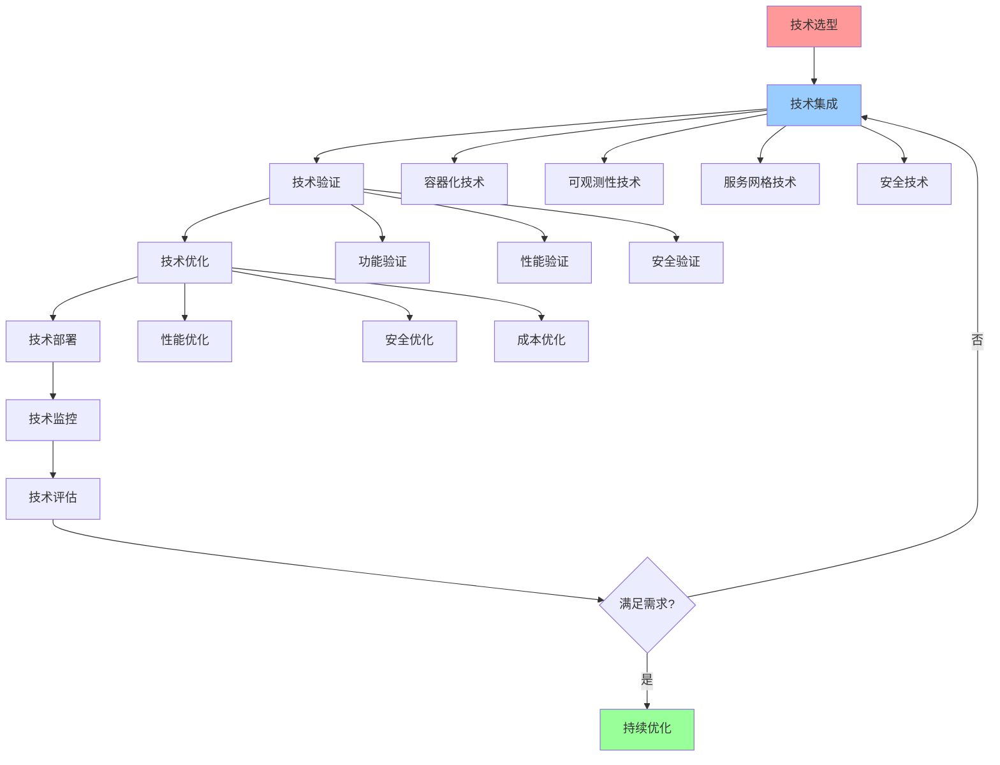

# 技术集成综合指南

## 📑 目录

- [技术集成综合指南](#技术集成综合指南)
  - [📑 目录](#-目录)
  - [1 技术集成全景](#1-技术集成全景)
  - [2 容器化技术集成](#2-容器化技术集成)
  - [3 可观测性技术集成](#3-可观测性技术集成)
  - [4 服务网格技术集成](#4-服务网格技术集成)
  - [5 技术集成检查清单](#5-技术集成检查清单)
  - [6 使用指南](#6-使用指南)
    - [6.1 快速开始](#61-快速开始)
    - [6.2 技术集成应用](#62-技术集成应用)
  - [7 使用技巧](#7-使用技巧)
    - [7.1 集成设计技巧](#71-集成设计技巧)
  - [8 2025 年最新实践](#8-2025-年最新实践)
    - [8.1 技术集成综合指南应用最佳实践（2025）](#81-技术集成综合指南应用最佳实践2025)
  - [9 实际应用案例](#9-实际应用案例)
    - [案例 1：技术集成综合指南应用（2025）](#案例-1技术集成综合指南应用2025)
  - [10 相关文档](#10-相关文档)

---

## 1 技术集成全景



---

## 2 容器化技术集成

| 集成场景 | 技术栈 | 集成方法 | 预期效果 | 复杂度 | 推荐度 |
|---------|--------|---------|---------|--------|--------|
| **容器运行时** | containerd、CRI-O、Docker | 运行时选择、运行时配置 | 容器运行优化 | 中 | ⭐⭐⭐⭐⭐ |
| **容器编排** | Kubernetes、Docker Swarm | 编排选择、编排配置 | 容器编排优化 | 高 | ⭐⭐⭐⭐⭐ |
| **容器网络** | CNI、Calico、Flannel | 网络选择、网络配置 | 容器网络优化 | 中 | ⭐⭐⭐⭐ |
| **容器存储** | CSI、本地存储、网络存储 | 存储选择、存储配置 | 容器存储优化 | 中 | ⭐⭐⭐⭐ |
| **容器安全** | 安全策略、安全扫描、安全审计 | 安全设计、安全配置 | 容器安全优化 | 高 | ⭐⭐⭐⭐⭐ |

**推荐度说明**：

- **⭐⭐⭐⭐⭐**：强烈推荐
- **⭐⭐⭐⭐**：推荐
- **⭐⭐⭐**：可选

---

## 3 可观测性技术集成

| 集成场景 | 技术栈 | 集成方法 | 预期效果 | 复杂度 | 推荐度 |
|---------|--------|---------|---------|--------|--------|
| **数据采集** | eBPF、OTLP、Prometheus | 采集选择、采集配置 | 数据采集优化 | 中 | ⭐⭐⭐⭐⭐ |
| **数据存储** | Prometheus、InfluxDB、Elasticsearch | 存储选择、存储配置 | 数据存储优化 | 中 | ⭐⭐⭐⭐ |
| **数据分析** | Grafana、Kibana、Jaeger | 分析选择、分析配置 | 数据分析优化 | 中 | ⭐⭐⭐⭐ |
| **告警管理** | Alertmanager、PagerDuty | 告警选择、告警配置 | 告警管理优化 | 中 | ⭐⭐⭐⭐ |
| **可视化** | Grafana、Kibana、Jaeger | 可视化选择、可视化配置 | 可视化优化 | 低 | ⭐⭐⭐⭐⭐ |

**推荐度说明**：

- **⭐⭐⭐⭐⭐**：强烈推荐
- **⭐⭐⭐⭐**：推荐
- **⭐⭐⭐**：可选

---

## 4 服务网格技术集成

| 集成场景 | 技术栈 | 集成方法 | 预期效果 | 复杂度 | 推荐度 |
|---------|--------|---------|---------|--------|--------|
| **服务发现** | Consul、etcd、Kubernetes | 发现选择、发现配置 | 服务发现优化 | 中 | ⭐⭐⭐⭐⭐ |
| **负载均衡** | Envoy、Istio、Linkerd | 均衡选择、均衡配置 | 负载均衡优化 | 中 | ⭐⭐⭐⭐⭐ |
| **流量管理** | Istio、Linkerd、Consul | 管理选择、管理配置 | 流量管理优化 | 高 | ⭐⭐⭐⭐⭐ |
| **安全通信** | mTLS、RBAC、策略管理 | 安全选择、安全配置 | 安全通信优化 | 高 | ⭐⭐⭐⭐⭐ |
| **可观测性** | 分布式追踪、指标、日志 | 可观测性选择、可观测性配置 | 可观测性优化 | 中 | ⭐⭐⭐⭐ |

**推荐度说明**：

- **⭐⭐⭐⭐⭐**：强烈推荐
- **⭐⭐⭐⭐**：推荐
- **⭐⭐⭐**：可选

---

## 5 技术集成检查清单

| 检查项 | 检查内容 | 重要性 | 推荐度 |
|--------|---------|--------|--------|
| **技术选型** | 技术评估、技术选择、技术验证 | 极高 | ⭐⭐⭐⭐⭐ |
| **技术集成** | 集成设计、集成实施、集成验证 | 高 | ⭐⭐⭐⭐⭐ |
| **技术验证** | 功能验证、性能验证、安全验证 | 高 | ⭐⭐⭐⭐⭐ |
| **技术优化** | 性能优化、安全优化、成本优化 | 中 | ⭐⭐⭐⭐ |
| **技术监控** | 监控设计、监控实施、监控分析 | 中 | ⭐⭐⭐⭐ |

**推荐度说明**：

- **⭐⭐⭐⭐⭐**：强烈推荐
- **⭐⭐⭐⭐**：推荐
- **⭐⭐⭐**：可选

---

## 6 使用指南

### 6.1 快速开始

**适用场景**：技术集成、技术选型、技术优化

**使用步骤**：

1. **技术选型**：选择需要集成的技术
2. **技术集成**：按照集成方法进行技术集成
3. **技术验证**：验证技术集成的效果
4. **技术优化**：优化技术集成

**推荐度**：⭐⭐⭐⭐⭐

---

### 6.2 技术集成应用

**适用场景**：实际项目中的技术集成

**使用步骤**：

1. **技术选型**：选择需要集成的技术（容器化、可观测性、服务网格）
2. **集成设计**：设计技术集成方案
3. **集成实施**：实施技术集成
4. **集成验证**：验证技术集成的功能、性能、安全
5. **技术优化**：优化技术集成的性能、安全、成本

**推荐度**：⭐⭐⭐⭐⭐

---

## 7 使用技巧

### 7.1 集成设计技巧

**技巧1：技术匹配**

- 选择兼容的技术进行集成
- 理解技术之间的依赖关系
- 避免技术冲突

**技巧2：集成优化**

- 优化技术集成的性能
- 平衡技术集成的复杂度和效果
- 建立集成监控机制

**推荐度**：⭐⭐⭐⭐⭐

---

## 8 2025 年最新实践

### 8.1 技术集成综合指南应用最佳实践（2025）

**2025 年趋势**：技术集成综合指南在容器化技术集成、可观测性技术集成、服务网格技术集成中的深度应用

**实践要点**：

- **技术选型**：基于指南选择合适的技术进行集成
- **集成设计**：系统化设计技术集成方案
- **集成验证**：全面验证技术集成的功能、性能、安全
- **持续优化**：基于实践效果优化技术集成

**代码示例**：

```python
# 2025 年技术集成综合指南工具
class TechnologyIntegrationGuideTool:
    def __init__(self):
        self.selector = TechnologySelector()
        self.designer = IntegrationDesigner()
        self.verifier = IntegrationVerifier()
        self.optimizer = IntegrationOptimizer()

    def select_technologies(self, requirements, constraints):
        """技术选型"""
        return self.selector.select(requirements, constraints)

    def design_integration(self, technologies, patterns):
        """集成设计"""
        return self.designer.design(technologies, patterns)

    def verify_integration(self, integration, criteria):
        """集成验证"""
        return self.verifier.verify(integration, criteria)
```

## 9 实际应用案例

### 案例 1：技术集成综合指南应用（2025）

**场景**：使用技术集成综合指南进行容器化和可观测性技术集成

**实现方案**：

```python
# 技术集成综合指南应用
tool = TechnologyIntegrationGuideTool()

# 技术选型
requirements = Requirements(containerization=True, observability=True)
constraints = Constraints(budget="limited", team="small")
technologies = tool.select_technologies(requirements, constraints)

# 集成设计
patterns = [Pattern(type="container_runtime"), Pattern(type="metrics_collection")]
integration = tool.design_integration(technologies, patterns)

# 集成验证
criteria = Criteria(functionality=True, performance=True, security=True)
verification = tool.verify_integration(integration, criteria)
```

**效果**：

- 技术选型：基于指南选择技术，提高选型准确性
- 集成设计：系统化设计集成方案，提高设计质量
- 集成验证：全面验证集成效果，提高集成可靠性

---

## 10 相关文档

- **[应用视角思维导图](01-application-perspectives-mindmap.md)** - 应用视角全景、eBPF/OTLP视角、程序设计视角
- **[综合应用指南](09-comprehensive-application-guide.md)** - 应用开发全景、技术栈选择、架构设计
- **[实践案例详细矩阵](10-practical-cases-detailed.md)** - 电商平台案例、金融系统案例、边缘计算案例

---

**最后更新**：2025-11-15
**文档状态**：✅ 完整 | 📊 包含技术集成综合指南、使用指南、使用技巧 | 🎯 生产就绪
**维护者**：项目团队
