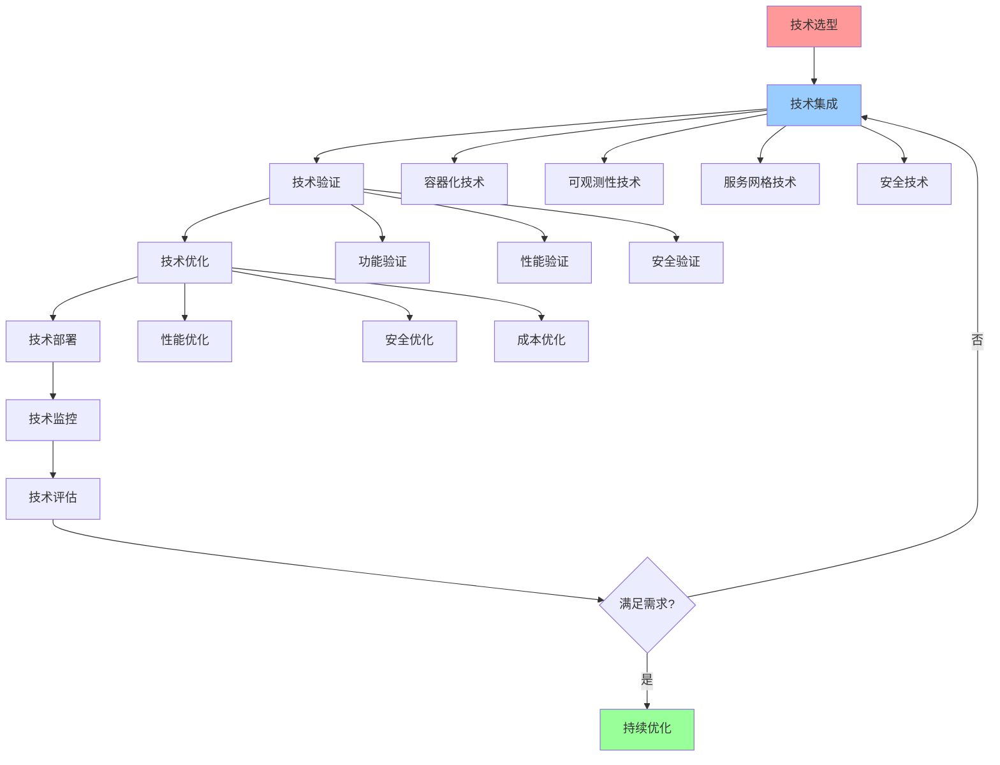

# 技术集成综合指南

## 📑 目录

- [技术集成综合指南](#技术集成综合指南)
  - [📑 目录](#-目录)
  - [1 技术集成全景](#1-技术集成全景)
  - [2 容器化技术集成](#2-容器化技术集成)
  - [3 可观测性技术集成](#3-可观测性技术集成)
  - [4 服务网格技术集成](#4-服务网格技术集成)

---

## 1 技术集成全景

---

## 2 容器化技术集成

| 集成场景 | 技术栈 | 集成方法 | 预期效果 | 复杂度 | 推荐度 |
|---------|--------|---------|---------|--------|--------|
| **容器运行时** | containerd、CRI-O、Docker | 运行时选择、运行时配置 | 容器运行优化 | 中 | ⭐⭐⭐⭐⭐ |
| **容器编排** | Kubernetes、Docker Swarm | 编排选择、编排配置 | 容器编排优化 | 高 | ⭐⭐⭐⭐⭐ |
| **容器网络** | CNI、Calico、Flannel | 网络选择、网络配置 | 容器网络优化 | 中 | ⭐⭐⭐⭐ |
| **容器存储** | CSI、本地存储、网络存储 | 存储选择、存储配置 | 容器存储优化 | 中 | ⭐⭐⭐⭐ |
| **容器安全** | 安全策略、安全扫描、安全审计 | 安全设计、安全配置 | 容器安全优化 | 高 | ⭐⭐⭐⭐⭐ |

**推荐度说明**：

- **⭐⭐⭐⭐⭐**：强烈推荐
- **⭐⭐⭐⭐**：推荐
- **⭐⭐⭐**：可选

---

## 3 可观测性技术集成

| 集成场景 | 技术栈 | 集成方法 | 预期效果 | 复杂度 | 推荐度 |
|---------|--------|---------|---------|--------|--------|
| **数据采集** | eBPF、OTLP、Prometheus | 采集选择、采集配置 | 数据采集优化 | 中 | ⭐⭐⭐⭐⭐ |
| **数据存储** | Prometheus、InfluxDB、Elasticsearch | 存储选择、存储配置 | 数据存储优化 | 中 | ⭐⭐⭐⭐ |
| **数据分析** | Grafana、Kibana、Jaeger | 分析选择、分析配置 | 数据分析优化 | 中 | ⭐⭐⭐⭐ |
| **告警管理** | Alertmanager、PagerDuty | 告警选择、告警配置 | 告警管理优化 | 中 | ⭐⭐⭐⭐ |
| **可视化** | Grafana、Kibana、Jaeger | 可视化选择、可视化配置 | 可视化优化 | 低 | ⭐⭐⭐⭐⭐ |

**推荐度说明**：

- **⭐⭐⭐⭐⭐**：强烈推荐
- **⭐⭐⭐⭐**：推荐
- **⭐⭐⭐**：可选

---

## 4 服务网格技术集成

| 集成场景 | 技术栈 | 集成方法 | 预期效果 | 复杂度 | 推荐度 |
|---------|--------|---------|---------|--------|--------|
| **服务发现** | Consul、etcd、Kubernetes | 发现选择、发现配置 | 服务发现优化 | 中 | ⭐⭐⭐⭐⭐ |
| **负载均衡** | Envoy、Istio、Linkerd | 均衡选择、均衡配置 | 负载均衡优化 | 中 | ⭐⭐⭐⭐⭐ |
| **流量管理** | Istio、Linkerd、Consul | 管理选择、管理配置 | 流量管理优化 | 高 | ⭐⭐⭐⭐⭐ |
| **安全通信** | mTLS、RBAC、策略管理 | 安全选择、安全配置 | 安全通信优化 | 高 | ⭐⭐⭐⭐⭐ |
| **可观测性** | 分布式追踪、指标、日志 | 可观测性选择、可观测性配置 | 可观测性优化 | 中 | ⭐⭐⭐⭐ |

**推荐度说明**：

- **⭐⭐⭐⭐⭐**：强烈推荐
- **⭐⭐⭐⭐**：推荐
- **⭐⭐⭐**：可选

---

## 5 技术集成检查清单

| 检查项 | 检查内容 | 重要性 | 推荐度 |
|--------|---------|--------|--------|
| **技术选型** | 技术评估、技术选择、技术验证 | 极高 | ⭐⭐⭐⭐⭐ |
| **技术集成** | 集成设计、集成实施、集成验证 | 高 | ⭐⭐⭐⭐⭐ |
| **技术验证** | 功能验证、性能验证、安全验证 | 高 | ⭐⭐⭐⭐⭐ |
| **技术优化** | 性能优化、安全优化、成本优化 | 中 | ⭐⭐⭐⭐ |
| **技术监控** | 监控设计、监控实施、监控分析 | 中 | ⭐⭐⭐⭐ |

**推荐度说明**：

- **⭐⭐⭐⭐⭐**：强烈推荐
- **⭐⭐⭐⭐**：推荐
- **⭐⭐⭐**：可选

---

**最后更新**：2025-11-07
**文档状态**：✅ 完整 | 📊 包含技术集成综合指南 | 🎯 生产就绪
**维护者**：项目团队
