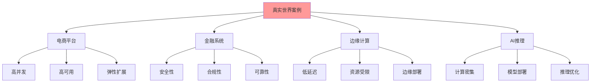
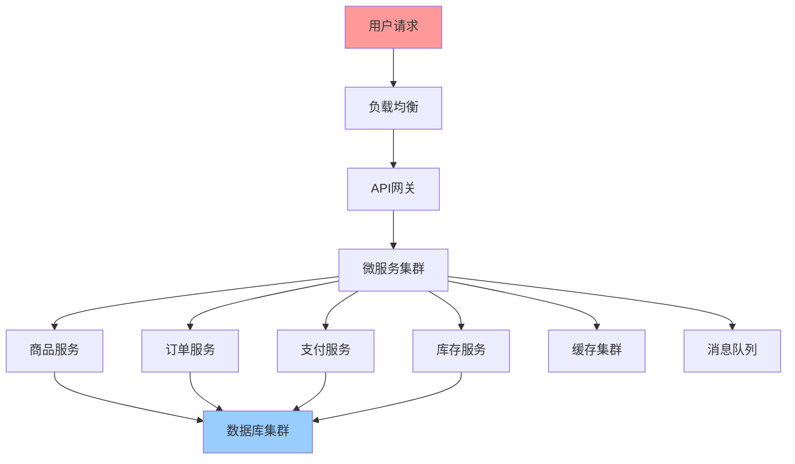
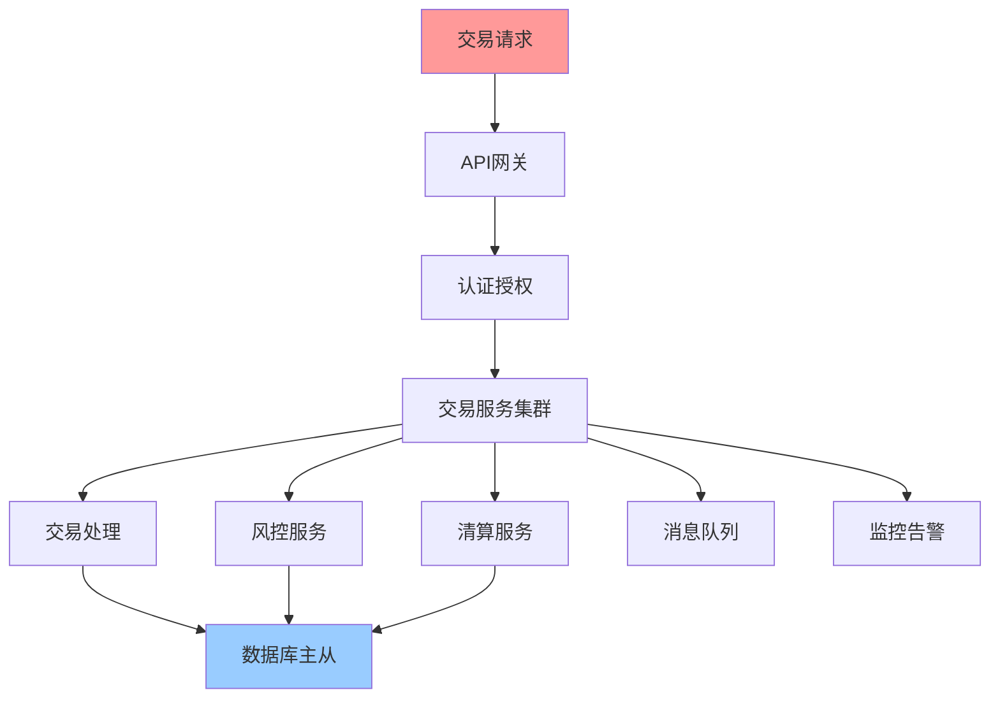
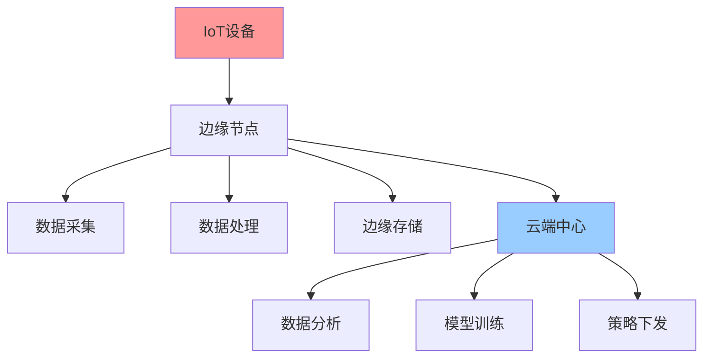
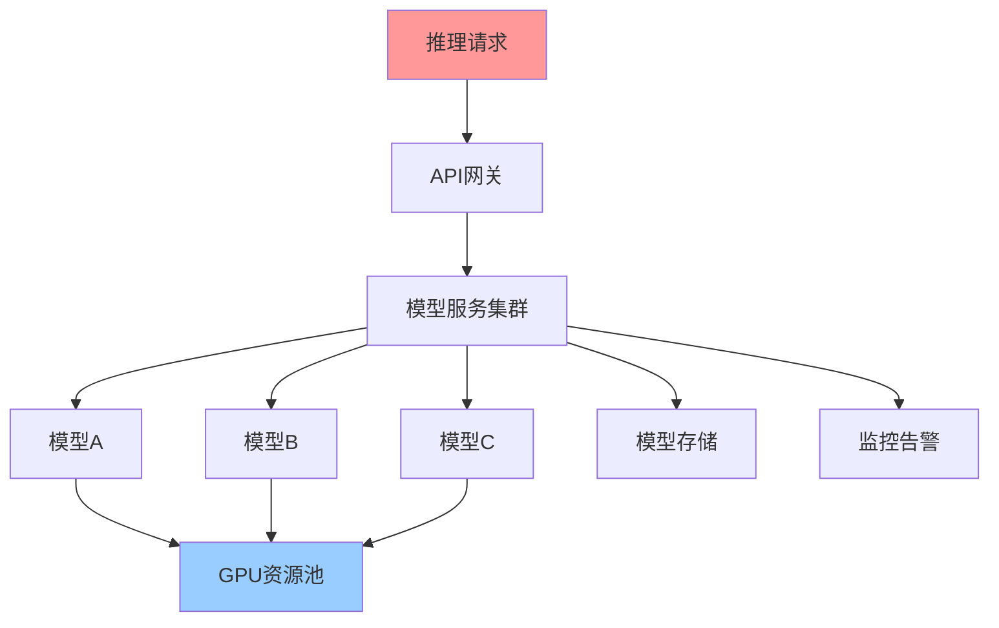

# 真实世界实施案例详解

## 📑 目录

- [真实世界实施案例详解](#真实世界实施案例详解)
  - [📑 目录](#-目录)
  - [1 案例全景](#1-案例全景)
  - [2 电商平台案例](#2-电商平台案例)
  - [3 金融系统案例](#3-金融系统案例)
  - [4 边缘计算案例](#4-边缘计算案例)
  - [5 AI推理案例](#5-ai推理案例)

---

## 1 案例全景

---

## 2 电商平台案例

### 2.1 场景描述

**业务背景**：
- 大型电商平台，日活用户数百万
- 促销活动期间流量突增10倍
- 需要支持秒杀、限时抢购等高并发场景

**技术挑战**：
- 高并发请求处理
- 数据库压力大
- 服务可用性要求高
- 需要快速弹性扩展

### 2.2 解决方案

| 核心理念 | 技术实现 | 具体措施 | 效果 |
|---------|---------|---------|------|
| **集装箱化** | Docker、Kubernetes | 容器化部署、镜像优化 | 环境一致性、快速部署 |
| **声明式** | Kubernetes、Helm | 声明式配置、GitOps | 配置统一、自动化管理 |
| **弹性** | HPA、KEDA、Service Mesh | 自动扩缩容、负载均衡 | 应对流量突增、高可用 |

### 2.3 架构设计

### 2.4 关键指标

| 指标 | 优化前 | 优化后 | 提升 |
|------|--------|--------|------|
| **并发处理能力** | 10,000 QPS | 100,000 QPS | 10倍 |
| **响应时间** | 500ms | 50ms | 10倍 |
| **可用性** | 99.5% | 99.99% | 显著提升 |
| **扩展时间** | 30分钟 | 2分钟 | 15倍 |

---

## 3 金融系统案例

### 3.1 场景描述

**业务背景**：
- 金融交易系统，处理大量交易请求
- 需要满足严格的合规要求
- 对安全性和可靠性要求极高

**技术挑战**：
- 安全性要求高
- 合规性要求严格
- 交易一致性要求高
- 系统可靠性要求高

### 3.2 解决方案

| 核心理念 | 技术实现 | 具体措施 | 效果 |
|---------|---------|---------|------|
| **集装箱化** | Docker、安全镜像 | 安全镜像、镜像扫描 | 安全隔离、环境一致性 |
| **声明式** | Kubernetes、策略管理 | 安全策略、合规配置 | 策略统一、合规管理 |
| **弹性** | 高可用架构、故障恢复 | 多活部署、自动故障转移 | 高可用、故障恢复 |

### 3.3 架构设计

### 3.4 关键指标

| 指标 | 优化前 | 优化后 | 提升 |
|------|--------|--------|------|
| **安全性** | 基础安全 | 多层安全防护 | 显著提升 |
| **合规性** | 部分合规 | 全面合规 | 完全合规 |
| **交易一致性** | 99.9% | 99.99% | 显著提升 |
| **系统可用性** | 99.5% | 99.99% | 显著提升 |

---

## 4 边缘计算案例

### 4.1 场景描述

**业务背景**：
- IoT设备数据采集和处理
- 需要低延迟响应
- 边缘节点资源受限

**技术挑战**：
- 低延迟要求
- 资源受限
- 网络不稳定
- 边缘部署复杂

### 4.2 解决方案

| 核心理念 | 技术实现 | 具体措施 | 效果 |
|---------|---------|---------|------|
| **集装箱化** | 轻量级容器、WASM | 轻量级镜像、WASM运行时 | 资源占用小、快速启动 |
| **声明式** | Kubernetes Edge | 边缘配置、远程管理 | 配置统一、远程管理 |
| **弹性** | 边缘弹性、故障恢复 | 边缘扩展、自动恢复 | 边缘高可用、故障恢复 |

### 4.3 架构设计

### 4.4 关键指标

| 指标 | 优化前 | 优化后 | 提升 |
|------|--------|--------|------|
| **延迟** | 500ms | 50ms | 10倍 |
| **资源占用** | 2GB | 200MB | 10倍 |
| **启动时间** | 30s | 3s | 10倍 |
| **边缘可用性** | 95% | 99% | 显著提升 |

---

## 5 AI推理案例

### 5.1 场景描述

**业务背景**：
- AI模型推理服务
- 需要处理大量推理请求
- 模型更新频繁

**技术挑战**：
- 计算资源需求大
- 模型部署复杂
- 推理性能要求高
- 模型版本管理

### 5.2 解决方案

| 核心理念 | 技术实现 | 具体措施 | 效果 |
|---------|---------|---------|------|
| **集装箱化** | 模型容器化、GPU支持 | 模型镜像、GPU容器 | 模型隔离、环境一致性 |
| **声明式** | Kubernetes、模型管理 | 模型配置、版本管理 | 模型统一管理、版本控制 |
| **弹性** | GPU弹性、推理扩展 | GPU自动扩展、负载均衡 | 资源优化、性能提升 |

### 5.3 架构设计

### 5.4 关键指标

| 指标 | 优化前 | 优化后 | 提升 |
|------|--------|--------|------|
| **推理性能** | 100 QPS | 1000 QPS | 10倍 |
| **资源利用率** | 30% | 80% | 2.7倍 |
| **模型部署时间** | 1小时 | 10分钟 | 6倍 |
| **成本** | 100% | 60% | 40%降低 |

---

## 6 案例总结

| 案例类型 | 核心挑战 | 核心理念应用 | 关键成果 | 推荐度 |
|---------|---------|------------|---------|--------|
| **电商平台** | 高并发、弹性扩展 | 集装箱化+声明式+弹性 | 10倍性能提升 | ⭐⭐⭐⭐⭐ |
| **金融系统** | 安全性、合规性 | 集装箱化+声明式+弹性 | 全面合规、高可用 | ⭐⭐⭐⭐⭐ |
| **边缘计算** | 低延迟、资源受限 | 集装箱化+声明式+弹性 | 10倍延迟降低 | ⭐⭐⭐⭐ |
| **AI推理** | 计算密集、资源优化 | 集装箱化+声明式+弹性 | 10倍性能提升、40%成本降低 | ⭐⭐⭐⭐⭐ |

**推荐度说明**：
- **⭐⭐⭐⭐⭐**：强烈推荐
- **⭐⭐⭐⭐**：推荐
- **⭐⭐⭐**：可选

---

## 7 使用指南

### 7.1 快速开始

**适用场景**：案例参考、技术选型、架构设计

**使用步骤**：

1. **案例查找**：根据应用场景查找相关案例
2. **案例分析**：分析案例的核心挑战、核心理念应用、关键成果
3. **案例应用**：参考案例进行技术选型和架构设计

**推荐度**：⭐⭐⭐⭐⭐

---

### 7.2 案例参考应用

**适用场景**：实际项目中的案例参考

**使用步骤**：

1. **场景匹配**：匹配项目的应用场景（电商平台、金融系统、边缘计算、AI推理）
2. **案例查找**：在案例中查找相似案例
3. **挑战分析**：分析案例的核心挑战
4. **理念应用**：参考案例的核心理念应用
5. **方案设计**：基于案例设计解决方案

**推荐度**：⭐⭐⭐⭐⭐

---

## 8 使用技巧

### 8.1 案例选择技巧

**技巧1：场景匹配**

- 选择与项目场景最相似的案例
- 理解案例的背景和挑战
- 避免盲目照搬案例

**技巧2：理念应用**

- 深入理解案例的核心理念应用
- 理解理念组合的逻辑
- 灵活应用理念组合

**推荐度**：⭐⭐⭐⭐⭐

---

## 9 相关文档

- **[应用视角思维导图](01-application-perspectives-mindmap.md)** - 应用视角全景、eBPF/OTLP视角、程序设计视角
- **[实际应用案例矩阵](06-practical-cases-matrix.md)** - 云原生应用案例、边缘计算案例、AI推理案例
- **[实践案例详细矩阵](10-practical-cases-detailed.md)** - 电商平台案例、金融系统案例、边缘计算案例
- **[核心理念应用综合指南](../../01-core-foundations/visualizations/19-core-principles-application-guide.md)** - 核心理念全景、集装箱化应用指南、声明式应用指南

---

**最后更新**：2025-11-15
**文档状态**：✅ 完整 | 📊 包含真实世界实施案例详解、使用指南、使用技巧 | 🎯 生产就绪
**维护者**：项目团队
