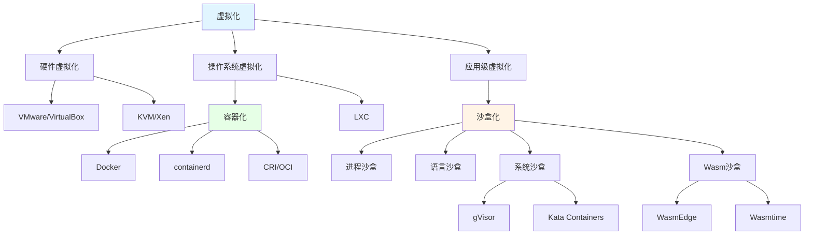

# 10. 技术决策模型与架构选择：虚拟化、容器化、沙盒化的技术架构模型选择

## 📑 目录

- [📑 目录](#-目录)
- [📋 文档提纲（草案）](#-文档提纲草案)
- [1 文档定位](#1-文档定位)
- [2 虚拟化、容器化、沙盒化的技术架构模型](#2-虚拟化容器化沙盒化的技术架构模型)
  - [2.1 技术架构模型全景](#21-技术架构模型全景)
  - [2.2 虚拟化架构模型](#22-虚拟化架构模型)
  - [2.3 容器化架构模型](#23-容器化架构模型)
  - [2.4 沙盒化架构模型](#24-沙盒化架构模型)
  - [2.5 技术范式背后的理论模型](#25-技术范式背后的理论模型)
  - [2.6 分布式系统与集群模型（底层支撑模型）](#26-分布式系统与集群模型底层支撑模型)
    - [2.6.1 分布式系统架构模型](#261-分布式系统架构模型)
    - [2.6.2 集群管理模型](#262-集群管理模型)
    - [2.6.3 P2P 网络模型](#263-p2p-网络模型)
    - [2.6.4 服务发现模型](#264-服务发现模型)
    - [2.6.5 一致性模型与共识算法](#265-一致性模型与共识算法)
    - [2.6.6 负载均衡模型](#266-负载均衡模型)
    - [2.6.7 分布式系统模型在虚拟化/容器化/沙盒化中的映射](#267-分布式系统模型在虚拟化容器化沙盒化中的映射)
- [3 物理资源层面的权衡模型](#3-物理资源层面的权衡模型)
  - [3.1 CPU 资源模型与权衡](#31-cpu-资源模型与权衡)
  - [3.2 内存资源模型与权衡](#32-内存资源模型与权衡)
  - [3.3 IO 资源模型与权衡](#33-io-资源模型与权衡)
  - [3.4 网络资源模型与权衡](#34-网络资源模型与权衡)
  - [3.5 存储资源模型与权衡](#35-存储资源模型与权衡)
  - [3.6 物理资源权衡决策矩阵](#36-物理资源权衡决策矩阵)
- [4 隔离模型与安全模型](#4-隔离模型与安全模型)
  - [4.1 隔离模型理论](#41-隔离模型理论)
  - [4.2 安全模型理论](#42-安全模型理论)
- [5 技术决策模型与权衡框架](#5-技术决策模型与权衡框架)
  - [5.1 决策模型分类](#51-决策模型分类)
  - [5.2 权衡框架](#52-权衡框架)
  - [5.3 决策模型实例化](#53-决策模型实例化)
- [6 技术场景分析论证模型](#6-技术场景分析论证模型)
  - [6.1 场景分析框架](#61-场景分析框架)
  - [6.2 论证模型](#62-论证模型)
  - [6.3 场景-技术映射关系](#63-场景-技术映射关系)
- [7 技术概念定义脉络](#7-技术概念定义脉络)
  - [7.1 技术概念演进脉络](#71-技术概念演进脉络)
  - [7.2 关键概念定义与决策背景](#72-关键概念定义与决策背景)
  - [7.3 技术概念关系图](#73-技术概念关系图)
- [8 技术决策模型形式化](#8-技术决策模型形式化)
  - [8.1 决策模型数学表达](#81-决策模型数学表达)
  - [8.2 权衡函数](#82-权衡函数)
  - [8.3 场景-技术映射模型](#83-场景-技术映射模型)
- [9 实际案例：技术架构选择论证](#9-实际案例技术架构选择论证)
  - [9.1 案例 1：边缘计算平台](#91-案例-1边缘计算平台)
  - [9.2 案例 2：Serverless 函数服务](#92-案例-2serverless-函数服务)
  - [9.3 案例 3：企业级多租户平台](#93-案例-3企业级多租户平台)
- [10 技术决策流程与检查清单](#10-技术决策流程与检查清单)
  - [10.1 决策流程](#101-决策流程)
  - [10.2 决策检查清单](#102-决策检查清单)
- [11 与其他文档的关系](#11-与其他文档的关系)
- [12 参考](#12-参考)
- [13 待完善事项](#13-待完善事项)
  - [13.1 需要确认的问题](#131-需要确认的问题)
  - [13.2 下一步计划](#132-下一步计划)

---

## 📋 文档提纲（草案）

## 1 文档定位

本文档深入梳理虚拟化、容器化、沙盒化背后的**技术架构模型选择**，以及**技术决策模
型的权衡和分类**，阐述技术场景的分析论证过程和技术概念定义的脉络，帮助理解技术背
后的决策逻辑。

**文档双重结构**：

1. **第一层：技术范式背后的理论模型**（核心）

   - **物理资源模型**：CPU、IO、Network、Storage 等资源的权衡模型
   - **隔离模型**：硬件级、进程级、应用级隔离的理论模型
   - **安全模型**：信任边界、攻击面、安全隔离的理论模型
   - **分布式系统模型**：集群管理、P2P 网络、服务发现、一致性模型、共识算法、负
     载均衡等底层支撑模型
   - **技术范式选择的理论支撑**：为什么选择虚拟化/容器化/沙盒化的底层原因（包括
     底层分布式系统模型的选择）

2. **第二层：技术场景应用决策模型**
   - **场景分析论证**：根据技术场景进行技术应用的决策
   - **技术选型决策**：具体技术的选择（Docker vs containerd）
   - **权衡框架**：多维度权衡决策模型
   - **⭐ 关键决策维度**：
     - **设备访问需求**：
       - USB/PCI 设备访问 → 虚拟化/半虚拟化（必需）
       - **GPU 设备访问**：根据访问方式选择（直通、vGPU、SR-IOV）
         - GPU 直通：强隔离 → 虚拟化/半虚拟化（性能>95%），中等隔离 → 容器化（性
           能>98%）
         - GPU vGPU/SR-IOV → 虚拟化/半虚拟化（资源共享，多租户）
         - GPU 虚拟化 → 全虚拟化（性能极低，仅兼容性）
     - **内核特性需求**：epoll/io_uring → 容器化（必需，16-62x 性能提升）
     - **资源访问需求**：CPU/内存/逻辑 → 沙盒化/容器化

**核心价值**：

- **技术范式理论模型**：理解虚拟化、容器化、沙盒化背后的物理资源模型、隔离模型、
  安全模型
- **物理资源权衡**：掌握 CPU、IO、Network、Storage 等资源的权衡模型和数学模型
- **技术架构模型选择**：理解技术范式选择的底层理论依据，而非仅应用场景决策
- **场景分析论证**：理解技术场景的分析框架和论证模型（第二层）
- **概念定义脉络**：梳理技术概念的定义脉络和背景决策

---

## 2 虚拟化、容器化、沙盒化的技术架构模型

### 2.1 技术架构模型全景

**三种技术范式的本质区别**：

- **虚拟化**：硬件虚拟化模型（VM）
- **容器化**：操作系统级虚拟化模型（Container）
- **沙盒化**：应用级隔离模型（Sandbox）

**架构模型对比矩阵**：

| 维度         | 虚拟化        | 容器化         | 沙盒化               |
| ------------ | ------------- | -------------- | -------------------- |
| **隔离级别** | 硬件级        | 进程级         | 应用级               |
| **资源开销** | 高            | 中             | 低                   |
| **启动速度** | 慢（分钟级）  | 中（秒级）     | 快（毫秒级）         |
| **兼容性**   | 完全隔离      | 共享内核       | 应用特定             |
| **适用场景** | 多 OS、强隔离 | 微服务、DevOps | Serverless、边缘计算 |

### 2.2 虚拟化架构模型

**虚拟化模型选择**：

- **全虚拟化**：VMware、VirtualBox
- **半虚拟化**：Xen
- **硬件辅助虚拟化**：Intel VT-x、AMD-V
- **容器虚拟化**：Docker、containerd

**架构决策依据**：

- **性能要求** → 硬件辅助虚拟化
- **兼容性要求** → 全虚拟化
- **资源效率** → 容器虚拟化

### 2.3 容器化架构模型

**容器化模型演进**：

- **LXC**：Linux 容器基础
- **Docker**：镜像分层 + 容器运行时
- **containerd**：容器生命周期管理
- **CRI**：容器运行时接口标准化
- **OCI**：容器标准规范

**架构决策依据**：

- **标准化需求** → OCI + CRI
- **镜像管理** → Docker 镜像格式
- **运行时选择** → runc、crun、gVisor

### 2.4 沙盒化架构模型

**沙盒化模型分类**：

- **语言沙盒**：JavaScript V8、Python PyPy
- **系统沙盒**：gVisor、Kata Containers
- **Wasm 沙盒**：WasmEdge、Wasmtime
- **进程沙盒**：seccomp、AppArmor、SELinux

**架构决策依据**：

- **性能要求** → Wasm 沙盒
- **安全要求** → gVisor、Kata
- **兼容性要求** → 语言沙盒

---

### 2.5 技术范式背后的理论模型

**技术范式选择的理论基础**：

虚拟化、容器化、沙盒化不仅仅是应用场景的选择，更是**底层技术架构模型的选择**。每
种范式都有其理论支撑和物理资源模型。

**理论模型层次**：

1. **隔离模型**：硬件隔离、内核隔离、进程隔离、应用隔离
2. **资源模型**：CPU 调度模型、内存管理模型、IO 模型、存储模型
3. **性能模型**：启动性能、运行性能、网络性能、存储性能
4. **安全模型**：攻击面模型、信任边界模型、安全隔离模型
5. **分布式系统模型**：集群管理模型、服务发现模型、一致性模型、共识算法模型
6. **网络模型**：P2P 网络模型、覆盖网络模型、路由模型、负载均衡模型

---

### 10.2.6 分布式系统与集群模型（底层支撑模型）

**分布式系统是虚拟化、容器化、沙盒化的底层支撑**。虚拟化、容器化、沙盒化技术都依
赖于分布式系统模型来实现集群管理、服务发现、一致性保证等基础能力。

#### 10.2.6.1 分布式系统架构模型

**分布式系统模型分类**：

| 模型类型       | 定义                             | 代表技术                 | 在容器化中的作用       |
| -------------- | -------------------------------- | ------------------------ | ---------------------- |
| **主从模型**   | 中心化控制节点 + 工作节点        | Kubernetes Master-Worker | 集群编排与控制         |
| **P2P 模型**   | 去中心化对等节点网络             | libp2p、BitTorrent、etcd | 服务发现、分布式存储   |
| **分片模型**   | 数据分片存储在不同节点           | Cassandra、MongoDB       | 分布式存储、状态分片   |
| **复制模型**   | 数据复制到多个节点保证可用性     | etcd、Consul、ZooKeeper  | 配置存储、服务注册中心 |
| **一致性模型** | 强一致性、最终一致性、因果一致性 | Raft、Paxos、Gossip      | 分布式协调、状态同步   |

**分布式系统模型在容器化中的映射**：

```text
容器编排系统（Kubernetes/K3s）:
├── 主从模型: Master节点 → Worker节点
│   └── API Server、Scheduler、Controller Manager
├── P2P模型: 节点发现、服务发现
│   └── CoreDNS、Service Discovery
├── 复制模型: etcd集群、配置存储
│   └── 状态存储、配置同步
└── 一致性模型: Raft共识算法
    └── etcd、Leader选举
```

#### 2.6.2 集群管理模型

**集群管理模型定义**：

集群管理模型用于管理多个节点的生命周期、资源分配、任务调度等。

**集群管理模型分类**：

1. **集中式集群模型**：

   - **架构**：单一控制节点 + N 个工作节点
   - **优点**：简单、一致性强、易于管理
   - **缺点**：单点故障、扩展性受限
   - **代表**：Kubernetes（Master-Worker）、Hadoop（NameNode-DataNode）

2. **分布式集群模型**：

   - **架构**：多个对等节点，无中心节点
   - **优点**：高可用、去中心化、扩展性强
   - **缺点**：复杂性高、一致性难保证
   - **代表**：etcd 集群、Consul 集群

3. **混合集群模型**：
   - **架构**：多个控制节点 + N 个工作节点
   - **优点**：高可用 + 简单管理
   - **缺点**：复杂度中等
   - **代表**：Kubernetes HA（多 Master）、K3s（单节点或集群模式）

**集群管理数学模型**：

设集群为 $C = (N, M, S)$，其中：

- $N = \{n_1, n_2, \ldots, n_k\}$：节点集合
- $M = \{m_1, m_2, \ldots, m_p\}$：管理节点集合
- $S$：状态集合

**集群可用性模型**：

$$A_{\text{cluster}} = \prod_{i=1}^{|M|} A_{m_i} \times \prod_{j=1}^{|N|} A_{n_j}$$

其中：

- $A_{m_i}$：管理节点 $i$ 的可用性
- $A_{n_j}$：工作节点 $j$ 的可用性

**在容器化中的应用**：

- **Kubernetes**：集中式集群模型（Master-Worker）
- **K3s**：混合集群模型（支持单节点和集群模式）
- **etcd**：分布式集群模型（P2P，Raft 共识）

#### 2.6.3 P2P 网络模型

**P2P 网络模型定义**：

P2P（Peer-to-Peer）网络模型是去中心化的对等网络模型，节点之间直接通信，无需中心
服务器。

**P2P 网络模型分类**：

1. **纯 P2P 模型（Pure P2P）**：

   - **特点**：完全去中心化，无中心节点
   - **拓扑**：全连接或部分连接
   - **应用**：BitTorrent、区块链网络
   - **在容器化中**：节点发现、分布式存储

2. **混合 P2P 模型（Hybrid P2P）**：

   - **特点**：中心节点 + P2P 节点
   - **拓扑**：中心节点协调，节点间 P2P 通信
   - **应用**：Skype（早期）、某些 CDN
   - **在容器化中**：服务发现（CoreDNS）、分布式配置（Consul）

3. **结构化 P2P 模型（Structured P2P）**：
   - **特点**：基于 DHT（分布式哈希表）的结构化拓扑
   - **拓扑**：一致性哈希、Chord、Kademlia
   - **应用**：IPFS、libp2p、etcd
   - **在容器化中**：服务发现、状态存储

**P2P 网络数学模型**：

设 P2P 网络为 $G = (V, E)$，其中：

- $V = \{v_1, v_2, \ldots, v_n\}$：节点集合
- $E = \{(v_i, v_j) | v_i, v_j \in V\}$：边集合（连接关系）

**P2P 网络连通性模型**：

$$C_{\text{network}} = \frac{2|E|}{|V|(|V|-1)}$$

其中：

- $C_{\text{network}}$：网络连通度（0-1）
- $|E|$：边数量
- $|V|$：节点数量

**P2P 网络在容器化中的应用**：

1. **服务发现**：

   - **etcd**：基于 Raft 的 P2P 存储（用于 Kubernetes 状态存储）
   - **Consul**：基于 Gossip 协议的 P2P 服务发现
   - **CoreDNS**：分布式 DNS 服务发现

2. **分布式存储**：

   - **etcd**：分布式键值存储（Kubernetes 元数据）
   - **IPFS**：分布式文件系统（可选存储后端）

3. **节点通信**：
   - **Kubernetes**：节点间 P2P 通信（Pod 通信）
   - **K3s**：节点发现与同步

#### 2.6.4 服务发现模型

**服务发现模型定义**：

服务发现模型用于在分布式系统中自动发现和注册服务实例。

**服务发现模型分类**：

1. **客户端发现模型（Client-Side Discovery）**：

   - **机制**：客户端查询服务注册表，直接连接服务实例
   - **优点**：简单、延迟低
   - **缺点**：客户端需要知道注册表位置
   - **代表**：Netflix Eureka、Consul Client

2. **服务端发现模型（Server-Side Discovery）**：

   - **机制**：客户端请求负载均衡器，负载均衡器查询注册表
   - **优点**：客户端无需知道服务位置
   - **缺点**：需要额外的负载均衡器
   - **代表**：Kubernetes Service、AWS ELB

3. **服务注册表模型（Service Registry）**：
   - **机制**：服务实例向注册表注册，客户端查询注册表
   - **实现**：etcd、Consul、ZooKeeper
   - **在容器化中**：Kubernetes Service、K3s Service Discovery

**服务发现数学模型**：

设服务发现系统为 $SD = (R, S, C)$，其中：

- $R$：服务注册表
- $S = \{s_1, s_2, \ldots, s_n\}$：服务实例集合
- $C = \{c_1, c_2, \ldots, c_m\}$：客户端集合

**服务发现延迟模型**：

$$L_{\text{discovery}} = L_{\text{register}} + L_{\text{query}} + L_{\text{select}}$$

其中：

- $L_{\text{register}}$：服务注册延迟
- $L_{\text{query}}$：查询延迟
- $L_{\text{select}}$：服务选择延迟

**在容器化中的应用**：

- **Kubernetes Service**：基于 Service 和 Endpoints 的服务发现
- **CoreDNS**：基于 DNS 的服务发现
- **K3s**：内置 CoreDNS，支持 Service Discovery

#### 2.6.5 一致性模型与共识算法

**一致性模型定义**：

一致性模型用于保证分布式系统中多个节点的数据一致性和状态同步。

**一致性模型分类**：

1. **强一致性（Strong Consistency）**：

   - **特点**：所有节点同时看到相同数据
   - **实现**：Raft、Paxos、ZAB
   - **延迟**：高（需要多数节点确认）
   - **应用**：etcd、ZooKeeper、Consul（强一致性模式）

2. **最终一致性（Eventual Consistency）**：

   - **特点**：允许短期不一致，最终会收敛
   - **实现**：Gossip 协议、CRDT
   - **延迟**：低（异步传播）
   - **应用**：Consul（最终一致性模式）、DynamoDB

3. **因果一致性（Causal Consistency）**：
   - **特点**：保证因果关系的操作顺序
   - **实现**：向量时钟、逻辑时钟
   - **应用**：分布式数据库、分布式系统

**共识算法模型**：

1. **Raft 算法**：

   - **特点**：领导者选举 + 日志复制
   - **复杂度**：$O(n)$（n 为节点数）
   - **应用**：etcd、Consul（Raft 模式）
   - **在容器化中**：Kubernetes etcd、K3s etcd

2. **Paxos 算法**：

   - **特点**：多数派投票、多轮协商
   - **复杂度**：$O(n^2)$（最坏情况）
   - **应用**：Chubby、部分分布式数据库

3. **Gossip 协议**：
   - **特点**：谣言传播、最终一致性
   - **复杂度**：$O(\log n)$（传播轮数）
   - **应用**：Consul（Gossip 模式）、Cassandra

**一致性数学模型**：

设分布式系统为 $DS = (N, S, R)$，其中：

- $N = \{n_1, n_2, \ldots, n_k\}$：节点集合
- $S$：状态集合
- $R$：一致性规则

**强一致性条件**：

$$\forall t, \forall n_i, n_j \in N: S_{n_i}(t) = S_{n_j}(t)$$

**最终一致性条件**：

$$\lim_{t \to \infty} \forall n_i, n_j \in N: S_{n_i}(t) = S_{n_j}(t)$$

**在容器化中的应用**：

- **etcd（Raft）**：Kubernetes 状态存储，保证强一致性
- **Consul（Raft/Gossip）**：服务发现与配置存储
- **K3s**：内置 etcd，使用 Raft 算法

#### 2.6.6 负载均衡模型

**负载均衡模型定义**：

负载均衡模型用于在多个服务实例之间分配请求负载。

**负载均衡模型分类**：

1. **集中式负载均衡（Centralized Load Balancing）**：

   - **架构**：单一负载均衡器 + 多个后端服务
   - **优点**：简单、统一控制
   - **缺点**：单点故障、扩展性受限
   - **代表**：Nginx、HAProxy、Kubernetes Service（NodePort）

2. **分布式负载均衡（Distributed Load Balancing）**：

   - **架构**：每个节点有负载均衡器
   - **优点**：高可用、扩展性强
   - **缺点**：复杂度高、状态同步难
   - **代表**：Kubernetes Ingress、Istio Gateway

3. **客户端负载均衡（Client-Side Load Balancing）**：
   - **架构**：客户端直接选择后端服务
   - **优点**：延迟低、无单点故障
   - **缺点**：客户端复杂度高
   - **代表**：Ribbon、Kubernetes Service（ClusterIP）

**负载均衡算法模型**：

1. **轮询（Round Robin）**： $$L_{\text{RR}}(i) = (i \bmod n) + 1$$

2. **加权轮询（Weighted Round Robin）**：
   $$L_{\text{WRR}}(i) = \arg\max_{j} \frac{W_j}{\sum_{k=1}^{n} W_k}$$

3. **最少连接（Least Connections）**： $$L_{\text{LC}} = \arg\min_{j} C_j$$

4. **一致性哈希（Consistent Hashing）**：
   $$L_{\text{CH}}(k) = \arg\min_{j} \text{hash}(k, j)$$

**在容器化中的应用**：

- **Kubernetes Service**：基于 iptables/IPVS 的负载均衡
- **Ingress Controller**：基于 Nginx/Envoy 的负载均衡
- **K3s**：内置 Traefik Ingress，支持负载均衡

#### 2.6.7 分布式系统模型在虚拟化/容器化/沙盒化中的映射

**模型映射关系**：

```text
虚拟化/容器化/沙盒化的底层支撑模型:

1. 虚拟化（VM）:
   ├── 集群管理: vCenter、OpenStack Nova
   ├── 服务发现: OpenStack Service Discovery
   ├── 一致性: 数据库集群（MySQL Replication）
   └── 负载均衡: Load Balancer（VM级别）

2. 容器化（Container）:
   ├── 集群管理: Kubernetes、K3s（Master-Worker）
   ├── 服务发现: Service、CoreDNS、etcd
   ├── 一致性: etcd（Raft）、Consul
   └── 负载均衡: Service（iptables/IPVS）、Ingress

3. 沙盒化（Sandbox/Wasm）:
   ├── 集群管理: K3s（轻量集群）
   ├── 服务发现: Service、CoreDNS
   ├── 一致性: etcd（可选）、轻量共识
   └── 负载均衡: Service、Ingress（轻量）
```

**技术选择依据**：

- **大规模集群** → 分布式集群模型（Kubernetes）
- **小规模集群** → 混合集群模型（K3s）
- **高可用要求** → P2P 模型（etcd 集群）
- **服务发现需求** → 服务注册表模型（etcd、Consul）
- **强一致性需求** → Raft 算法（etcd）
- **最终一致性可接受** → Gossip 协议（Consul）
- **负载均衡需求** → 集中式或分布式负载均衡（Service、Ingress）

---

### 10.3 物理资源层面的权衡模型

**物理资源是技术选择的根本约束**。虚拟化、容器化、沙盒化的差异本质上来自于对物理
资源的不同使用方式。

#### 10.3.1 CPU 资源模型与权衡

**CPU 调度模型对比**：

| 范式       | CPU 调度模型                      | 上下文切换开销      | CPU 利用率 | 开销来源                    |
| ---------- | --------------------------------- | ------------------- | ---------- | --------------------------- |
| **虚拟化** | 两级调度（Hypervisor + Guest OS） | 高（> 1000 cycles） | 70-80%     | 特权指令陷阱、VM Exit       |
| **容器化** | 单级调度（Host OS）               | 中（~500 cycles）   | 85-95%     | Namespace 切换、Cgroup 更新 |
| **沙盒化** | 应用级调度（Runtime）             | 低（< 100 cycles）  | 90-98%     | 函数调用、轻量隔离          |

**CPU 开销数学模型**：

设 CPU 总开销为 $C_{\text{total}}$，则：

$$C_{\text{total}} = C_{\text{workload}} + C_{\text{isolation}} + C_{\text{overhead}}$$

其中：

- $C_{\text{workload}}$：工作负载 CPU 开销
- $C_{\text{isolation}}$：隔离机制 CPU 开销
- $C_{\text{overhead}}$：管理开销

**各范式 CPU 开销模型**：

1. **虚拟化**：
   $$C_{\text{VM}} = C_{\text{workload}} + C_{\text{vmexit}} + C_{\text{emulation}} + C_{\text{hypervisor}}$$

   - $C_{\text{vmexit}}$：VM Exit 开销（特权指令陷阱）
   - $C_{\text{emulation}}$：指令模拟开销
   - $C_{\text{hypervisor}}$：Hypervisor 调度开销

2. **容器化**：
   $$C_{\text{Container}} = C_{\text{workload}} + C_{\text{namespace}} + C_{\text{cgroup}} + C_{\text{runtime}}$$

   - $C_{\text{namespace}}$：Namespace 切换开销
   - $C_{\text{cgroup}}$：Cgroup 更新开销
   - $C_{\text{runtime}}$：容器运行时开销

3. **沙盒化**：
   $$C_{\text{Sandbox}} = C_{\text{workload}} + C_{\text{runtime}} + C_{\text{syscall}}$$

   - $C_{\text{runtime}}$：运行时开销（最小化）
   - $C_{\text{syscall}}$：系统调用拦截开销

**CPU 资源权衡决策**：

- **CPU 密集型应用** → 容器化（CPU 利用率高）
- **低延迟要求** → 沙盒化（上下文切换快）
- **多 OS 需求** → 虚拟化（需要 Guest OS）

### 3.2 内存资源模型与权衡

**内存管理模型对比**：

| 范式       | 内存模型     | 内存开销              | 共享机制           | 隔离粒度     |
| ---------- | ------------ | --------------------- | ------------------ | ------------ |
| **虚拟化** | 独立物理内存 | 高（Guest OS + 应用） | 无（完全隔离）     | 物理内存页   |
| **容器化** | 共享内核内存 | 中（仅应用内存）      | 内核内存、文件系统 | 进程地址空间 |
| **沙盒化** | 应用级内存   | 低（仅运行时）        | 共享主机内存       | 应用内存空间 |

**内存开销数学模型**：

设总内存开销为 $M_{\text{total}}$，则：

$$M_{\text{total}} = M_{\text{workload}} + M_{\text{isolation}} + M_{\text{overhead}}$$

**各范式内存开销模型**：

1. **虚拟化**：
   $$M_{\text{VM}} = M_{\text{guest\_os}} + M_{\text{workload}} + M_{\text{hypervisor}}$$

   - $M_{\text{guest\_os}}$：Guest OS 内存（通常 256MB-2GB）
   - $M_{\text{workload}}$：工作负载内存
   - $M_{\text{hypervisor}}$：Hypervisor 开销（通常 < 100MB）

2. **容器化**：
   $$M_{\text{Container}} = M_{\text{workload}} + M_{\text{namespace}} + M_{\text{runtime}}$$

   - $M_{\text{workload}}$：工作负载内存（主要开销）
   - $M_{\text{namespace}}$：Namespace 开销（可忽略）
   - $M_{\text{runtime}}$：运行时开销（通常 < 50MB）

3. **沙盒化（Wasm）**：
   $$M_{\text{Wasm}} = M_{\text{wasm\_module}} + M_{\text{runtime}} + M_{\text{memory}}$$

   - $M_{\text{wasm\_module}}$：Wasm 模块内存（通常 < 10MB）
   - $M_{\text{runtime}}$：运行时开销（通常 < 10MB）
   - $M_{\text{memory}}$：线性内存（按需分配）

**内存资源权衡决策**：

- **内存受限场景** → 沙盒化（内存开销最小）
- **资源充足场景** → 虚拟化（强隔离）
- **资源共享场景** → 容器化（内存共享）

### 3.3 IO 资源模型与权衡

**IO 模型对比**：

| 范式       | IO 模型            | IO 开销 | 虚拟化层              | 性能损失 |
| ---------- | ------------------ | ------- | --------------------- | -------- |
| **虚拟化** | 虚拟设备（VirtIO） | 高      | Hypervisor + Guest OS | 10-30%   |
| **容器化** | 直接 IO（syscall） | 低      | Host OS               | < 5%     |
| **沙盒化** | 拦截 IO（WASI）    | 极低    | Runtime 拦截          | < 1%     |

**IO 性能模型**：

设 IO 性能为 $P_{\text{io}}$，则：

$$P_{\text{io}} = \frac{\text{IO Throughput}}{\text{IO Latency}}$$

**各范式 IO 模型**：

1. **虚拟化**：

   - **IO 路径**：Guest App → Guest Kernel → VirtIO → Hypervisor → Host Kernel →
     硬件
   - **开销**：VirtIO 虚拟化、IO 拦截、上下文切换
   - **性能损失**：10-30%

2. **容器化**：

   - **IO 路径**：Container App → Host Kernel → 硬件
   - **开销**：Namespace 过滤、Cgroup 限制
   - **性能损失**：< 5%

3. **沙盒化（Wasm）**：
   - **IO 路径**：Wasm Module → WASI Runtime → Host Kernel → 硬件
   - **开销**：WASI 系统调用拦截（函数调用）
   - **性能损失**：< 1%

**IO 资源权衡决策**：

- **高 IO 性能要求** → 沙盒化（IO 路径最短）
- **IO 密集型应用** → 容器化（性能损失小）
- **多设备支持** → 虚拟化（设备虚拟化）

### 3.4 网络资源模型与权衡

**网络模型对比**：

| 范式       | 网络模型         | 网络开销 | 虚拟化层              | 延迟开销 |
| ---------- | ---------------- | -------- | --------------------- | -------- |
| **虚拟化** | 虚拟网卡（vNIC） | 高       | Hypervisor + Guest OS | 10-50μs  |
| **容器化** | 网络 Namespace   | 中       | Host OS Network Stack | 1-10μs   |
| **沙盒化** | Socket 拦截      | 低       | Runtime + Host OS     | < 1μs    |

**网络延迟模型**：

设网络延迟为 $L_{\text{net}}$，则：

$$L_{\text{net}} = L_{\text{hardware}} + L_{\text{software}} + L_{\text{isolation}}$$

其中：

- $L_{\text{hardware}}$：硬件延迟（物理网络）
- $L_{\text{software}}$：软件栈延迟（内核、协议栈）
- $L_{\text{isolation}}$：隔离层延迟（虚拟化开销）

**各范式网络延迟模型**：

1. **虚拟化**：
   $$L_{\text{VM}} = L_{\text{hardware}} + L_{\text{host\_kernel}} + L_{\text{hypervisor}} + L_{\text{guest\_kernel}}$$

   - $L_{\text{hypervisor}}$：Hypervisor 网络虚拟化（10-30μs）
   - $L_{\text{guest\_kernel}}$：Guest OS 网络栈（5-10μs）

2. **容器化**：
   $$L_{\text{Container}} = L_{\text{hardware}} + L_{\text{host\_kernel}} + L_{\text{namespace}}$$

   - $L_{\text{namespace}}$：Namespace 过滤（1-5μs）

3. **沙盒化（Wasm）**：
   $$L_{\text{Wasm}} = L_{\text{hardware}} + L_{\text{host\_kernel}} + L_{\text{wasi}}$$

   - $L_{\text{wasi}}$：WASI socket 拦截（< 1μs）

**网络资源权衡决策**：

- **低延迟要求** → 沙盒化（延迟最小）
- **网络密集型** → 容器化（性能损失小）
- **多网卡支持** → 虚拟化（虚拟网卡）

### 3.5 存储资源模型与权衡

**存储模型对比**：

| 范式       | 存储模型            | 存储开销         | 共享机制    | IO 性能 |
| ---------- | ------------------- | ---------------- | ----------- | ------- |
| **虚拟化** | 虚拟磁盘（VirtIO）  | 高（Guest FS）   | 无          | 中等    |
| **容器化** | 镜像层（OverlayFS） | 中（层共享）     | 镜像层共享  | 较高    |
| **沙盒化** | 零 rootfs           | 低（无文件系统） | 共享主机 FS | 最高    |

**存储 IO 模型**：

设存储 IO 性能为 $P_{\text{storage}}$，则：

$$P_{\text{storage}} = \frac{\text{IOPS} \times \text{Throughput}}{\text{Latency}}$$

**各范式存储模型**：

1. **虚拟化**：

   - **存储路径**：Guest App → Guest FS → VirtIO Block → Hypervisor → Host FS →
     硬件
   - **开销**：文件系统虚拟化、块设备虚拟化
   - **性能损失**：15-25%

2. **容器化**：

   - **存储路径**：Container App → OverlayFS → Host FS → 硬件
   - **开销**：镜像层合并、OverlayFS 开销
   - **性能损失**：5-10%

3. **沙盒化（Wasm）**：
   - **存储路径**：Wasm Module → WASI FS → Host FS → 硬件
   - **开销**：WASI 文件系统拦截（函数调用）
   - **性能损失**：< 2%

**存储资源权衡决策**：

- **高 IOPS 要求** → 沙盒化（存储路径最短）
- **镜像共享需求** → 容器化（镜像层共享）
- **多文件系统** → 虚拟化（支持任意 Guest FS）

### 3.6 物理资源权衡决策矩阵

**综合资源权衡矩阵**：

| 资源维度       | 虚拟化             | 容器化            | 沙盒化           | 最佳选择 |
| -------------- | ------------------ | ----------------- | ---------------- | -------- |
| **CPU 利用率** | 70-80%             | 85-95%            | 90-98%           | 沙盒化   |
| **内存开销**   | 高（+Guest OS）    | 中（仅应用）      | 低（最小）       | 沙盒化   |
| **IO 性能**    | 中等（10-30%损失） | 较高（< 5%损失）  | 最高（< 1%损失） | 沙盒化   |
| **网络延迟**   | 高（10-50μs）      | 中（1-10μs）      | 低（< 1μs）      | 沙盒化   |
| **存储 IO**    | 中等（15-25%损失） | 较高（5-10%损失） | 最高（< 2%损失） | 沙盒化   |
| **隔离强度**   | 最高（硬件级）     | 中等（进程级）    | 较低（应用级）   | 虚拟化   |
| **兼容性**     | 最高（多 OS）      | 高（Linux）       | 低（应用特定）   | 虚拟化   |

**资源权衡决策规则**：

```text
if 资源受限 and 性能要求高:
    return 沙盒化
elif 隔离要求高 and 兼容性要求高:
    return 虚拟化
elif 资源共享需求 and 标准化需求:
    return 容器化
```

---

## 4 隔离模型与安全模型

### 4.1 隔离模型理论

**隔离模型是技术范式选择的核心理论基础**。不同范式采用不同的隔离机制，形成不同的
隔离边界。

**隔离层次模型**：

```text
隔离层级（从低到高）:
1. 应用级隔离（沙盒化）
   - 隔离边界: 应用运行时
   - 隔离机制: 系统调用拦截、能力限制
   - 攻击面: 应用层、系统调用接口

2. 进程级隔离（容器化）
   - 隔离边界: 进程地址空间、Namespace
   - 隔离机制: Namespace、Cgroup、Capabilities
   - 攻击面: 进程间通信、内核接口

3. 内核级隔离（半虚拟化）
   - 隔离边界: Guest内核
   - 隔离机制: Hypervisor、半虚拟化接口
   - 攻击面: 内核漏洞、虚拟化接口

4. 硬件级隔离（全虚拟化）
   - 隔离边界: 物理硬件
   - 隔离机制: Hypervisor、硬件虚拟化
   - 攻击面: Hypervisor漏洞、侧信道攻击
```

**隔离强度数学模型**：

设隔离强度为 $I_{\text{isolation}}$，则：

$$I_{\text{isolation}} = f(I_{\text{boundary}}, I_{\text{mechanism}}, I_{\text{attack\_surface}})$$

其中：

- $I_{\text{boundary}}$：隔离边界强度
- $I_{\text{mechanism}}$：隔离机制强度
- $I_{\text{attack\_surface}}$：攻击面大小（越小越强）

**各范式隔离强度**：

1. **虚拟化（硬件级隔离）**：
   $$I_{\text{VM}} = f(\text{hardware}, \text{hypervisor}, \text{minimal})$$

   - 隔离边界：物理硬件（最强）
   - 隔离机制：Hypervisor（硬件辅助）
   - 攻击面：Hypervisor 漏洞（较小）

2. **容器化（进程级隔离）**：
   $$I_{\text{Container}} = f(\text{process}, \text{namespace}, \text{medium})$$

   - 隔离边界：进程地址空间（中等）
   - 隔离机制：Namespace、Cgroup（软件）
   - 攻击面：内核接口（较大）

3. **沙盒化（应用级隔离）**：
   $$I_{\text{Sandbox}} = f(\text{application}, \text{runtime}, \text{large})$$
   - 隔离边界：应用运行时（较弱）
   - 隔离机制：系统调用拦截（软件）
   - 攻击面：系统调用接口（最大）

**隔离模型权衡决策**：

- **强隔离需求** → 虚拟化（硬件级隔离）
- **中等隔离需求** → 容器化（进程级隔离）
- **轻量隔离需求** → 沙盒化（应用级隔离）

### 4.2 安全模型理论

**安全模型定义**：

安全模型包括：**信任边界模型**、**攻击面模型**、**安全隔离模型**。

**信任边界模型**：

| 范式       | 信任边界   | 信任假设                         | 攻击面                     |
| ---------- | ---------- | -------------------------------- | -------------------------- |
| **虚拟化** | Hypervisor | 信任 Hypervisor，不信任 Guest    | Hypervisor 漏洞            |
| **容器化** | Host 内核  | 信任 Host 内核，不信任容器       | 内核漏洞、Namespace 逃逸   |
| **沙盒化** | Runtime    | 信任 Runtime 和 Host，不信任应用 | Runtime 漏洞、系统调用漏洞 |

**攻击面模型**：

设攻击面为 $A_{\text{attack}}$，则：

$$A_{\text{attack}} = \sum_{i} A_{\text{interface}_i} \times P_{\text{vulnerability}_i}$$

其中：

- $A_{\text{interface}_i}$：接口 $i$ 的暴露面积
- $P_{\text{vulnerability}_i}$：接口 $i$ 的漏洞概率

**各范式攻击面分析**：

1. **虚拟化**：

   - **攻击面**：Hypervisor 接口（小）、虚拟设备接口（小）
   - **漏洞概率**：低（Hypervisor 经过严格审计）
   - **总攻击面**：小

2. **容器化**：

   - **攻击面**：内核接口（中）、Namespace 接口（中）、系统调用（大）
   - **漏洞概率**：中（内核接口暴露较多）
   - **总攻击面**：中

3. **沙盒化**：
   - **攻击面**：系统调用接口（大）、Runtime 接口（中）
   - **漏洞概率**：中高（系统调用暴露多）
   - **总攻击面**：大

**安全模型权衡决策**：

- **高安全要求** → 虚拟化（攻击面最小）
- **中等安全要求** → 容器化（平衡安全与性能）
- **低安全要求** → 沙盒化（性能优先）

---

## 5 技术决策模型与权衡框架

### 5.1 决策模型分类

**决策模型层次**：

1. **架构决策模型**：虚拟化/容器化/沙盒化的选择
2. **技术选型决策模型**：具体技术的选择（Docker vs containerd）
3. **配置决策模型**：参数配置的选择（资源限制、网络策略）

**决策维度矩阵**：

| 决策维度     | 虚拟化     | 容器化   | 沙盒化     |
| ------------ | ---------- | -------- | ---------- |
| **资源效率** | ⭐⭐       | ⭐⭐⭐⭐ | ⭐⭐⭐⭐⭐ |
| **隔离强度** | ⭐⭐⭐⭐⭐ | ⭐⭐⭐   | ⭐⭐       |
| **启动速度** | ⭐⭐       | ⭐⭐⭐⭐ | ⭐⭐⭐⭐⭐ |
| **兼容性**   | ⭐⭐⭐⭐⭐ | ⭐⭐⭐⭐ | ⭐⭐⭐     |
| **安全边界** | ⭐⭐⭐⭐⭐ | ⭐⭐⭐   | ⭐⭐⭐⭐   |

### 5.2 权衡框架

**权衡决策树**：

```text
场景需求
├── 资源限制
│   ├── 资源充足 → 虚拟化
│   ├── 资源中等 → 容器化
│   └── 资源受限 → 沙盒化
├── 隔离要求
│   ├── 强隔离 → 虚拟化/Kata
│   ├── 中等隔离 → 容器化
│   └── 应用隔离 → 沙盒化
├── 性能要求
│   ├── 低延迟 → 沙盒化（Wasm）
│   ├── 中等延迟 → 容器化
│   └── 延迟不敏感 → 虚拟化
└── 兼容性要求
    ├── 多OS → 虚拟化
    ├── Linux一致 → 容器化
    └── 应用特定 → 沙盒化
```

### 5.3 决策模型实例化

**实例 1：边缘计算场景**:

- **需求**：资源受限、低延迟、快速启动
- **决策**：沙盒化（WasmEdge）+ 容器编排（K3s）
- **论证**：Wasm 启动毫秒级、内存占用小、适合边缘设备

**实例 2：企业级应用场景**:

- **需求**：强隔离、多 OS、稳定可靠
- **决策**：虚拟化（VMware/KVM）+ 容器编排（Kubernetes）
- **论证**：VM 提供强隔离、支持多 OS、成熟稳定

**实例 3：云原生微服务场景**:

- **需求**：资源效率、快速迭代、标准化
- **决策**：容器化（Docker/containerd）+ 容器编排（Kubernetes）
- **论证**：容器资源共享、快速部署、OCI 标准

---

## 6 技术场景分析论证模型

### 6.1 场景分析框架

**场景分析维度**：

1. **业务需求**：功能要求、性能要求、安全要求
2. **技术约束**：资源限制、网络环境、基础设施
3. **运营要求**：部署效率、运维成本、可观测性

**场景分析矩阵**：

| 场景           | 业务需求             | 技术约束             | 运营要求           | 技术选择        | 论证依据               |
| -------------- | -------------------- | -------------------- | ------------------ | --------------- | ---------------------- |
| **边缘计算**   | 低延迟、离线运行     | 资源受限、网络不稳定 | 轻量部署、快速恢复 | WasmEdge + K3s  | 毫秒启动、低资源占用   |
| **Serverless** | 极速冷启动、按需计费 | 资源受限、高并发     | 自动扩缩容         | WasmEdge + K3s  | 冷启动毫秒级、资源高效 |
| **企业应用**   | 强隔离、多 OS 支持   | 资源充足、稳定网络   | 稳定可靠、易于运维 | VM + K8s        | 强隔离、成熟稳定       |
| **微服务**     | 快速迭代、标准化     | 资源中等、容器友好   | DevOps、CI/CD      | Container + K8s | 标准化、快速部署       |

### 6.2 论证模型

**论证逻辑链条**：

```text
问题识别
  ↓
需求分析
  ↓
技术选项枚举
  ↓
权衡评估（多维度）
  ↓
决策选择
  ↓
实施方案
  ↓
效果验证
  ↓
迭代优化
```

**论证模型示例**：Serverless 场景技术选型

```yaml
问题识别:
  传统容器冷启动慢（秒级）
  资源占用高
  计费粒度粗

需求分析:
  冷启动: < 100ms
  资源占用: 最小化
  计费粒度: 精确到毫秒

技术选项枚举:
  - 选项1: Docker + K8s (冷启动: 2-5s)
  - 选项2: WasmEdge + K3s (冷启动: < 50ms)
  - 选项3: gVisor + K8s (冷启动: 1-2s)

权衡评估:
  维度1: 启动速度
    - 选项1: ⭐⭐
    - 选项2: ⭐⭐⭐⭐⭐
    - 选项3: ⭐⭐⭐

  维度2: 资源占用
    - 选项1: ⭐⭐⭐
    - 选项2: ⭐⭐⭐⭐⭐
    - 选项3: ⭐⭐⭐⭐

  维度3: 兼容性
    - 选项1: ⭐⭐⭐⭐⭐
    - 选项2: ⭐⭐⭐
    - 选项3: ⭐⭐⭐⭐

决策选择: 选项2 (WasmEdge + K3s)
论证依据:
  - 冷启动性能最优
  - 资源占用最小
  - 符合Serverless场景需求
```

### 6.3 场景-技术映射关系

**场景分类与技术映射**：

| 场景类别       | 核心特征               | 推荐技术架构          | 备选方案       | 不推荐方案 |
| -------------- | ---------------------- | --------------------- | -------------- | ---------- |
| **边缘计算**   | 资源受限、低延迟、离线 | WasmEdge + K3s        | Docker + K3s   | VM + K8s   |
| **Serverless** | 极速启动、按需计费     | WasmEdge + K3s        | gVisor + K8s   | VM         |
| **企业应用**   | 强隔离、多 OS          | VM + K8s              | Kata + K8s     | 容器化     |
| **微服务**     | 快速迭代、标准化       | Container + K8s       | WasmEdge + K8s | VM         |
| **AI 推理**    | GPU 加速、低延迟       | WasmEdge + GPU Plugin | Docker + GPU   | VM         |

---

## 7 技术概念定义脉络

### 7.1 技术概念演进脉络

**概念定义的历史脉络**：

```text
虚拟化概念（1960s-）
├── 硬件虚拟化
│   └── 问题：多租户、资源隔离
├── 操作系统虚拟化（2000s-）
│   └── 问题：资源效率、快速部署
│   └── 演化：LXC → Docker → containerd
└── 应用级虚拟化（2010s-）
    ├── 语言沙盒（V8、PyPy）
    ├── 系统沙盒（gVisor、Kata）
    └── Wasm沙盒（WasmEdge、Wasmtime）
```

### 7.2 关键概念定义与决策背景

**1. 虚拟化（Virtualization）**:

**定义演变**：

- **早期**：硬件虚拟化，完整 OS 运行
- **现代**：广义虚拟化，包括容器、沙盒

**决策背景**：

- **1960s**：大型机多租户需求 → 硬件虚拟化
- **2000s**：x86 虚拟化需求 → Intel VT-x/AMD-V
- **2010s**：容器化兴起 → 操作系统虚拟化

**技术脉络**：

```text
硬件虚拟化 → 半虚拟化 → 硬件辅助虚拟化 → 容器虚拟化 → 沙盒虚拟化
```

**2. 容器化（Containerization）**:

**定义演变**：

- **早期**：LXC（Linux 容器）
- **Docker 时代**：镜像 + 容器 + 仓库
- **现代**：OCI 标准 + CRI 接口

**决策背景**：

- **2000s**：LXC 提供进程隔离
- **2013**：Docker 简化容器使用 → 镜像分层
- **2016**：OCI 标准化 → 容器标准
- **2017**：CRI 接口 → 编排系统解耦

**技术脉络**：

```text
LXC → Docker镜像 → OCI标准 → CRI接口 → containerd
```

**3. 沙盒化（Sandboxing）**:

**定义演变**：

- **早期**：进程级沙盒（seccomp、AppArmor）
- **语言沙盒**：JavaScript V8、Python PyPy
- **系统沙盒**：gVisor、Kata Containers
- **Wasm 沙盒**：WasmEdge、Wasmtime

**决策背景**：

- **安全需求** → 进程级沙盒（限制系统调用）
- **性能需求** → 语言沙盒（JIT 编译）
- **隔离需求** → 系统沙盒（用户空间内核）
- **轻量需求** → Wasm 沙盒（零 rootfs、毫秒启动）

**技术脉络**：

```text
进程沙盒 → 语言沙盒 → 系统沙盒 → Wasm沙盒
```

### 7.3 技术概念关系图

**概念关系网络**：



---

## 8 技术决策模型形式化

### 8.1 决策模型数学表达

**决策模型定义**：

设决策问题为 $D = (S, O, C, F)$，其中：

- $S$ = 场景需求集合
- $O$ = 技术选项集合
- $C$ = 约束条件集合
- $F$ = 评估函数

**决策函数**：

$$D(s) = \arg\max_{o \in O} F(s, o, C)$$

其中：

- $s \in S$：场景需求
- $o \in O$：技术选项
- $C$：约束条件
- $F(s, o, C)$：综合评估分数

### 8.2 权衡函数

**多维度权衡函数**：

$$F(s, o, C) = \sum_{i=1}^{n} w_i \cdot f_i(s, o, C)$$

其中：

- $w_i$：维度权重（$\sum w_i = 1$）
- $f_i(s, o, C)$：第 $i$ 个维度的评估分数

**维度定义**：

- $f_1$：性能维度（启动速度、运行效率）
- $f_2$：资源维度（内存、CPU 占用）
- $f_3$：安全维度（隔离强度、攻击面）
- $f_4$：兼容性维度（OS 支持、应用兼容）
- $f_5$：成本维度（部署成本、运维成本）

### 8.3 场景-技术映射模型

**映射函数**：

$$M: S \rightarrow O$$

其中：

- $S$ = 场景特征向量
- $O$ = 技术选项集合

**映射规则**：

对于场景 $s = (r, l, i, c)$，其中：

- $r$ = 资源限制级别
- $l$ = 延迟要求级别
- $i$ = 隔离要求级别
- $c$ = 兼容性要求级别

映射决策：

```text
if r == "受限" and l == "低延迟":
    return WasmSandbox
elif i == "强隔离":
    return Virtualization
else:
    return Containerization
```

---

## 9 实际案例：技术架构选择论证

### 9.1 案例 1：边缘计算平台

**场景**：5G MEC 边缘计算平台

**需求分析**：

- 资源受限（ARM 设备、512MB-2GB 内存）
- 低延迟要求（< 10ms）
- 快速启动（冷启动 < 100ms）
- 离线运行能力

**技术选项评估**：

| 选项           | 启动速度   | 资源占用   | 兼容性     | 综合评分 |
| -------------- | ---------- | ---------- | ---------- | -------- |
| Docker + K3s   | ⭐⭐⭐     | ⭐⭐⭐     | ⭐⭐⭐⭐⭐ | 7.5/10   |
| WasmEdge + K3s | ⭐⭐⭐⭐⭐ | ⭐⭐⭐⭐⭐ | ⭐⭐⭐     | 9.0/10   |
| gVisor + K8s   | ⭐⭐⭐⭐   | ⭐⭐⭐     | ⭐⭐⭐⭐   | 7.5/10   |

**决策**：WasmEdge + K3s

**论证过程**：

1. **性能论证**：Wasm 冷启动 < 50ms，满足 < 100ms 要求
2. **资源论证**：Wasm 运行时占用 < 10MB，适合受限资源
3. **兼容性论证**：边缘应用多为 WebAssembly，兼容性可接受
4. **成本论证**：K3s 轻量，适合边缘设备

### 9.2 案例 2：Serverless 函数服务

**场景**：云函数平台（类似 AWS Lambda）

**需求分析**：

- 极速冷启动（< 100ms）
- 精确计费（按毫秒计费）
- 高并发（万级并发）
- 资源高效（最小化资源占用）

**技术选项评估**：

| 选项     | 冷启动             | 资源效率   | 计费粒度            | 综合评分 |
| -------- | ------------------ | ---------- | ------------------- | -------- |
| Docker   | ⭐⭐ (2-5s)        | ⭐⭐⭐     | ⭐⭐ (秒级)         | 5.0/10   |
| WasmEdge | ⭐⭐⭐⭐⭐ (<50ms) | ⭐⭐⭐⭐⭐ | ⭐⭐⭐⭐⭐ (毫秒级) | 9.5/10   |
| gVisor   | ⭐⭐⭐ (1-2s)      | ⭐⭐⭐⭐   | ⭐⭐⭐ (秒级)       | 6.5/10   |

**决策**：WasmEdge

**论证过程**：

1. **冷启动论证**：Wasm 启动 < 50ms，满足极速要求
2. **计费论证**：毫秒级计费，资源利用率高
3. **并发论证**：Wasm 轻量，支持高并发
4. **成本论证**：资源占用最小，成本最优

### 9.3 案例 3：企业级多租户平台

**场景**：企业级 SaaS 平台

**需求分析**：

- 强隔离（多租户安全隔离）
- 多 OS 支持（Windows/Linux）
- 稳定可靠（99.9%可用性）
- 易于运维（统一管理）

**技术选项评估**：

| 选项            | 隔离强度   | OS 支持    | 稳定性     | 运维复杂度 | 综合评分 |
| --------------- | ---------- | ---------- | ---------- | ---------- | -------- |
| VM + K8s        | ⭐⭐⭐⭐⭐ | ⭐⭐⭐⭐⭐ | ⭐⭐⭐⭐⭐ | ⭐⭐⭐     | 9.0/10   |
| Container + K8s | ⭐⭐⭐     | ⭐⭐⭐⭐   | ⭐⭐⭐⭐⭐ | ⭐⭐⭐⭐⭐ | 7.5/10   |
| Kata + K8s      | ⭐⭐⭐⭐⭐ | ⭐⭐⭐⭐   | ⭐⭐⭐⭐   | ⭐⭐⭐     | 8.0/10   |

**决策**：VM + K8s（混合架构）

**论证过程**：

1. **隔离论证**：VM 提供硬件级隔离，安全边界清晰
2. **兼容性论证**：支持 Windows/Linux，满足多 OS 需求
3. **稳定性论证**：VM 技术成熟，稳定性高
4. **运维论证**：K8s 统一编排，运维复杂度可接受

---

## 10 技术决策流程与检查清单

### 10.1 决策流程

**标准化决策流程**：

```text
1. 场景需求分析
   ├── 业务需求识别
   ├── 技术约束识别
   └── 运营要求识别

2. 技术选项枚举
   ├── 虚拟化选项
   ├── 容器化选项
   └── 沙盒化选项

3. 多维度评估
   ├── 性能评估
   ├── 资源评估
   ├── 安全评估
   ├── 兼容性评估
   └── 成本评估

4. 权衡决策
   ├── 权重设置
   ├── 综合评分
   └── 决策选择

5. 实施方案
   ├── 技术栈组合
   ├── 配置方案
   └── 验证方案

6. 效果验证
   ├── 性能验证
   ├── 功能验证
   └── 成本验证

7. 迭代优化
   ├── 问题识别
   ├── 方案调整
   └── 持续改进
```

### 10.2 决策检查清单

**场景需求检查清单**：

- [ ] 业务需求是否清晰？（功能、性能、安全）
- [ ] 技术约束是否识别？（资源、网络、基础设施）
- [ ] 运营要求是否明确？（部署、运维、可观测性）

**技术选项检查清单**：

- [ ] 是否枚举了所有可能的技术选项？
- [ ] 是否考虑了备选方案？
- [ ] 是否评估了技术成熟度？

**评估维度检查清单**：

- [ ] 性能维度是否评估？（启动速度、运行效率）
- [ ] 资源维度是否评估？（内存、CPU 占用）
- [ ] 安全维度是否评估？（隔离强度、攻击面）
- [ ] 兼容性维度是否评估？（OS 支持、应用兼容）
- [ ] 成本维度是否评估？（部署成本、运维成本）

**决策验证检查清单**：

- [ ] 是否进行了小规模 POC 验证？
- [ ] 是否评估了风险？
- [ ] 是否制定了回滚方案？

---

## 11 与其他文档的关系

**关联文档**：

- **[02. 理念层](../../01-core-foundations/principles/principles.md)** - 容器化
  的核心理念
- **[05. 全局架构设计](../../02-architecture-design/architecture-design/architecture-design.md)** -
  技术组合方案与决策框架
- **[06. 问题解决方案矩阵](../../02-architecture-design/problem-solution-matrix/problem-solution-matrix.md)** -
  问题分类与解决方案
- **[08. 范畴论视角](../../03-theoretical-perspectives/category-theory/category-theory.md)** -
  技术概念的数学抽象

**文档定位差异**：

- **本文档**：聚焦技术架构模型选择、决策模型、概念定义脉络
- **05. 架构设计**：聚焦具体技术组合方案
- **06. 问题解决**：聚焦问题分类与解决方案
- **08. 范畴论**：聚焦数学抽象和形式化

---

## 12 参考

**外部参考**：

- [Virtualization](https://en.wikipedia.org/wiki/Virtualization)
- [Containerization](https://en.wikipedia.org/wiki/Containerization)
- [Sandboxing](<https://en.wikipedia.org/wiki/Sandbox_(computer_security)>)
- [WebAssembly](https://webassembly.org/)

**内部参考**：

- [02 理念层](../../01-core-foundations/principles/principles.md)
- [05 全局架构设计](../../02-architecture-design/architecture-design/architecture-design.md)
- [06 问题解决方案矩阵](../../02-architecture-design/problem-solution-matrix/problem-solution-matrix.md)

---

## 13 待完善事项

### 13.1 需要确认的问题

1. **文档编号**：当前设为 `10-decision-models`，是否合适？
2. **文档结构**：上述提纲结构是否完整？是否需要调整？
3. **内容深度**：各章节的详细程度是否合适？
4. **案例数量**：实际案例是否足够？是否需要更多案例？
5. **形式化程度**：数学表达是否合适？是否需要更多形式化？

### 13.2 下一步计划

1. **确认提纲**：等待您确认提纲结构和内容
2. **撰写初稿**：基于确认的提纲撰写详细内容
3. **案例补充**：补充更多实际案例和论证过程
4. **形式化完善**：完善数学表达和形式化模型
5. **交叉引用**：完善与其他文档的关联关系

---

**请审查此提纲，确认是否符合您的需求，我们可以基于您的反馈进一步完善和调整。**
