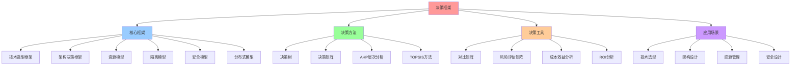

# 决策框架对比矩阵

## 📑 目录

- [决策框架对比矩阵](#决策框架对比矩阵)
  - [📑 目录](#-目录)
  - [1 决策框架功能矩阵](#1-决策框架功能矩阵)
  - [2 决策场景适用矩阵](#2-决策场景适用矩阵)
  - [3 决策方法对比矩阵](#3-决策方法对比矩阵)
  - [4 决策工具对比矩阵](#4-决策工具对比矩阵)

---

## 1 决策框架功能矩阵

| 决策框架 | 核心功能 | 主要工具 | 输出形式 | 适用问题 | 推荐度 |
|---------|---------|---------|---------|---------|--------|
| **技术选型框架** | 技术方案选择 | 对比矩阵、决策树 | 选型方案 | 技术选型 | ⭐⭐⭐⭐⭐ |
| **架构决策框架** | 架构方案选择 | 架构模式、设计原则 | 架构方案 | 架构设计 | ⭐⭐⭐⭐⭐ |
| **资源模型** | 资源分配决策 | 资源模型、约束分析 | 资源方案 | 资源管理 | ⭐⭐⭐⭐ |
| **隔离模型** | 隔离方案选择 | 隔离层次、安全分析 | 隔离方案 | 安全隔离 | ⭐⭐⭐⭐⭐ |
| **安全模型** | 安全方案选择 | 安全策略、风险评估 | 安全方案 | 安全设计 | ⭐⭐⭐⭐ |
| **分布式模型** | 分布式方案选择 | 一致性模型、容错模型 | 分布式方案 | 分布式系统 | ⭐⭐⭐⭐ |
| **性能基准** | 性能评估决策 | 基准测试、性能分析 | 性能报告 | 性能优化 | ⭐⭐⭐⭐ |

**推荐度说明**：

- **⭐⭐⭐⭐⭐**：强烈推荐
- **⭐⭐⭐⭐**：推荐
- **⭐⭐⭐**：可选

---

## 2 决策场景适用矩阵

| 场景 | 推荐框架 | 理由 | 使用工具 | 预期效果 | 优先级 |
|------|---------|------|---------|---------|--------|
| **技术选型** | 技术选型框架 | 系统化选型方法 | 对比矩阵 | 高 | 高 |
| **架构设计** | 架构决策框架 | 架构设计指导 | 架构模式 | 高 | 高 |
| **资源管理** | 资源模型 | 资源分配优化 | 资源模型 | 高 | 中 |
| **安全隔离** | 隔离模型 | 隔离方案选择 | 隔离层次 | 高 | 高 |
| **安全设计** | 安全模型 | 安全方案选择 | 安全策略 | 高 | 高 |
| **分布式系统** | 分布式模型 | 分布式方案选择 | 一致性模型 | 高 | 中 |
| **性能优化** | 性能基准 | 性能评估决策 | 基准测试 | 高 | 中 |
| **综合决策** | 多框架组合 | 全面决策分析 | 综合工具 | 极高 | 高 |

**优先级说明**：

- **高**：必须使用
- **中**：建议使用
- **低**：可选使用

---

## 3 决策方法对比矩阵

| 决策方法 | 适用场景 | 复杂度 | 准确性 | 时间成本 | 推荐度 |
|---------|---------|--------|--------|---------|--------|
| **决策树** | 结构化决策 | 低 | 中 | 低 | ⭐⭐⭐⭐⭐ |
| **决策矩阵** | 多因素决策 | 中 | 高 | 中 | ⭐⭐⭐⭐⭐ |
| **AHP层次分析** | 复杂决策 | 高 | 高 | 高 | ⭐⭐⭐⭐ |
| **TOPSIS方法** | 多方案选择 | 中 | 高 | 中 | ⭐⭐⭐⭐ |
| **SWOT分析** | 战略决策 | 低 | 中 | 低 | ⭐⭐⭐⭐ |
| **PEST分析** | 环境分析 | 低 | 中 | 低 | ⭐⭐⭐ |
| **五力模型** | 竞争分析 | 中 | 中 | 中 | ⭐⭐⭐ |
| **场景分析** | 不确定性决策 | 中 | 中 | 中 | ⭐⭐⭐⭐ |

**推荐度说明**：

- **⭐⭐⭐⭐⭐**：强烈推荐
- **⭐⭐⭐⭐**：推荐
- **⭐⭐⭐**：可选

---

## 4 决策工具对比矩阵

| 工具 | 功能 | 适用场景 | 使用难度 | 输出质量 | 推荐度 |
|------|------|---------|---------|---------|--------|
| **对比矩阵** | 方案对比 | 技术选型 | 低 | 高 | ⭐⭐⭐⭐⭐ |
| **决策树** | 决策路径 | 结构化决策 | 低 | 中 | ⭐⭐⭐⭐⭐ |
| **决策矩阵** | 多因素评估 | 综合决策 | 中 | 高 | ⭐⭐⭐⭐⭐ |
| **风险评估矩阵** | 风险分析 | 风险评估 | 中 | 高 | ⭐⭐⭐⭐ |
| **成本效益分析** | 成本评估 | 成本决策 | 中 | 高 | ⭐⭐⭐⭐ |
| **ROI分析** | 投资回报 | 投资决策 | 中 | 高 | ⭐⭐⭐⭐ |
| **敏感性分析** | 参数影响 | 不确定性分析 | 高 | 高 | ⭐⭐⭐ |
| **蒙特卡洛模拟** | 随机模拟 | 风险分析 | 高 | 高 | ⭐⭐⭐ |

**推荐度说明**：

- **⭐⭐⭐⭐⭐**：强烈推荐
- **⭐⭐⭐⭐**：推荐
- **⭐⭐⭐**：可选

---

## 5 决策流程矩阵

| 阶段 | 任务 | 工具 | 输出 | 时间 | 重要性 |
|------|------|------|------|------|--------|
| **问题识别** | 识别决策问题 | 问题分析 | 问题定义 | 短 | 高 |
| **信息收集** | 收集相关信息 | 信息收集工具 | 信息汇总 | 中 | 高 |
| **方案生成** | 生成备选方案 | 头脑风暴 | 方案列表 | 中 | 高 |
| **方案评估** | 评估备选方案 | 决策矩阵 | 评估结果 | 长 | 高 |
| **方案选择** | 选择最优方案 | 决策工具 | 最终方案 | 短 | 高 |
| **方案实施** | 实施方案 | 实施计划 | 实施结果 | 长 | 高 |
| **效果评估** | 评估实施效果 | 评估工具 | 评估报告 | 中 | 中 |
| **持续改进** | 持续改进 | 改进工具 | 改进方案 | 持续 | 中 |

**重要性说明**：

- **高**：关键阶段
- **中**：重要阶段

---

## 6 使用指南

### 6.1 快速开始

**适用场景**：决策框架选择、决策方法选择

**使用步骤**：

1. **问题识别**：识别决策问题的类型和特征
2. **场景匹配**：在"决策场景适用矩阵"中匹配应用场景
3. **框架选择**：选择适合的决策框架
4. **方法选择**：在"决策方法对比矩阵"中选择合适的决策方法
5. **工具选择**：在"决策工具对比矩阵"中选择合适的决策工具

**推荐度**：⭐⭐⭐⭐⭐

---

### 6.2 决策框架应用

**适用场景**：实际项目中的决策制定

**使用步骤**：

1. **问题分析**：分析决策问题的类型和特征
2. **框架选择**：根据问题类型选择合适的决策框架
3. **方法应用**：使用选择的决策方法进行分析
4. **工具使用**：使用选择的决策工具进行决策
5. **流程执行**：按照决策流程执行决策过程

**推荐度**：⭐⭐⭐⭐⭐

---

### 6.3 综合决策应用

**适用场景**：复杂问题的综合决策

**使用步骤**：

1. **问题分解**：将复杂问题分解为多个子问题
2. **框架组合**：为每个子问题选择合适的决策框架
3. **综合分析**：综合各子问题的决策结果
4. **最终决策**：做出最终的综合决策

**推荐度**：⭐⭐⭐⭐⭐

---

## 7 使用技巧

### 7.1 框架选择技巧

**技巧1：场景匹配**

- 准确匹配应用场景，避免框架误选
- 理解各框架的适用场景和特点
- 建立场景-框架匹配机制

**技巧2：框架组合**

- 对于复杂问题，组合使用多个框架
- 理解框架之间的关系
- 建立框架组合策略

**推荐度**：⭐⭐⭐⭐⭐

---

### 7.2 方法应用技巧

**技巧1：方法选择**

- 根据问题复杂度选择合适的决策方法
- 理解各方法的适用场景和优缺点
- 避免方法滥用

**技巧2：工具使用**

- 选择合适的决策工具
- 理解工具的使用方法和限制
- 提高工具使用效率

**推荐度**：⭐⭐⭐⭐⭐

---

## 8 实践案例

### 8.1 技术选型决策案例

**场景**：选择容器运行时技术

**分析过程**：

1. **问题识别**：技术选型问题
2. **场景匹配**：匹配"技术选型"场景，推荐技术选型框架
3. **方法选择**：选择决策矩阵方法
4. **工具选择**：选择对比矩阵工具
5. **流程执行**：
   - 问题识别：需要选择容器运行时
   - 信息收集：收集containerd、CRI-O、runc等信息
   - 方案生成：生成备选方案列表
   - 方案评估：使用决策矩阵评估各方案
   - 方案选择：选择containerd作为最终方案

**效果**：成功选择最适合的容器运行时技术

**推荐度**：⭐⭐⭐⭐⭐

---

### 8.2 架构决策案例

**场景**：选择微服务架构模式

**分析过程**：

1. **问题识别**：架构设计问题
2. **场景匹配**：匹配"架构设计"场景，推荐架构决策框架
3. **方法选择**：选择决策树方法
4. **工具选择**：选择架构模式工具
5. **流程执行**：
   - 问题识别：需要选择架构模式
   - 信息收集：收集微服务架构相关信息
   - 方案生成：生成架构方案列表
   - 方案评估：使用架构决策框架评估各方案
   - 方案选择：选择微服务架构作为最终方案

**效果**：成功选择最适合的架构模式

**推荐度**：⭐⭐⭐⭐⭐

---

## 9 2025 年最新实践

### 9.1 决策框架矩阵应用最佳实践（2025）

**2025 年趋势**：决策框架矩阵在技术选型、架构决策、资源管理中的深度应用

**实践要点**：

- **框架选择**：根据决策场景选择合适的决策框架
- **方法应用**：系统化应用决策方法和工具
- **决策优化**：基于实践效果优化决策流程
- **持续改进**：定期更新框架数据，反映最新趋势

**代码示例**：

```python
# 2025 年决策框架矩阵工具
class DecisionFrameworkMatrixTool:
    def __init__(self):
        self.matrix = DecisionFrameworkMatrix()
        self.selector = FrameworkSelector()
        self.applicator = MethodApplicator()
        self.optimizer = DecisionOptimizer()

    def select_framework(self, scenario, requirements):
        """框架选择"""
        return self.selector.select(scenario, requirements)

    def apply_method(self, framework, context):
        """方法应用"""
        return self.applicator.apply(framework, context)

    def optimize_decision(self, decision, feedback):
        """决策优化"""
        return self.optimizer.optimize(decision, feedback)
```

## 10 实际应用案例

### 案例 1：决策框架矩阵应用（2025）

**场景**：使用决策框架矩阵进行容器运行时技术选型

**实现方案**：

```python
# 决策框架矩阵应用
tool = DecisionFrameworkMatrixTool()

# 框架选择
scenario = Scenario(type="technology_selection", domain="runtime")
requirements = Requirements(complexity="medium", accuracy="high")
framework = tool.select_framework(scenario, requirements)

# 方法应用
context = Context(alternatives=["containerd", "CRI-O", "runc"])
decision = tool.apply_method(framework, context)

# 决策优化
feedback = Feedback(performance="good", satisfaction="high")
optimized = tool.optimize_decision(decision, feedback)
```

**效果**：

- 框架选择：基于场景选择框架，提高选择准确性
- 方法应用：系统化应用方法，提高决策质量
- 决策优化：基于反馈优化决策，提高决策效果

---

## 11 相关文档

- **[技术选型决策树](03-technology-selection-decision-tree.md)** - 容器运行时、隔离技术、编排平台、服务网格选型决策树
- **[决策案例对比矩阵](02-decision-cases-matrix.md)** - 边缘计算、Serverless、企业级、服务网格决策案例
- **[决策制定完整流程](24-decision-making-process.md)** - 决策制定全景流程、问题识别流程、方案设计流程
- **[决策反馈完整流程](27-decision-feedback-process.md)** - 决策反馈全景流程、反馈收集流程、反馈分析流程
- **[决策风险评估综合指南](28-decision-risk-assessment.md)** - 风险评估全景、技术风险评估、业务风险评估

---

## 10 认知增强：思维导图、知识矩阵与专家观点

### 10.1 决策框架完整思维导图



### 10.2 知识多维关系矩阵

#### 决策框架多维关系矩阵

| 框架维度 | 技术选型 | 架构决策 | 资源模型 | 隔离模型 | 安全模型 | 分布式模型 | 适用场景 | 认知价值 |
|---------|---------|---------|---------|---------|---------|-----------|---------|---------|
| **核心功能** | 技术方案选择 | 架构方案选择 | 资源分配决策 | 隔离方案选择 | 安全方案选择 | 分布式方案选择 | 决策制定 | 统一理解 |
| **主要工具** | 对比矩阵、决策树 | 架构模式、设计原则 | 资源模型、约束分析 | 隔离层次、安全分析 | 安全策略、风险评估 | 一致性模型、容错模型 | 决策分析 | 工具理解 |
| **输出形式** | 选型方案 | 架构方案 | 资源方案 | 隔离方案 | 安全方案 | 分布式方案 | 决策结果 | 结果理解 |
| **推荐度** | ⭐⭐⭐⭐⭐ | ⭐⭐⭐⭐⭐ | ⭐⭐⭐⭐ | ⭐⭐⭐⭐⭐ | ⭐⭐⭐⭐ | ⭐⭐⭐⭐ | - | 价值理解 |
| **学习难度** | ⭐⭐⭐ | ⭐⭐⭐⭐ | ⭐⭐⭐ | ⭐⭐⭐⭐ | ⭐⭐⭐⭐ | ⭐⭐⭐⭐ | - | 渐进学习 |
| **专家推荐** | ⭐⭐⭐⭐⭐ | ⭐⭐⭐⭐⭐ | ⭐⭐⭐⭐ | ⭐⭐⭐⭐⭐ | ⭐⭐⭐⭐ | ⭐⭐⭐⭐ | - | 理论深度 |

#### 决策方法多维关系矩阵

| 方法维度 | 决策树 | 决策矩阵 | AHP层次分析 | TOPSIS方法 | SWOT分析 | 适用场景 | 复杂度 | 认知价值 |
|---------|--------|---------|------------|-----------|----------|---------|--------|---------|
| **适用场景** | 结构化决策 | 多因素决策 | 复杂决策 | 多方案选择 | 战略决策 | 决策制定 | - | 场景理解 |
| **复杂度** | 低 | 中 | 高 | 中 | 低 | - | 方法复杂度 | 复杂度理解 |
| **准确性** | 中 | 高 | 高 | 高 | 中 | - | - | 准确性理解 |
| **时间成本** | 低 | 中 | 高 | 中 | 低 | - | - | 效率理解 |
| **推荐度** | ⭐⭐⭐⭐⭐ | ⭐⭐⭐⭐⭐ | ⭐⭐⭐⭐ | ⭐⭐⭐⭐ | ⭐⭐⭐⭐ | - | - | 价值理解 |

### 10.3 形象化解释论证

#### 决策框架的形象化类比

##### 1. 决策框架 = 导航系统

> **类比**：决策框架就像导航系统，决策树是路线规划（决策路径），决策矩阵是路况信息（方案对比），就像导航系统帮助我们选择最佳路线一样。

**认知价值**：

- **路径理解**：通过导航系统类比，理解决策框架的路径规划作用
- **信息理解**：通过路况信息类比，理解决策矩阵的信息对比作用
- **选择理解**：通过路线选择类比，理解决策框架的选择指导作用

##### 2. 决策矩阵 = 评分表

> **类比**：决策矩阵就像评分表，不同方案（选手）在不同维度（评分项）上得分，最终选择得分最高的方案（选手），就像评分表选择最佳选手一样。

**认知价值**：

- **评分理解**：通过评分表类比，理解决策矩阵的评分机制
- **维度理解**：通过评分项类比，理解决策矩阵的多维度分析
- **选择理解**：通过选择最佳选手类比，理解决策矩阵的选择逻辑

##### 3. 决策树 = 流程图

> **类比**：决策树就像流程图，每个节点是决策点（判断条件），每个分支是选择路径（决策结果），就像流程图指导流程执行一样。

**认知价值**：

- **流程理解**：通过流程图类比，理解决策树的流程指导作用
- **节点理解**：通过判断条件类比，理解决策树的节点判断逻辑
- **路径理解**：通过选择路径类比，理解决策树的分支选择机制

##### 4. 风险评估 = 天气预报

> **类比**：风险评估就像天气预报，识别潜在风险（天气变化），评估风险等级（天气等级），制定应对措施（防护措施），就像天气预报帮助我们应对天气变化一样。

**认知价值**：

- **识别理解**：通过天气变化类比，理解风险识别的重要性
- **评估理解**：通过天气等级类比，理解风险等级评估的方法
- **应对理解**：通过防护措施类比，理解风险应对的策略

### 10.4 专家观点与论证

#### 计算信息软件科学家的观点

##### 1. Herbert Simon（决策理论专家

> "Decision frameworks provide a systematic approach to making complex decisions. They help us structure our thinking and make more rational choices."

**在决策框架中的应用**：

- **系统化方法**：决策框架提供了系统化的决策方法
- **结构化思维**：决策框架帮助我们结构化思维
- **理性选择**：决策框架帮助我们做出更理性的选择

##### 2. Herbert Simon（决策理论专家）

> "Bounded rationality means we can't consider all options. Decision frameworks help us focus on what matters most."

**在决策框架中的应用**：

- **有限理性**：我们无法考虑所有选项，决策框架帮助我们聚焦最重要的因素
- **聚焦理解**：决策框架帮助我们聚焦关键因素
- **效率理解**：决策框架提高了决策效率

##### 3. Daniel Kahneman（行为经济学家）

> "Decision frameworks help us overcome cognitive biases. They provide structure when our intuition might lead us astray."

**在决策框架中的应用**：

- **认知偏差**：决策框架帮助我们克服认知偏差
- **结构化指导**：决策框架在直觉可能误导我们时提供结构化指导
- **理性决策**：决策框架帮助我们做出更理性的决策

#### 计算信息软件教育家的观点

##### 1. Robert Harper（决策教育专家）

> "Teaching decision frameworks helps students understand that complex decisions can be broken down into manageable steps."

**教育价值**：

- **步骤理解**：决策框架教学生将复杂决策分解为可管理的步骤
- **方法理解**：决策框架帮助学生理解决策方法
- **能力提升**：决策框架提升了学生的决策能力

##### 2. Benjamin Pierce（决策教育专家）

> "Decision frameworks are cognitive tools that help students think more systematically about complex problems."

**教育价值**：

- **认知工具**：决策框架是帮助学生更系统地思考复杂问题的认知工具
- **系统思维**：决策框架训练学生的系统思维能力
- **问题解决**：决策框架帮助学生解决复杂问题

#### 计算信息软件认知学家的观点

##### 1. David Marr（计算认知科学家）

> "Decision-making is a cognitive process. Decision frameworks provide computational models for understanding this process."

**认知价值**：

- **认知过程**：决策是认知过程，决策框架提供了理解这一过程的计算模型
- **模型理解**：决策框架帮助我们理解决策的认知模型
- **过程理解**：决策框架帮助我们理解决策过程

##### 2. Douglas Hofstadter（认知科学家）

> "Decision frameworks teach us to think in terms of structure and process. This is a fundamental cognitive skill."

**认知价值**：

- **结构化思维**：决策框架训练我们从结构和过程角度思考
- **认知技能**：决策框架训练了我们的基本认知技能
- **思维提升**：决策框架提升了我们的思维能力

### 10.5 认知学习路径矩阵

| 学习阶段 | 核心概念 | 形象化理解 | 方法理解 | 实践应用 | 认知目标 |
|---------|---------|-----------|---------|---------|---------|
| **入门** | 决策框架基础 | 导航系统、评分表类比 | 决策树、决策矩阵 | 简单决策 | 建立直觉 |
| **进阶** | 多框架应用 | 流程图、天气预报类比 | AHP、TOPSIS | 复杂决策 | 理解方法 |
| **高级** | 综合决策 | 深层结构类比 | 多框架组合 | 战略决策 | 掌握框架 |
| **专家** | 决策优化 | 系统设计类比 | 决策优化理论 | 系统设计 | 灵活应用 |

### 10.6 专家推荐阅读路径

**计算信息软件科学家推荐路径**：

1. **理论基础**：从决策理论开始，理解决策的数学基础
2. **框架理解**：理解各种决策框架的特点和适用场景
3. **方法掌握**：掌握决策树、决策矩阵等决策方法
4. **理论应用**：将决策理论应用到技术选型和架构设计

**计算信息软件教育家推荐路径**：

1. **形象化理解**：通过导航系统、评分表等类比，建立直观理解
2. **渐进学习**：从简单决策开始，逐步学习复杂决策
3. **实践结合**：结合实际案例，理解决策框架应用
4. **思维训练**：通过决策框架，训练决策思维能力

**计算信息软件认知学家推荐路径**：

1. **认知模式**：识别决策框架中的认知模式
2. **过程理解**：理解决策的认知过程
3. **跨域应用**：将决策思维应用到其他领域
4. **认知提升**：通过决策框架，提升认知能力

---

**最后更新**：2025-11-15
**文档状态**：✅ 完整 | 📊 包含思维导图、知识多维关系矩阵、形象化解释论证、专家观点 | 🎯 生产就绪
**维护者**：项目团队
