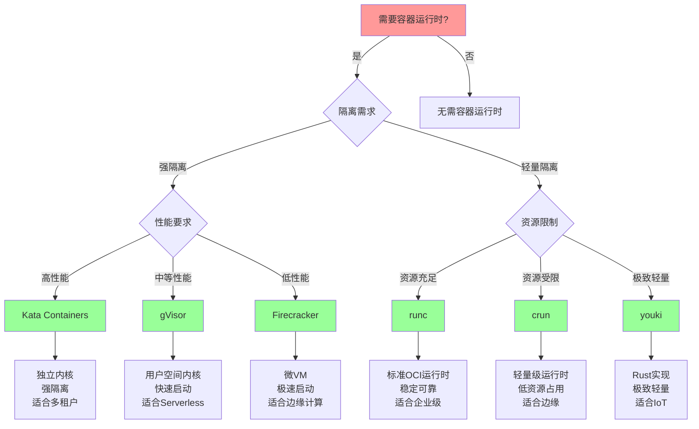
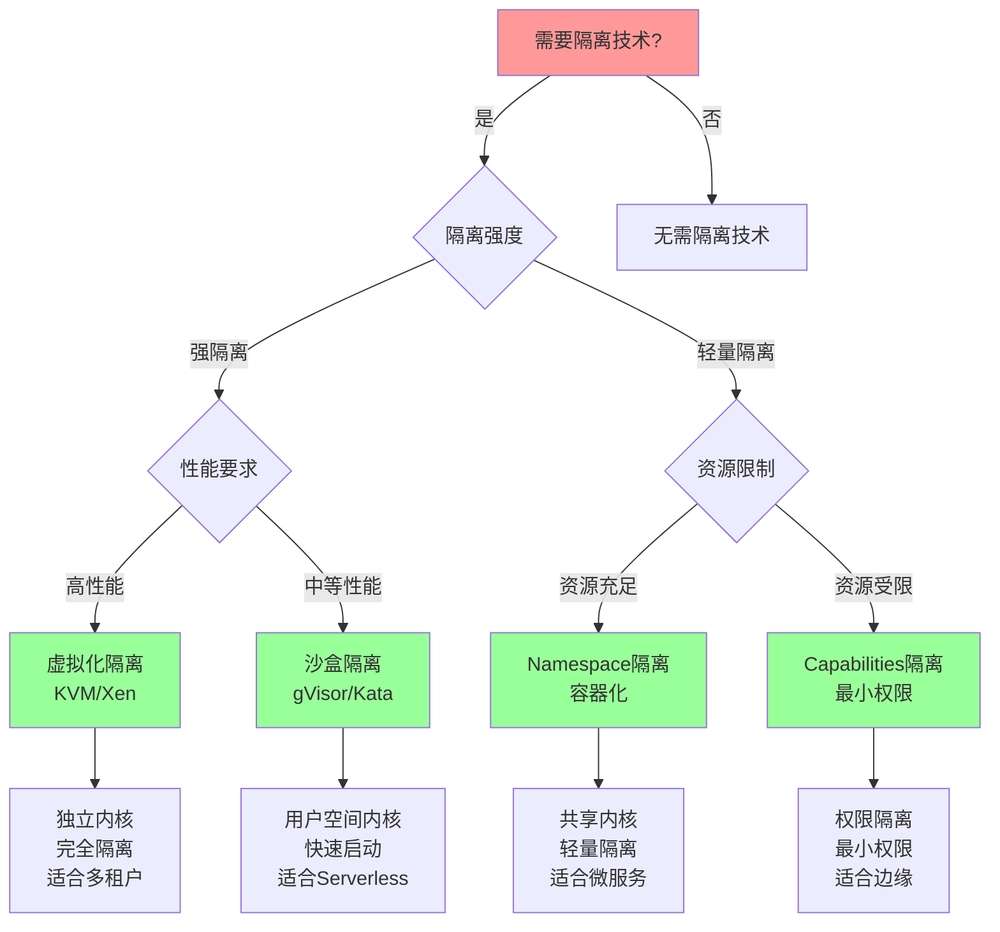
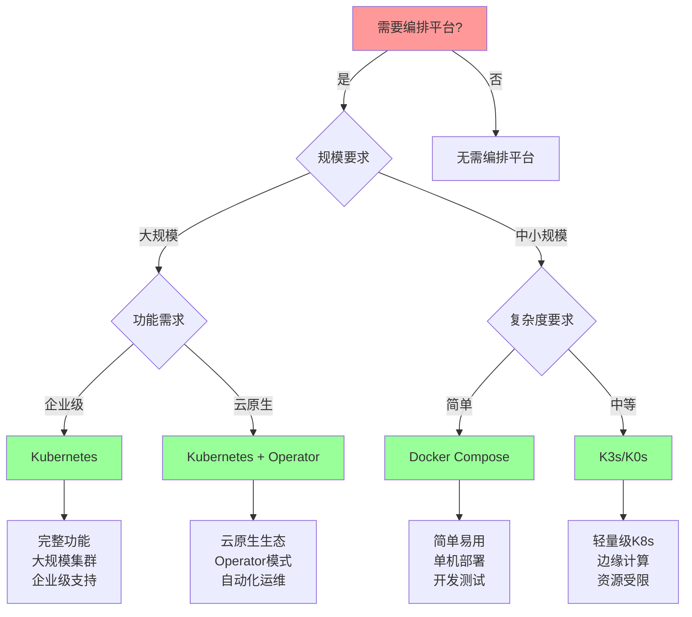
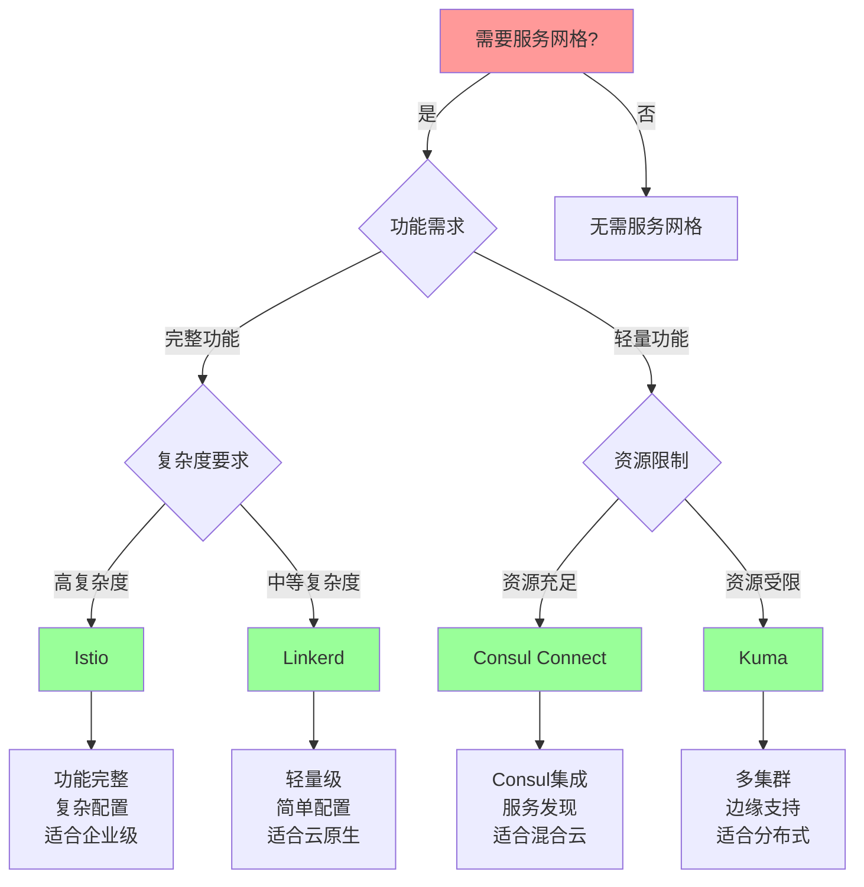
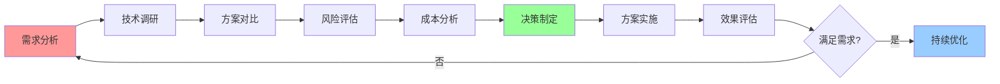

# 技术选型决策树

## 📑 目录

- [技术选型决策树](#技术选型决策树)
  - [📑 目录](#-目录)
  - [1 容器运行时选型决策树](#1-容器运行时选型决策树)
  - [2 隔离技术选型决策树](#2-隔离技术选型决策树)
  - [3 编排平台选型决策树](#3-编排平台选型决策树)
  - [4 服务网格选型决策树](#4-服务网格选型决策树)

---

## 1 容器运行时选型决策树

---

## 2 隔离技术选型决策树

---

## 3 编排平台选型决策树

---

## 4 服务网格选型决策树

---

## 5 技术选型综合决策矩阵

| 决策因素 | 权重 | 容器运行时 | 隔离技术 | 编排平台 | 服务网格 | 优先级 |
|---------|------|-----------|---------|---------|---------|--------|
| **隔离强度** | 高 | 高 | 高 | 中 | 中 | 高 |
| **性能要求** | 高 | 高 | 高 | 中 | 中 | 高 |
| **资源限制** | 高 | 高 | 高 | 中 | 中 | 高 |
| **易用性** | 中 | 中 | 中 | 高 | 中 | 中 |
| **可维护性** | 中 | 中 | 中 | 高 | 中 | 中 |
| **生态支持** | 中 | 中 | 中 | 高 | 高 | 中 |
| **成本** | 中 | 中 | 中 | 中 | 中 | 中 |

**优先级说明**：

- **高**：必须考虑
- **中**：建议考虑
- **低**：可选考虑

---

## 6 技术选型决策流程

---

**最后更新**：2025-11-07
**文档状态**：✅ 完整 | 📊 包含技术选型决策树 | 🎯 生产就绪
**维护者**：项目团队
