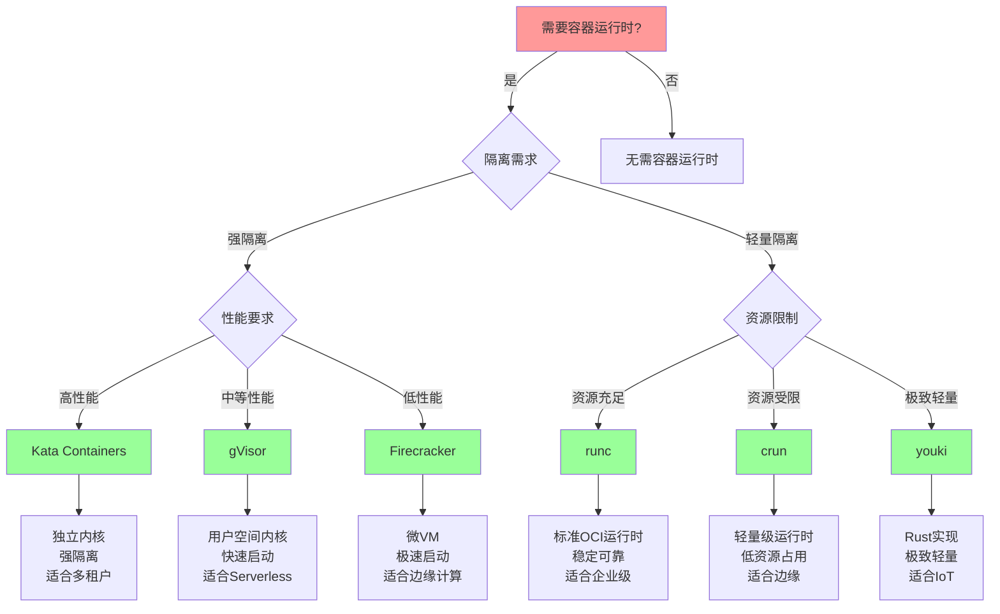
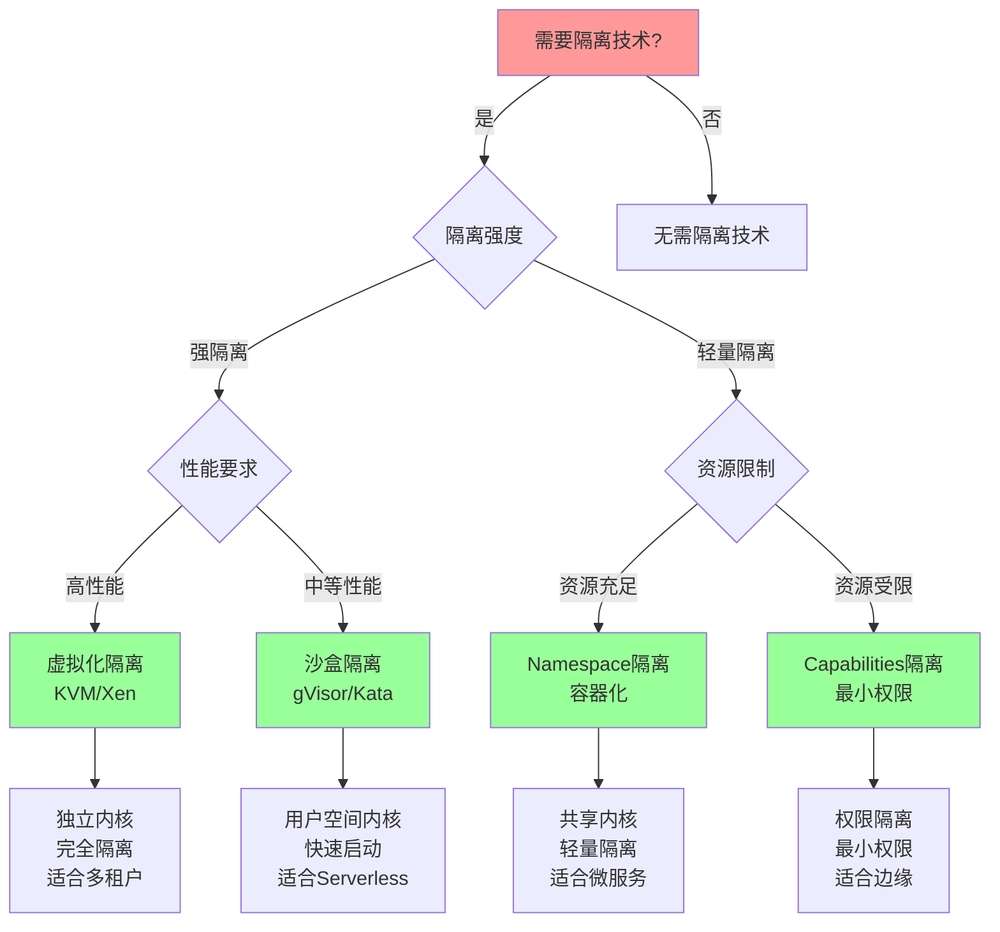
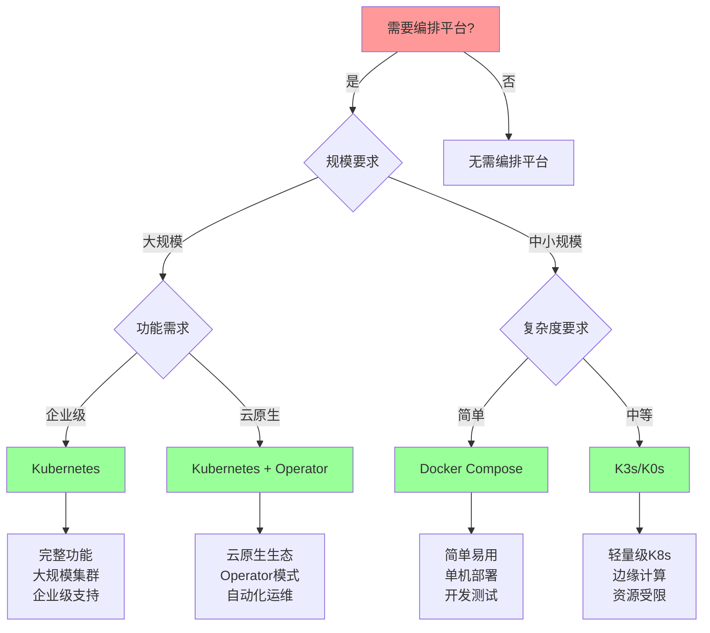
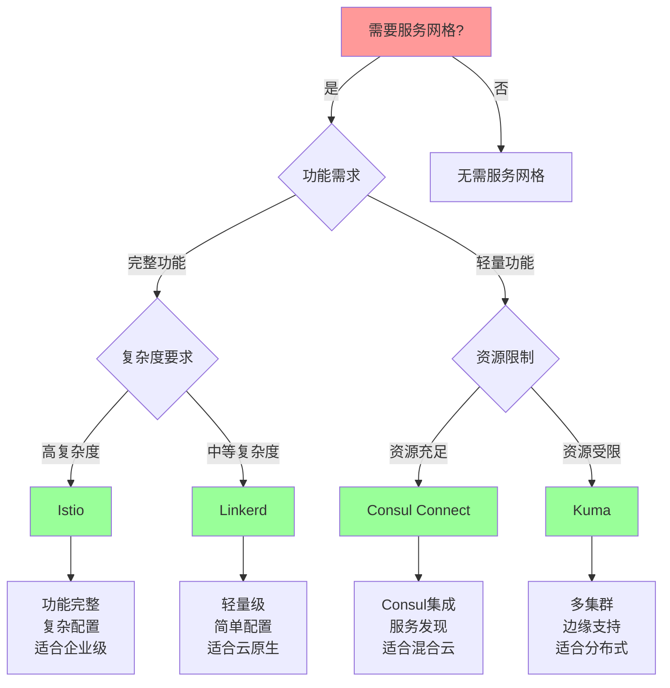
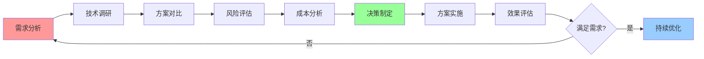

# 技术选型决策树

## 📑 目录

- [技术选型决策树](#技术选型决策树)
  - [📑 目录](#-目录)
  - [1 容器运行时选型决策树](#1-容器运行时选型决策树)
  - [2 隔离技术选型决策树](#2-隔离技术选型决策树)
  - [3 编排平台选型决策树](#3-编排平台选型决策树)
  - [4 服务网格选型决策树](#4-服务网格选型决策树)
  - [5 技术选型综合决策矩阵](#5-技术选型综合决策矩阵)
  - [6 技术选型决策流程](#6-技术选型决策流程)
  - [7 使用指南](#7-使用指南)
    - [7.1 快速开始](#71-快速开始)
    - [7.2 技术选型应用](#72-技术选型应用)
    - [7.3 综合选型应用](#73-综合选型应用)
  - [8 使用技巧](#8-使用技巧)
    - [8.1 决策树使用技巧](#81-决策树使用技巧)
    - [8.2 方案评估技巧](#82-方案评估技巧)
  - [9 实践案例](#9-实践案例)
    - [9.1 容器运行时选型案例](#91-容器运行时选型案例)
    - [9.2 编排平台选型案例](#92-编排平台选型案例)
  - [10 相关文档](#10-相关文档)

---

## 1 容器运行时选型决策树



---

## 2 隔离技术选型决策树



---

## 3 编排平台选型决策树



---

## 4 服务网格选型决策树



---

## 5 技术选型综合决策矩阵

| 决策因素 | 权重 | 容器运行时 | 隔离技术 | 编排平台 | 服务网格 | 优先级 |
|---------|------|-----------|---------|---------|---------|--------|
| **隔离强度** | 高 | 高 | 高 | 中 | 中 | 高 |
| **性能要求** | 高 | 高 | 高 | 中 | 中 | 高 |
| **资源限制** | 高 | 高 | 高 | 中 | 中 | 高 |
| **易用性** | 中 | 中 | 中 | 高 | 中 | 中 |
| **可维护性** | 中 | 中 | 中 | 高 | 中 | 中 |
| **生态支持** | 中 | 中 | 中 | 高 | 高 | 中 |
| **成本** | 中 | 中 | 中 | 中 | 中 | 中 |

**优先级说明**：

- **高**：必须考虑
- **中**：建议考虑
- **低**：可选考虑

---

## 6 技术选型决策流程



---

## 7 使用指南

### 7.1 快速开始

**适用场景**：技术选型、快速决策

**使用步骤**：

1. **需求分析**：分析技术选型的需求和约束条件
2. **决策树选择**：根据技术类型选择合适的决策树（容器运行时、隔离技术、编排平台、服务网格）
3. **路径遍历**：按照决策树路径进行决策
4. **方案选择**：根据决策树路径选择最终方案

**推荐度**：⭐⭐⭐⭐⭐

---

### 7.2 技术选型应用

**适用场景**：实际项目中的技术选型

**使用步骤**：

1. **需求识别**：识别技术选型的需求（隔离需求、性能要求、资源限制等）
2. **决策树应用**：使用相应的决策树进行决策
3. **方案评估**：评估决策树推荐的方案
4. **方案选择**：选择最适合的技术方案
5. **效果验证**：验证选择的技术方案的效果

**推荐度**：⭐⭐⭐⭐⭐

---

### 7.3 综合选型应用

**适用场景**：多个技术的综合选型

**使用步骤**：

1. **技术列表**：列出需要选型的技术列表
2. **逐个选型**：使用相应的决策树逐个进行技术选型
3. **组合评估**：评估技术组合的兼容性和效果
4. **综合决策**：做出综合的技术选型决策

**推荐度**：⭐⭐⭐⭐⭐

---

## 8 使用技巧

### 8.1 决策树使用技巧

**技巧1：需求明确**

- 明确技术选型的需求和约束条件
- 避免需求模糊导致的决策错误
- 建立需求-决策树映射机制

**技巧2：路径验证**

- 验证决策树路径的正确性
- 理解路径中每个节点的含义
- 避免路径误选

**推荐度**：⭐⭐⭐⭐⭐

---

### 8.2 方案评估技巧

**技巧1：多因素考虑**

- 综合考虑多个因素（性能、成本、安全性等）
- 避免单一因素决策
- 建立多因素评估机制

**技巧2：方案验证**

- 验证选择的技术方案的可行性
- 进行小规模验证测试
- 根据验证结果调整方案

**推荐度**：⭐⭐⭐⭐⭐

---

## 9 实践案例

### 9.1 容器运行时选型案例

**场景**：为Kubernetes集群选择容器运行时

**分析过程**：

1. **需求分析**：
   - 隔离需求：中等隔离（多租户环境）
   - 性能要求：高性能
   - 资源限制：资源充足

2. **决策树应用**：
   - 使用容器运行时选型决策树
   - 路径：需要容器运行时 → 轻量隔离 → 资源充足 → runc

3. **方案评估**：
   - runc：标准OCI运行时，稳定可靠，适合企业级应用

4. **方案选择**：选择runc作为容器运行时

5. **效果验证**：runc运行稳定，满足需求

**效果**：成功选择最适合的容器运行时

**推荐度**：⭐⭐⭐⭐⭐

---

### 9.2 编排平台选型案例

**场景**：为边缘计算场景选择编排平台

**分析过程**：

1. **需求分析**：
   - 规模要求：中小规模
   - 复杂度要求：简单
   - 资源限制：资源受限

2. **决策树应用**：
   - 使用编排平台选型决策树
   - 路径：需要编排平台 → 中小规模 → 简单 → Docker Compose

3. **方案评估**：
   - Docker Compose：简单易用，适合边缘计算场景

4. **方案选择**：选择Docker Compose作为编排平台

5. **效果验证**：Docker Compose满足边缘计算需求

**效果**：成功选择最适合的编排平台

**推荐度**：⭐⭐⭐⭐⭐

---

## 10 2025 年最新实践

### 10.1 技术选型决策树应用最佳实践（2025）

**2025 年趋势**：技术选型决策树在容器运行时、隔离技术、编排平台、服务网格选型中的深度应用

**实践要点**：

- **需求分析**：系统化分析技术选型需求
- **决策树应用**：使用决策树进行结构化决策
- **路径验证**：验证决策树路径的正确性
- **方案评估**：多因素评估技术方案

**代码示例**：

```python
# 2025 年技术选型决策树工具
class TechnologySelectionDecisionTreeTool:
    def __init__(self):
        self.tree = TechnologySelectionDecisionTree()
        self.analyzer = RequirementAnalyzer()
        self.traverser = TreeTraverser()
        self.evaluator = SolutionEvaluator()

    def analyze_requirements(self, project, constraints):
        """需求分析"""
        return self.analyzer.analyze(project, constraints)

    def traverse_tree(self, requirements, tree_type):
        """决策树遍历"""
        return self.traverser.traverse(requirements, tree_type)

    def evaluate_solution(self, solution, criteria):
        """方案评估"""
        return self.evaluator.evaluate(solution, criteria)
```

## 11 实际应用案例

### 案例 1：技术选型决策树应用（2025）

**场景**：使用技术选型决策树进行容器运行时选型

**实现方案**：

```python
# 技术选型决策树应用
tool = TechnologySelectionDecisionTreeTool()

# 需求分析
project = Project(type="kubernetes", scale="large")
constraints = Constraints(isolation="medium", performance="high")
requirements = tool.analyze_requirements(project, constraints)

# 决策树遍历
tree_type = "container_runtime"
path = tool.traverse_tree(requirements, tree_type)

# 方案评估
solution = Solution(technology=path.result)
criteria = Criteria(performance=True, security=True, stability=True)
evaluation = tool.evaluate_solution(solution, criteria)
```

**效果**：

- 需求分析：系统化分析需求，提高分析质量
- 决策树遍历：结构化决策路径，提高决策准确性
- 方案评估：多因素评估方案，提高评估质量

---

## 12 相关文档

- **[决策框架对比矩阵](01-decision-framework-matrix.md)** - 决策框架功能、决策场景适用、决策方法、决策工具对比
- **[技术选型详细指南](15-technology-selection-guide.md)** - 容器运行时选型指南、隔离技术选型指南、编排平台选型指南
- **[技术对比详细矩阵](16-technology-comparison-matrix.md)** - 容器运行时对比、隔离技术对比、编排平台对比
- **[技术选型完整工作流](23-technology-selection-workflow.md)** - 技术选型全景流程、需求分析流程、技术评估流程
- **[决策案例研究详解](29-decision-case-studies.md)** - 案例研究全景、容器运行时选型案例、服务网格选型案例

---

**最后更新**：2025-11-15
**文档状态**：✅ 完整 | 📊 包含技术选型决策树、使用指南、使用技巧、实践案例 | 🎯 生产就绪
**维护者**：项目团队
