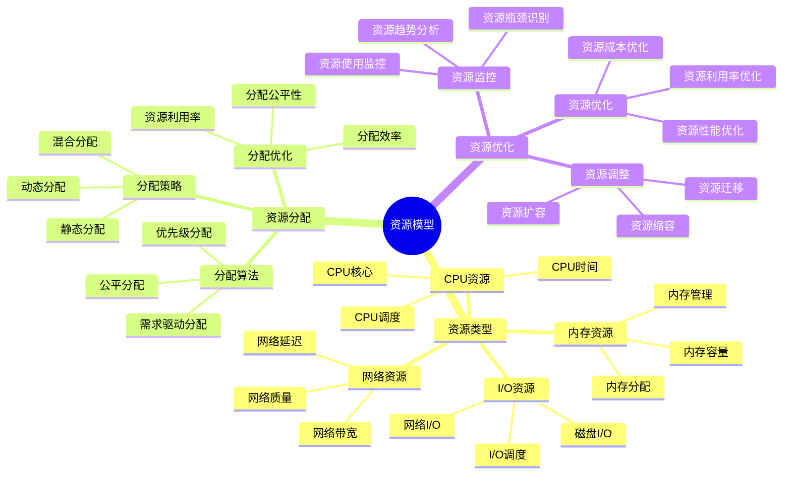
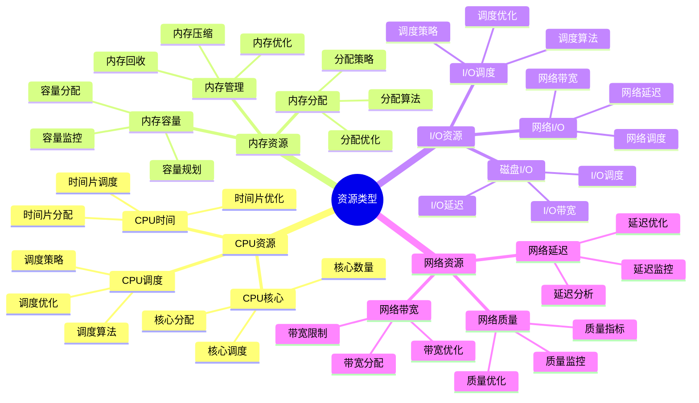
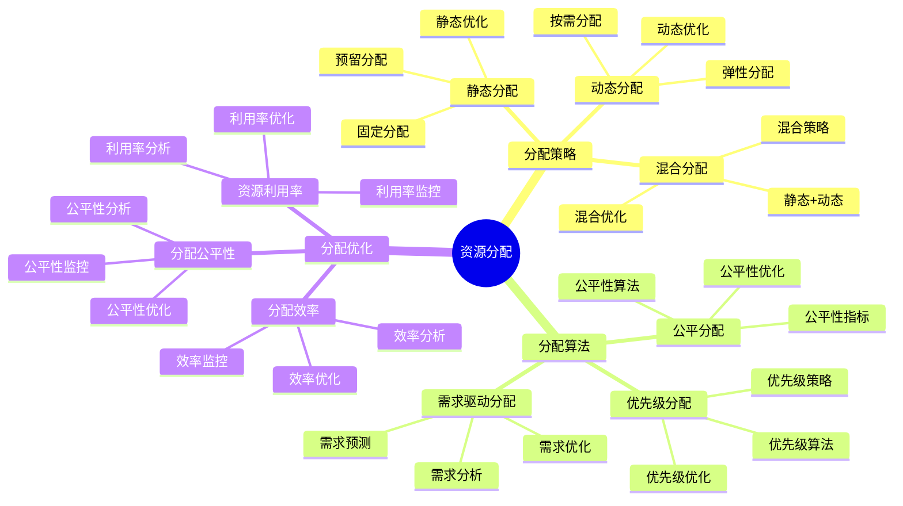
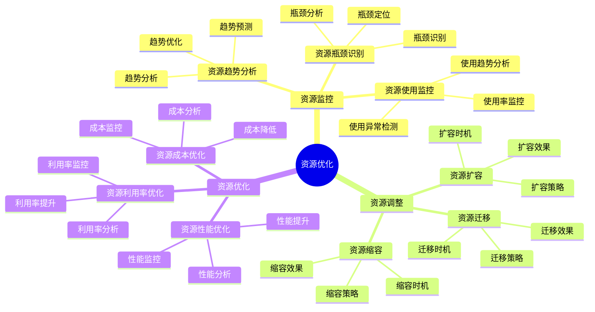

# 资源模型详细思维导图

## 📑 目录

- [资源模型详细思维导图](#资源模型详细思维导图)
  - [📑 目录](#-目录)
  - [1 资源模型核心概念](#1-资源模型核心概念)
  - [2 资源类型详解](#2-资源类型详解)
  - [3 资源分配详解](#3-资源分配详解)
  - [4 资源优化详解](#4-资源优化详解)

---

## 1 资源模型核心概念

---

## 2 资源类型详解

---

## 3 资源分配详解

---

## 4 资源优化详解

---

## 5 资源模型应用场景矩阵

| 应用场景 | 资源类型 | 分配策略 | 优化方法 | 效果 | 推荐度 |
|---------|---------|---------|---------|------|--------|
| **容器化** | CPU+内存+I/O | 动态分配 | Cgroup优化 | 高 | ⭐⭐⭐⭐⭐ |
| **虚拟化** | CPU+内存+I/O+网络 | 静态+动态 | 资源池化 | 高 | ⭐⭐⭐⭐⭐ |
| **Serverless** | CPU+内存 | 按需分配 | 弹性伸缩 | 高 | ⭐⭐⭐⭐⭐ |
| **边缘计算** | CPU+内存+网络 | 静态分配 | 资源限制 | 中 | ⭐⭐⭐⭐ |
| **高性能计算** | CPU+内存+I/O | 静态分配 | 资源预留 | 高 | ⭐⭐⭐⭐ |
| **多租户** | 全部资源 | 混合分配 | 资源隔离 | 高 | ⭐⭐⭐⭐⭐ |

**推荐度说明**：

- **⭐⭐⭐⭐⭐**：强烈推荐
- **⭐⭐⭐⭐**：推荐
- **⭐⭐⭐**：可选

---

**最后更新**：2025-11-07
**文档状态**：✅ 完整 | 📊 包含资源模型详细思维导图 | 🎯 生产就绪
**维护者**：项目团队
