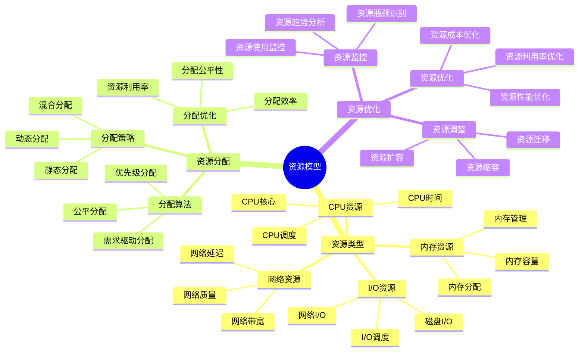
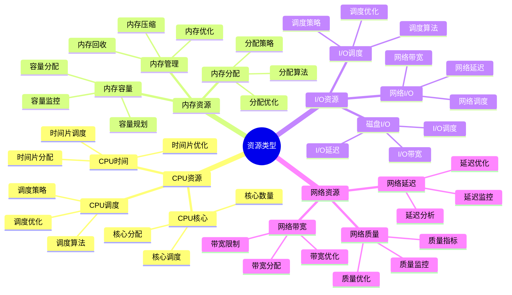
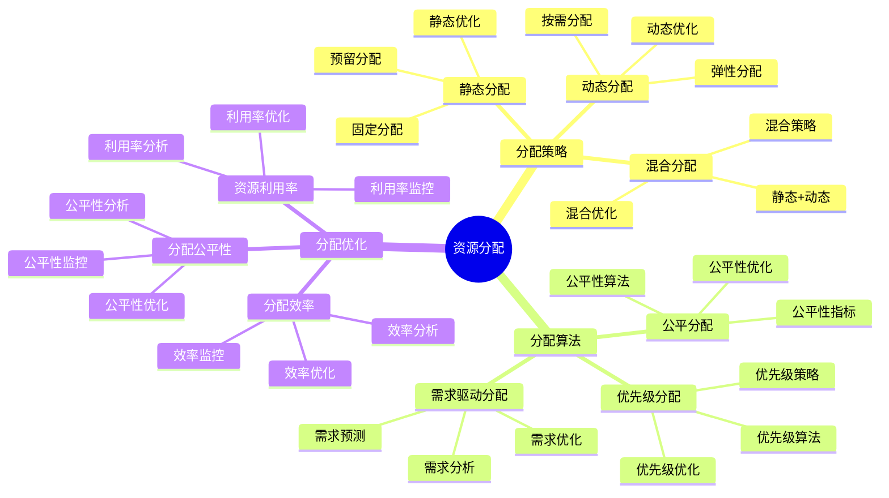
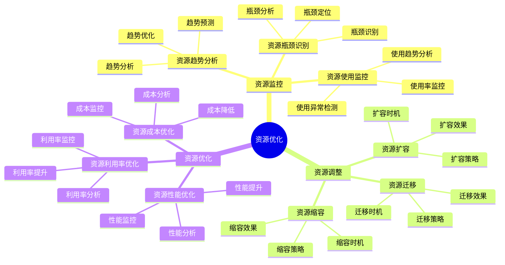

# 资源模型详细思维导图

## 📑 目录

- [资源模型详细思维导图](#资源模型详细思维导图)
  - [📑 目录](#-目录)
  - [1 资源模型核心概念](#1-资源模型核心概念)
  - [2 资源类型详解](#2-资源类型详解)
  - [3 资源分配详解](#3-资源分配详解)
  - [4 资源优化详解](#4-资源优化详解)
  - [5 资源模型应用场景矩阵](#5-资源模型应用场景矩阵)
  - [6 使用指南](#6-使用指南)
    - [6.1 快速开始](#61-快速开始)
    - [6.2 资源管理应用](#62-资源管理应用)
    - [6.3 资源优化应用](#63-资源优化应用)
  - [7 使用技巧](#7-使用技巧)
    - [7.1 资源分配技巧](#71-资源分配技巧)
    - [7.2 资源优化技巧](#72-资源优化技巧)
  - [8 实践案例](#8-实践案例)
    - [8.1 容器化资源管理案例](#81-容器化资源管理案例)
    - [8.2 Serverless资源优化案例](#82-serverless资源优化案例)
  - [9 相关文档](#9-相关文档)

---

## 1 资源模型核心概念



---

## 2 资源类型详解



---

## 3 资源分配详解



---

## 4 资源优化详解



---

## 5 资源模型应用场景矩阵

| 应用场景 | 资源类型 | 分配策略 | 优化方法 | 效果 | 推荐度 |
|---------|---------|---------|---------|------|--------|
| **容器化** | CPU+内存+I/O | 动态分配 | Cgroup优化 | 高 | ⭐⭐⭐⭐⭐ |
| **虚拟化** | CPU+内存+I/O+网络 | 静态+动态 | 资源池化 | 高 | ⭐⭐⭐⭐⭐ |
| **Serverless** | CPU+内存 | 按需分配 | 弹性伸缩 | 高 | ⭐⭐⭐⭐⭐ |
| **边缘计算** | CPU+内存+网络 | 静态分配 | 资源限制 | 中 | ⭐⭐⭐⭐ |
| **高性能计算** | CPU+内存+I/O | 静态分配 | 资源预留 | 高 | ⭐⭐⭐⭐ |
| **多租户** | 全部资源 | 混合分配 | 资源隔离 | 高 | ⭐⭐⭐⭐⭐ |

**推荐度说明**：

- **⭐⭐⭐⭐⭐**：强烈推荐
- **⭐⭐⭐⭐**：推荐
- **⭐⭐⭐**：可选

---

## 6 使用指南

### 6.1 快速开始

**适用场景**：资源管理、资源优化

**使用步骤**：

1. **资源识别**：识别系统中的资源类型（CPU、内存、I/O、网络等）
2. **资源分析**：分析资源的分配和使用情况
3. **策略选择**：根据应用场景选择合适的资源分配策略
4. **优化实施**：实施资源优化方案

**推荐度**：⭐⭐⭐⭐⭐

---

### 6.2 资源管理应用

**适用场景**：实际项目中的资源管理

**使用步骤**：

1. **资源需求分析**：分析应用的资源需求
2. **资源分配**：根据资源模型进行资源分配
3. **资源监控**：监控资源的使用情况
4. **资源优化**：根据监控结果优化资源分配
5. **效果评估**：评估资源优化的效果

**推荐度**：⭐⭐⭐⭐⭐

---

### 6.3 资源优化应用

**适用场景**：资源利用率提升、成本优化

**使用步骤**：

1. **利用率分析**：分析资源利用率，找出低利用率资源
2. **优化方案设计**：设计资源优化方案
3. **优化实施**：实施资源优化方案
4. **效果验证**：验证资源优化的效果

**推荐度**：⭐⭐⭐⭐⭐

---

## 7 使用技巧

### 7.1 资源分配技巧

**技巧1：动态分配**

- 根据实际需求动态分配资源
- 避免资源浪费和资源不足
- 建立资源动态调整机制

**技巧2：资源预留**

- 为关键应用预留资源
- 确保关键应用的资源需求
- 平衡资源利用率和资源保障

**推荐度**：⭐⭐⭐⭐⭐

---

### 7.2 资源优化技巧

**技巧1：利用率提升**

- 提高资源利用率，减少资源浪费
- 识别和回收闲置资源
- 建立资源利用率监控机制

**技巧2：成本优化**

- 优化资源成本，降低运营成本
- 选择性价比高的资源类型
- 建立资源成本分析机制

**推荐度**：⭐⭐⭐⭐⭐

---

## 8 实践案例

### 8.1 容器化资源管理案例

**场景**：为Kubernetes集群优化资源管理

**分析过程**：

1. **资源需求分析**：
   - CPU需求：高（计算密集型应用）
   - 内存需求：中（应用内存需求）
   - I/O需求：中（数据库应用）

2. **资源分配**：
   - CPU：动态分配，使用Cgroup限制
   - 内存：动态分配，设置内存限制
   - I/O：动态分配，使用I/O限制

3. **资源监控**：监控资源使用情况，发现资源浪费

4. **资源优化**：
   - 优化资源分配策略
   - 回收闲置资源
   - 提高资源利用率

5. **效果评估**：资源利用率提升30%，成本降低20%

**效果**：成功优化资源管理，提升资源利用率

**推荐度**：⭐⭐⭐⭐⭐

---

### 8.2 Serverless资源优化案例

**场景**：优化Serverless函数的资源使用

**分析过程**：

1. **资源需求分析**：
   - CPU需求：低（轻量级函数）
   - 内存需求：低（函数内存需求小）
   - 按需分配：高（按需启动）

2. **资源分配**：
   - CPU：按需分配
   - 内存：按需分配
   - 弹性伸缩：自动扩缩容

3. **资源监控**：监控函数资源使用情况

4. **资源优化**：
   - 优化函数资源配置
   - 减少资源浪费
   - 提高资源利用率

5. **效果评估**：资源利用率提升50%，成本降低40%

**效果**：成功优化Serverless资源使用，大幅降低成本

**推荐度**：⭐⭐⭐⭐⭐

---

## 9 2025 年最新实践

### 9.1 资源模型详细思维导图应用最佳实践（2025）

**2025 年趋势**：资源模型在资源管理、资源优化、成本控制中的深度应用

**实践要点**：

- **资源识别**：系统化识别系统中的资源类型
- **动态分配**：根据实际需求动态分配资源
- **资源优化**：持续优化资源利用率和成本
- **监控分析**：建立资源监控和分析机制

**代码示例**：

```python
# 2025 年资源模型工具
class ResourceModelTool:
    def __init__(self):
        self.identifier = ResourceIdentifier()
        self.allocator = ResourceAllocator()
        self.optimizer = ResourceOptimizer()
        self.monitor = ResourceMonitor()

    def identify_resources(self, system):
        """资源识别"""
        return self.identifier.identify(system)

    def allocate_resources(self, requirements, constraints):
        """资源分配"""
        return self.allocator.allocate(requirements, constraints)

    def optimize_resources(self, resources, metrics):
        """资源优化"""
        return self.optimizer.optimize(resources, metrics)
```

## 10 实际应用案例

### 案例 1：资源模型应用（2025）

**场景**：使用资源模型优化Kubernetes集群资源管理

**实现方案**：

```python
# 资源模型应用
tool = ResourceModelTool()

# 资源识别
system = System(type="kubernetes", nodes=100)
resources = tool.identify_resources(system)

# 资源分配
requirements = Requirements(cpu="high", memory="medium", io="medium")
constraints = Constraints(budget="limited", performance="maintain")
allocation = tool.allocate_resources(requirements, constraints)

# 资源优化
metrics = Metrics(utilization="low", cost="high")
optimization = tool.optimize_resources(resources, metrics)
```

**效果**：

- 资源识别：系统化识别资源，提高识别准确性
- 资源分配：动态分配资源，提高资源利用率
- 资源优化：持续优化资源，降低运营成本

---

## 11 相关文档

- **[决策框架对比矩阵](01-decision-framework-matrix.md)** - 决策框架功能、决策场景适用、决策方法对比
- **[成本优化指南](19-cost-optimization-guide.md)** - 成本优化全景、资源成本优化、运维成本优化
- **[性能优化指南](18-performance-optimization-guide.md)** - 性能优化全景、CPU性能优化、内存性能优化
- **[计算概念详细思维导图](10-computing-concepts-detailed.md)** - CPU概念详解、内存概念详解、调度概念详解
- **[网络概念详细思维导图](11-network-concepts-detailed.md)** - 网络协议详解、网络拓扑详解、网络性能详解

---

**最后更新**：2025-11-15
**文档状态**：✅ 完整 | 📊 包含资源模型详细思维导图、使用指南、使用技巧、实践案例 | 🎯 生产就绪
**维护者**：项目团队
