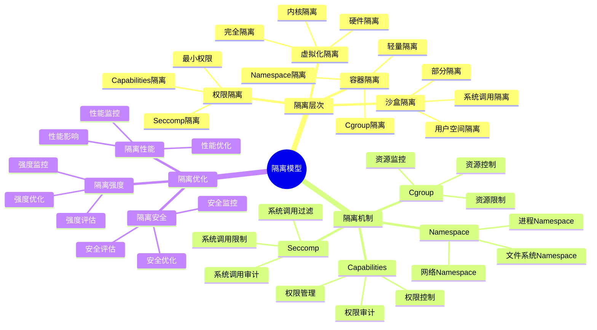
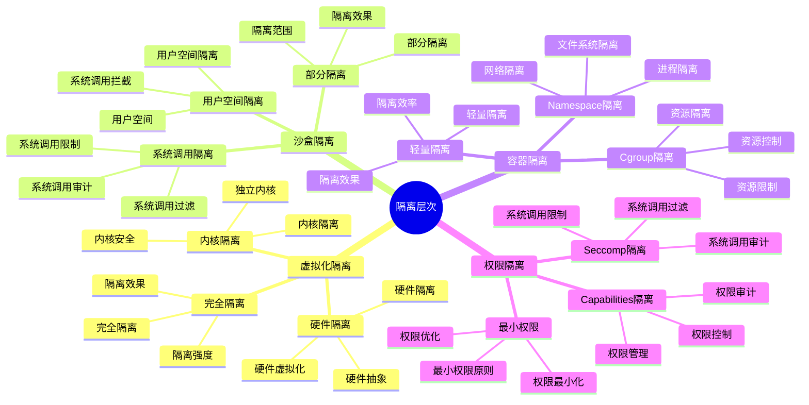
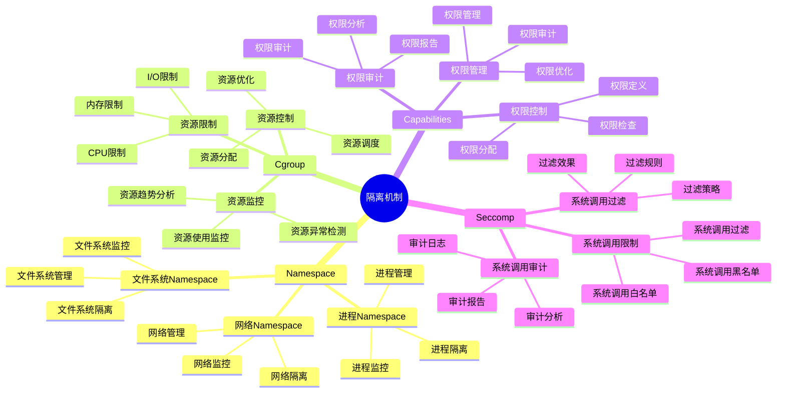
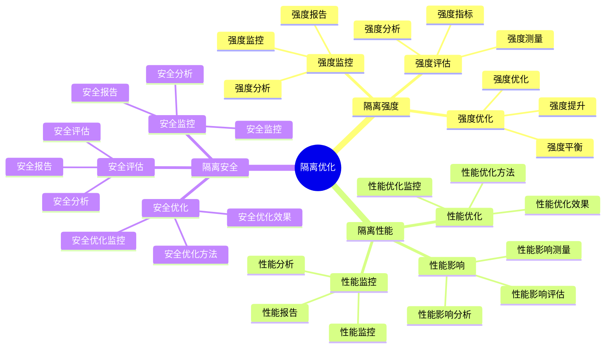

# 隔离模型详细思维导图

## 📑 目录

- [隔离模型详细思维导图](#隔离模型详细思维导图)
  - [📑 目录](#-目录)
  - [1 隔离模型核心概念](#1-隔离模型核心概念)
  - [2 隔离层次详解](#2-隔离层次详解)
  - [3 隔离机制详解](#3-隔离机制详解)
  - [4 隔离优化详解](#4-隔离优化详解)
  - [5 隔离模型应用场景矩阵](#5-隔离模型应用场景矩阵)
  - [6 使用指南](#6-使用指南)
    - [6.1 快速开始](#61-快速开始)
    - [6.2 隔离设计应用](#62-隔离设计应用)
    - [6.3 隔离优化应用](#63-隔离优化应用)
  - [7 使用技巧](#7-使用技巧)
    - [7.1 隔离层次选择技巧](#71-隔离层次选择技巧)
    - [7.2 隔离机制选择技巧](#72-隔离机制选择技巧)
  - [8 实践案例](#8-实践案例)
    - [8.1 多租户隔离设计案例](#81-多租户隔离设计案例)
    - [8.2 Serverless隔离设计案例](#82-serverless隔离设计案例)
  - [9 2025 年最新实践](#9-2025-年最新实践)
    - [9.1 隔离模型详细思维导图应用最佳实践（2025）](#91-隔离模型详细思维导图应用最佳实践2025)
  - [10 实际应用案例](#10-实际应用案例)
    - [案例 1：隔离模型应用（2025）](#案例-1隔离模型应用2025)
  - [11 相关文档](#11-相关文档)

---

## 1 隔离模型核心概念



---

## 2 隔离层次详解



---

## 3 隔离机制详解



---

## 4 隔离优化详解



---

## 5 隔离模型应用场景矩阵

| 应用场景 | 隔离层次 | 隔离机制 | 隔离强度 | 效果 | 推荐度 |
|---------|---------|---------|---------|------|--------|
| **多租户** | 虚拟化隔离 | KVM/Xen | 极高 | 高 | ⭐⭐⭐⭐⭐ |
| **Serverless** | 沙盒隔离 | gVisor/Kata | 高 | 高 | ⭐⭐⭐⭐⭐ |
| **容器化** | 容器隔离 | Namespace+Cgroup | 中 | 高 | ⭐⭐⭐⭐⭐ |
| **边缘计算** | 容器隔离 | Namespace+Cgroup | 中 | 中 | ⭐⭐⭐⭐ |
| **安全敏感** | 虚拟化隔离 | KVM+LSM | 极高 | 高 | ⭐⭐⭐⭐⭐ |
| **开发测试** | 容器隔离 | Namespace | 低 | 中 | ⭐⭐⭐ |

**推荐度说明**：

- **⭐⭐⭐⭐⭐**：强烈推荐
- **⭐⭐⭐⭐**：推荐
- **⭐⭐⭐**：可选

---

## 6 使用指南

### 6.1 快速开始

**适用场景**：隔离设计、安全隔离

**使用步骤**：

1. **隔离需求分析**：分析隔离需求（隔离强度、性能要求、资源限制等）
2. **隔离层次选择**：根据需求选择合适的隔离层次（虚拟化、容器化、沙盒化）
3. **隔离机制选择**：选择适合的隔离机制（KVM、Namespace、gVisor等）
4. **隔离实施**：实施隔离方案

**推荐度**：⭐⭐⭐⭐⭐

---

### 6.2 隔离设计应用

**适用场景**：实际项目中的隔离设计

**使用步骤**：

1. **需求分析**：分析隔离需求和安全要求
2. **层次选择**：在"隔离模型应用场景矩阵"中选择合适的隔离层次
3. **机制选择**：选择适合的隔离机制
4. **强度评估**：评估隔离强度是否满足需求
5. **性能优化**：优化隔离性能，减少性能影响

**推荐度**：⭐⭐⭐⭐⭐

---

### 6.3 隔离优化应用

**适用场景**：隔离性能优化、隔离强度优化

**使用步骤**：

1. **性能分析**：分析隔离对性能的影响
2. **强度分析**：分析隔离强度是否满足安全要求
3. **优化方案设计**：设计隔离优化方案
4. **优化实施**：实施隔离优化方案
5. **效果验证**：验证隔离优化的效果

**推荐度**：⭐⭐⭐⭐⭐

---

## 7 使用技巧

### 7.1 隔离层次选择技巧

**技巧1：需求匹配**

- 根据隔离需求选择合适的隔离层次
- 理解各隔离层次的特点和适用场景
- 避免隔离层次过度或不足

**技巧2：性能平衡**

- 平衡隔离强度和性能影响
- 选择性能影响最小的隔离方案
- 建立性能监控机制

**推荐度**：⭐⭐⭐⭐⭐

---

### 7.2 隔离机制选择技巧

**技巧1：机制组合**

- 根据需求组合使用多个隔离机制
- 理解机制之间的关系
- 避免机制冲突

**技巧2：安全验证**

- 验证隔离机制的安全性
- 进行安全测试和评估
- 建立安全监控机制

**推荐度**：⭐⭐⭐⭐⭐

---

## 8 实践案例

### 8.1 多租户隔离设计案例

**场景**：为多租户SaaS平台设计隔离方案

**分析过程**：

1. **需求分析**：
   - 隔离强度：极高（多租户环境）
   - 性能要求：高性能
   - 安全要求：高安全性

2. **层次选择**：选择虚拟化隔离（KVM/Xen）

3. **机制选择**：
   - 使用KVM进行虚拟化隔离
   - 使用LSM进行安全隔离
   - 使用网络隔离进行网络隔离

4. **强度评估**：隔离强度极高，满足多租户需求

5. **性能优化**：优化虚拟化性能，减少性能影响

**效果**：成功实现多租户隔离，隔离强度极高，性能影响可控

**推荐度**：⭐⭐⭐⭐⭐

---

### 8.2 Serverless隔离设计案例

**场景**：为Serverless函数设计隔离方案

**分析过程**：

1. **需求分析**：
   - 隔离强度：高（不可信代码）
   - 性能要求：快速启动
   - 资源限制：资源受限

2. **层次选择**：选择沙盒隔离（gVisor/Kata）

3. **机制选择**：
   - 使用gVisor进行沙盒隔离
   - 使用Seccomp进行系统调用限制
   - 使用Capabilities进行权限限制

4. **强度评估**：隔离强度高，满足Serverless需求

5. **性能优化**：优化启动性能，实现快速启动

**效果**：成功实现Serverless隔离，隔离强度高，启动速度快

**推荐度**：⭐⭐⭐⭐⭐

---

## 9 2025 年最新实践

### 9.1 隔离模型详细思维导图应用最佳实践（2025）

**2025 年趋势**：隔离模型在隔离设计、安全隔离、多租户隔离中的深度应用

**实践要点**：

- **需求分析**：系统化分析隔离需求和安全要求
- **层次选择**：根据需求选择合适的隔离层次
- **机制组合**：组合使用多个隔离机制
- **性能平衡**：平衡隔离强度和性能影响

**代码示例**：

```python
# 2025 年隔离模型工具
class IsolationModelTool:
    def __init__(self):
        self.analyzer = IsolationRequirementAnalyzer()
        self.selector = IsolationLevelSelector()
        self.combiner = IsolationMechanismCombiner()
        self.optimizer = IsolationPerformanceOptimizer()

    def analyze_requirements(self, context, security_requirements):
        """需求分析"""
        return self.analyzer.analyze(context, security_requirements)

    def select_level(self, requirements, constraints):
        """层次选择"""
        return self.selector.select(requirements, constraints)

    def combine_mechanisms(self, level, mechanisms):
        """机制组合"""
        return self.combiner.combine(level, mechanisms)
```

## 10 实际应用案例

### 案例 1：隔离模型应用（2025）

**场景**：使用隔离模型设计多租户SaaS平台隔离方案

**实现方案**：

```python
# 隔离模型应用
tool = IsolationModelTool()

# 需求分析
context = Context(type="saas", tenants="multi")
security_requirements = SecurityRequirements(isolation="strong", compliance="required")
requirements = tool.analyze_requirements(context, security_requirements)

# 层次选择
constraints = Constraints(performance="maintain", cost="limited")
level = tool.select_level(requirements, constraints)

# 机制组合
mechanisms = [Mechanism(type="kvm"), Mechanism(type="lsm"), Mechanism(type="network")]
isolation = tool.combine_mechanisms(level, mechanisms)
```

**效果**：

- 需求分析：系统化分析需求，提高分析质量
- 层次选择：选择合适的层次，提高隔离效果
- 机制组合：组合使用机制，提高安全水平

---

## 11 相关文档

- **[决策框架对比矩阵](01-decision-framework-matrix.md)** - 决策框架功能、决策场景适用、决策方法对比
- **[安全模型详细思维导图](06-security-model-detailed.md)** - 安全模型核心概念、安全机制详解、安全策略详解
- **[安全优化指南](20-security-optimization-guide.md)** - 安全优化全景、隔离安全优化、权限安全优化
- **[技术选型决策树](03-technology-selection-decision-tree.md)** - 容器运行时、隔离技术、编排平台选型决策树
- **[决策案例研究详解](29-decision-case-studies.md)** - 案例研究全景、容器运行时选型案例、服务网格选型案例

---

**最后更新**：2025-11-15
**文档状态**：✅ 完整 | 📊 包含隔离模型详细思维导图、使用指南、使用技巧、实践案例 | 🎯 生产就绪
**维护者**：项目团队
