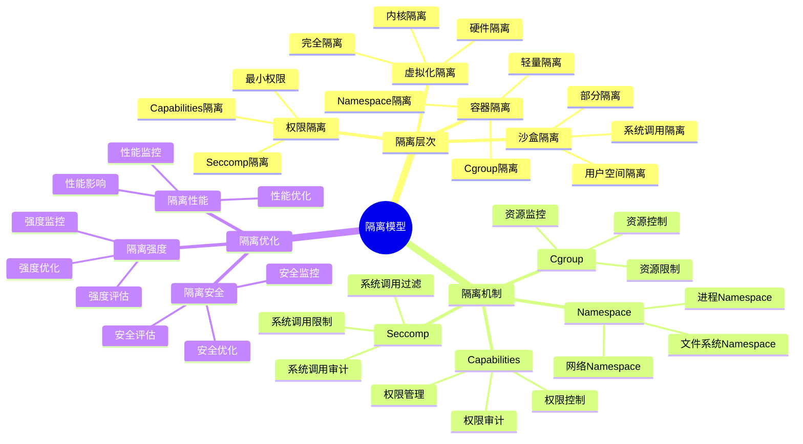
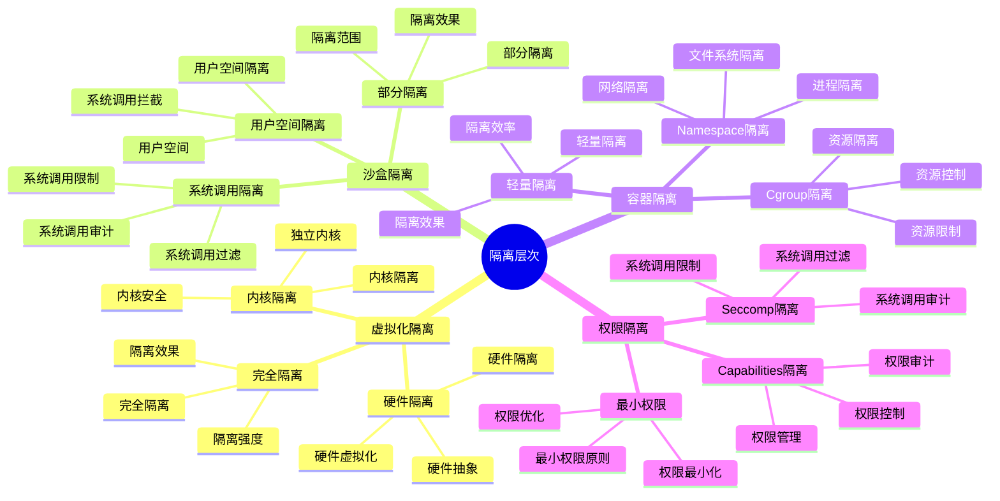
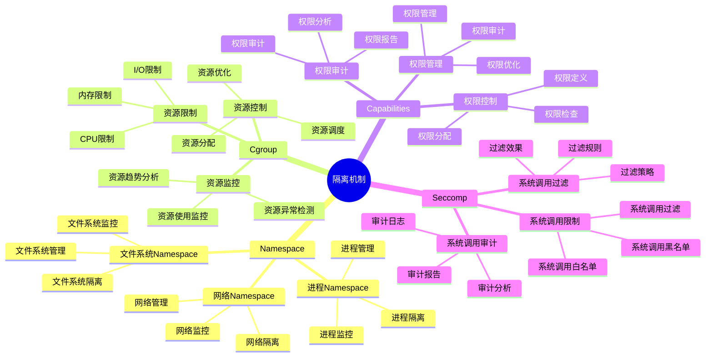
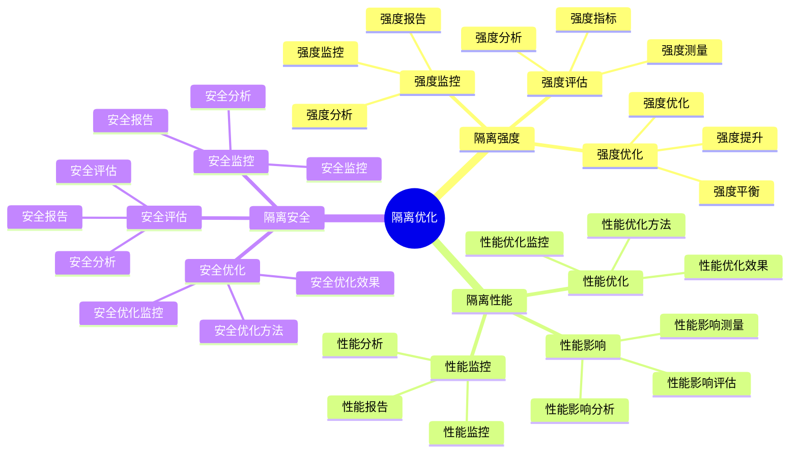

# 隔离模型详细思维导图

## 📑 目录

- [隔离模型详细思维导图](#隔离模型详细思维导图)
  - [📑 目录](#-目录)
  - [1 隔离模型核心概念](#1-隔离模型核心概念)
  - [2 隔离层次详解](#2-隔离层次详解)
  - [3 隔离机制详解](#3-隔离机制详解)
  - [4 隔离优化详解](#4-隔离优化详解)

---

## 1 隔离模型核心概念

---

## 2 隔离层次详解

---

## 3 隔离机制详解

---

## 4 隔离优化详解

---

## 5 隔离模型应用场景矩阵

| 应用场景 | 隔离层次 | 隔离机制 | 隔离强度 | 效果 | 推荐度 |
|---------|---------|---------|---------|------|--------|
| **多租户** | 虚拟化隔离 | KVM/Xen | 极高 | 高 | ⭐⭐⭐⭐⭐ |
| **Serverless** | 沙盒隔离 | gVisor/Kata | 高 | 高 | ⭐⭐⭐⭐⭐ |
| **容器化** | 容器隔离 | Namespace+Cgroup | 中 | 高 | ⭐⭐⭐⭐⭐ |
| **边缘计算** | 容器隔离 | Namespace+Cgroup | 中 | 中 | ⭐⭐⭐⭐ |
| **安全敏感** | 虚拟化隔离 | KVM+LSM | 极高 | 高 | ⭐⭐⭐⭐⭐ |
| **开发测试** | 容器隔离 | Namespace | 低 | 中 | ⭐⭐⭐ |

**推荐度说明**：

- **⭐⭐⭐⭐⭐**：强烈推荐
- **⭐⭐⭐⭐**：推荐
- **⭐⭐⭐**：可选

---

**最后更新**：2025-11-07
**文档状态**：✅ 完整 | 📊 包含隔离模型详细思维导图 | 🎯 生产就绪
**维护者**：项目团队
