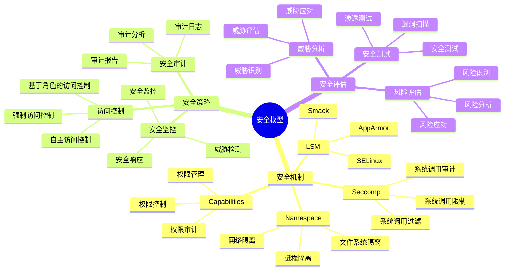
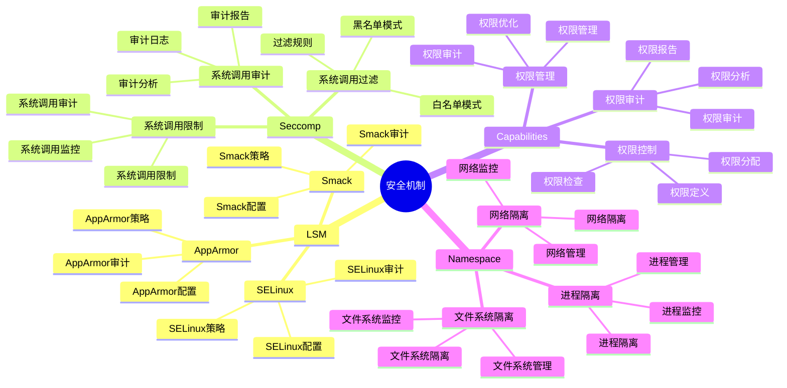
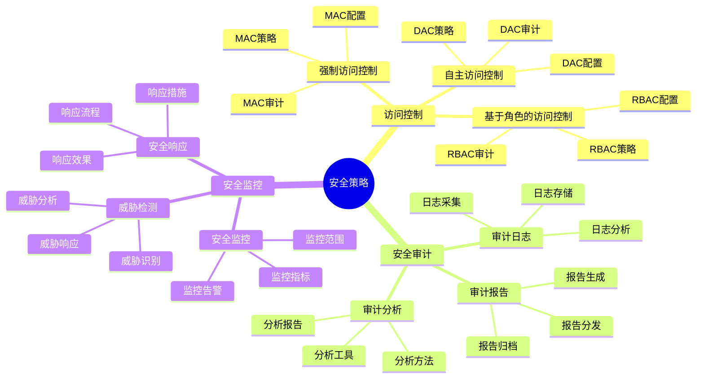
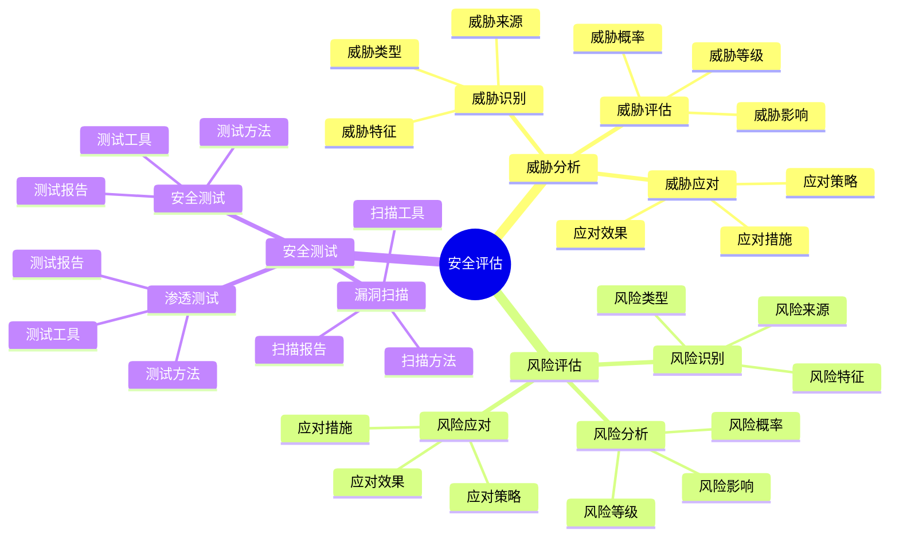

# 安全模型详细思维导图

## 📑 目录

- [安全模型详细思维导图](#安全模型详细思维导图)
  - [📑 目录](#-目录)
  - [1 安全模型核心概念](#1-安全模型核心概念)
  - [2 安全机制详解](#2-安全机制详解)
  - [3 安全策略详解](#3-安全策略详解)
  - [4 安全评估详解](#4-安全评估详解)

---

## 1 安全模型核心概念

---

## 2 安全机制详解

---

## 3 安全策略详解

---

## 4 安全评估详解

---

## 5 安全模型应用场景矩阵

| 应用场景 | 安全机制 | 安全策略 | 安全强度 | 效果 | 推荐度 |
|---------|---------|---------|---------|------|--------|
| **多租户** | LSM + Seccomp | 强制访问控制 | 极高 | 高 | ⭐⭐⭐⭐⭐ |
| **Serverless** | Seccomp + Capabilities | 最小权限 | 高 | 高 | ⭐⭐⭐⭐⭐ |
| **容器化** | Namespace + Capabilities | 自主访问控制 | 中 | 高 | ⭐⭐⭐⭐⭐ |
| **边缘计算** | Seccomp + Capabilities | 最小权限 | 中 | 中 | ⭐⭐⭐⭐ |
| **安全敏感** | LSM + Seccomp + Capabilities | 强制访问控制 | 极高 | 高 | ⭐⭐⭐⭐⭐ |
| **开发测试** | Namespace | 自主访问控制 | 低 | 中 | ⭐⭐⭐ |

**推荐度说明**：

- **⭐⭐⭐⭐⭐**：强烈推荐
- **⭐⭐⭐⭐**：推荐
- **⭐⭐⭐**：可选

---

## 6 使用指南

### 6.1 快速开始

**适用场景**：安全设计、安全评估

**使用步骤**：

1. **安全需求分析**：分析安全需求（安全等级、攻击面、合规要求等）
2. **安全机制选择**：根据需求选择合适的安全机制（LSM、Seccomp、Capabilities等）
3. **安全策略制定**：制定安全策略（强制访问控制、最小权限等）
4. **安全实施**：实施安全方案

**推荐度**：⭐⭐⭐⭐⭐

---

### 6.2 安全设计应用

**适用场景**：实际项目中的安全设计

**使用步骤**：

1. **需求分析**：分析安全需求和安全威胁
2. **机制选择**：在"安全模型应用场景矩阵"中选择合适的安全机制
3. **策略制定**：制定安全策略
4. **风险评估**：评估安全风险
5. **安全测试**：进行安全测试和验证

**推荐度**：⭐⭐⭐⭐⭐

---

### 6.3 安全优化应用

**适用场景**：安全性能优化、安全强度优化

**使用步骤**：

1. **安全分析**：分析当前安全方案的问题
2. **优化方案设计**：设计安全优化方案
3. **优化实施**：实施安全优化方案
4. **效果验证**：验证安全优化的效果

**推荐度**：⭐⭐⭐⭐⭐

---

## 7 使用技巧

### 7.1 安全机制选择技巧

**技巧1：多层防护**

- 组合使用多个安全机制
- 建立多层安全防护体系
- 避免单一安全机制失效

**技巧2：最小权限**

- 实施最小权限原则
- 减少攻击面
- 提高安全性

**推荐度**：⭐⭐⭐⭐⭐

---

### 7.2 安全策略制定技巧

**技巧1：策略细化**

- 制定细化的安全策略
- 明确策略的执行规则
- 建立策略执行机制

**技巧2：持续监控**

- 持续监控安全状态
- 及时发现安全威胁
- 快速响应安全事件

**推荐度**：⭐⭐⭐⭐⭐

---

## 8 实践案例

### 8.1 多租户安全设计案例

**场景**：为多租户SaaS平台设计安全方案

**分析过程**：

1. **需求分析**：
   - 安全等级：极高（多租户环境）
   - 攻击面：大（多租户共享资源）
   - 合规要求：高（数据保护法规）

2. **机制选择**：
   - 使用LSM进行强制访问控制
   - 使用Seccomp进行系统调用限制
   - 使用网络隔离进行网络隔离

3. **策略制定**：
   - 强制访问控制策略
   - 最小权限策略
   - 数据隔离策略

4. **风险评估**：评估安全风险，识别潜在威胁

5. **安全测试**：进行安全测试，验证安全方案

**效果**：成功实现多租户安全，安全等级极高，满足合规要求

**推荐度**：⭐⭐⭐⭐⭐

---

### 8.2 Serverless安全设计案例

**场景**：为Serverless函数设计安全方案

**分析过程**：

1. **需求分析**：
   - 安全等级：高（不可信代码）
   - 攻击面：中（函数执行环境）
   - 合规要求：中（基本安全要求）

2. **机制选择**：
   - 使用Seccomp进行系统调用限制
   - 使用Capabilities进行权限限制
   - 使用沙盒隔离进行环境隔离

3. **策略制定**：
   - 最小权限策略
   - 系统调用白名单策略
   - 资源限制策略

4. **风险评估**：评估安全风险，识别潜在威胁

5. **安全测试**：进行安全测试，验证安全方案

**效果**：成功实现Serverless安全，安全等级高，满足安全要求

**推荐度**：⭐⭐⭐⭐⭐

---

## 9 相关文档

- **[决策框架对比矩阵](01-decision-framework-matrix.md)** - 决策框架功能、决策场景适用、决策方法对比
- **[隔离模型详细思维导图](05-isolation-model-detailed.md)** - 隔离模型核心概念、隔离层次详解、隔离机制详解
- **[安全优化指南](20-security-optimization-guide.md)** - 安全优化全景、隔离安全优化、权限安全优化
- **[决策风险评估综合指南](28-decision-risk-assessment.md)** - 风险评估全景、技术风险评估、业务风险评估
- **[决策案例研究详解](29-decision-case-studies.md)** - 案例研究全景、容器运行时选型案例、服务网格选型案例

---

**最后更新**：2025-11-15
**文档状态**：✅ 完整 | 📊 包含安全模型详细思维导图、使用指南、使用技巧、实践案例 | 🎯 生产就绪
**维护者**：项目团队
