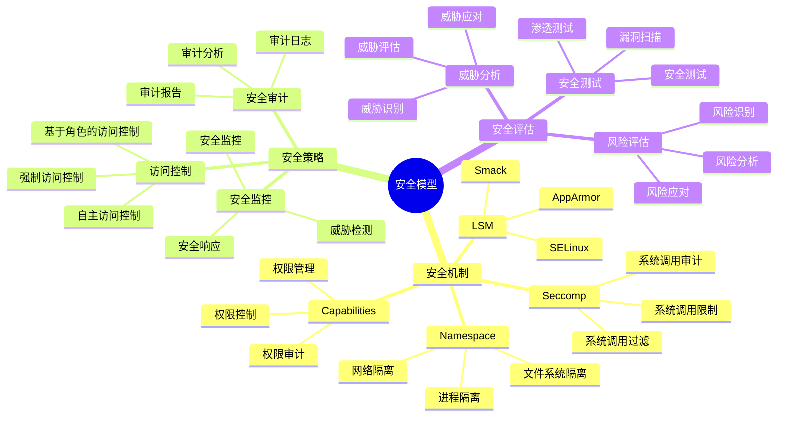
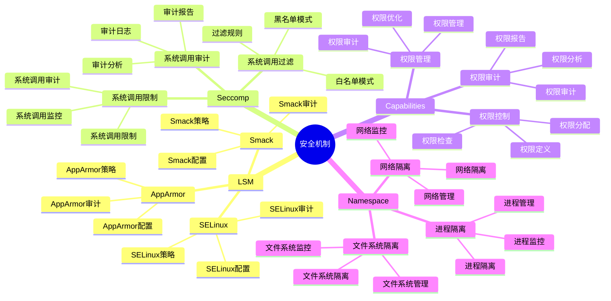
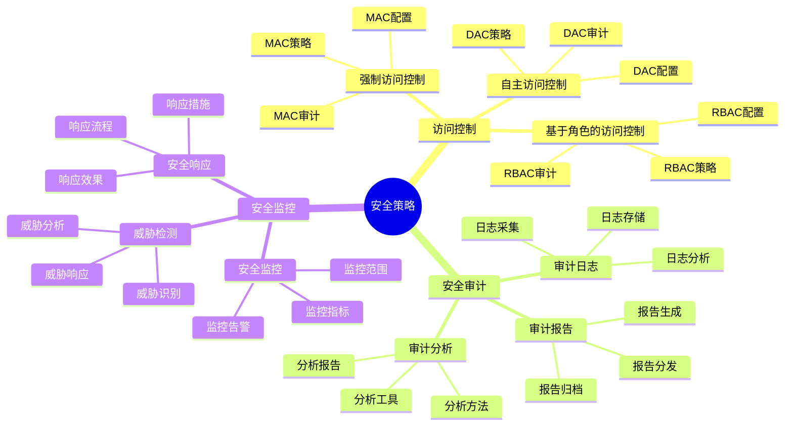
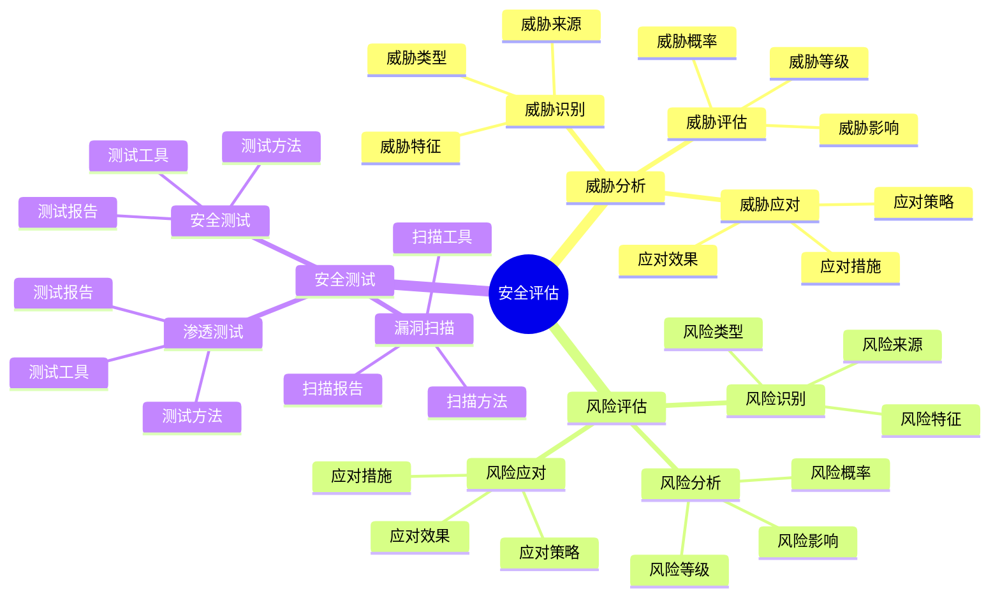

# 安全模型详细思维导图

## 📑 目录

- [安全模型详细思维导图](#安全模型详细思维导图)
  - [📑 目录](#-目录)
  - [1 安全模型核心概念](#1-安全模型核心概念)
  - [2 安全机制详解](#2-安全机制详解)
  - [3 安全策略详解](#3-安全策略详解)
  - [4 安全评估详解](#4-安全评估详解)

---

## 1 安全模型核心概念

---

## 2 安全机制详解

---

## 3 安全策略详解

---

## 4 安全评估详解

---

## 5 安全模型应用场景矩阵

| 应用场景 | 安全机制 | 安全策略 | 安全强度 | 效果 | 推荐度 |
|---------|---------|---------|---------|------|--------|
| **多租户** | LSM + Seccomp | 强制访问控制 | 极高 | 高 | ⭐⭐⭐⭐⭐ |
| **Serverless** | Seccomp + Capabilities | 最小权限 | 高 | 高 | ⭐⭐⭐⭐⭐ |
| **容器化** | Namespace + Capabilities | 自主访问控制 | 中 | 高 | ⭐⭐⭐⭐⭐ |
| **边缘计算** | Seccomp + Capabilities | 最小权限 | 中 | 中 | ⭐⭐⭐⭐ |
| **安全敏感** | LSM + Seccomp + Capabilities | 强制访问控制 | 极高 | 高 | ⭐⭐⭐⭐⭐ |
| **开发测试** | Namespace | 自主访问控制 | 低 | 中 | ⭐⭐⭐ |

**推荐度说明**：

- **⭐⭐⭐⭐⭐**：强烈推荐
- **⭐⭐⭐⭐**：推荐
- **⭐⭐⭐**：可选

---

**最后更新**：2025-11-07
**文档状态**：✅ 完整 | 📊 包含安全模型详细思维导图 | 🎯 生产就绪
**维护者**：项目团队
