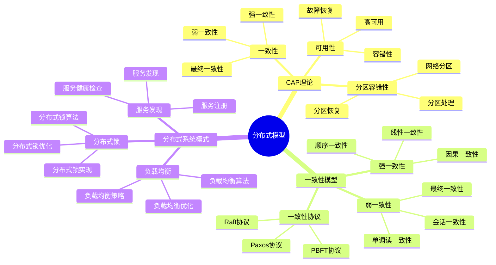
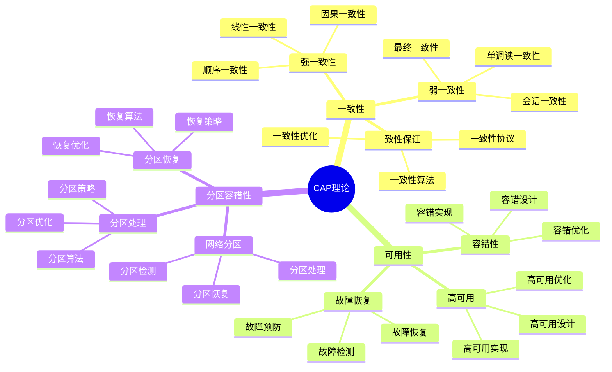
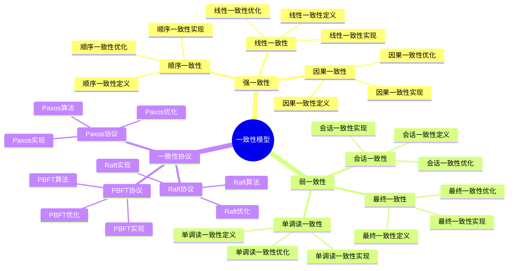
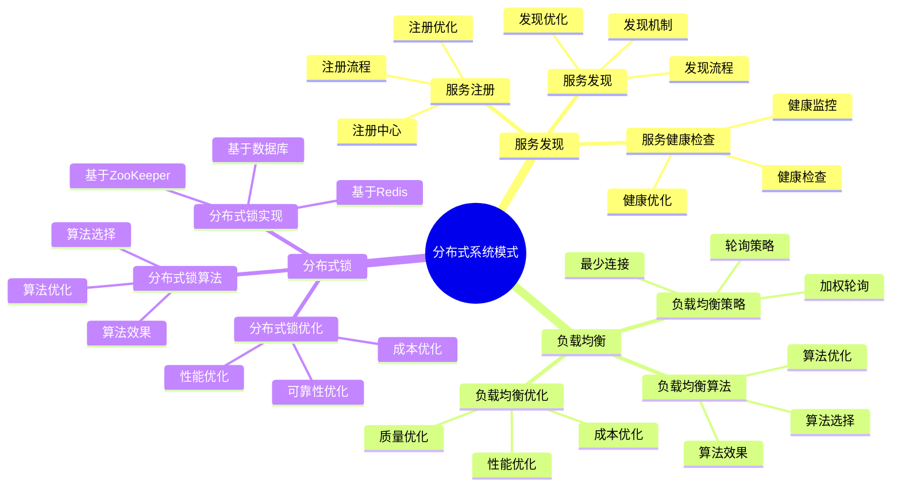

# 分布式模型详细思维导图

## 📑 目录

- [分布式模型详细思维导图](#分布式模型详细思维导图)
  - [📑 目录](#-目录)
  - [1 分布式模型核心概念](#1-分布式模型核心概念)
  - [2 CAP理论详解](#2-cap理论详解)
  - [3 一致性模型详解](#3-一致性模型详解)
  - [4 分布式系统模式详解](#4-分布式系统模式详解)

---

## 1 分布式模型核心概念

---

## 2 CAP理论详解

---

## 3 一致性模型详解

---

## 4 分布式系统模式详解

---

## 5 分布式模型应用场景矩阵

| 应用场景 | 一致性要求 | 可用性要求 | 分区容错 | 推荐模型 | 效果 | 推荐度 |
|---------|-----------|-----------|---------|---------|------|--------|
| **金融系统** | 强一致性 | 高可用 | 必需 | 强一致性+高可用 | 高 | ⭐⭐⭐⭐⭐ |
| **电商系统** | 最终一致性 | 高可用 | 必需 | 最终一致性+高可用 | 高 | ⭐⭐⭐⭐⭐ |
| **社交网络** | 最终一致性 | 高可用 | 必需 | 最终一致性+高可用 | 高 | ⭐⭐⭐⭐⭐ |
| **内容分发** | 最终一致性 | 高可用 | 必需 | 最终一致性+高可用 | 高 | ⭐⭐⭐⭐ |
| **实时系统** | 强一致性 | 高可用 | 必需 | 强一致性+高可用 | 高 | ⭐⭐⭐⭐⭐ |
| **数据分析** | 最终一致性 | 中可用 | 必需 | 最终一致性+中可用 | 中 | ⭐⭐⭐⭐ |

**推荐度说明**：

- **⭐⭐⭐⭐⭐**：强烈推荐
- **⭐⭐⭐⭐**：推荐
- **⭐⭐⭐**：可选

---

**最后更新**：2025-11-07
**文档状态**：✅ 完整 | 📊 包含分布式模型详细思维导图 | 🎯 生产就绪
**维护者**：项目团队
