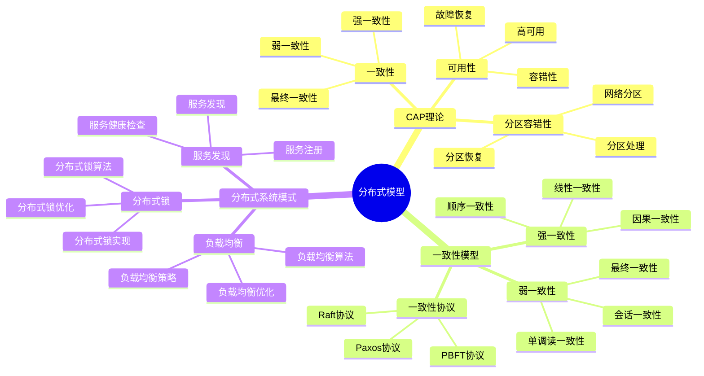
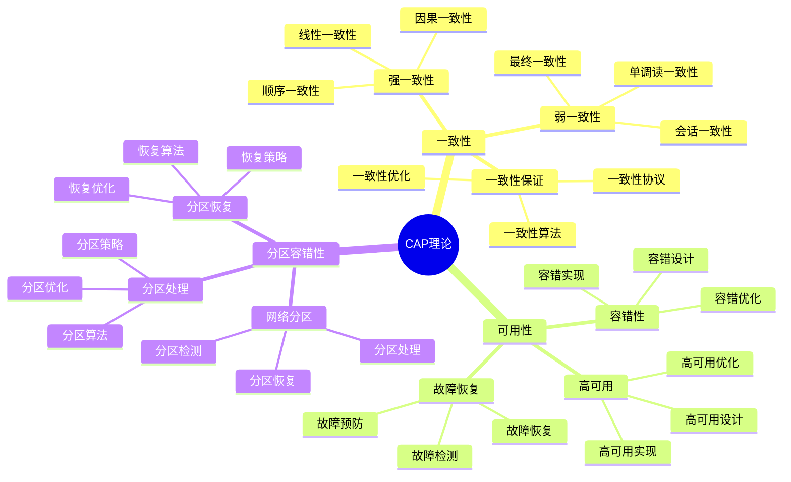
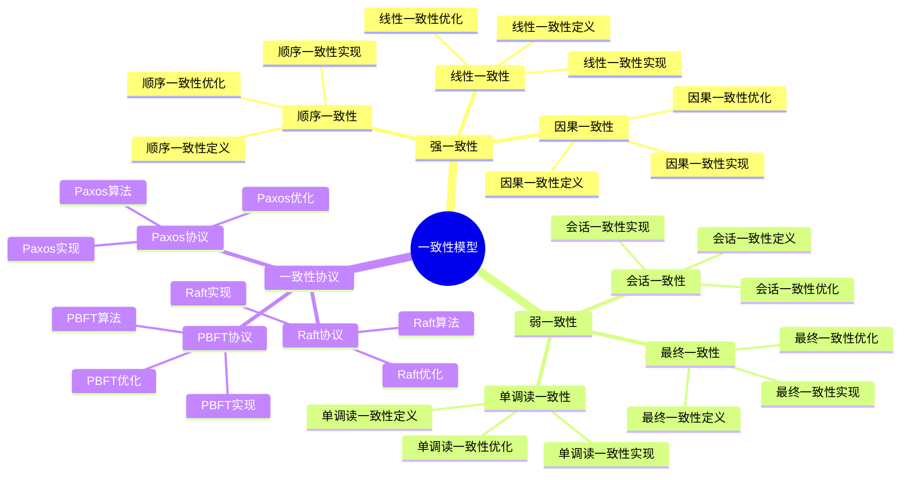
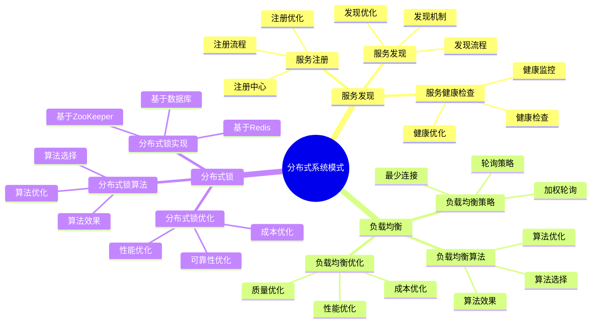

# 分布式模型详细思维导图

## 📑 目录

- [分布式模型详细思维导图](#分布式模型详细思维导图)
  - [📑 目录](#-目录)
  - [1 分布式模型核心概念](#1-分布式模型核心概念)
  - [2 CAP理论详解](#2-cap理论详解)
  - [3 一致性模型详解](#3-一致性模型详解)
  - [4 分布式系统模式详解](#4-分布式系统模式详解)
  - [5 分布式模型应用场景矩阵](#5-分布式模型应用场景矩阵)
  - [6 使用指南](#6-使用指南)
    - [6.1 快速开始](#61-快速开始)
    - [6.2 分布式设计应用](#62-分布式设计应用)
    - [6.3 分布式优化应用](#63-分布式优化应用)
  - [7 使用技巧](#7-使用技巧)
    - [7.1 CAP权衡技巧](#71-cap权衡技巧)
    - [7.2 一致性模型选择技巧](#72-一致性模型选择技巧)
  - [8 实践案例](#8-实践案例)
    - [8.1 金融系统分布式设计案例](#81-金融系统分布式设计案例)
    - [8.2 电商系统分布式设计案例](#82-电商系统分布式设计案例)
  - [9 2025 年最新实践](#9-2025-年最新实践)
    - [9.1 分布式模型详细思维导图应用最佳实践（2025）](#91-分布式模型详细思维导图应用最佳实践2025)
  - [10 实际应用案例](#10-实际应用案例)
    - [案例 1：分布式模型应用（2025）](#案例-1分布式模型应用2025)
  - [11 相关文档](#11-相关文档)

---

## 1 分布式模型核心概念



---

## 2 CAP理论详解



---

## 3 一致性模型详解



---

## 4 分布式系统模式详解



---

## 5 分布式模型应用场景矩阵

| 应用场景 | 一致性要求 | 可用性要求 | 分区容错 | 推荐模型 | 效果 | 推荐度 |
|---------|-----------|-----------|---------|---------|------|--------|
| **金融系统** | 强一致性 | 高可用 | 必需 | 强一致性+高可用 | 高 | ⭐⭐⭐⭐⭐ |
| **电商系统** | 最终一致性 | 高可用 | 必需 | 最终一致性+高可用 | 高 | ⭐⭐⭐⭐⭐ |
| **社交网络** | 最终一致性 | 高可用 | 必需 | 最终一致性+高可用 | 高 | ⭐⭐⭐⭐⭐ |
| **内容分发** | 最终一致性 | 高可用 | 必需 | 最终一致性+高可用 | 高 | ⭐⭐⭐⭐ |
| **实时系统** | 强一致性 | 高可用 | 必需 | 强一致性+高可用 | 高 | ⭐⭐⭐⭐⭐ |
| **数据分析** | 最终一致性 | 中可用 | 必需 | 最终一致性+中可用 | 中 | ⭐⭐⭐⭐ |

**推荐度说明**：

- **⭐⭐⭐⭐⭐**：强烈推荐
- **⭐⭐⭐⭐**：推荐
- **⭐⭐⭐**：可选

---

## 6 使用指南

### 6.1 快速开始

**适用场景**：分布式系统设计、一致性设计

**使用步骤**：

1. **需求分析**：分析分布式系统需求（一致性要求、可用性要求、分区容错要求）
2. **CAP权衡**：根据需求进行CAP权衡（一致性、可用性、分区容错）
3. **一致性模型选择**：选择合适的一致性模型（强一致性、最终一致性等）
4. **分布式模式选择**：选择适合的分布式模式

**推荐度**：⭐⭐⭐⭐⭐

---

### 6.2 分布式设计应用

**适用场景**：实际项目中的分布式系统设计

**使用步骤**：

1. **需求分析**：分析分布式系统需求
2. **CAP分析**：分析CAP三个维度的要求
3. **模型选择**：在"分布式模型应用场景矩阵"中选择合适的模型
4. **模式选择**：选择适合的分布式模式
5. **设计实施**：实施分布式系统设计

**推荐度**：⭐⭐⭐⭐⭐

---

### 6.3 分布式优化应用

**适用场景**：分布式系统性能优化、一致性优化

**使用步骤**：

1. **性能分析**：分析分布式系统的性能问题
2. **一致性分析**：分析一致性模型的效果
3. **优化方案设计**：设计分布式优化方案
4. **优化实施**：实施分布式优化方案
5. **效果验证**：验证分布式优化的效果

**推荐度**：⭐⭐⭐⭐⭐

---

## 7 使用技巧

### 7.1 CAP权衡技巧

**技巧1：需求优先**

- 根据业务需求优先选择CAP维度
- 理解各维度的权衡关系
- 避免过度追求某个维度

**技巧2：场景匹配**

- 根据应用场景选择合适的CAP组合
- 理解不同场景的CAP要求
- 建立场景-CAP映射机制

**推荐度**：⭐⭐⭐⭐⭐

---

### 7.2 一致性模型选择技巧

**技巧1：业务需求**

- 根据业务需求选择一致性模型
- 理解各一致性模型的特点
- 避免一致性过度或不足

**技巧2：性能平衡**

- 平衡一致性和性能
- 选择性能影响最小的一致性模型
- 建立性能监控机制

**推荐度**：⭐⭐⭐⭐⭐

---

## 8 实践案例

### 8.1 金融系统分布式设计案例

**场景**：为金融系统设计分布式架构

**分析过程**：

1. **需求分析**：
   - 一致性要求：强一致性（金融交易）
   - 可用性要求：高可用（7x24小时服务）
   - 分区容错：必需（分布式系统）

2. **CAP分析**：
   - 优先选择：一致性 + 可用性
   - 权衡：在分区容错的前提下保证一致性和可用性

3. **模型选择**：选择强一致性+高可用模型

4. **模式选择**：
   - 使用两阶段提交保证强一致性
   - 使用主从复制保证高可用
   - 使用分片技术提高性能

5. **设计实施**：实施分布式系统设计

**效果**：成功实现金融系统分布式架构，强一致性+高可用

**推荐度**：⭐⭐⭐⭐⭐

---

### 8.2 电商系统分布式设计案例

**场景**：为电商系统设计分布式架构

**分析过程**：

1. **需求分析**：
   - 一致性要求：最终一致性（商品库存、订单）
   - 可用性要求：高可用（用户体验）
   - 分区容错：必需（分布式系统）

2. **CAP分析**：
   - 优先选择：可用性 + 分区容错
   - 权衡：接受最终一致性，保证高可用

3. **模型选择**：选择最终一致性+高可用模型

4. **模式选择**：
   - 使用事件驱动保证最终一致性
   - 使用负载均衡保证高可用
   - 使用缓存提高性能

5. **设计实施**：实施分布式系统设计

**效果**：成功实现电商系统分布式架构，最终一致性+高可用

**推荐度**：⭐⭐⭐⭐⭐

---

## 9 2025 年最新实践

### 9.1 分布式模型详细思维导图应用最佳实践（2025）

**2025 年趋势**：分布式模型在分布式系统设计、CAP权衡、一致性模型选择中的深度应用

**实践要点**：

- **需求优先**：根据业务需求优先选择CAP维度
- **场景匹配**：根据应用场景选择合适的CAP组合
- **性能平衡**：平衡一致性和性能
- **持续优化**：持续优化分布式系统性能

**代码示例**：

```python
# 2025 年分布式模型工具
class DistributedModelTool:
    def __init__(self):
        self.analyzer = DistributedRequirementAnalyzer()
        self.cap_analyzer = CAPAnalyzer()
        self.model_selector = ConsistencyModelSelector()
        self.optimizer = DistributedOptimizer()

    def analyze_requirements(self, context, requirements):
        """需求分析"""
        return self.analyzer.analyze(context, requirements)

    def analyze_cap(self, requirements):
        """CAP分析"""
        return self.cap_analyzer.analyze(requirements)

    def select_model(self, cap_analysis, constraints):
        """一致性模型选择"""
        return self.model_selector.select(cap_analysis, constraints)
```

## 10 实际应用案例

### 案例 1：分布式模型应用（2025）

**场景**：使用分布式模型设计金融系统分布式架构

**实现方案**：

```python
# 分布式模型应用
tool = DistributedModelTool()

# 需求分析
context = Context(type="financial", scale="large")
requirements = Requirements(consistency="strong", availability="high")
analysis = tool.analyze_requirements(context, requirements)

# CAP分析
cap_analysis = tool.analyze_cap(requirements)

# 一致性模型选择
constraints = Constraints(performance="maintain", cost="limited")
model = tool.select_model(cap_analysis, constraints)
```

**效果**：

- 需求分析：系统化分析分布式需求，提高分析质量
- CAP分析：准确进行CAP权衡，提高权衡质量
- 模型选择：选择合适的一致性模型，提高系统设计质量

---

## 11 相关文档

- **[决策框架对比矩阵](01-decision-framework-matrix.md)** - 决策框架功能、决策场景适用、决策方法对比
- **[可靠性优化指南](21-reliability-optimization-guide.md)** - 可靠性优化全景、可用性优化、容错性优化
- **[性能优化指南](18-performance-optimization-guide.md)** - 性能优化全景、CPU性能优化、内存性能优化
- **[架构决策完整流程](../02-architecture-design/visualizations/08-architecture-decision-process.md)** - 架构决策全景流程、需求分析流程、架构设计流程
- **[决策案例研究详解](29-decision-case-studies.md)** - 案例研究全景、容器运行时选型案例、服务网格选型案例

---

**最后更新**：2025-11-15
**文档状态**：✅ 完整 | 📊 包含分布式模型详细思维导图、使用指南、使用技巧、实践案例 | 🎯 生产就绪
**维护者**：项目团队
