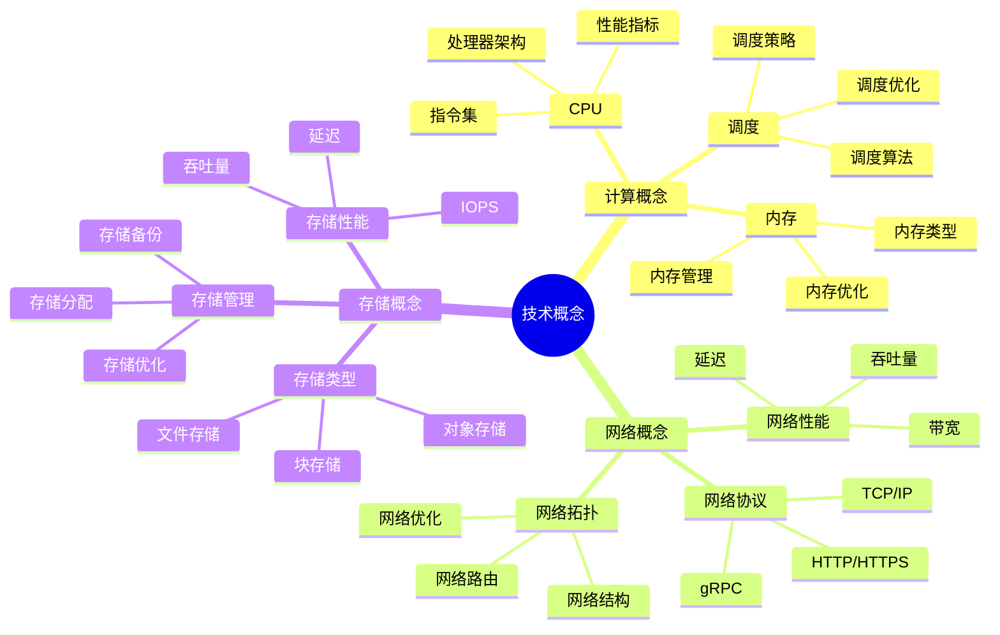
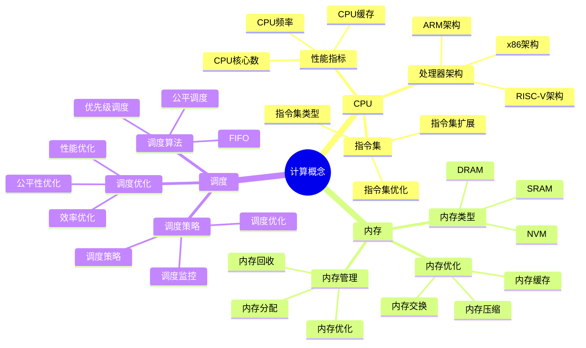
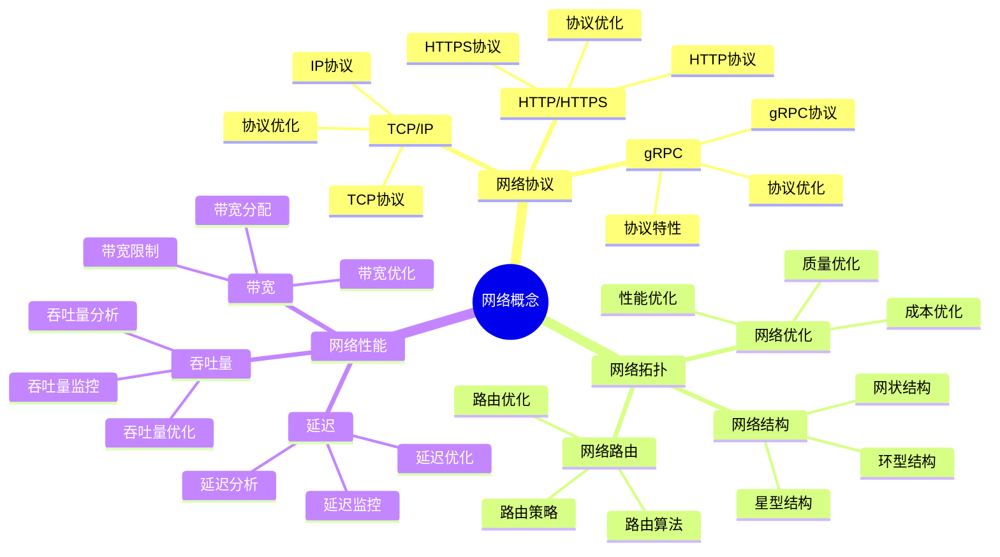
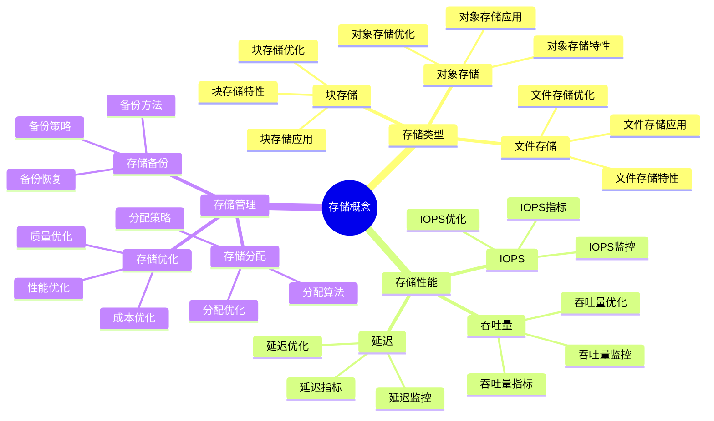

# 技术概念思维导图

## 📑 目录

- [技术概念思维导图](#技术概念思维导图)
  - [📑 目录](#-目录)
  - [1 技术概念全景](#1-技术概念全景)
  - [2 计算概念详解](#2-计算概念详解)
  - [3 网络概念详解](#3-网络概念详解)
  - [4 存储概念详解](#4-存储概念详解)
  - [5 技术概念应用矩阵](#5-技术概念应用矩阵)
  - [6 使用指南](#6-使用指南)
    - [6.1 快速开始](#61-快速开始)
    - [6.2 技术选型应用](#62-技术选型应用)
    - [6.3 系统设计应用](#63-系统设计应用)
  - [7 使用技巧](#7-使用技巧)
    - [7.1 概念理解技巧](#71-概念理解技巧)
    - [7.2 技术组合技巧](#72-技术组合技巧)
  - [8 实践案例](#8-实践案例)
    - [8.1 计算密集型系统设计案例](#81-计算密集型系统设计案例)
    - [8.2 微服务系统设计案例](#82-微服务系统设计案例)
  - [9 相关文档](#9-相关文档)

---

## 1 技术概念全景



---

## 2 计算概念详解



---

## 3 网络概念详解



---

## 4 存储概念详解



---

## 5 技术概念应用矩阵

| 技术概念 | 应用场景 | 技术选择 | 性能指标 | 效果 | 推荐度 |
|---------|---------|---------|---------|------|--------|
| **CPU** | 计算密集型 | 多核CPU | CPU利用率 | 高 | ⭐⭐⭐⭐⭐ |
| **内存** | 内存密集型 | 大内存 | 内存利用率 | 高 | ⭐⭐⭐⭐⭐ |
| **网络** | 网络密集型 | 高带宽 | 网络延迟 | 高 | ⭐⭐⭐⭐⭐ |
| **存储** | 存储密集型 | 高性能存储 | IOPS | 高 | ⭐⭐⭐⭐⭐ |
| **调度** | 多任务 | 智能调度 | 调度效率 | 高 | ⭐⭐⭐⭐ |
| **协议** | 分布式系统 | gRPC | 延迟+吞吐量 | 高 | ⭐⭐⭐⭐⭐ |

**推荐度说明**：

- **⭐⭐⭐⭐⭐**：强烈推荐
- **⭐⭐⭐⭐**：推荐
- **⭐⭐⭐**：可选

---

## 6 使用指南

### 6.1 快速开始

**适用场景**：技术概念理解、技术选型、系统设计

**使用步骤**：

1. **概念理解**：理解计算概念、网络概念、存储概念等
2. **需求分析**：分析应用的技术需求
3. **技术选择**：根据技术概念应用矩阵选择合适的技术
4. **系统设计**：基于技术概念进行系统设计

**推荐度**：⭐⭐⭐⭐⭐

---

### 6.2 技术选型应用

**适用场景**：实际项目中的技术选型

**使用步骤**：

1. **需求分析**：分析应用的技术需求
2. **概念匹配**：在技术概念应用矩阵中匹配应用场景
3. **技术选择**：选择合适的技术
4. **性能评估**：评估技术的性能指标
5. **效果验证**：验证技术选择的效果

**推荐度**：⭐⭐⭐⭐⭐

---

### 6.3 系统设计应用

**适用场景**：基于技术概念进行系统设计

**使用步骤**：

1. **概念分析**：分析系统涉及的技术概念
2. **技术组合**：组合使用多个技术概念
3. **系统设计**：基于技术概念进行系统设计
4. **性能优化**：优化系统性能
5. **效果评估**：评估系统设计的效果

**推荐度**：⭐⭐⭐⭐⭐

---

## 7 使用技巧

### 7.1 概念理解技巧

**技巧1：概念分类**

- 准确理解技术概念的分类
- 理解概念之间的关系
- 建立概念知识网络

**技巧2：概念应用**

- 根据应用场景应用技术概念
- 理解概念的适用场景
- 避免概念滥用

**推荐度**：⭐⭐⭐⭐⭐

---

### 7.2 技术组合技巧

**技巧1：技术匹配**

- 根据需求匹配合适的技术
- 理解技术之间的兼容性
- 避免技术冲突

**技巧2：性能平衡**

- 平衡不同技术的性能
- 选择性能最优的技术组合
- 建立性能监控机制

**推荐度**：⭐⭐⭐⭐⭐

---

## 8 实践案例

### 8.1 计算密集型系统设计案例

**场景**：设计机器学习训练系统

**分析过程**：

1. **概念分析**：
   - CPU：多核CPU（训练计算）
   - 内存：大内存（模型数据）
   - 存储：高性能存储（数据加载）
   - 网络：高带宽（分布式训练）

2. **技术选择**：
   - CPU：多核高频CPU（32核3.5GHz）
   - 内存：大内存（256GB）
   - 存储：NVMe SSD（高IOPS）
   - 网络：高带宽网络（10Gbps）

3. **系统设计**：
   - 设计分布式训练架构
   - 优化数据加载流程
   - 优化网络通信

4. **性能优化**：
   - CPU优化：多线程并行
   - 内存优化：内存池化
   - 存储优化：数据预加载
   - 网络优化：数据压缩

5. **效果验证**：
   - 训练速度提升50%
   - 资源利用率提升30%
   - 系统性能显著提升

**效果**：成功设计计算密集型系统

**推荐度**：⭐⭐⭐⭐⭐

---

### 8.2 微服务系统设计案例

**场景**：设计微服务架构系统

**分析过程**：

1. **概念分析**：
   - CPU：中等CPU（服务计算）
   - 内存：中等内存（服务数据）
   - 网络：高带宽+低延迟（服务通信）
   - 存储：中等存储（服务数据）

2. **技术选择**：
   - CPU：多核CPU（8核）
   - 内存：中等内存（64GB）
   - 网络：gRPC（低延迟+高吞吐）
   - 存储：SSD（中等性能）

3. **系统设计**：
   - 设计微服务架构
   - 优化服务间通信
   - 优化服务部署

4. **性能优化**：
   - CPU优化：服务负载均衡
   - 内存优化：服务缓存
   - 网络优化：连接池优化
   - 存储优化：数据分片

5. **效果验证**：
   - 服务响应时间降低40%
   - 系统吞吐量提升50%
   - 系统可扩展性提升

**效果**：成功设计微服务系统

**推荐度**：⭐⭐⭐⭐⭐

---

## 9 2025 年最新实践

### 9.1 技术概念思维导图应用最佳实践（2025）

**2025 年趋势**：技术概念思维导图在知识组织、概念理解、技术选型中的深度应用

**实践要点**：

- **知识组织**：使用思维导图系统化组织技术概念
- **概念理解**：通过思维导图深入理解技术概念
- **技术选型**：基于思维导图进行技术选型
- **持续更新**：定期更新思维导图，反映最新技术趋势

**代码示例**：

```python
# 2025 年技术概念思维导图工具
class TechnicalConceptsMindmapTool:
    def __init__(self):
        self.organizer = KnowledgeOrganizer()
        self.analyzer = ConceptAnalyzer()
        self.selector = TechnologySelector()
        self.updater = MindmapUpdater()

    def organize_concepts(self, concepts, relations):
        """知识组织"""
        return self.organizer.organize(concepts, relations)

    def analyze_concept(self, concept, context):
        """概念理解"""
        return self.analyzer.analyze(concept, context)

    def select_technology(self, requirements, mindmap):
        """技术选型"""
        return self.selector.select(requirements, mindmap)
```

## 10 实际应用案例

### 案例 1：技术概念思维导图应用（2025）

**场景**：使用技术概念思维导图进行微服务系统设计

**实现方案**：

```python
# 技术概念思维导图应用
tool = TechnicalConceptsMindmapTool()

# 知识组织
concepts = [Concept(type="computing"), Concept(type="network"), Concept(type="storage")]
relations = Relations([...])
mindmap = tool.organize_concepts(concepts, relations)

# 概念理解
concept = Concept(type="microservices")
context = Context(domain="ecommerce")
analysis = tool.analyze_concept(concept, context)

# 技术选型
requirements = Requirements(scale="high", performance="high")
selection = tool.select_technology(requirements, mindmap)
```

**效果**：

- 知识组织：系统化组织技术概念，提高知识组织效率
- 概念理解：深入理解技术概念，提高理解质量
- 技术选型：基于思维导图选型，提高选型准确性

---

## 11 相关文档

- **[计算概念详细思维导图](10-computing-concepts-detailed.md)** - CPU概念详解、内存概念详解、调度概念详解
- **[网络概念详细思维导图](11-network-concepts-detailed.md)** - 网络协议详解、网络拓扑详解、网络性能详解
- **[存储概念详细思维导图](12-storage-concepts-detailed.md)** - 存储类型详解、存储性能详解、存储管理详解
- **[资源模型详细思维导图](04-resource-model-detailed.md)** - 资源模型核心概念、资源类型详解、资源分配详解
- **[性能优化指南](18-performance-optimization-guide.md)** - 性能优化全景、CPU性能优化、内存性能优化、I/O性能优化

---

**最后更新**：2025-11-15
**文档状态**：✅ 完整 | 📊 包含技术概念思维导图、使用指南、使用技巧、实践案例 | 🎯 生产就绪
**维护者**：项目团队
