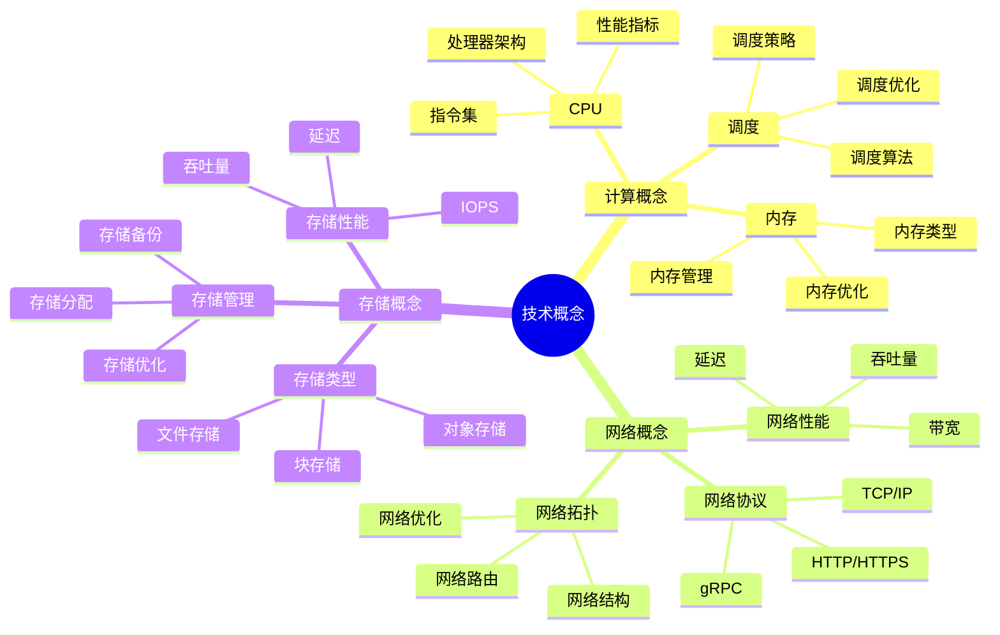
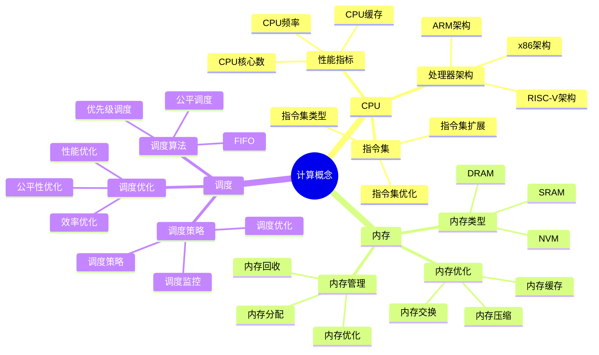
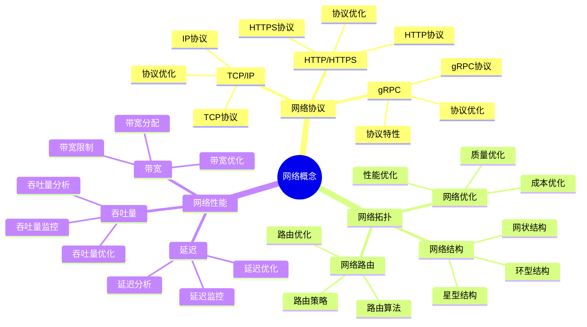
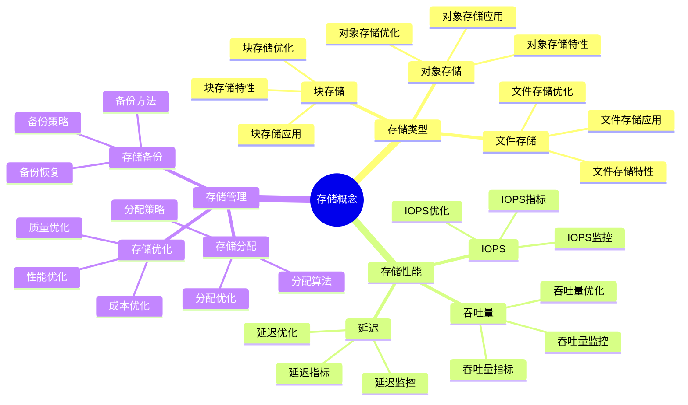

# 技术概念思维导图

## 📑 目录

- [技术概念思维导图](#技术概念思维导图)
  - [📑 目录](#-目录)
  - [1 技术概念全景](#1-技术概念全景)
  - [2 计算概念详解](#2-计算概念详解)
  - [3 网络概念详解](#3-网络概念详解)
  - [4 存储概念详解](#4-存储概念详解)

---

## 1 技术概念全景

---

## 2 计算概念详解

---

## 3 网络概念详解

---

## 4 存储概念详解

---

## 5 技术概念应用矩阵

| 技术概念 | 应用场景 | 技术选择 | 性能指标 | 效果 | 推荐度 |
|---------|---------|---------|---------|------|--------|
| **CPU** | 计算密集型 | 多核CPU | CPU利用率 | 高 | ⭐⭐⭐⭐⭐ |
| **内存** | 内存密集型 | 大内存 | 内存利用率 | 高 | ⭐⭐⭐⭐⭐ |
| **网络** | 网络密集型 | 高带宽 | 网络延迟 | 高 | ⭐⭐⭐⭐⭐ |
| **存储** | 存储密集型 | 高性能存储 | IOPS | 高 | ⭐⭐⭐⭐⭐ |
| **调度** | 多任务 | 智能调度 | 调度效率 | 高 | ⭐⭐⭐⭐ |
| **协议** | 分布式系统 | gRPC | 延迟+吞吐量 | 高 | ⭐⭐⭐⭐⭐ |

**推荐度说明**：

- **⭐⭐⭐⭐⭐**：强烈推荐
- **⭐⭐⭐⭐**：推荐
- **⭐⭐⭐**：可选

---

**最后更新**：2025-11-07
**文档状态**：✅ 完整 | 📊 包含技术概念思维导图 | 🎯 生产就绪
**维护者**：项目团队
