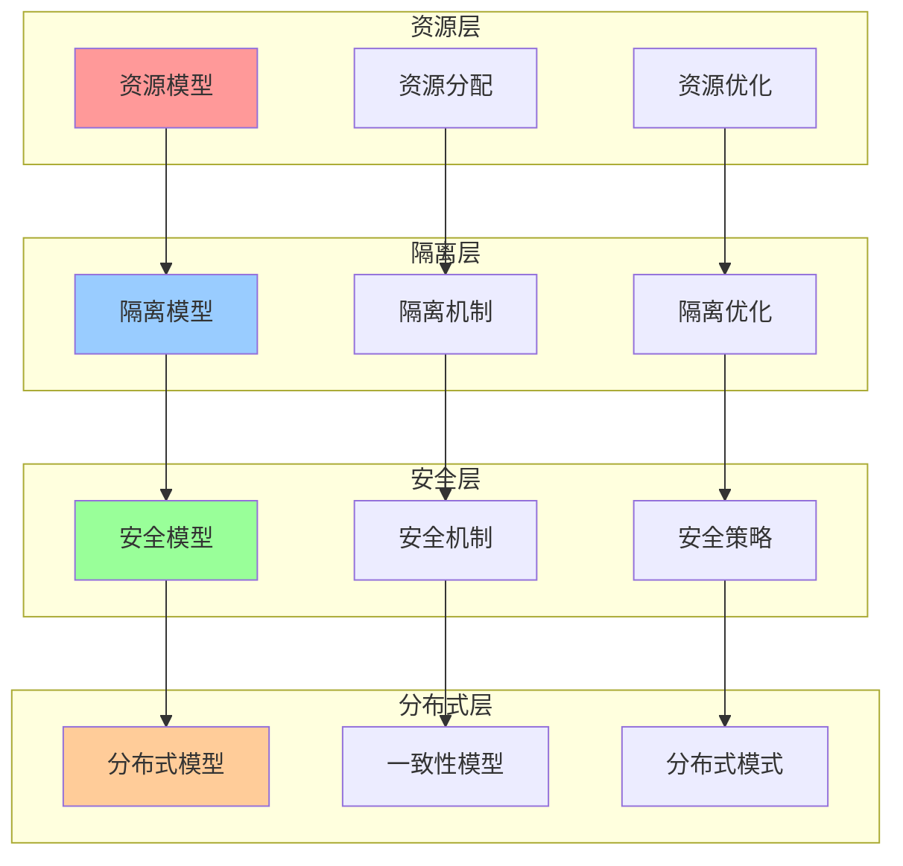
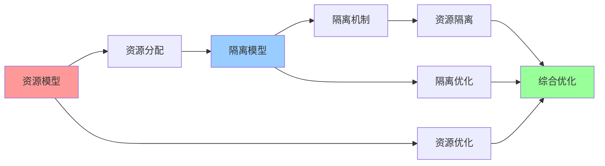
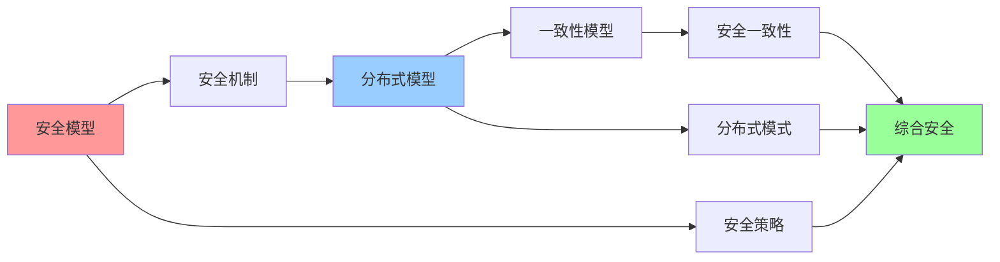
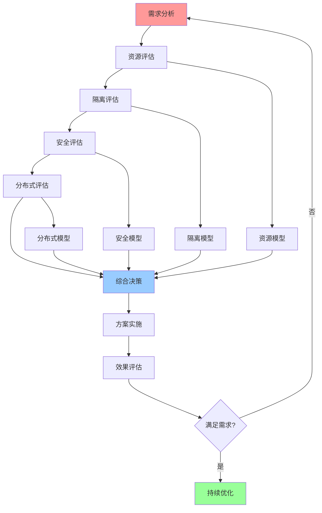

# 决策模型集成关系图

## 📑 目录

- [决策模型集成关系图](#决策模型集成关系图)
  - [📑 目录](#-目录)
  - [1 决策模型全景集成](#1-决策模型全景集成)
  - [2 资源与隔离集成](#2-资源与隔离集成)
  - [3 安全与分布式集成](#3-安全与分布式集成)
  - [4 决策流程集成](#4-决策流程集成)

---

## 1 决策模型全景集成

---

## 2 资源与隔离集成

---

## 3 安全与分布式集成

---

## 4 决策流程集成

---

## 5 决策模型组合使用矩阵

| 组合方式 | 模型1 | 模型2 | 模型3 | 适用场景 | 效果 | 复杂度 |
|---------|------|------|------|---------|------|--------|
| **资源+隔离** | 资源模型 | 隔离模型 | - | 容器化、虚拟化 | 高 | 中 |
| **隔离+安全** | 隔离模型 | 安全模型 | - | 多租户、Serverless | 高 | 高 |
| **安全+分布式** | 安全模型 | 分布式模型 | - | 分布式系统 | 高 | 高 |
| **资源+隔离+安全** | 资源模型 | 隔离模型 | 安全模型 | 企业级应用 | 极高 | 极高 |
| **全面组合** | 资源模型 | 隔离模型 | 安全模型+分布式模型 | 复杂系统 | 极高 | 极高 |

**效果说明**：

- **高**：单一模型效果
- **极高**：组合模型效果

---

## 6 决策模型选择指南

| 决策场景 | 推荐模型 | 使用工具 | 决策流程 | 预期效果 | 复杂度 | 推荐度 |
|---------|---------|---------|---------|---------|--------|--------|
| **资源分配** | 资源模型 | 资源分析工具 | 需求分析 → 资源评估 → 方案选择 | 高 | 中 | ⭐⭐⭐⭐⭐ |
| **隔离设计** | 隔离模型 | 隔离分析工具 | 需求分析 → 隔离评估 → 方案选择 | 高 | 中 | ⭐⭐⭐⭐⭐ |
| **安全设计** | 安全模型 | 安全分析工具 | 需求分析 → 安全评估 → 方案选择 | 高 | 高 | ⭐⭐⭐⭐⭐ |
| **分布式设计** | 分布式模型 | 分布式分析工具 | 需求分析 → 分布式评估 → 方案选择 | 高 | 高 | ⭐⭐⭐⭐⭐ |
| **综合决策** | 多模型组合 | 综合分析工具 | 需求分析 → 多模型评估 → 综合决策 | 极高 | 极高 | ⭐⭐⭐⭐ |

**推荐度说明**：

- **⭐⭐⭐⭐⭐**：强烈推荐
- **⭐⭐⭐⭐**：推荐
- **⭐⭐⭐**：可选

---

**最后更新**：2025-11-07
**文档状态**：✅ 完整 | 📊 包含决策模型集成关系图 | 🎯 生产就绪
**维护者**：项目团队
