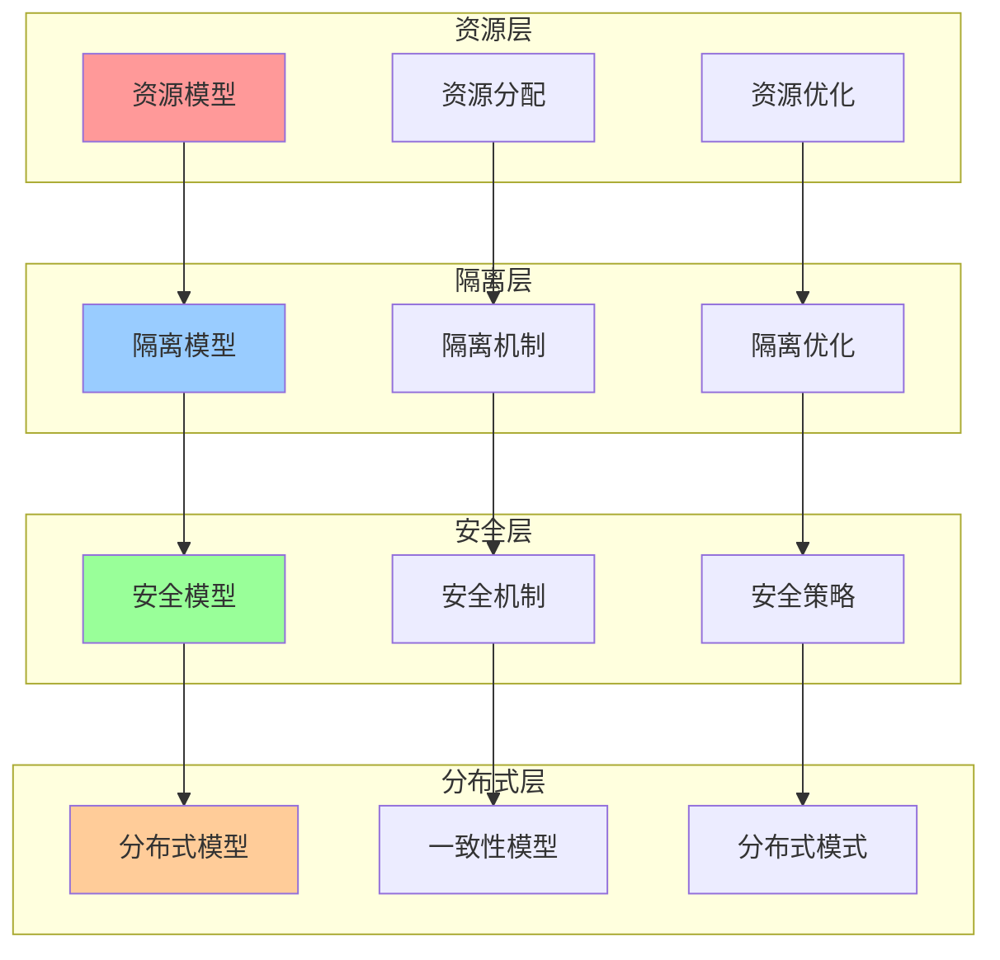
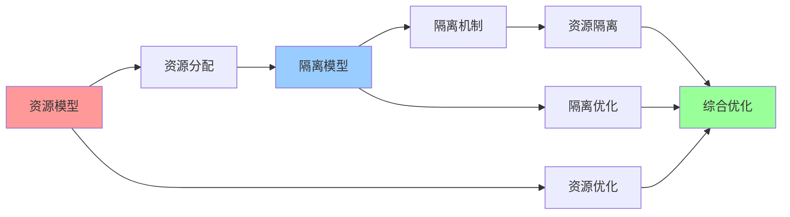
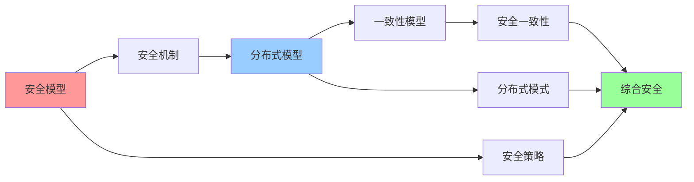
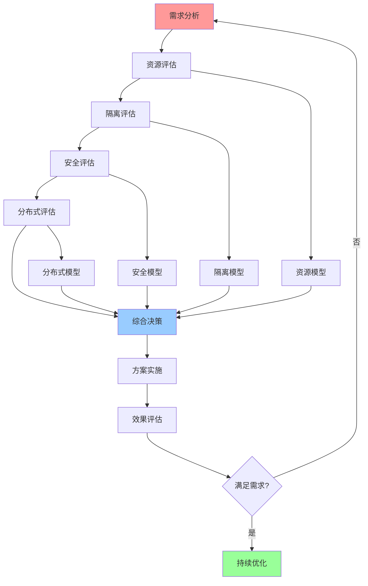

# 决策模型集成关系图

## 📑 目录

- [决策模型集成关系图](#决策模型集成关系图)
  - [📑 目录](#-目录)
  - [1 决策模型全景集成](#1-决策模型全景集成)
  - [2 资源与隔离集成](#2-资源与隔离集成)
  - [3 安全与分布式集成](#3-安全与分布式集成)
  - [4 决策流程集成](#4-决策流程集成)

---

## 1 决策模型全景集成

---

## 2 资源与隔离集成

---

## 3 安全与分布式集成

---

## 4 决策流程集成

---

## 5 决策模型组合使用矩阵

| 组合方式 | 模型1 | 模型2 | 模型3 | 适用场景 | 效果 | 复杂度 |
|---------|------|------|------|---------|------|--------|
| **资源+隔离** | 资源模型 | 隔离模型 | - | 容器化、虚拟化 | 高 | 中 |
| **隔离+安全** | 隔离模型 | 安全模型 | - | 多租户、Serverless | 高 | 高 |
| **安全+分布式** | 安全模型 | 分布式模型 | - | 分布式系统 | 高 | 高 |
| **资源+隔离+安全** | 资源模型 | 隔离模型 | 安全模型 | 企业级应用 | 极高 | 极高 |
| **全面组合** | 资源模型 | 隔离模型 | 安全模型+分布式模型 | 复杂系统 | 极高 | 极高 |

**效果说明**：

- **高**：单一模型效果
- **极高**：组合模型效果

---

## 6 决策模型选择指南

| 决策场景 | 推荐模型 | 使用工具 | 决策流程 | 预期效果 | 复杂度 | 推荐度 |
|---------|---------|---------|---------|---------|--------|--------|
| **资源分配** | 资源模型 | 资源分析工具 | 需求分析 → 资源评估 → 方案选择 | 高 | 中 | ⭐⭐⭐⭐⭐ |
| **隔离设计** | 隔离模型 | 隔离分析工具 | 需求分析 → 隔离评估 → 方案选择 | 高 | 中 | ⭐⭐⭐⭐⭐ |
| **安全设计** | 安全模型 | 安全分析工具 | 需求分析 → 安全评估 → 方案选择 | 高 | 高 | ⭐⭐⭐⭐⭐ |
| **分布式设计** | 分布式模型 | 分布式分析工具 | 需求分析 → 分布式评估 → 方案选择 | 高 | 高 | ⭐⭐⭐⭐⭐ |
| **综合决策** | 多模型组合 | 综合分析工具 | 需求分析 → 多模型评估 → 综合决策 | 极高 | 极高 | ⭐⭐⭐⭐ |

**推荐度说明**：

- **⭐⭐⭐⭐⭐**：强烈推荐
- **⭐⭐⭐⭐**：推荐
- **⭐⭐⭐**：可选

---

## 7 使用指南

### 7.1 快速开始

**适用场景**：综合决策、多模型组合应用

**使用步骤**：

1. **需求分析**：分析决策需求，识别涉及的决策维度
2. **模型选择**：根据需求选择合适的决策模型组合
3. **模型集成**：按照集成关系图集成多个决策模型
4. **综合决策**：使用集成模型进行综合决策

**推荐度**：⭐⭐⭐⭐⭐

---

### 7.2 模型组合应用

**适用场景**：实际项目中的综合决策

**使用步骤**：

1. **需求分析**：分析决策需求（资源、隔离、安全、分布式等）
2. **模型选择**：在"决策模型组合使用矩阵"中选择合适的模型组合
3. **模型集成**：按照集成关系图集成多个模型
4. **综合评估**：使用集成模型进行综合评估
5. **综合决策**：基于综合评估做出综合决策

**推荐度**：⭐⭐⭐⭐⭐

---

### 7.3 决策流程应用

**适用场景**：复杂问题的综合决策流程

**使用步骤**：

1. **需求分析**：分析决策问题的需求
2. **资源评估**：使用资源模型进行资源评估
3. **隔离评估**：使用隔离模型进行隔离评估
4. **安全评估**：使用安全模型进行安全评估
5. **分布式评估**：使用分布式模型进行分布式评估
6. **综合决策**：综合各模型评估结果做出决策
7. **方案实施**：实施方案并评估效果

**推荐度**：⭐⭐⭐⭐⭐

---

## 8 使用技巧

### 8.1 模型组合技巧

**技巧1：需求驱动**

- 根据决策需求选择合适的模型组合
- 理解模型之间的关系和依赖
- 避免模型过度组合

**技巧2：集成顺序**

- 按照集成关系图的顺序集成模型
- 理解模型集成的逻辑
- 建立模型集成机制

**推荐度**：⭐⭐⭐⭐⭐

---

### 8.2 综合决策技巧

**技巧1：多维度评估**

- 从多个维度评估决策方案
- 综合考虑各模型的评估结果
- 建立综合评估机制

**技巧2：权衡平衡**

- 平衡不同模型的要求
- 做出综合权衡决策
- 建立权衡机制

**推荐度**：⭐⭐⭐⭐⭐

---

## 9 实践案例

### 9.1 企业级应用综合决策案例

**场景**：为企业级SaaS平台进行综合技术决策

**分析过程**：

1. **需求分析**：
   - 资源需求：大规模资源管理
   - 隔离需求：多租户隔离
   - 安全需求：高安全性
   - 分布式需求：高可用性

2. **模型选择**：
   - 资源模型：资源分配和优化
   - 隔离模型：多租户隔离
   - 安全模型：安全策略和机制
   - 分布式模型：高可用性设计

3. **模型集成**：
   - 资源模型 → 隔离模型：资源隔离
   - 隔离模型 → 安全模型：隔离安全
   - 安全模型 → 分布式模型：安全分布式

4. **综合评估**：
   - 资源评估：资源分配方案
   - 隔离评估：隔离方案
   - 安全评估：安全方案
   - 分布式评估：分布式方案

5. **综合决策**：
   - 选择虚拟化+容器化混合架构
   - 使用KVM进行多租户隔离
   - 使用LSM+Seccomp进行安全隔离
   - 使用主从复制保证高可用性

**效果**：成功实现企业级SaaS平台，满足多租户、高安全、高可用需求

**推荐度**：⭐⭐⭐⭐⭐

---

### 9.2 云原生应用综合决策案例

**场景**：为云原生应用进行综合技术决策

**分析过程**：

1. **需求分析**：
   - 资源需求：弹性资源管理
   - 隔离需求：容器隔离
   - 安全需求：中等安全性
   - 分布式需求：微服务架构

2. **模型选择**：
   - 资源模型：弹性资源分配
   - 隔离模型：容器隔离
   - 安全模型：基本安全策略
   - 分布式模型：微服务一致性

3. **模型集成**：
   - 资源模型 → 隔离模型：资源隔离
   - 隔离模型 → 安全模型：隔离安全
   - 安全模型 → 分布式模型：安全分布式

4. **综合评估**：
   - 资源评估：弹性资源方案
   - 隔离评估：容器隔离方案
   - 安全评估：基本安全方案
   - 分布式评估：微服务方案

5. **综合决策**：
   - 选择Kubernetes容器编排
   - 使用Namespace+Cgroup进行容器隔离
   - 使用Seccomp+Capabilities进行安全隔离
   - 使用最终一致性保证微服务一致性

**效果**：成功实现云原生应用，满足弹性、隔离、安全、分布式需求

**推荐度**：⭐⭐⭐⭐⭐

---

## 10 相关文档

- **[资源模型详细思维导图](04-resource-model-detailed.md)** - 资源模型核心概念、资源类型详解、资源分配详解
- **[隔离模型详细思维导图](05-isolation-model-detailed.md)** - 隔离模型核心概念、隔离层次详解、隔离机制详解
- **[安全模型详细思维导图](06-security-model-detailed.md)** - 安全模型核心概念、安全机制详解、安全策略详解
- **[分布式模型详细思维导图](07-distributed-model-detailed.md)** - 分布式模型核心概念、CAP理论详解、一致性模型详解
- **[综合决策工作流图](13-comprehensive-decision-workflow.md)** - 决策工作流全景、需求分析工作流、技术选型工作流
- **[决策制定完整流程](24-decision-making-process.md)** - 决策制定全景流程、问题识别流程、方案设计流程

---

**最后更新**：2025-11-15
**文档状态**：✅ 完整 | 📊 包含决策模型集成关系图、使用指南、使用技巧、实践案例 | 🎯 生产就绪
**维护者**：项目团队
