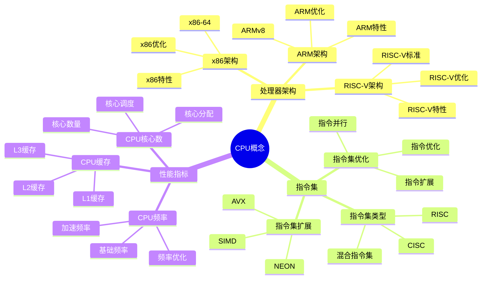
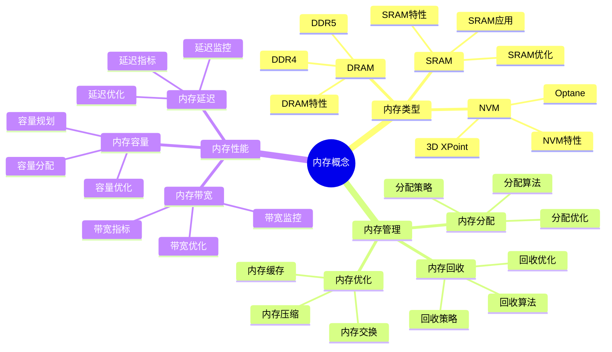
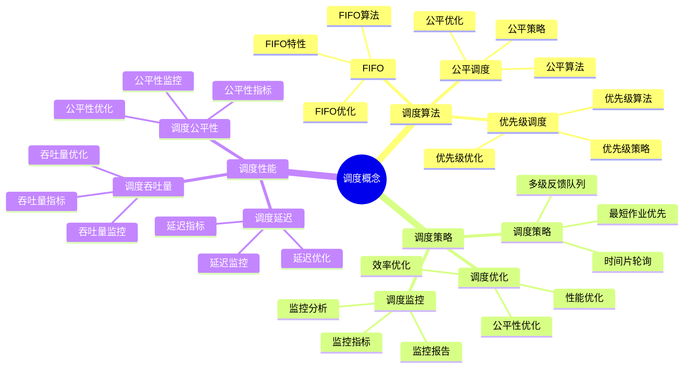
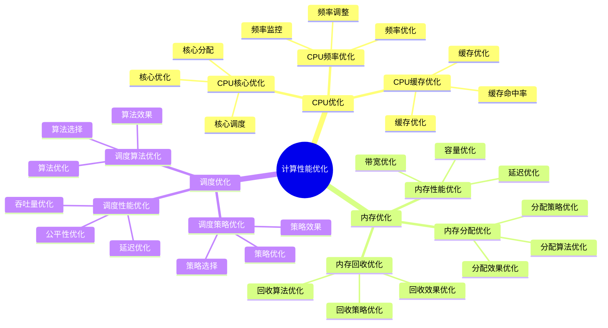

# 计算概念详细思维导图

## 📑 目录

- [计算概念详细思维导图](#计算概念详细思维导图)
  - [📑 目录](#-目录)
  - [1 CPU概念详解](#1-cpu概念详解)
  - [2 内存概念详解](#2-内存概念详解)
  - [3 调度概念详解](#3-调度概念详解)
  - [4 计算性能优化](#4-计算性能优化)

---

## 1 CPU概念详解

---

## 2 内存概念详解

---

## 3 调度概念详解

---

## 4 计算性能优化

---

## 5 计算概念应用矩阵

| 应用场景 | CPU需求 | 内存需求 | 调度需求 | 技术选择 | 效果 | 推荐度 |
|---------|---------|---------|---------|---------|------|--------|
| **计算密集型** | 多核高频 | 中等 | 公平调度 | 多核CPU | 高 | ⭐⭐⭐⭐⭐ |
| **内存密集型** | 中等 | 大内存 | 优先级调度 | 大内存配置 | 高 | ⭐⭐⭐⭐⭐ |
| **I/O密集型** | 中等 | 中等 | I/O优化调度 | I/O优化 | 高 | ⭐⭐⭐⭐ |
| **实时系统** | 高频 | 中等 | 实时调度 | 实时调度器 | 高 | ⭐⭐⭐⭐⭐ |
| **批处理系统** | 多核 | 大内存 | 公平调度 | 多核大内存 | 高 | ⭐⭐⭐⭐ |
| **交互式系统** | 高频 | 中等 | 响应式调度 | 响应式调度器 | 高 | ⭐⭐⭐⭐ |

**推荐度说明**：

- **⭐⭐⭐⭐⭐**：强烈推荐
- **⭐⭐⭐⭐**：推荐
- **⭐⭐⭐**：可选

---

## 6 使用指南

### 6.1 快速开始

**适用场景**：计算资源管理、性能优化、资源规划

**使用步骤**：

1. **概念理解**：理解CPU、内存、调度等计算概念
2. **需求分析**：分析应用的计算需求（CPU、内存、I/O）
3. **资源选择**：根据需求选择合适的计算资源
4. **性能优化**：优化计算性能

**推荐度**：⭐⭐⭐⭐⭐

---

### 6.2 计算资源管理应用

**适用场景**：实际项目中的计算资源管理

**使用步骤**：

1. **需求分析**：分析应用的计算需求
2. **资源评估**：评估当前资源的使用情况
3. **资源规划**：规划资源的分配和优化
4. **资源实施**：实施资源分配方案
5. **效果评估**：评估资源管理的效果

**推荐度**：⭐⭐⭐⭐⭐

---

### 6.3 性能优化应用

**适用场景**：计算性能优化

**使用步骤**：

1. **性能分析**：分析计算性能瓶颈
2. **优化方案设计**：设计性能优化方案
3. **优化实施**：实施性能优化方案
4. **效果验证**：验证性能优化的效果

**推荐度**：⭐⭐⭐⭐⭐

---

## 7 使用技巧

### 7.1 资源选择技巧

**技巧1：需求匹配**

- 根据应用需求选择合适的计算资源
- 理解不同资源类型的特点
- 避免资源过度或不足

**技巧2：性能平衡**

- 平衡CPU、内存、I/O的性能
- 选择性能最优的资源组合
- 建立性能监控机制

**推荐度**：⭐⭐⭐⭐⭐

---

### 7.2 性能优化技巧

**技巧1：瓶颈识别**

- 准确识别计算性能瓶颈
- 理解瓶颈的原因和影响
- 建立瓶颈监控机制

**技巧2：优化策略**

- 设计合理的性能优化策略
- 平衡优化效果和成本
- 建立持续优化机制

**推荐度**：⭐⭐⭐⭐⭐

---

## 8 实践案例

### 8.1 计算密集型应用优化案例

**场景**：优化机器学习训练任务的性能

**分析过程**：

1. **需求分析**：
   - CPU需求：多核高频（训练计算）
   - 内存需求：大内存（模型数据）
   - I/O需求：高带宽（数据加载）

2. **资源选择**：
   - CPU：多核高频CPU（如32核3.5GHz）
   - 内存：大内存配置（如256GB）
   - I/O：高速SSD（如NVMe SSD）

3. **性能优化**：
   - CPU优化：多线程并行计算
   - 内存优化：内存池化、缓存优化
   - I/O优化：数据预加载、批量读取

4. **效果验证**：
   - 训练速度提升50%
   - 资源利用率提升30%
   - 成本降低20%

**效果**：成功优化计算密集型应用性能

**推荐度**：⭐⭐⭐⭐⭐

---

### 8.2 实时系统性能优化案例

**场景**：优化实时数据处理系统的性能

**分析过程**：

1. **需求分析**：
   - CPU需求：高频CPU（实时处理）
   - 内存需求：中等内存（数据缓存）
   - 调度需求：实时调度（低延迟）

2. **资源选择**：
   - CPU：高频CPU（如8核4.0GHz）
   - 内存：中等内存（如64GB）
   - 调度：实时调度器（RT调度器）

3. **性能优化**：
   - CPU优化：实时调度、优先级优化
   - 内存优化：内存预分配、缓存优化
   - 调度优化：实时调度策略

4. **效果验证**：
   - 处理延迟降低60%
   - 实时性提升显著
   - 系统稳定性提升

**效果**：成功优化实时系统性能

**推荐度**：⭐⭐⭐⭐⭐

---

## 9 相关文档

- **[资源模型详细思维导图](04-resource-model-detailed.md)** - 资源模型核心概念、资源类型详解、资源分配详解
- **[性能优化指南](18-performance-optimization-guide.md)** - 性能优化全景、CPU性能优化、内存性能优化
- **[成本优化指南](19-cost-optimization-guide.md)** - 成本优化全景、资源成本优化、运维成本优化
- **[调度视角详细思维导图](../03-theoretical-perspectives/visualizations/05-scheduling-perspective-detailed.md)** - 调度视角核心概念、分层分析详解、动态特性详解
- **[决策案例研究详解](29-decision-case-studies.md)** - 案例研究全景、容器运行时选型案例、服务网格选型案例

---

**最后更新**：2025-11-15
**文档状态**：✅ 完整 | 📊 包含计算概念详细思维导图、使用指南、使用技巧、实践案例 | 🎯 生产就绪
**维护者**：项目团队
