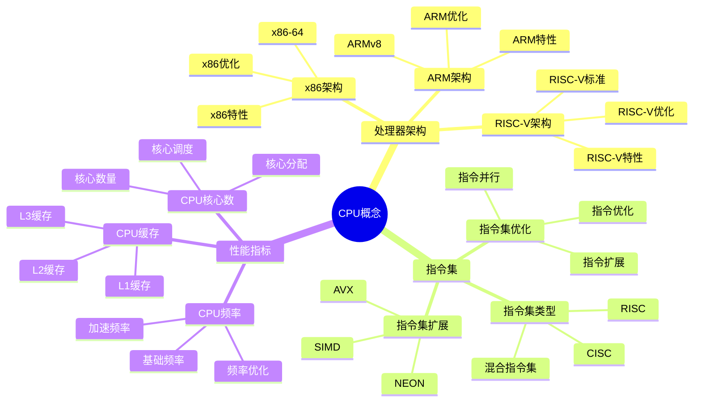
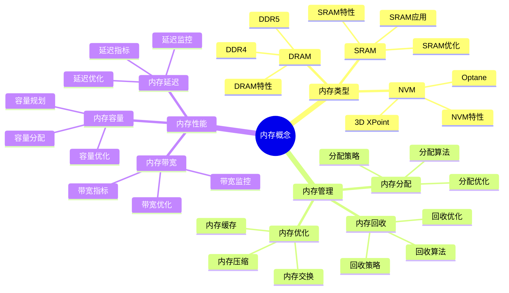
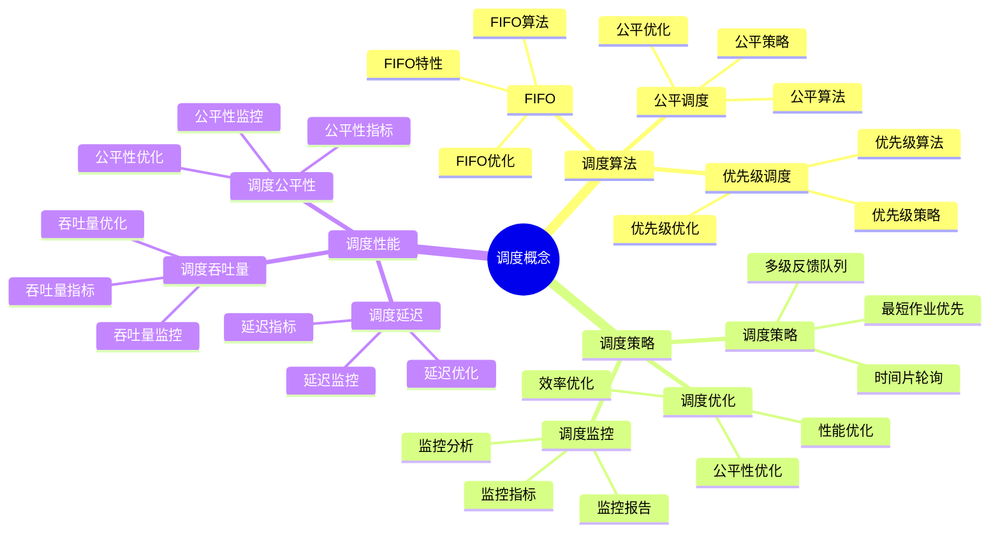
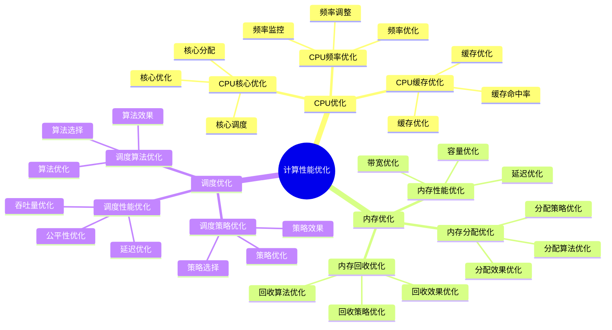

# 计算概念详细思维导图

## 📑 目录

- [计算概念详细思维导图](#计算概念详细思维导图)
  - [📑 目录](#-目录)
  - [1 CPU概念详解](#1-cpu概念详解)
  - [2 内存概念详解](#2-内存概念详解)
  - [3 调度概念详解](#3-调度概念详解)
  - [4 计算性能优化](#4-计算性能优化)

---

## 1 CPU概念详解

---

## 2 内存概念详解

---

## 3 调度概念详解

---

## 4 计算性能优化

---

## 5 计算概念应用矩阵

| 应用场景 | CPU需求 | 内存需求 | 调度需求 | 技术选择 | 效果 | 推荐度 |
|---------|---------|---------|---------|---------|------|--------|
| **计算密集型** | 多核高频 | 中等 | 公平调度 | 多核CPU | 高 | ⭐⭐⭐⭐⭐ |
| **内存密集型** | 中等 | 大内存 | 优先级调度 | 大内存配置 | 高 | ⭐⭐⭐⭐⭐ |
| **I/O密集型** | 中等 | 中等 | I/O优化调度 | I/O优化 | 高 | ⭐⭐⭐⭐ |
| **实时系统** | 高频 | 中等 | 实时调度 | 实时调度器 | 高 | ⭐⭐⭐⭐⭐ |
| **批处理系统** | 多核 | 大内存 | 公平调度 | 多核大内存 | 高 | ⭐⭐⭐⭐ |
| **交互式系统** | 高频 | 中等 | 响应式调度 | 响应式调度器 | 高 | ⭐⭐⭐⭐ |

**推荐度说明**：

- **⭐⭐⭐⭐⭐**：强烈推荐
- **⭐⭐⭐⭐**：推荐
- **⭐⭐⭐**：可选

---

**最后更新**：2025-11-07
**文档状态**：✅ 完整 | 📊 包含计算概念详细思维导图 | 🎯 生产就绪
**维护者**：项目团队
