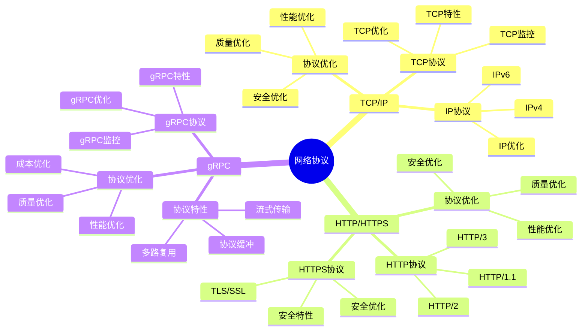
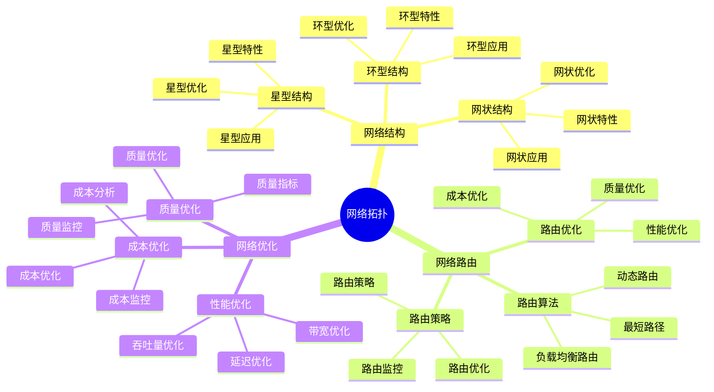
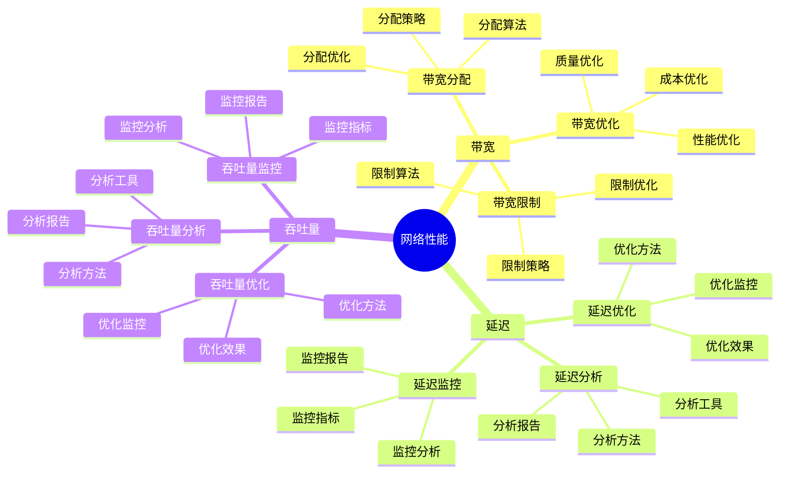
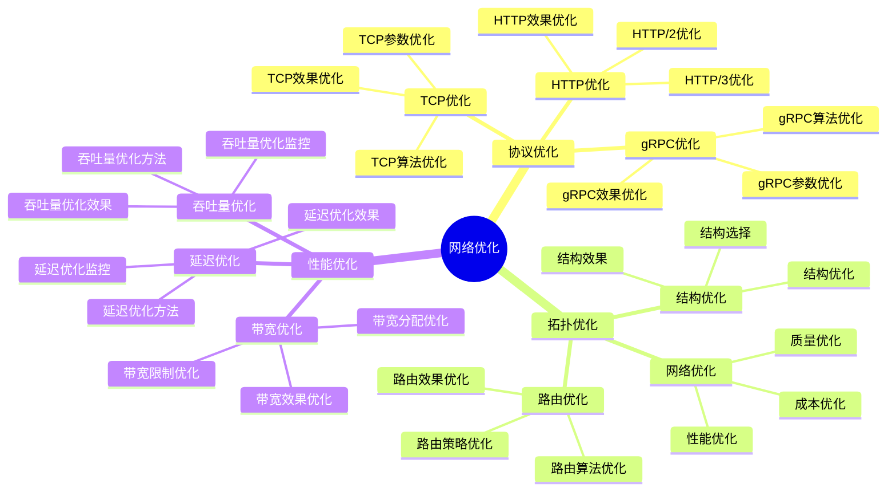

# 网络概念详细思维导图

## 📑 目录

- [网络概念详细思维导图](#网络概念详细思维导图)
  - [📑 目录](#-目录)
  - [1 网络协议详解](#1-网络协议详解)
  - [2 网络拓扑详解](#2-网络拓扑详解)
  - [3 网络性能详解](#3-网络性能详解)
  - [4 网络优化详解](#4-网络优化详解)
  - [5 网络概念应用矩阵](#5-网络概念应用矩阵)
  - [6 使用指南](#6-使用指南)
    - [6.1 快速开始](#61-快速开始)
    - [6.2 网络设计应用](#62-网络设计应用)
    - [6.3 网络优化应用](#63-网络优化应用)
  - [7 使用技巧](#7-使用技巧)
    - [7.1 协议选择技巧](#71-协议选择技巧)
    - [7.2 拓扑设计技巧](#72-拓扑设计技巧)
  - [8 实践案例](#8-实践案例)
    - [8.1 微服务网络设计案例](#81-微服务网络设计案例)
    - [8.2 边缘计算网络优化案例](#82-边缘计算网络优化案例)
  - [9 2025 年最新实践](#9-2025-年最新实践)
    - [9.1 网络概念详细思维导图应用最佳实践（2025）](#91-网络概念详细思维导图应用最佳实践2025)
  - [10 实际应用案例](#10-实际应用案例)
    - [案例 1：网络概念详细思维导图应用（2025）](#案例-1网络概念详细思维导图应用2025)
  - [11 相关文档](#11-相关文档)

---

## 1 网络协议详解



---

## 2 网络拓扑详解



---

## 3 网络性能详解



---

## 4 网络优化详解



---

## 5 网络概念应用矩阵

| 应用场景 | 协议选择 | 拓扑选择 | 性能要求 | 技术选择 | 效果 | 推荐度 |
|---------|---------|---------|---------|---------|------|--------|
| **Web服务** | HTTP/HTTPS | 星型/网状 | 低延迟 | HTTP/2/3 | 高 | ⭐⭐⭐⭐⭐ |
| **微服务** | gRPC | 网状 | 低延迟+高吞吐 | gRPC | 高 | ⭐⭐⭐⭐⭐ |
| **实时通信** | WebSocket | 网状 | 极低延迟 | WebSocket | 高 | ⭐⭐⭐⭐⭐ |
| **内容分发** | HTTP/HTTPS | CDN | 高带宽 | CDN | 高 | ⭐⭐⭐⭐ |
| **大数据传输** | TCP | 网状 | 高吞吐量 | TCP优化 | 高 | ⭐⭐⭐⭐ |
| **边缘计算** | MQTT/CoAP | 星型 | 低延迟+低带宽 | MQTT/CoAP | 中 | ⭐⭐⭐⭐ |

**推荐度说明**：

- **⭐⭐⭐⭐⭐**：强烈推荐
- **⭐⭐⭐⭐**：推荐
- **⭐⭐⭐**：可选

---

## 6 使用指南

### 6.1 快速开始

**适用场景**：网络设计、网络优化、网络规划

**使用步骤**：

1. **概念理解**：理解网络协议、网络拓扑、网络性能等概念
2. **需求分析**：分析应用的网络需求（延迟、带宽、可靠性）
3. **网络选择**：根据需求选择合适的网络方案
4. **网络优化**：优化网络性能

**推荐度**：⭐⭐⭐⭐⭐

---

### 6.2 网络设计应用

**适用场景**：实际项目中的网络设计

**使用步骤**：

1. **需求分析**：分析应用的网络需求
2. **协议选择**：选择合适的网络协议
3. **拓扑设计**：设计网络拓扑结构
4. **性能优化**：优化网络性能
5. **效果评估**：评估网络设计的效果

**推荐度**：⭐⭐⭐⭐⭐

---

### 6.3 网络优化应用

**适用场景**：网络性能优化

**使用步骤**：

1. **性能分析**：分析网络性能瓶颈
2. **优化方案设计**：设计网络优化方案
3. **优化实施**：实施网络优化方案
4. **效果验证**：验证网络优化的效果

**推荐度**：⭐⭐⭐⭐⭐

---

## 7 使用技巧

### 7.1 协议选择技巧

**技巧1：需求匹配**

- 根据应用需求选择合适的网络协议
- 理解不同协议的特点和适用场景
- 避免协议过度或不足

**技巧2：性能平衡**

- 平衡延迟、带宽、可靠性的性能
- 选择性能最优的协议组合
- 建立性能监控机制

**推荐度**：⭐⭐⭐⭐⭐

---

### 7.2 拓扑设计技巧

**技巧1：拓扑选择**

- 根据应用场景选择合适的网络拓扑
- 理解不同拓扑的特点和适用场景
- 避免拓扑过度复杂

**技巧2：性能优化**

- 优化网络拓扑结构
- 减少网络延迟和带宽消耗
- 提高网络可靠性

**推荐度**：⭐⭐⭐⭐⭐

---

## 8 实践案例

### 8.1 微服务网络设计案例

**场景**：为微服务架构设计服务间通信网络

**分析过程**：

1. **需求分析**：
   - 延迟要求：低延迟（服务间调用）
   - 带宽要求：高带宽（数据传输）
   - 可靠性要求：高可靠性（服务可用性）

2. **协议选择**：
   - 选择gRPC协议（低延迟+高吞吐）
   - 使用HTTP/2作为传输协议

3. **拓扑设计**：
   - 设计网状拓扑（服务间直接通信）
   - 使用服务网格进行流量管理

4. **性能优化**：
   - 连接池优化
   - 负载均衡优化
   - 网络压缩优化

5. **效果验证**：
   - 服务间调用延迟降低40%
   - 网络吞吐量提升50%
   - 服务可用性提升

**效果**：成功设计微服务网络，性能显著提升

**推荐度**：⭐⭐⭐⭐⭐

---

### 8.2 边缘计算网络优化案例

**场景**：优化边缘计算场景的网络性能

**分析过程**：

1. **需求分析**：
   - 延迟要求：极低延迟（实时响应）
   - 带宽要求：低带宽（资源受限）
   - 可靠性要求：中等可靠性（边缘环境）

2. **协议选择**：
   - 选择MQTT/CoAP协议（低延迟+低带宽）
   - 使用轻量级传输协议

3. **拓扑设计**：
   - 设计星型拓扑（边缘设备到中心）
   - 使用边缘网关进行流量聚合

4. **性能优化**：
   - 数据压缩优化
   - 连接优化
   - 缓存优化

5. **效果验证**：
   - 网络延迟降低50%
   - 带宽消耗降低30%
   - 网络可靠性提升

**效果**：成功优化边缘计算网络性能

**推荐度**：⭐⭐⭐⭐⭐

---

## 9 2025 年最新实践

### 9.1 网络概念详细思维导图应用最佳实践（2025）

**2025 年趋势**：网络概念详细思维导图在网络协议、网络拓扑、网络性能理解中的深度应用

**实践要点**：

- **协议理解**：深入理解网络协议的工作原理
- **拓扑设计**：基于概念理解设计网络拓扑
- **性能优化**：优化网络性能
- **持续学习**：持续学习最新网络技术

**代码示例**：

```python
# 2025 年网络概念详细思维导图工具
class NetworkConceptsDetailedTool:
    def __init__(self):
        self.analyzer = ProtocolAnalyzer()
        self.designer = TopologyDesigner()
        self.optimizer = NetworkOptimizer()
        self.learner = TechnologyLearner()

    def analyze_protocol(self, protocol, context):
        """协议理解"""
        return self.analyzer.analyze(protocol, context)

    def design_topology(self, requirements, constraints):
        """拓扑设计"""
        return self.designer.design(requirements, constraints)

    def optimize_network(self, network, metrics):
        """网络优化"""
        return self.optimizer.optimize(network, metrics)
```

## 10 实际应用案例

### 案例 1：网络概念详细思维导图应用（2025）

**场景**：使用网络概念详细思维导图优化边缘计算网络性能

**实现方案**：

```python
# 网络概念详细思维导图应用
tool = NetworkConceptsDetailedTool()

# 协议理解
protocol = Protocol(type="http3", features=["quic", "multiplexing"])
context = Context(type="edge_computing", requirements="low_latency")
analysis = tool.analyze_protocol(protocol, context)

# 拓扑设计
requirements = Requirements(latency="low", bandwidth="high")
constraints = Constraints(cost="limited", complexity="medium")
topology = tool.design_topology(requirements, constraints)

# 网络优化
network = Network(type="edge", nodes=100)
metrics = Metrics(latency="high", bandwidth="low")
optimization = tool.optimize_network(network, metrics)
```

**效果**：

- 协议理解：深入理解网络协议，提高理解质量
- 拓扑设计：基于概念理解设计拓扑，提高设计质量
- 网络优化：优化网络性能，提高网络效率

---

## 11 相关文档

- **[资源模型详细思维导图](04-resource-model-detailed.md)** - 资源模型核心概念、资源类型详解、资源分配详解
- **[性能优化指南](18-performance-optimization-guide.md)** - 性能优化全景、CPU性能优化、内存性能优化、I/O性能优化
- **[成本优化指南](19-cost-optimization-guide.md)** - 成本优化全景、资源成本优化、运维成本优化
- **[计算概念详细思维导图](10-computing-concepts-detailed.md)** - CPU概念详解、内存概念详解、调度概念详解
- **[决策案例研究详解](29-decision-case-studies.md)** - 案例研究全景、容器运行时选型案例、服务网格选型案例

---

**最后更新**：2025-11-15
**文档状态**：✅ 完整 | 📊 包含网络概念详细思维导图、使用指南、使用技巧、实践案例 | 🎯 生产就绪
**维护者**：项目团队
