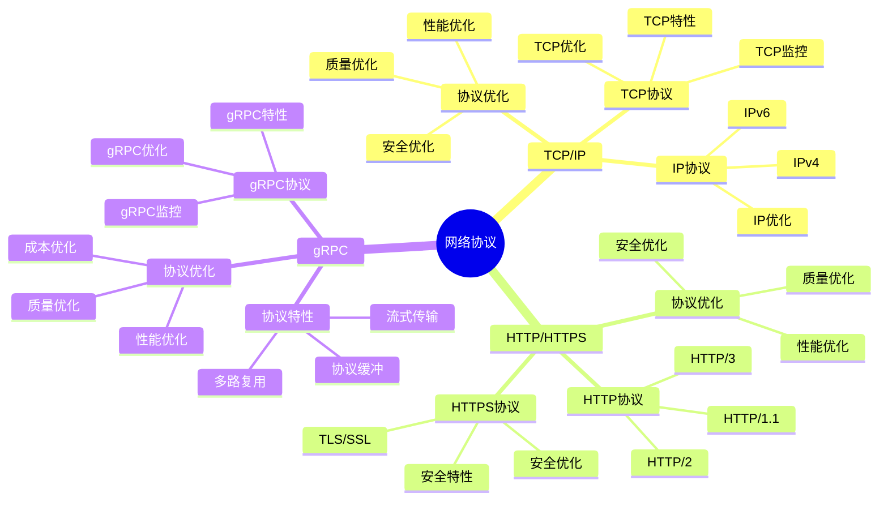
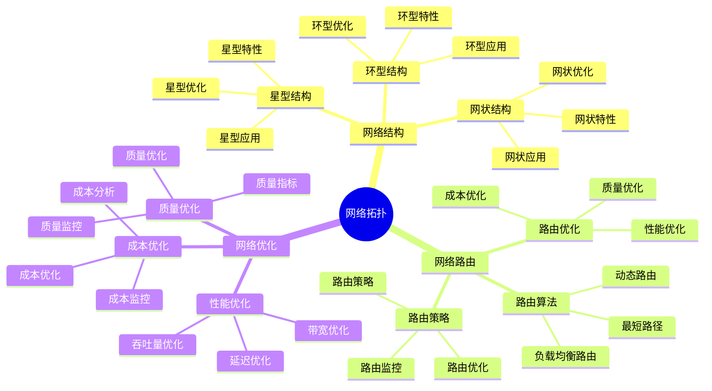
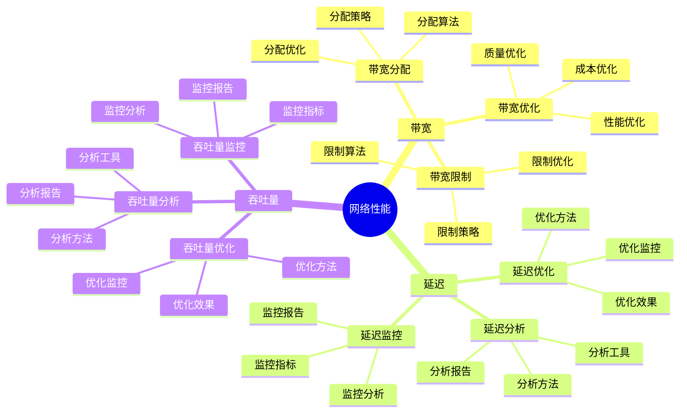
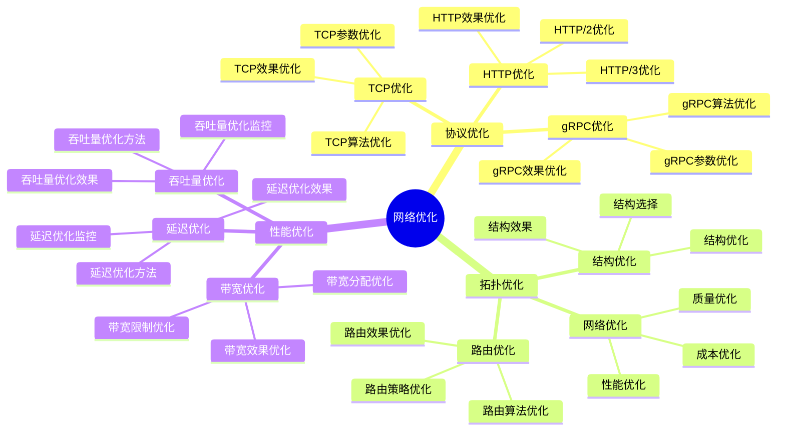

# 网络概念详细思维导图

## 📑 目录

- [网络概念详细思维导图](#网络概念详细思维导图)
  - [📑 目录](#-目录)
  - [1 网络协议详解](#1-网络协议详解)
  - [2 网络拓扑详解](#2-网络拓扑详解)
  - [3 网络性能详解](#3-网络性能详解)
  - [4 网络优化详解](#4-网络优化详解)

---

## 1 网络协议详解

---

## 2 网络拓扑详解

---

## 3 网络性能详解

---

## 4 网络优化详解

---

## 5 网络概念应用矩阵

| 应用场景 | 协议选择 | 拓扑选择 | 性能要求 | 技术选择 | 效果 | 推荐度 |
|---------|---------|---------|---------|---------|------|--------|
| **Web服务** | HTTP/HTTPS | 星型/网状 | 低延迟 | HTTP/2/3 | 高 | ⭐⭐⭐⭐⭐ |
| **微服务** | gRPC | 网状 | 低延迟+高吞吐 | gRPC | 高 | ⭐⭐⭐⭐⭐ |
| **实时通信** | WebSocket | 网状 | 极低延迟 | WebSocket | 高 | ⭐⭐⭐⭐⭐ |
| **内容分发** | HTTP/HTTPS | CDN | 高带宽 | CDN | 高 | ⭐⭐⭐⭐ |
| **大数据传输** | TCP | 网状 | 高吞吐量 | TCP优化 | 高 | ⭐⭐⭐⭐ |
| **边缘计算** | MQTT/CoAP | 星型 | 低延迟+低带宽 | MQTT/CoAP | 中 | ⭐⭐⭐⭐ |

**推荐度说明**：

- **⭐⭐⭐⭐⭐**：强烈推荐
- **⭐⭐⭐⭐**：推荐
- **⭐⭐⭐**：可选

---

**最后更新**：2025-11-07
**文档状态**：✅ 完整 | 📊 包含网络概念详细思维导图 | 🎯 生产就绪
**维护者**：项目团队
