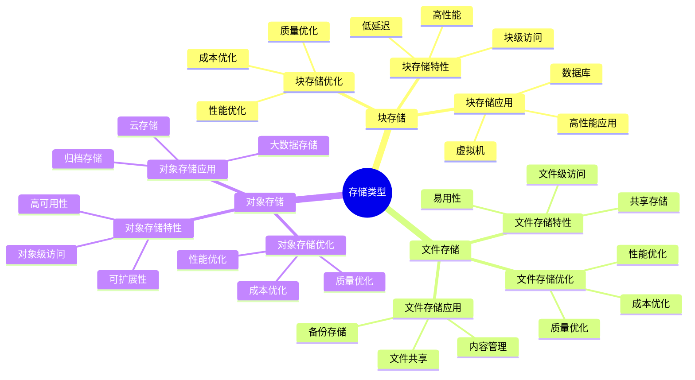
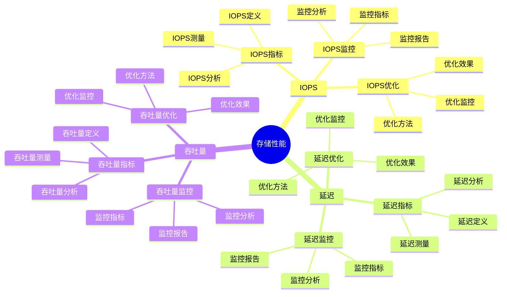
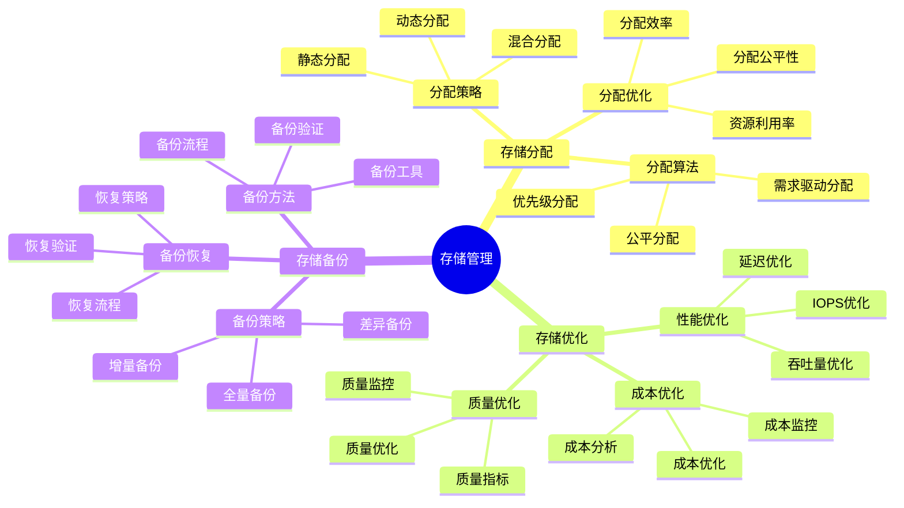
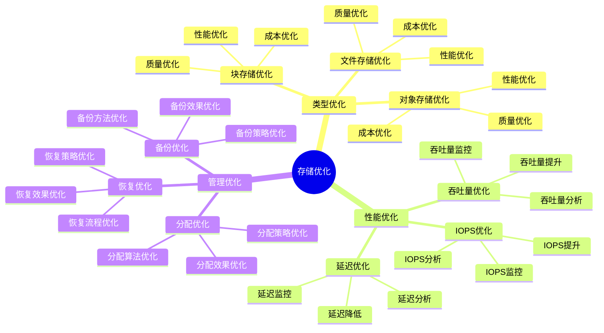

# 存储概念详细思维导图

## 📑 目录

- [存储概念详细思维导图](#存储概念详细思维导图)
  - [📑 目录](#-目录)
  - [1 存储类型详解](#1-存储类型详解)
  - [2 存储性能详解](#2-存储性能详解)
  - [3 存储管理详解](#3-存储管理详解)
  - [4 存储优化详解](#4-存储优化详解)
  - [5 存储概念应用矩阵](#5-存储概念应用矩阵)
  - [6 使用指南](#6-使用指南)
    - [6.1 快速开始](#61-快速开始)
    - [6.2 存储设计应用](#62-存储设计应用)
    - [6.3 存储优化应用](#63-存储优化应用)
  - [7 使用技巧](#7-使用技巧)
    - [7.1 存储选择技巧](#71-存储选择技巧)
    - [7.2 存储优化技巧](#72-存储优化技巧)
  - [8 实践案例](#8-实践案例)
    - [8.1 数据库存储优化案例](#81-数据库存储优化案例)
    - [8.2 云存储设计案例](#82-云存储设计案例)
  - [9 相关文档](#9-相关文档)

---

## 1 存储类型详解



---

## 2 存储性能详解



---

## 3 存储管理详解



---

## 4 存储优化详解



---

## 5 存储概念应用矩阵

| 应用场景 | 存储类型 | 性能要求 | 技术选择 | 效果 | 推荐度 |
|---------|---------|---------|---------|------|--------|
| **数据库** | 块存储 | 高IOPS+低延迟 | SSD/NVMe | 高 | ⭐⭐⭐⭐⭐ |
| **文件共享** | 文件存储 | 中等性能 | NFS/CIFS | 高 | ⭐⭐⭐⭐⭐ |
| **云存储** | 对象存储 | 高可扩展性 | S3/OSS | 高 | ⭐⭐⭐⭐⭐ |
| **大数据** | 对象存储 | 高吞吐量 | HDFS/对象存储 | 高 | ⭐⭐⭐⭐ |
| **备份归档** | 对象存储 | 低成本 | 对象存储 | 中 | ⭐⭐⭐⭐ |
| **高性能计算** | 块存储 | 极高IOPS | NVMe SSD | 高 | ⭐⭐⭐⭐⭐ |

**推荐度说明**：

- **⭐⭐⭐⭐⭐**：强烈推荐
- **⭐⭐⭐⭐**：推荐
- **⭐⭐⭐**：可选

---

## 6 使用指南

### 6.1 快速开始

**适用场景**：存储设计、存储优化、存储规划

**使用步骤**：

1. **概念理解**：理解存储类型、存储性能、存储管理等概念
2. **需求分析**：分析应用的存储需求（容量、性能、可靠性）
3. **存储选择**：根据需求选择合适的存储方案
4. **存储优化**：优化存储性能

**推荐度**：⭐⭐⭐⭐⭐

---

### 6.2 存储设计应用

**适用场景**：实际项目中的存储设计

**使用步骤**：

1. **需求分析**：分析应用的存储需求
2. **存储类型选择**：选择合适的存储类型（块存储、文件存储、对象存储）
3. **存储方案设计**：设计存储方案
4. **性能优化**：优化存储概念应用矩阵优化存储性能
5. **效果评估**：评估存储设计的效果

**推荐度**：⭐⭐⭐⭐⭐

---

### 6.3 存储优化应用

**适用场景**：存储性能优化、存储成本优化

**使用步骤**：

1. **性能分析**：分析存储性能瓶颈
2. **优化方案设计**：设计存储优化方案
3. **优化实施**：实施存储优化方案
4. **效果验证**：验证存储优化的效果

**推荐度**：⭐⭐⭐⭐⭐

---

## 7 使用技巧

### 7.1 存储选择技巧

**技巧1：需求匹配**

- 根据应用需求选择合适的存储类型
- 理解不同存储类型的特点和适用场景
- 避免存储类型过度或不足

**技巧2：性能平衡**

- 平衡容量、性能、可靠性的需求
- 选择性能最优的存储组合
- 建立性能监控机制

**推荐度**：⭐⭐⭐⭐⭐

---

### 7.2 存储优化技巧

**技巧1：性能优化**

- 优化存储IOPS和延迟
- 提高存储利用率
- 建立性能监控机制

**技巧2：成本优化**

- 优化存储成本
- 选择性价比高的存储类型
- 建立成本分析机制

**推荐度**：⭐⭐⭐⭐⭐

---

## 8 实践案例

### 8.1 数据库存储优化案例

**场景**：优化数据库存储性能

**分析过程**：

1. **需求分析**：
   - 存储类型：块存储（数据库）
   - 性能要求：高IOPS+低延迟
   - 容量要求：大容量（数据增长）

2. **存储选择**：
   - 选择NVMe SSD（高IOPS+低延迟）
   - 使用RAID 10（性能+可靠性）

3. **性能优化**：
   - IOPS优化：使用NVMe SSD
   - 延迟优化：优化存储配置
   - 容量优化：数据压缩、归档

4. **效果验证**：
   - IOPS提升100%
   - 延迟降低60%
   - 存储成本降低30%

**效果**：成功优化数据库存储性能

**推荐度**：⭐⭐⭐⭐⭐

---

### 8.2 云存储设计案例

**场景**：为云原生应用设计存储方案

**分析过程**：

1. **需求分析**：
   - 存储类型：对象存储（云原生）
   - 性能要求：高可扩展性
   - 成本要求：低成本

2. **存储选择**：
   - 选择S3/OSS对象存储
   - 使用CDN加速访问

3. **性能优化**：
   - 可扩展性优化：使用对象存储
   - 性能优化：使用CDN加速
   - 成本优化：使用分层存储

4. **效果验证**：
   - 可扩展性提升显著
   - 访问性能提升50%
   - 存储成本降低40%

**效果**：成功设计云存储方案

**推荐度**：⭐⭐⭐⭐⭐

---

## 9 2025 年最新实践

### 9.1 存储概念详细思维导图应用最佳实践（2025）

**2025 年趋势**：存储概念详细思维导图在存储类型、存储性能、存储管理理解中的深度应用

**实践要点**：

- **类型选择**：根据需求选择合适的存储类型
- **性能优化**：优化存储性能
- **成本控制**：控制存储成本
- **持续学习**：持续学习最新存储技术

**代码示例**：

```python
# 2025 年存储概念详细思维导图工具
class StorageConceptsDetailedTool:
    def __init__(self):
        self.selector = StorageTypeSelector()
        self.optimizer = StoragePerformanceOptimizer()
        self.cost_controller = StorageCostController()
        self.learner = TechnologyLearner()

    def select_storage_type(self, requirements, constraints):
        """类型选择"""
        return self.selector.select(requirements, constraints)

    def optimize_performance(self, storage, metrics):
        """性能优化"""
        return self.optimizer.optimize(storage, metrics)

    def control_cost(self, storage, budget):
        """成本控制"""
        return self.cost_controller.control(storage, budget)
```

## 10 实际应用案例

### 案例 1：存储概念详细思维导图应用（2025）

**场景**：使用存储概念详细思维导图设计云存储方案

**实现方案**：

```python
# 存储概念详细思维导图应用
tool = StorageConceptsDetailedTool()

# 类型选择
requirements = Requirements(capacity="large", performance="high", durability="high")
constraints = Constraints(budget="limited", scalability="required")
storage_type = tool.select_storage_type(requirements, constraints)

# 性能优化
storage = Storage(type="cloud", capacity="10TB")
metrics = Metrics(throughput="low", latency="high")
optimization = tool.optimize_performance(storage, metrics)

# 成本控制
budget = Budget(monthly="10000")
cost_control = tool.control_cost(storage, budget)
```

**效果**：

- 类型选择：根据需求选择类型，提高选择准确性
- 性能优化：优化存储性能，提高存储效率
- 成本控制：控制存储成本，降低运营成本

---

## 11 相关文档

- **[资源模型详细思维导图](04-resource-model-detailed.md)** - 资源模型核心概念、资源类型详解、资源分配详解
- **[成本优化指南](19-cost-optimization-guide.md)** - 成本优化全景、资源成本优化、运维成本优化
- **[性能优化指南](18-performance-optimization-guide.md)** - 性能优化全景、CPU性能优化、内存性能优化、I/O性能优化
- **[计算概念详细思维导图](10-computing-concepts-detailed.md)** - CPU概念详解、内存概念详解、调度概念详解
- **[网络概念详细思维导图](11-network-concepts-detailed.md)** - 网络协议详解、网络拓扑详解、网络性能详解

---

**最后更新**：2025-11-15
**文档状态**：✅ 完整 | 📊 包含存储概念详细思维导图、使用指南、使用技巧、实践案例 | 🎯 生产就绪
**维护者**：项目团队
