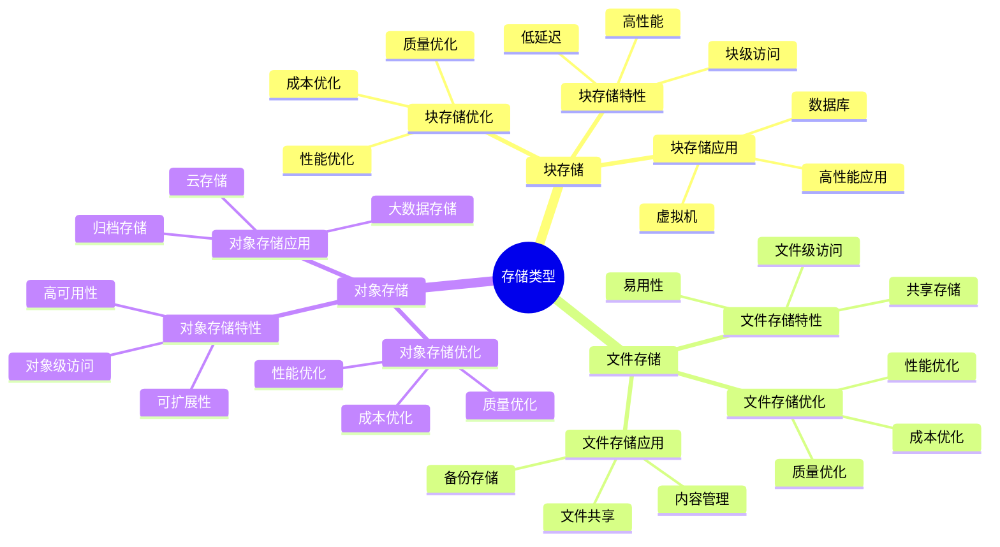
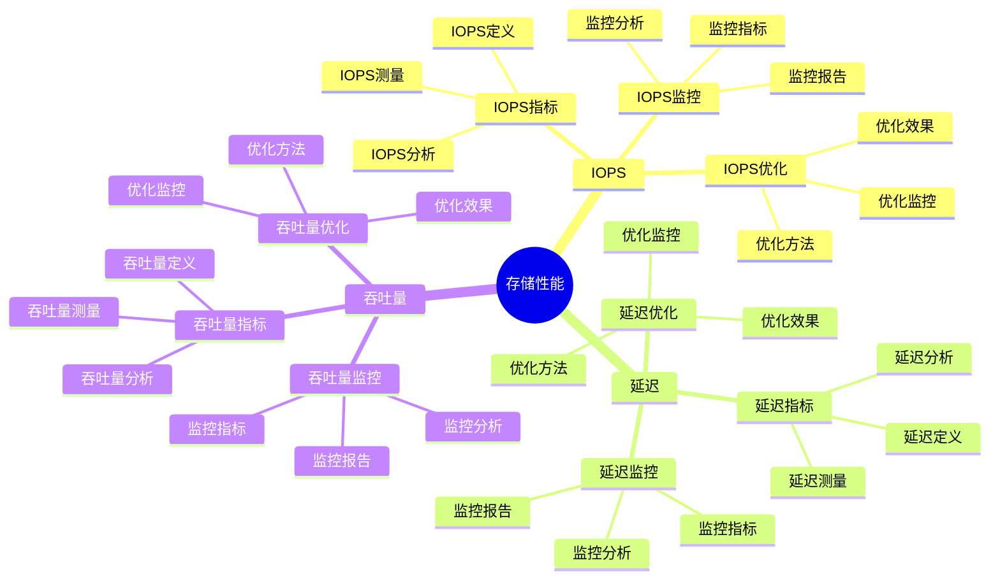
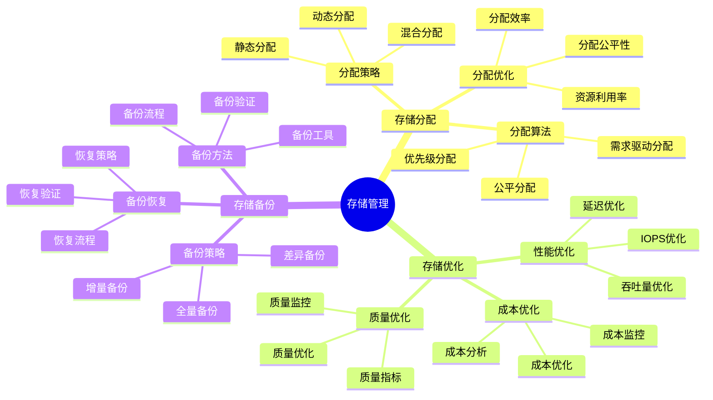
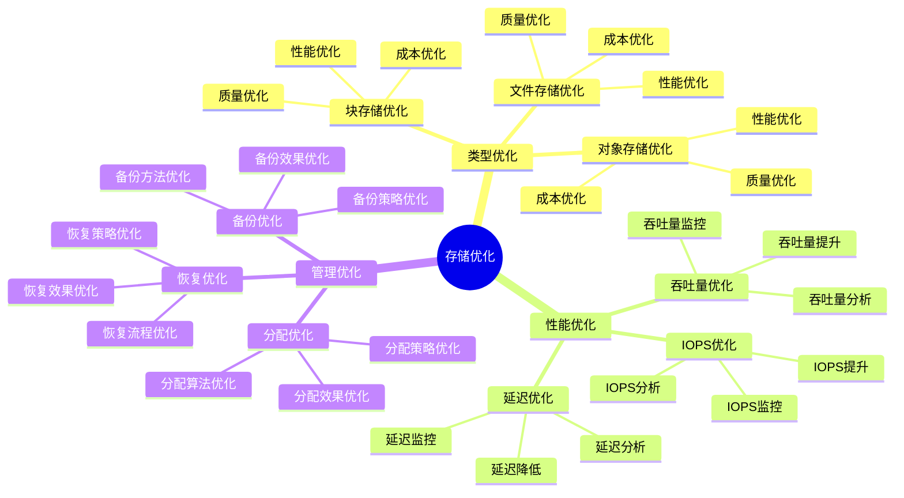

# 存储概念详细思维导图

## 📑 目录

- [存储概念详细思维导图](#存储概念详细思维导图)
  - [📑 目录](#-目录)
  - [1 存储类型详解](#1-存储类型详解)
  - [2 存储性能详解](#2-存储性能详解)
  - [3 存储管理详解](#3-存储管理详解)
  - [4 存储优化详解](#4-存储优化详解)

---

## 1 存储类型详解

---

## 2 存储性能详解

---

## 3 存储管理详解

---

## 4 存储优化详解

---

## 5 存储概念应用矩阵

| 应用场景 | 存储类型 | 性能要求 | 技术选择 | 效果 | 推荐度 |
|---------|---------|---------|---------|------|--------|
| **数据库** | 块存储 | 高IOPS+低延迟 | SSD/NVMe | 高 | ⭐⭐⭐⭐⭐ |
| **文件共享** | 文件存储 | 中等性能 | NFS/CIFS | 高 | ⭐⭐⭐⭐⭐ |
| **云存储** | 对象存储 | 高可扩展性 | S3/OSS | 高 | ⭐⭐⭐⭐⭐ |
| **大数据** | 对象存储 | 高吞吐量 | HDFS/对象存储 | 高 | ⭐⭐⭐⭐ |
| **备份归档** | 对象存储 | 低成本 | 对象存储 | 中 | ⭐⭐⭐⭐ |
| **高性能计算** | 块存储 | 极高IOPS | NVMe SSD | 高 | ⭐⭐⭐⭐⭐ |

**推荐度说明**：

- **⭐⭐⭐⭐⭐**：强烈推荐
- **⭐⭐⭐⭐**：推荐
- **⭐⭐⭐**：可选

---

**最后更新**：2025-11-07
**文档状态**：✅ 完整 | 📊 包含存储概念详细思维导图 | 🎯 生产就绪
**维护者**：项目团队
