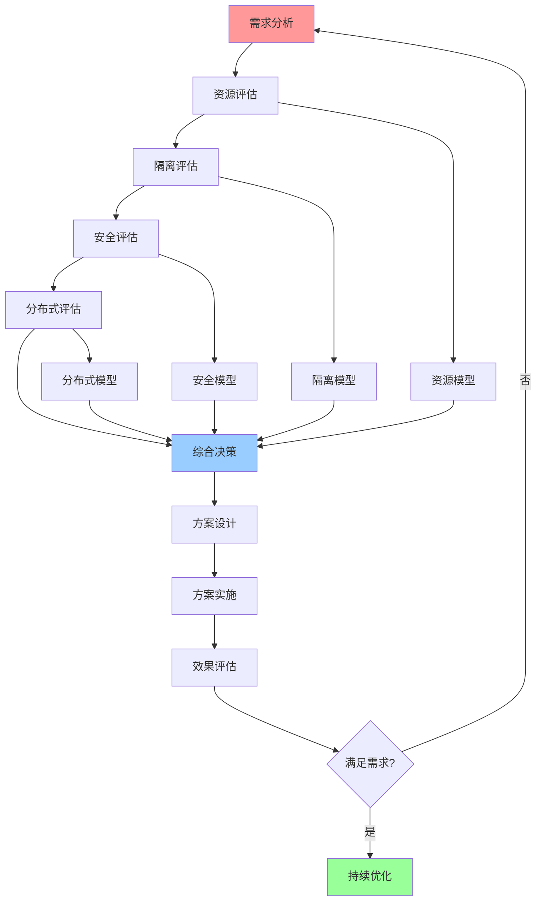
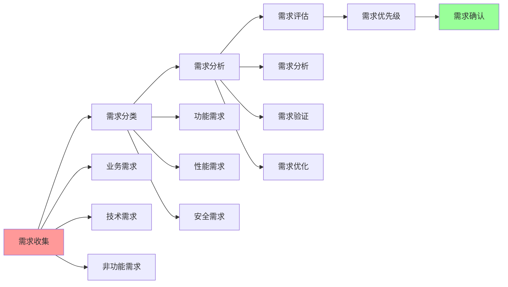
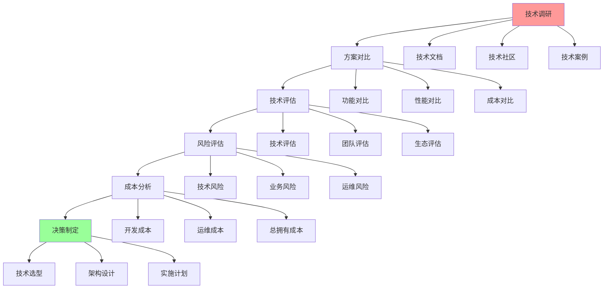
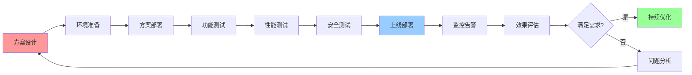

# 综合决策工作流图

## 📑 目录

- [综合决策工作流图](#综合决策工作流图)
  - [📑 目录](#-目录)
  - [1 决策工作流全景](#1-决策工作流全景)
  - [2 需求分析工作流](#2-需求分析工作流)
  - [3 技术选型工作流](#3-技术选型工作流)
  - [4 方案实施工作流](#4-方案实施工作流)

---

## 1 决策工作流全景

---

## 2 需求分析工作流

---

## 3 技术选型工作流

---

## 4 方案实施工作流

---

## 5 决策工作流检查点

| 检查点 | 阶段 | 检查内容 | 通过标准 | 推荐度 |
|--------|------|---------|---------|--------|
| **需求确认** | 需求分析 | 需求完整性、需求可行性 | 需求明确、可实施 | ⭐⭐⭐⭐⭐ |
| **技术选型** | 技术选型 | 技术评估、方案对比 | 技术选择合理 | ⭐⭐⭐⭐⭐ |
| **方案设计** | 方案设计 | 架构设计、技术方案 | 方案可行、可实施 | ⭐⭐⭐⭐⭐ |
| **功能测试** | 方案实施 | 功能完整性、功能正确性 | 功能满足需求 | ⭐⭐⭐⭐⭐ |
| **性能测试** | 方案实施 | 性能指标、性能优化 | 性能满足要求 | ⭐⭐⭐⭐ |
| **安全测试** | 方案实施 | 安全评估、安全测试 | 安全满足要求 | ⭐⭐⭐⭐⭐ |
| **上线部署** | 方案实施 | 部署流程、部署验证 | 部署成功、系统稳定 | ⭐⭐⭐⭐⭐ |
| **效果评估** | 效果评估 | 效果测量、效果分析 | 效果满足预期 | ⭐⭐⭐⭐⭐ |

**推荐度说明**：

- **⭐⭐⭐⭐⭐**：强烈推荐
- **⭐⭐⭐⭐**：推荐
- **⭐⭐⭐**：可选

---

**最后更新**：2025-11-07
**文档状态**：✅ 完整 | 📊 包含综合决策工作流图 | 🎯 生产就绪
**维护者**：项目团队
