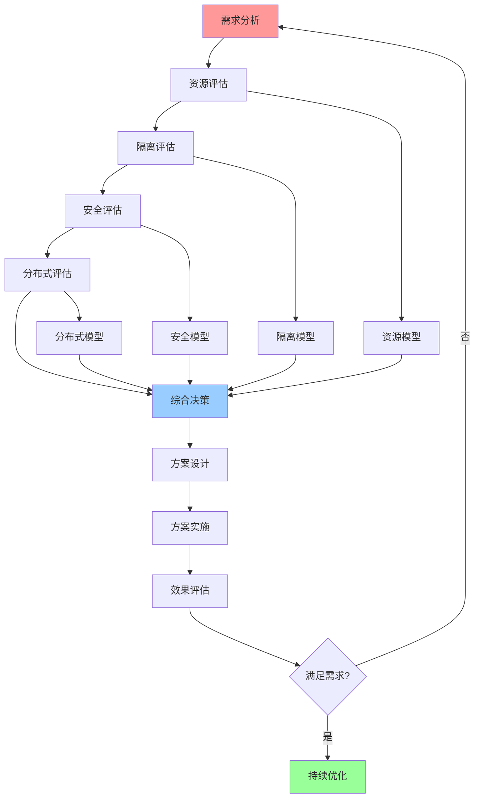
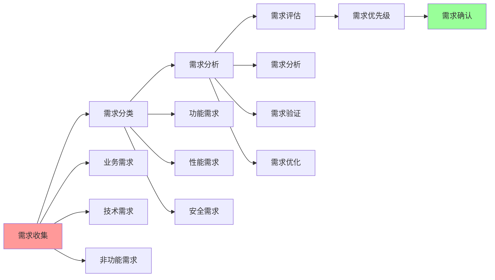
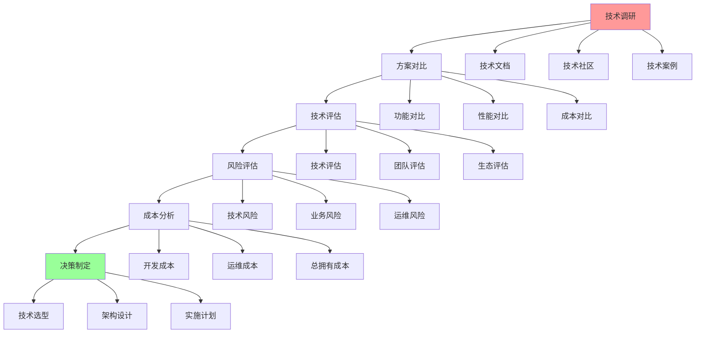
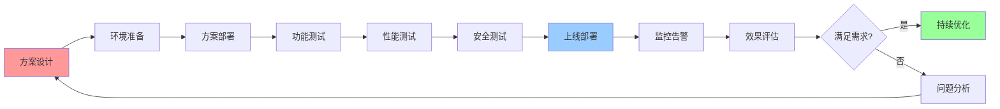

# 综合决策工作流图

## 📑 目录

- [综合决策工作流图](#综合决策工作流图)
  - [📑 目录](#-目录)
  - [1 决策工作流全景](#1-决策工作流全景)
  - [2 需求分析工作流](#2-需求分析工作流)
  - [3 技术选型工作流](#3-技术选型工作流)
  - [4 方案实施工作流](#4-方案实施工作流)
  - [5 决策工作流检查点](#5-决策工作流检查点)
  - [6 使用指南](#6-使用指南)
    - [6.1 快速开始](#61-快速开始)
    - [6.2 综合决策应用](#62-综合决策应用)
  - [7 使用技巧](#7-使用技巧)
    - [7.1 工作流执行技巧](#71-工作流执行技巧)
  - [8 实践案例](#8-实践案例)
    - [8.1 企业级应用综合决策案例](#81-企业级应用综合决策案例)
  - [9 相关文档](#9-相关文档)

---

## 1 决策工作流全景



---

## 2 需求分析工作流



---

## 3 技术选型工作流



---

## 4 方案实施工作流



---

## 5 决策工作流检查点

| 检查点 | 阶段 | 检查内容 | 通过标准 | 推荐度 |
|--------|------|---------|---------|--------|
| **需求确认** | 需求分析 | 需求完整性、需求可行性 | 需求明确、可实施 | ⭐⭐⭐⭐⭐ |
| **技术选型** | 技术选型 | 技术评估、方案对比 | 技术选择合理 | ⭐⭐⭐⭐⭐ |
| **方案设计** | 方案设计 | 架构设计、技术方案 | 方案可行、可实施 | ⭐⭐⭐⭐⭐ |
| **功能测试** | 方案实施 | 功能完整性、功能正确性 | 功能满足需求 | ⭐⭐⭐⭐⭐ |
| **性能测试** | 方案实施 | 性能指标、性能优化 | 性能满足要求 | ⭐⭐⭐⭐ |
| **安全测试** | 方案实施 | 安全评估、安全测试 | 安全满足要求 | ⭐⭐⭐⭐⭐ |
| **上线部署** | 方案实施 | 部署流程、部署验证 | 部署成功、系统稳定 | ⭐⭐⭐⭐⭐ |
| **效果评估** | 效果评估 | 效果测量、效果分析 | 效果满足预期 | ⭐⭐⭐⭐⭐ |

**推荐度说明**：

- **⭐⭐⭐⭐⭐**：强烈推荐
- **⭐⭐⭐⭐**：推荐
- **⭐⭐⭐**：可选

---

## 6 使用指南

### 6.1 快速开始

**适用场景**：综合决策、技术选型、方案实施

**使用步骤**：

1. **需求分析**：按照需求分析工作流进行需求分析
2. **技术选型**：按照技术选型工作流进行技术选型
3. **方案实施**：按照方案实施工作流进行方案实施
4. **效果评估**：评估方案实施效果

**推荐度**：⭐⭐⭐⭐⭐

---

### 6.2 综合决策应用

**适用场景**：实际项目中的综合决策

**使用步骤**：

1. **需求分析**：按照需求分析工作流分析需求
2. **资源评估**：使用资源模型进行资源评估
3. **隔离评估**：使用隔离模型进行隔离评估
4. **安全评估**：使用安全模型进行安全评估
5. **分布式评估**：使用分布式模型进行分布式评估
6. **综合决策**：综合各模型评估结果做出决策
7. **方案实施**：按照方案实施工作流实施方案
8. **效果评估**：评估方案实施效果

**推荐度**：⭐⭐⭐⭐⭐

---

## 7 使用技巧

### 7.1 工作流执行技巧

**技巧1：检查点利用**

- 充分利用检查点验证阶段成果
- 确保每个阶段的质量
- 及时调整工作流

**技巧2：迭代优化**

- 根据效果评估结果优化工作流
- 积累工作流使用经验
- 形成工作流使用模式

**推荐度**：⭐⭐⭐⭐⭐

---

## 8 实践案例

### 8.1 企业级应用综合决策案例

**场景**：为企业级SaaS平台进行综合技术决策

**决策过程**：

1. **需求分析**：
   - 功能需求：多租户、高可用
   - 性能需求：高并发、低延迟
   - 安全需求：高安全性、合规性
   - 成本需求：成本可控

2. **资源评估**：
   - 使用资源模型评估资源需求
   - 资源需求：大规模资源管理

3. **隔离评估**：
   - 使用隔离模型评估隔离需求
   - 隔离需求：多租户隔离

4. **安全评估**：
   - 使用安全模型评估安全需求
   - 安全需求：高安全性

5. **分布式评估**：
   - 使用分布式模型评估分布式需求
   - 分布式需求：高可用性

6. **综合决策**：
   - 选择虚拟化+容器化混合架构
   - 使用KVM进行多租户隔离
   - 使用LSM+Seccomp进行安全隔离

7. **方案实施**：
   - 按照方案实施工作流实施
   - 通过所有检查点

8. **效果评估**：
   - 系统满足多租户、高安全、高可用需求
   - 效果显著

**效果**：成功完成综合决策，系统满足所有需求

**推荐度**：⭐⭐⭐⭐⭐

---

## 9 2025 年最新实践

### 9.1 综合决策工作流应用最佳实践（2025）

**2025 年趋势**：综合决策工作流在需求分析、技术选型、方案实施中的深度应用

**实践要点**：

- **工作流执行**：严格按照工作流执行决策流程
- **检查点利用**：充分利用检查点验证阶段成果
- **迭代优化**：基于效果评估结果优化工作流
- **持续改进**：积累工作流使用经验，形成使用模式

**代码示例**：

```python
# 2025 年综合决策工作流工具
class ComprehensiveDecisionWorkflowTool:
    def __init__(self):
        self.workflow = ComprehensiveDecisionWorkflow()
        self.executor = WorkflowExecutor()
        self.checkpoint_manager = CheckpointManager()
        self.optimizer = WorkflowOptimizer()

    def execute_workflow(self, requirements, context):
        """工作流执行"""
        return self.executor.execute(self.workflow, requirements, context)

    def verify_checkpoint(self, checkpoint, results):
        """检查点验证"""
        return self.checkpoint_manager.verify(checkpoint, results)

    def optimize_workflow(self, workflow, feedback):
        """工作流优化"""
        return self.optimizer.optimize(workflow, feedback)
```

## 10 实际应用案例

### 案例 1：综合决策工作流应用（2025）

**场景**：使用综合决策工作流进行企业级应用技术决策

**实现方案**：

```python
# 综合决策工作流应用
tool = ComprehensiveDecisionWorkflowTool()

# 工作流执行
requirements = Requirements(type="enterprise", scale="large")
context = Context(team="devops", budget="high")
results = tool.execute_workflow(requirements, context)

# 检查点验证
checkpoints = ["需求分析", "技术选型", "方案实施"]
for checkpoint in checkpoints:
    verification = tool.verify_checkpoint(checkpoint, results)

# 工作流优化
feedback = Feedback(performance="good", satisfaction="high")
optimized = tool.optimize_workflow(tool.workflow, feedback)
```

**效果**：

- 工作流执行：系统化执行决策流程，提高执行质量
- 检查点验证：验证阶段成果，确保流程质量
- 工作流优化：基于反馈优化工作流，提高工作流效率

---

## 11 相关文档

- **[决策框架对比矩阵](01-decision-framework-matrix.md)** - 决策框架功能、决策场景适用、决策方法
- **[决策模型集成关系图](09-decision-models-integration.md)** - 决策模型全景集成、资源与隔离集成、安全与分布式集成
- **[架构决策完整流程](../../02-architecture-design/visualizations/08-architecture-decision-process.md)** - 架构决策全景流程、需求分析流程、架构设计流程

---

**最后更新**：2025-11-15
**文档状态**：✅ 完整 | 📊 包含综合决策工作流图、使用指南、使用技巧、实践案例 | 🎯 生产就绪
**维护者**：项目团队
