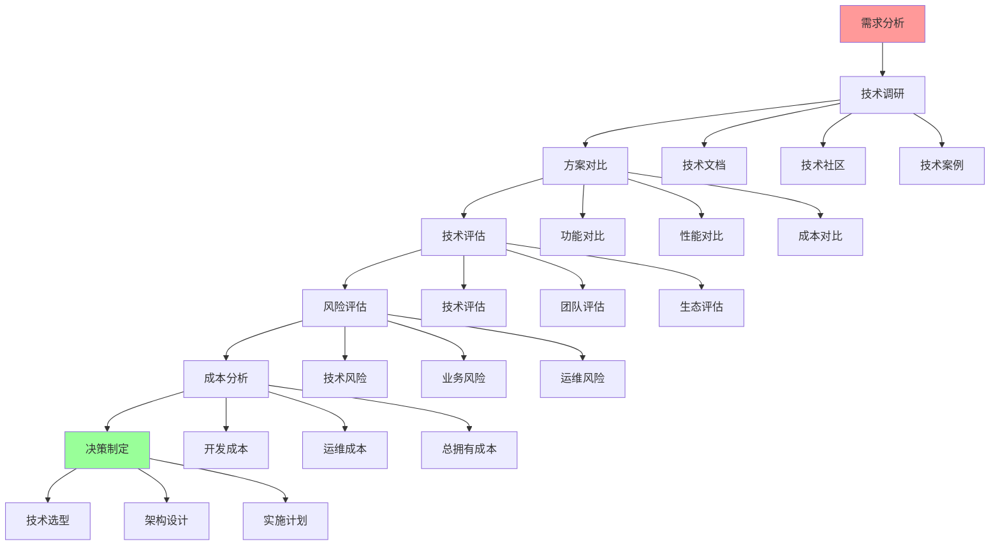
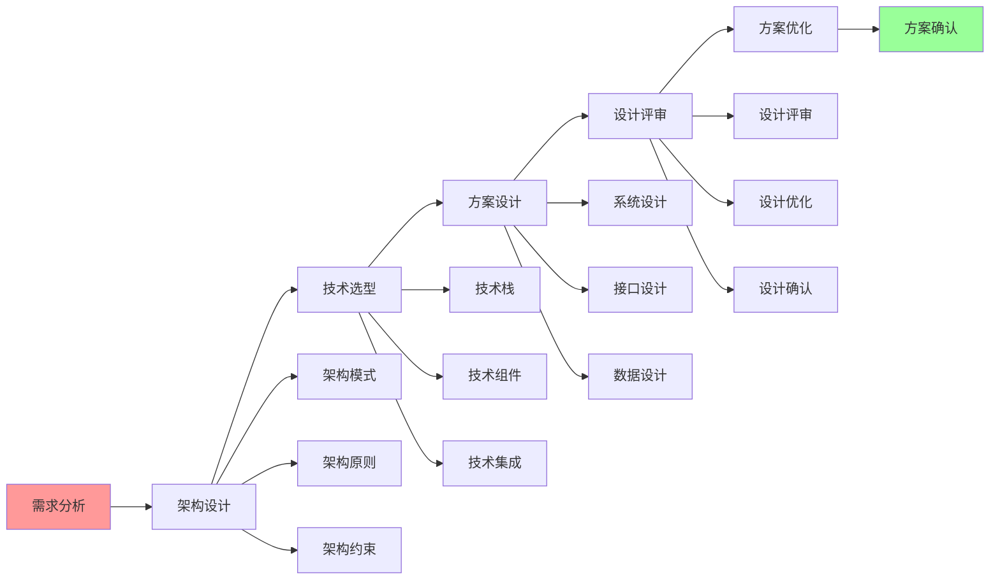
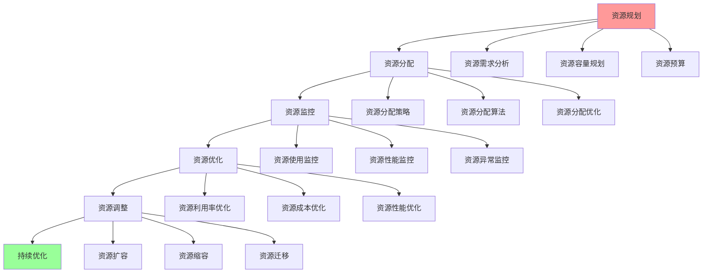
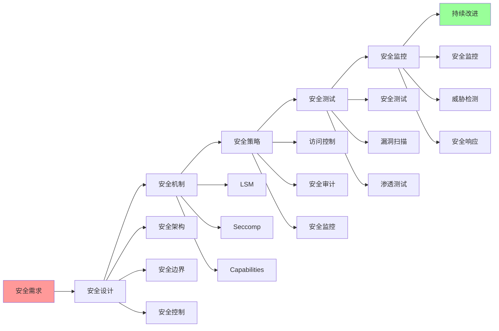

# 最佳实践指南

## 📑 目录

- [最佳实践指南](#最佳实践指南)
  - [📑 目录](#-目录)
  - [1 技术选型最佳实践](#1-技术选型最佳实践)
  - [2 架构设计最佳实践](#2-架构设计最佳实践)
  - [3 资源管理最佳实践](#3-资源管理最佳实践)
  - [4 安全设计最佳实践](#4-安全设计最佳实践)

---

## 1 技术选型最佳实践

---

## 2 架构设计最佳实践

---

## 3 资源管理最佳实践

---

## 4 安全设计最佳实践

---

## 5 最佳实践检查清单

| 实践领域 | 检查项 | 重要性 | 推荐度 |
|---------|--------|--------|--------|
| **技术选型** | 需求分析、技术调研、方案对比、技术评估、风险评估、成本分析 | 极高 | ⭐⭐⭐⭐⭐ |
| **架构设计** | 需求分析、架构设计、技术选型、方案设计、设计评审、方案优化 | 高 | ⭐⭐⭐⭐⭐ |
| **资源管理** | 资源规划、资源分配、资源监控、资源优化、资源调整、持续优化 | 高 | ⭐⭐⭐⭐⭐ |
| **安全设计** | 安全需求、安全设计、安全机制、安全策略、安全测试、安全监控 | 极高 | ⭐⭐⭐⭐⭐ |
| **监控运维** | 监控设计、监控实施、监控分析、告警配置、运维流程、持续优化 | 中 | ⭐⭐⭐⭐ |
| **持续改进** | 效果评估、问题分析、改进方案、改进实施、效果验证、持续优化 | 中 | ⭐⭐⭐⭐ |

**推荐度说明**：

- **⭐⭐⭐⭐⭐**：强烈推荐
- **⭐⭐⭐⭐**：推荐
- **⭐⭐⭐**：可选

---

## 6 使用指南

### 6.1 快速开始

**适用场景**：技术选型、架构设计、资源管理、安全设计

**使用步骤**：

1. **实践领域选择**：选择需要应用最佳实践的领域
2. **实践流程应用**：按照最佳实践流程执行
3. **检查清单验证**：使用检查清单验证实践效果

**推荐度**：⭐⭐⭐⭐⭐

---

### 6.2 最佳实践应用

**适用场景**：实际项目中的最佳实践应用

**使用步骤**：

1. **需求分析**：分析项目需求
2. **实践选择**：选择合适的最佳实践
3. **流程执行**：按照最佳实践流程执行
4. **检查清单验证**：使用检查清单验证实践效果
5. **持续优化**：根据实践效果持续优化

**推荐度**：⭐⭐⭐⭐⭐

---

## 7 使用技巧

### 7.1 实践选择技巧

**技巧1：需求匹配**

- 根据项目需求选择合适的最佳实践
- 理解最佳实践的适用场景
- 避免实践过度或不足

**技巧2：流程执行**

- 严格按照最佳实践流程执行
- 确保每个阶段的质量
- 及时进行效果验证

**推荐度**：⭐⭐⭐⭐⭐

---

## 8 实践案例

### 8.1 技术选型最佳实践案例

**场景**：为微服务架构选择容器运行时

**实践过程**：

1. **需求分析**：
   - 功能需求：稳定可靠、Kubernetes集成
   - 性能需求：高性能、低延迟
   - 安全需求：中等安全性

2. **技术调研**：
   - 调研containerd、CRI-O、Docker
   - 分析技术文档、社区、案例

3. **方案对比**：
   - 功能对比：containerd功能完整
   - 性能对比：containerd性能优秀
   - 生态对比：containerd生态支持好

4. **技术评估**：
   - 技术能力：containerd成熟稳定
   - 团队能力：团队熟悉containerd
   - 生态支持：containerd生态完善

5. **风险评估**：
   - 技术风险：低
   - 业务风险：低
   - 运维风险：低

6. **决策制定**：
   - 选择containerd
   - 理由：功能完整、性能优秀、生态支持好

**效果**：成功应用技术选型最佳实践，选择合适的技术

**推荐度**：⭐⭐⭐⭐⭐

---

## 9 相关文档

- **[技术选型详细指南](15-technology-selection-guide.md)** - 容器运行时选型指南、隔离技术选型指南、编排平台选型指南
- **[决策框架对比矩阵](01-decision-framework-matrix.md)** - 决策框架功能、决策场景适用、决策方法
- **[架构决策完整流程](../../02-architecture-design/visualizations/08-architecture-decision-process.md)** - 架构决策全景流程、需求分析流程、架构设计流程

---

**最后更新**：2025-11-15
**文档状态**：✅ 完整 | 📊 包含最佳实践指南、使用指南、使用技巧、实践案例 | 🎯 生产就绪
**维护者**：项目团队
