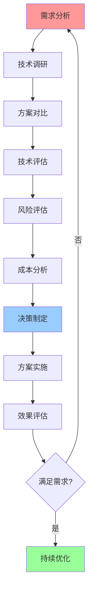

# 技术选型详细指南

## 📑 目录

- [技术选型详细指南](#技术选型详细指南)
  - [📑 目录](#-目录)
  - [1 容器运行时选型指南](#1-容器运行时选型指南)
  - [2 隔离技术选型指南](#2-隔离技术选型指南)
  - [3 编排平台选型指南](#3-编排平台选型指南)
  - [4 服务网格选型指南](#4-服务网格选型指南)
  - [5 技术选型决策流程](#5-技术选型决策流程)
  - [6 技术选型检查清单](#6-技术选型检查清单)
  - [7 使用指南](#7-使用指南)
    - [7.1 快速开始](#71-快速开始)
    - [7.2 技术选型应用](#72-技术选型应用)
  - [8 使用技巧](#8-使用技巧)
    - [8.1 选型因素分析技巧](#81-选型因素分析技巧)
  - [9 实践案例](#9-实践案例)
    - [9.1 容器运行时选型案例](#91-容器运行时选型案例)
  - [10 2025 年最新实践](#10-2025-年最新实践)
    - [10.1 技术选型详细指南应用最佳实践（2025）](#101-技术选型详细指南应用最佳实践2025)
  - [11 实际应用案例](#11-实际应用案例)
    - [案例 1：技术选型详细指南应用（2025）](#案例-1技术选型详细指南应用2025)
  - [12 相关文档](#12-相关文档)

---

## 1 容器运行时选型指南

| 选型因素 | runc | crun | youki | Kata | gVisor | Firecracker | 推荐度 |
|---------|------|------|-------|------|--------|------------|--------|
| **隔离强度** | 中 | 中 | 中 | 极高 | 高 | 高 | ⭐⭐⭐⭐⭐ |
| **启动速度** | 快 | 快 | 快 | 慢 | 中 | 极快 | ⭐⭐⭐⭐⭐ |
| **资源占用** | 低 | 低 | 低 | 高 | 中 | 极低 | ⭐⭐⭐⭐⭐ |
| **性能** | 高 | 高 | 高 | 中 | 中 | 高 | ⭐⭐⭐⭐⭐ |
| **稳定性** | 极高 | 高 | 中 | 高 | 高 | 高 | ⭐⭐⭐⭐ |
| **生态支持** | 极高 | 中 | 低 | 高 | 高 | 中 | ⭐⭐⭐⭐ |

**推荐度说明**：

- **⭐⭐⭐⭐⭐**：强烈推荐
- **⭐⭐⭐⭐**：推荐
- **⭐⭐⭐**：可选

---

## 2 隔离技术选型指南

| 选型因素 | 虚拟化 | 沙盒化 | 容器化 | 权限隔离 | 推荐度 |
|---------|--------|--------|--------|---------|--------|
| **隔离强度** | 极高 | 高 | 中 | 低 | ⭐⭐⭐⭐⭐ |
| **性能** | 中 | 中 | 高 | 高 | ⭐⭐⭐⭐⭐ |
| **资源占用** | 高 | 中 | 低 | 极低 | ⭐⭐⭐⭐⭐ |
| **启动速度** | 慢 | 中 | 快 | 极快 | ⭐⭐⭐⭐⭐ |
| **适用场景** | 多租户 | Serverless | 微服务 | 边缘计算 | ⭐⭐⭐⭐⭐ |
| **复杂度** | 高 | 中 | 低 | 低 | ⭐⭐⭐⭐ |

**推荐度说明**：

- **⭐⭐⭐⭐⭐**：强烈推荐
- **⭐⭐⭐⭐**：推荐
- **⭐⭐⭐**：可选

---

## 3 编排平台选型指南

| 选型因素 | Kubernetes | Docker Compose | K3s/K0s | 推荐度 |
|---------|-----------|---------------|---------|--------|
| **功能完整性** | 极高 | 低 | 中 | ⭐⭐⭐⭐⭐ |
| **扩展性** | 极高 | 低 | 中 | ⭐⭐⭐⭐⭐ |
| **复杂度** | 高 | 低 | 中 | ⭐⭐⭐⭐ |
| **资源占用** | 高 | 低 | 低 | ⭐⭐⭐⭐ |
| **适用规模** | 大规模 | 小规模 | 中小规模 | ⭐⭐⭐⭐⭐ |
| **生态支持** | 极高 | 中 | 中 | ⭐⭐⭐⭐ |

**推荐度说明**：

- **⭐⭐⭐⭐⭐**：强烈推荐
- **⭐⭐⭐⭐**：推荐
- **⭐⭐⭐**：可选

---

## 4 服务网格选型指南

| 选型因素 | Istio | Linkerd | Consul Connect | Kuma | 推荐度 |
|---------|-------|---------|---------------|------|--------|
| **功能完整性** | 极高 | 高 | 中 | 中 | ⭐⭐⭐⭐⭐ |
| **复杂度** | 高 | 中 | 中 | 低 | ⭐⭐⭐⭐ |
| **性能** | 中 | 高 | 中 | 中 | ⭐⭐⭐⭐ |
| **资源占用** | 高 | 中 | 中 | 低 | ⭐⭐⭐⭐ |
| **易用性** | 中 | 高 | 中 | 高 | ⭐⭐⭐⭐ |
| **生态支持** | 极高 | 高 | 中 | 中 | ⭐⭐⭐⭐ |

**推荐度说明**：

- **⭐⭐⭐⭐⭐**：强烈推荐
- **⭐⭐⭐⭐**：推荐
- **⭐⭐⭐**：可选

---

## 5 技术选型决策流程



---

## 6 技术选型检查清单

| 检查项 | 检查内容 | 重要性 | 推荐度 |
|--------|---------|--------|--------|
| **需求分析** | 功能需求、性能需求、安全需求、成本需求 | 极高 | ⭐⭐⭐⭐⭐ |
| **技术调研** | 技术文档、技术社区、技术案例、技术趋势 | 高 | ⭐⭐⭐⭐⭐ |
| **方案对比** | 功能对比、性能对比、成本对比、生态对比 | 高 | ⭐⭐⭐⭐⭐ |
| **技术评估** | 技术能力、团队能力、生态支持、技术趋势 | 高 | ⭐⭐⭐⭐⭐ |
| **风险评估** | 技术风险、业务风险、运维风险、安全风险 | 高 | ⭐⭐⭐⭐⭐ |
| **成本分析** | 开发成本、运维成本、总拥有成本、ROI分析 | 中 | ⭐⭐⭐⭐ |
| **决策制定** | 决策记录、决策理由、决策流程、决策评审 | 高 | ⭐⭐⭐⭐⭐ |
| **方案实施** | 实施计划、实施执行、实施监控、实施验证 | 高 | ⭐⭐⭐⭐⭐ |
| **效果评估** | 效果测量、效果分析、效果报告、持续改进 | 中 | ⭐⭐⭐⭐ |

**推荐度说明**：

- **⭐⭐⭐⭐⭐**：强烈推荐
- **⭐⭐⭐⭐**：推荐
- **⭐⭐⭐**：可选

---

## 7 使用指南

### 7.1 快速开始

**适用场景**：容器运行时选型、隔离技术选型、编排平台选型、服务网格选型

**使用步骤**：

1. **需求分析**：分析技术选型需求
2. **选型因素分析**：分析选型因素（隔离强度、性能、资源占用等）
3. **技术对比**：使用选型指南对比技术
4. **决策制定**：基于对比结果制定决策

**推荐度**：⭐⭐⭐⭐⭐

---

### 7.2 技术选型应用

**适用场景**：实际项目中的技术选型

**使用步骤**：

1. **需求分析**：分析功能需求、性能需求、安全需求、成本需求
2. **技术调研**：调研相关技术（文档、社区、案例）
3. **方案对比**：使用选型指南对比技术方案
4. **技术评估**：评估技术能力、团队能力、生态支持
5. **风险评估**：评估技术风险、业务风险、运维风险
6. **成本分析**：分析开发成本、运维成本、总拥有成本
7. **决策制定**：制定技术选型决策
8. **方案实施**：实施方案并评估效果

**推荐度**：⭐⭐⭐⭐⭐

---

## 8 使用技巧

### 8.1 选型因素分析技巧

**技巧1：因素权重**

- 根据项目需求确定因素权重
- 理解不同因素的重要性
- 平衡不同因素的要求

**技巧2：技术对比**

- 使用选型指南进行系统化对比
- 理解技术的优缺点
- 做出综合权衡

**推荐度**：⭐⭐⭐⭐⭐

---

## 9 实践案例

### 9.1 容器运行时选型案例

**场景**：为Kubernetes集群选择容器运行时

**选型过程**：

1. **需求分析**：
   - 功能需求：稳定可靠、Kubernetes集成
   - 性能需求：高性能、低延迟
   - 安全需求：中等安全性

2. **选型因素分析**：
   - 隔离强度：中等（中）
   - 启动速度：快
   - 资源占用：低
   - 性能：高
   - 稳定性：极高
   - 生态支持：极高

3. **技术对比**：
   - runc：稳定可靠、生态支持好
   - containerd：功能完整、Kubernetes集成好
   - CRI-O：轻量级、Kubernetes原生

4. **决策制定**：
   - 选择containerd
   - 理由：功能完整、稳定可靠、Kubernetes集成好

**效果**：成功选择containerd，满足所有需求

**推荐度**：⭐⭐⭐⭐⭐

---

## 10 2025 年最新实践

### 10.1 技术选型详细指南应用最佳实践（2025）

**2025 年趋势**：技术选型详细指南在容器运行时、隔离技术、编排平台选型中的深度应用

**实践要点**：

- **需求分析**：系统化分析技术选型需求
- **因素分析**：全面分析选型因素
- **技术对比**：多维度对比技术方案
- **决策制定**：基于分析结果制定决策

**代码示例**：

```python
# 2025 年技术选型详细指南工具
class TechnologySelectionGuideTool:
    def __init__(self):
        self.analyzer = RequirementAnalyzer()
        self.factor_analyzer = FactorAnalyzer()
        self.comparator = TechnologyComparator()
        self.decision_maker = DecisionMaker()

    def analyze_requirements(self, project, constraints):
        """需求分析"""
        return self.analyzer.analyze(project, constraints)

    def analyze_factors(self, requirements, technologies):
        """因素分析"""
        return self.factor_analyzer.analyze(requirements, technologies)

    def compare_technologies(self, technologies, factors):
        """技术对比"""
        return self.comparator.compare(technologies, factors)
```

## 11 实际应用案例

### 案例 1：技术选型详细指南应用（2025）

**场景**：使用技术选型详细指南进行容器运行时选型

**实现方案**：

```python
# 技术选型详细指南应用
tool = TechnologySelectionGuideTool()

# 需求分析
project = Project(type="microservices", scale="large")
constraints = Constraints(budget="limited", team="small")
requirements = tool.analyze_requirements(project, constraints)

# 因素分析
technologies = [Technology(name="containerd"), Technology(name="CRI-O")]
factors = tool.analyze_factors(requirements, technologies)

# 技术对比
comparison = tool.compare_technologies(technologies, factors)

# 决策制定
decision = tool.decision_maker.make(comparison)
```

**效果**：

- 需求分析：系统化分析需求，提高分析质量
- 因素分析：全面分析因素，提高分析准确性
- 技术对比：多维度对比技术，提高对比质量

---

## 12 相关文档

- **[技术选型决策树](03-technology-selection-decision-tree.md)** - 容器运行时、隔离技术、编排平台、服务网格选型决策树
- **[决策框架对比矩阵](01-decision-framework-matrix.md)** - 决策框架功能、决策场景适用、决策方法
- **[最佳实践指南](14-best-practices-guide.md)** - 技术选型最佳实践、架构设计最佳实践、资源管理最佳实践

---

**最后更新**：2025-11-15
**文档状态**：✅ 完整 | 📊 包含技术选型详细指南、使用指南、使用技巧、实践案例 | 🎯 生产就绪
**维护者**：项目团队
