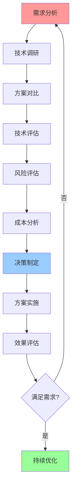

# 技术选型详细指南

## 📑 目录

- [技术选型详细指南](#技术选型详细指南)
  - [📑 目录](#-目录)
  - [1 容器运行时选型指南](#1-容器运行时选型指南)
  - [2 隔离技术选型指南](#2-隔离技术选型指南)
  - [3 编排平台选型指南](#3-编排平台选型指南)
  - [4 服务网格选型指南](#4-服务网格选型指南)

---

## 1 容器运行时选型指南

| 选型因素 | runc | crun | youki | Kata | gVisor | Firecracker | 推荐度 |
|---------|------|------|-------|------|--------|------------|--------|
| **隔离强度** | 中 | 中 | 中 | 极高 | 高 | 高 | ⭐⭐⭐⭐⭐ |
| **启动速度** | 快 | 快 | 快 | 慢 | 中 | 极快 | ⭐⭐⭐⭐⭐ |
| **资源占用** | 低 | 低 | 低 | 高 | 中 | 极低 | ⭐⭐⭐⭐⭐ |
| **性能** | 高 | 高 | 高 | 中 | 中 | 高 | ⭐⭐⭐⭐⭐ |
| **稳定性** | 极高 | 高 | 中 | 高 | 高 | 高 | ⭐⭐⭐⭐ |
| **生态支持** | 极高 | 中 | 低 | 高 | 高 | 中 | ⭐⭐⭐⭐ |

**推荐度说明**：

- **⭐⭐⭐⭐⭐**：强烈推荐
- **⭐⭐⭐⭐**：推荐
- **⭐⭐⭐**：可选

---

## 2 隔离技术选型指南

| 选型因素 | 虚拟化 | 沙盒化 | 容器化 | 权限隔离 | 推荐度 |
|---------|--------|--------|--------|---------|--------|
| **隔离强度** | 极高 | 高 | 中 | 低 | ⭐⭐⭐⭐⭐ |
| **性能** | 中 | 中 | 高 | 高 | ⭐⭐⭐⭐⭐ |
| **资源占用** | 高 | 中 | 低 | 极低 | ⭐⭐⭐⭐⭐ |
| **启动速度** | 慢 | 中 | 快 | 极快 | ⭐⭐⭐⭐⭐ |
| **适用场景** | 多租户 | Serverless | 微服务 | 边缘计算 | ⭐⭐⭐⭐⭐ |
| **复杂度** | 高 | 中 | 低 | 低 | ⭐⭐⭐⭐ |

**推荐度说明**：

- **⭐⭐⭐⭐⭐**：强烈推荐
- **⭐⭐⭐⭐**：推荐
- **⭐⭐⭐**：可选

---

## 3 编排平台选型指南

| 选型因素 | Kubernetes | Docker Compose | K3s/K0s | 推荐度 |
|---------|-----------|---------------|---------|--------|
| **功能完整性** | 极高 | 低 | 中 | ⭐⭐⭐⭐⭐ |
| **扩展性** | 极高 | 低 | 中 | ⭐⭐⭐⭐⭐ |
| **复杂度** | 高 | 低 | 中 | ⭐⭐⭐⭐ |
| **资源占用** | 高 | 低 | 低 | ⭐⭐⭐⭐ |
| **适用规模** | 大规模 | 小规模 | 中小规模 | ⭐⭐⭐⭐⭐ |
| **生态支持** | 极高 | 中 | 中 | ⭐⭐⭐⭐ |

**推荐度说明**：

- **⭐⭐⭐⭐⭐**：强烈推荐
- **⭐⭐⭐⭐**：推荐
- **⭐⭐⭐**：可选

---

## 4 服务网格选型指南

| 选型因素 | Istio | Linkerd | Consul Connect | Kuma | 推荐度 |
|---------|-------|---------|---------------|------|--------|
| **功能完整性** | 极高 | 高 | 中 | 中 | ⭐⭐⭐⭐⭐ |
| **复杂度** | 高 | 中 | 中 | 低 | ⭐⭐⭐⭐ |
| **性能** | 中 | 高 | 中 | 中 | ⭐⭐⭐⭐ |
| **资源占用** | 高 | 中 | 中 | 低 | ⭐⭐⭐⭐ |
| **易用性** | 中 | 高 | 中 | 高 | ⭐⭐⭐⭐ |
| **生态支持** | 极高 | 高 | 中 | 中 | ⭐⭐⭐⭐ |

**推荐度说明**：

- **⭐⭐⭐⭐⭐**：强烈推荐
- **⭐⭐⭐⭐**：推荐
- **⭐⭐⭐**：可选

---

## 5 技术选型决策流程

---

## 6 技术选型检查清单

| 检查项 | 检查内容 | 重要性 | 推荐度 |
|--------|---------|--------|--------|
| **需求分析** | 功能需求、性能需求、安全需求、成本需求 | 极高 | ⭐⭐⭐⭐⭐ |
| **技术调研** | 技术文档、技术社区、技术案例、技术趋势 | 高 | ⭐⭐⭐⭐⭐ |
| **方案对比** | 功能对比、性能对比、成本对比、生态对比 | 高 | ⭐⭐⭐⭐⭐ |
| **技术评估** | 技术能力、团队能力、生态支持、技术趋势 | 高 | ⭐⭐⭐⭐⭐ |
| **风险评估** | 技术风险、业务风险、运维风险、安全风险 | 高 | ⭐⭐⭐⭐⭐ |
| **成本分析** | 开发成本、运维成本、总拥有成本、ROI分析 | 中 | ⭐⭐⭐⭐ |
| **决策制定** | 决策记录、决策理由、决策流程、决策评审 | 高 | ⭐⭐⭐⭐⭐ |
| **方案实施** | 实施计划、实施执行、实施监控、实施验证 | 高 | ⭐⭐⭐⭐⭐ |
| **效果评估** | 效果测量、效果分析、效果报告、持续改进 | 中 | ⭐⭐⭐⭐ |

**推荐度说明**：

- **⭐⭐⭐⭐⭐**：强烈推荐
- **⭐⭐⭐⭐**：推荐
- **⭐⭐⭐**：可选

---

**最后更新**：2025-11-07
**文档状态**：✅ 完整 | 📊 包含技术选型详细指南 | 🎯 生产就绪
**维护者**：项目团队
