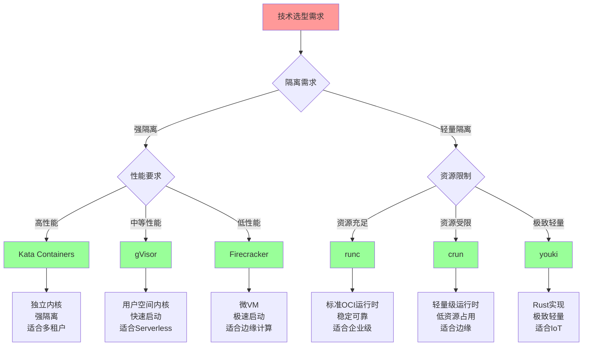

# 技术对比详细矩阵

## 📑 目录

- [技术对比详细矩阵](#技术对比详细矩阵)
  - [📑 目录](#-目录)
  - [1 容器运行时对比](#1-容器运行时对比)
  - [2 隔离技术对比](#2-隔离技术对比)
  - [3 编排平台对比](#3-编排平台对比)
  - [4 服务网格对比](#4-服务网格对比)
  - [5 技术选型决策树](#5-技术选型决策树)
  - [6 使用指南](#6-使用指南)
    - [6.1 快速开始](#61-快速开始)
    - [6.2 技术对比应用](#62-技术对比应用)
  - [7 使用技巧](#7-使用技巧)
    - [7.1 对比技巧](#71-对比技巧)
  - [8 实践案例](#8-实践案例)
    - [8.1 容器运行时对比案例](#81-容器运行时对比案例)
  - [9 相关文档](#9-相关文档)

---

## 1 容器运行时对比

| 特性 | runc | crun | youki | Kata | gVisor | Firecracker | 推荐度 |
|------|------|------|-------|------|--------|------------|--------|
| **隔离强度** | 中 | 中 | 中 | 极高 | 高 | 高 | ⭐⭐⭐⭐⭐ |
| **启动速度** | 快(100ms) | 快(80ms) | 快(90ms) | 慢(2-5s) | 中(500ms) | 极快(50ms) | ⭐⭐⭐⭐⭐ |
| **资源占用** | 低 | 低 | 低 | 高 | 中 | 极低 | ⭐⭐⭐⭐⭐ |
| **性能** | 高(100%) | 高(98%) | 高(99%) | 中(85%) | 中(90%) | 高(95%) | ⭐⭐⭐⭐⭐ |
| **稳定性** | 极高 | 高 | 中 | 高 | 高 | 高 | ⭐⭐⭐⭐ |
| **生态支持** | 极高 | 中 | 低 | 高 | 高 | 中 | ⭐⭐⭐⭐ |
| **适用场景** | 通用 | 边缘计算 | Rust生态 | 多租户 | Serverless | Serverless | ⭐⭐⭐⭐⭐ |

**推荐度说明**：

- **⭐⭐⭐⭐⭐**：强烈推荐
- **⭐⭐⭐⭐**：推荐
- **⭐⭐⭐**：可选

---

## 2 隔离技术对比

| 特性 | 虚拟化 | 沙盒化 | 容器化 | 权限隔离 | 推荐度 |
|---------|--------|--------|--------|---------|--------|
| **隔离强度** | 极高 | 高 | 中 | 低 | ⭐⭐⭐⭐⭐ |
| **性能** | 中(80%) | 中(90%) | 高(100%) | 高(100%) | ⭐⭐⭐⭐⭐ |
| **资源占用** | 高 | 中 | 低 | 极低 | ⭐⭐⭐⭐⭐ |
| **启动速度** | 慢(5-10s) | 中(500ms) | 快(100ms) | 极快(10ms) | ⭐⭐⭐⭐⭐ |
| **适用场景** | 多租户 | Serverless | 微服务 | 边缘计算 | ⭐⭐⭐⭐⭐ |
| **复杂度** | 高 | 中 | 低 | 低 | ⭐⭐⭐⭐ |
| **成本** | 高 | 中 | 低 | 极低 | ⭐⭐⭐⭐ |

**推荐度说明**：

- **⭐⭐⭐⭐⭐**：强烈推荐
- **⭐⭐⭐⭐**：推荐
- **⭐⭐⭐**：可选

---

## 3 编排平台对比

| 特性 | Kubernetes | Docker Compose | K3s/K0s | 推荐度 |
|---------|-----------|---------------|---------|--------|
| **功能完整性** | 极高 | 低 | 中 | ⭐⭐⭐⭐⭐ |
| **扩展性** | 极高 | 低 | 中 | ⭐⭐⭐⭐⭐ |
| **复杂度** | 高 | 低 | 中 | ⭐⭐⭐⭐ |
| **资源占用** | 高(2GB+) | 低(<100MB) | 低(512MB) | ⭐⭐⭐⭐ |
| **适用规模** | 大规模(1000+节点) | 小规模(<10节点) | 中小规模(100节点) | ⭐⭐⭐⭐⭐ |
| **生态支持** | 极高 | 中 | 中 | ⭐⭐⭐⭐ |
| **学习曲线** | 陡峭 | 平缓 | 中等 | ⭐⭐⭐⭐ |
| **运维成本** | 高 | 低 | 中 | ⭐⭐⭐⭐ |

**推荐度说明**：

- **⭐⭐⭐⭐⭐**：强烈推荐
- **⭐⭐⭐⭐**：推荐
- **⭐⭐⭐**：可选

---

## 4 服务网格对比

| 特性 | Istio | Linkerd | Consul Connect | Kuma | 推荐度 |
|---------|-------|---------|---------------|------|--------|
| **功能完整性** | 极高 | 高 | 中 | 中 | ⭐⭐⭐⭐⭐ |
| **复杂度** | 高 | 中 | 中 | 低 | ⭐⭐⭐⭐ |
| **性能** | 中 | 高 | 中 | 中 | ⭐⭐⭐⭐ |
| **资源占用** | 高(500MB+) | 中(200MB) | 中(300MB) | 低(100MB) | ⭐⭐⭐⭐ |
| **易用性** | 中 | 高 | 中 | 高 | ⭐⭐⭐⭐ |
| **生态支持** | 极高 | 高 | 中 | 中 | ⭐⭐⭐⭐ |
| **多集群支持** | 是 | 是 | 是 | 是 | ⭐⭐⭐⭐ |
| **边缘支持** | 是 | 是 | 是 | 是 | ⭐⭐⭐⭐ |

**推荐度说明**：

- **⭐⭐⭐⭐⭐**：强烈推荐
- **⭐⭐⭐⭐**：推荐
- **⭐⭐⭐**：可选

---

## 5 技术选型决策树



---

## 6 使用指南

### 6.1 快速开始

**适用场景**：技术对比、技术选型

**使用步骤**：

1. **需求分析**：分析技术选型需求
2. **技术对比**：使用对比矩阵对比技术
3. **决策制定**：基于对比结果制定决策

**推荐度**：⭐⭐⭐⭐⭐

---

### 6.2 技术对比应用

**适用场景**：实际项目中的技术对比

**使用步骤**：

1. **需求分析**：分析技术选型需求（隔离、性能、资源占用等）
2. **技术选择**：选择需要对比的技术
3. **特性对比**：使用对比矩阵对比技术特性
4. **决策树应用**：使用技术选型决策树进行决策
5. **决策制定**：基于对比结果制定技术选型决策

**推荐度**：⭐⭐⭐⭐⭐

---

## 7 使用技巧

### 7.1 对比技巧

**技巧1：特性权重**

- 根据项目需求确定特性权重
- 理解不同特性的重要性
- 平衡不同特性的要求

**技巧2：决策树应用**

- 使用技术选型决策树进行决策
- 理解决策树的分支逻辑
- 做出合理的决策

**推荐度**：⭐⭐⭐⭐⭐

---

## 8 实践案例

### 8.1 容器运行时对比案例

**场景**：对比容器运行时技术（runc vs crun vs Kata）

**对比过程**：

1. **需求分析**：
   - 隔离需求：强隔离
   - 性能需求：高性能
   - 资源占用：中等

2. **特性对比**：
   - 隔离强度：Kata（极高）> runc（中）= crun（中）
   - 性能：runc（高）> crun（高）> Kata（中）
   - 资源占用：runc（低）= crun（低）< Kata（高）

3. **决策树应用**：
   - 隔离需求：强隔离 → Kata Containers
   - 性能要求：高性能 → runc/crun
   - 综合决策：根据需求选择Kata（强隔离优先）

4. **决策制定**：
   - 选择Kata Containers
   - 理由：强隔离、适合多租户场景

**效果**：成功对比并选择容器运行时，满足强隔离需求

**推荐度**：⭐⭐⭐⭐⭐

---

## 9 2025 年最新实践

### 9.1 技术对比详细矩阵应用最佳实践（2025）

**2025 年趋势**：技术对比详细矩阵在容器运行时、隔离技术、编排平台对比中的深度应用

**实践要点**：

- **技术查询**：使用矩阵快速查询技术特性
- **多维度对比**：从多个维度对比技术方案
- **决策支持**：基于对比结果支持技术选型决策
- **持续更新**：定期更新技术数据，反映最新趋势

**代码示例**：

```python
# 2025 年技术对比详细矩阵工具
class TechnologyComparisonMatrixTool:
    def __init__(self):
        self.matrix = TechnologyComparisonMatrix()
        self.query_engine = TechnologyQueryEngine()
        self.comparator = TechnologyComparator()
        self.decision_support = DecisionSupport()

    def query_technology(self, tech_name, dimensions):
        """技术查询"""
        return self.query_engine.query(tech_name, dimensions)

    def compare_technologies(self, technologies, dimensions):
        """技术对比"""
        return self.comparator.compare(technologies, dimensions)

    def support_decision(self, comparison, requirements):
        """决策支持"""
        return self.decision_support.recommend(comparison, requirements)
```

## 10 实际应用案例

### 案例 1：技术对比详细矩阵应用（2025）

**场景**：使用技术对比详细矩阵进行容器运行时对比

**实现方案**：

```python
# 技术对比详细矩阵应用
tool = TechnologyComparisonMatrixTool()

# 技术查询
technologies = ["containerd", "CRI-O", "runc"]
dimensions = ["performance", "security", "stability"]
tech_data = [tool.query_technology(tech, dimensions) for tech in technologies]

# 技术对比
comparison = tool.compare_technologies(tech_data, dimensions)

# 决策支持
requirements = Requirements(performance="high", security="medium")
recommendation = tool.support_decision(comparison, requirements)
```

**效果**：

- 技术查询：快速查询技术特性，提高查询效率
- 技术对比：多维度对比技术，提高对比质量
- 决策支持：基于对比支持决策，提高决策准确性

---

## 11 相关文档

- **[技术选型详细指南](15-technology-selection-guide.md)** - 容器运行时选型指南、隔离技术选型指南、编排平台选型指南
- **[技术选型决策树](03-technology-selection-decision-tree.md)** - 容器运行时、隔离技术、编排平台、服务网格选型决策树
- **[技术选型完整工作流](23-technology-selection-workflow.md)** - 技术选型全景流程、需求分析流程、技术评估流程

---

**最后更新**：2025-11-15
**文档状态**：✅ 完整 | 📊 包含技术对比详细矩阵、使用指南、使用技巧、实践案例 | 🎯 生产就绪
**维护者**：项目团队
