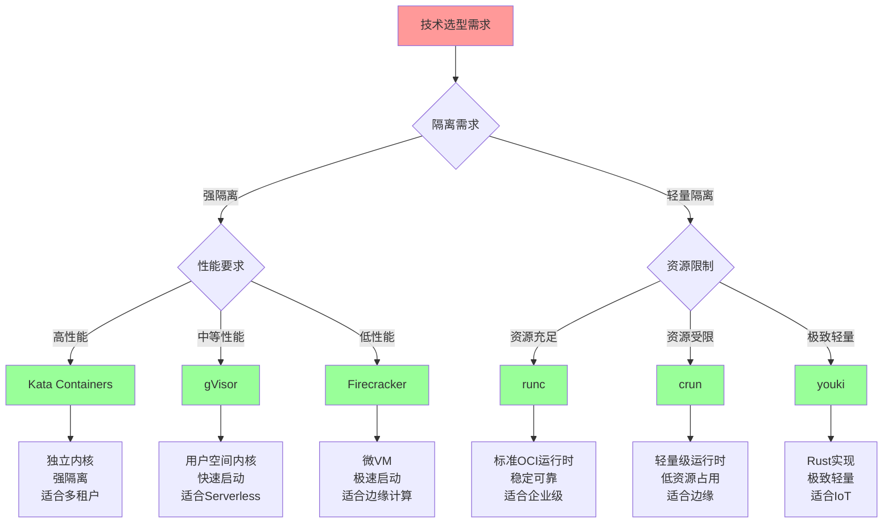

# 技术对比详细矩阵

## 📑 目录

- [技术对比详细矩阵](#技术对比详细矩阵)
  - [📑 目录](#-目录)
  - [1 容器运行时对比](#1-容器运行时对比)
  - [2 隔离技术对比](#2-隔离技术对比)
  - [3 编排平台对比](#3-编排平台对比)
  - [4 服务网格对比](#4-服务网格对比)

---

## 1 容器运行时对比

| 特性 | runc | crun | youki | Kata | gVisor | Firecracker | 推荐度 |
|------|------|------|-------|------|--------|------------|--------|
| **隔离强度** | 中 | 中 | 中 | 极高 | 高 | 高 | ⭐⭐⭐⭐⭐ |
| **启动速度** | 快(100ms) | 快(80ms) | 快(90ms) | 慢(2-5s) | 中(500ms) | 极快(50ms) | ⭐⭐⭐⭐⭐ |
| **资源占用** | 低 | 低 | 低 | 高 | 中 | 极低 | ⭐⭐⭐⭐⭐ |
| **性能** | 高(100%) | 高(98%) | 高(99%) | 中(85%) | 中(90%) | 高(95%) | ⭐⭐⭐⭐⭐ |
| **稳定性** | 极高 | 高 | 中 | 高 | 高 | 高 | ⭐⭐⭐⭐ |
| **生态支持** | 极高 | 中 | 低 | 高 | 高 | 中 | ⭐⭐⭐⭐ |
| **适用场景** | 通用 | 边缘计算 | Rust生态 | 多租户 | Serverless | Serverless | ⭐⭐⭐⭐⭐ |

**推荐度说明**：

- **⭐⭐⭐⭐⭐**：强烈推荐
- **⭐⭐⭐⭐**：推荐
- **⭐⭐⭐**：可选

---

## 2 隔离技术对比

| 特性 | 虚拟化 | 沙盒化 | 容器化 | 权限隔离 | 推荐度 |
|---------|--------|--------|--------|---------|--------|
| **隔离强度** | 极高 | 高 | 中 | 低 | ⭐⭐⭐⭐⭐ |
| **性能** | 中(80%) | 中(90%) | 高(100%) | 高(100%) | ⭐⭐⭐⭐⭐ |
| **资源占用** | 高 | 中 | 低 | 极低 | ⭐⭐⭐⭐⭐ |
| **启动速度** | 慢(5-10s) | 中(500ms) | 快(100ms) | 极快(10ms) | ⭐⭐⭐⭐⭐ |
| **适用场景** | 多租户 | Serverless | 微服务 | 边缘计算 | ⭐⭐⭐⭐⭐ |
| **复杂度** | 高 | 中 | 低 | 低 | ⭐⭐⭐⭐ |
| **成本** | 高 | 中 | 低 | 极低 | ⭐⭐⭐⭐ |

**推荐度说明**：

- **⭐⭐⭐⭐⭐**：强烈推荐
- **⭐⭐⭐⭐**：推荐
- **⭐⭐⭐**：可选

---

## 3 编排平台对比

| 特性 | Kubernetes | Docker Compose | K3s/K0s | 推荐度 |
|---------|-----------|---------------|---------|--------|
| **功能完整性** | 极高 | 低 | 中 | ⭐⭐⭐⭐⭐ |
| **扩展性** | 极高 | 低 | 中 | ⭐⭐⭐⭐⭐ |
| **复杂度** | 高 | 低 | 中 | ⭐⭐⭐⭐ |
| **资源占用** | 高(2GB+) | 低(<100MB) | 低(512MB) | ⭐⭐⭐⭐ |
| **适用规模** | 大规模(1000+节点) | 小规模(<10节点) | 中小规模(100节点) | ⭐⭐⭐⭐⭐ |
| **生态支持** | 极高 | 中 | 中 | ⭐⭐⭐⭐ |
| **学习曲线** | 陡峭 | 平缓 | 中等 | ⭐⭐⭐⭐ |
| **运维成本** | 高 | 低 | 中 | ⭐⭐⭐⭐ |

**推荐度说明**：

- **⭐⭐⭐⭐⭐**：强烈推荐
- **⭐⭐⭐⭐**：推荐
- **⭐⭐⭐**：可选

---

## 4 服务网格对比

| 特性 | Istio | Linkerd | Consul Connect | Kuma | 推荐度 |
|---------|-------|---------|---------------|------|--------|
| **功能完整性** | 极高 | 高 | 中 | 中 | ⭐⭐⭐⭐⭐ |
| **复杂度** | 高 | 中 | 中 | 低 | ⭐⭐⭐⭐ |
| **性能** | 中 | 高 | 中 | 中 | ⭐⭐⭐⭐ |
| **资源占用** | 高(500MB+) | 中(200MB) | 中(300MB) | 低(100MB) | ⭐⭐⭐⭐ |
| **易用性** | 中 | 高 | 中 | 高 | ⭐⭐⭐⭐ |
| **生态支持** | 极高 | 高 | 中 | 中 | ⭐⭐⭐⭐ |
| **多集群支持** | 是 | 是 | 是 | 是 | ⭐⭐⭐⭐ |
| **边缘支持** | 是 | 是 | 是 | 是 | ⭐⭐⭐⭐ |

**推荐度说明**：

- **⭐⭐⭐⭐⭐**：强烈推荐
- **⭐⭐⭐⭐**：推荐
- **⭐⭐⭐**：可选

---

## 5 技术选型决策树

---

**最后更新**：2025-11-07
**文档状态**：✅ 完整 | 📊 包含技术对比详细矩阵 | 🎯 生产就绪
**维护者**：项目团队
