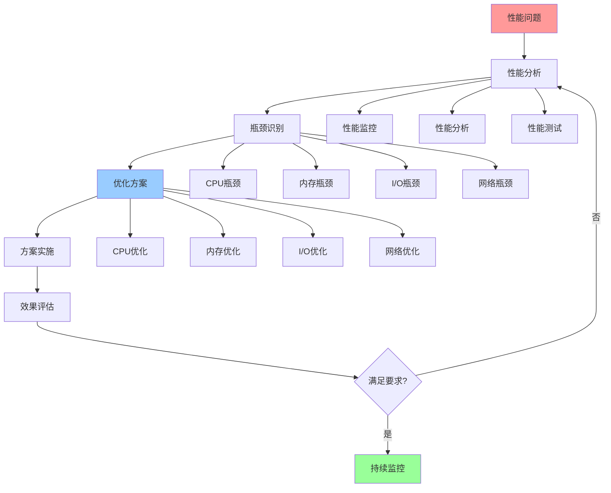

# 性能优化指南

## 📑 目录

- [性能优化指南](#性能优化指南)
  - [📑 目录](#-目录)
  - [1 性能优化全景](#1-性能优化全景)
  - [2 CPU性能优化](#2-cpu性能优化)
  - [3 内存性能优化](#3-内存性能优化)
  - [4 I/O性能优化](#4-io性能优化)

---

## 1 性能优化全景

---

## 2 CPU性能优化

| 优化方法 | 优化目标 | 优化效果 | 适用场景 | 推荐度 |
|---------|---------|---------|---------|--------|
| **CPU频率优化** | 提升频率 | 10-20% | 计算密集型 | ⭐⭐⭐⭐ |
| **CPU核心优化** | 增加核心 | 线性提升 | 并行计算 | ⭐⭐⭐⭐⭐ |
| **CPU缓存优化** | 提升命中率 | 5-15% | 内存密集型 | ⭐⭐⭐⭐ |
| **调度优化** | 优化调度 | 5-10% | 多任务 | ⭐⭐⭐⭐ |
| **NUMA优化** | NUMA感知 | 10-30% | 多插槽系统 | ⭐⭐⭐⭐ |
| **CPU亲和性** | 绑定核心 | 5-15% | 实时系统 | ⭐⭐⭐⭐ |

**推荐度说明**：

- **⭐⭐⭐⭐⭐**：强烈推荐
- **⭐⭐⭐⭐**：推荐
- **⭐⭐⭐**：可选

---

## 3 内存性能优化

| 优化方法 | 优化目标 | 优化效果 | 适用场景 | 推荐度 |
|---------|---------|---------|---------|--------|
| **内存分配优化** | 减少分配 | 10-20% | 高频分配 | ⭐⭐⭐⭐⭐ |
| **内存回收优化** | 优化回收 | 5-15% | 内存压力 | ⭐⭐⭐⭐ |
| **内存压缩** | 压缩内存 | 20-40% | 内存受限 | ⭐⭐⭐⭐ |
| **内存交换优化** | 减少交换 | 10-30% | 内存不足 | ⭐⭐⭐⭐ |
| **内存缓存优化** | 提升命中率 | 5-15% | 缓存敏感 | ⭐⭐⭐⭐ |
| **大页内存** | 使用大页 | 5-10% | 大内存应用 | ⭐⭐⭐⭐ |

**推荐度说明**：

- **⭐⭐⭐⭐⭐**：强烈推荐
- **⭐⭐⭐⭐**：推荐
- **⭐⭐⭐**：可选

---

## 4 I/O性能优化

| 优化方法 | 优化目标 | 优化效果 | 适用场景 | 推荐度 |
|---------|---------|---------|---------|--------|
| **I/O调度优化** | 优化调度 | 10-20% | I/O密集型 | ⭐⭐⭐⭐ |
| **I/O合并** | 合并I/O | 20-40% | 小I/O | ⭐⭐⭐⭐⭐ |
| **异步I/O** | 异步处理 | 30-50% | I/O密集型 | ⭐⭐⭐⭐⭐ |
| **I/O预读** | 预读数据 | 10-30% | 顺序读取 | ⭐⭐⭐⭐ |
| **I/O缓存** | 缓存数据 | 50-90% | 重复读取 | ⭐⭐⭐⭐⭐ |
| **存储优化** | 优化存储 | 10-30% | 存储瓶颈 | ⭐⭐⭐⭐ |

**推荐度说明**：

- **⭐⭐⭐⭐⭐**：强烈推荐
- **⭐⭐⭐⭐**：推荐
- **⭐⭐⭐**：可选

---

## 5 网络性能优化

| 优化方法 | 优化目标 | 优化效果 | 适用场景 | 推荐度 |
|---------|---------|---------|---------|--------|
| **网络协议优化** | 优化协议 | 10-30% | 网络密集型 | ⭐⭐⭐⭐⭐ |
| **网络连接优化** | 优化连接 | 10-20% | 高并发 | ⭐⭐⭐⭐ |
| **网络缓存** | 缓存数据 | 50-90% | 重复请求 | ⭐⭐⭐⭐⭐ |
| **CDN优化** | 使用CDN | 30-70% | 内容分发 | ⭐⭐⭐⭐⭐ |
| **负载均衡** | 均衡负载 | 20-40% | 高负载 | ⭐⭐⭐⭐⭐ |
| **网络压缩** | 压缩数据 | 30-70% | 带宽受限 | ⭐⭐⭐⭐ |

**推荐度说明**：

- **⭐⭐⭐⭐⭐**：强烈推荐
- **⭐⭐⭐⭐**：推荐
- **⭐⭐⭐**：可选

---

## 6 性能优化检查清单

| 检查项 | 检查内容 | 重要性 | 推荐度 |
|--------|---------|--------|--------|
| **性能监控** | 监控指标、监控工具、监控告警 | 极高 | ⭐⭐⭐⭐⭐ |
| **性能分析** | 性能分析、瓶颈识别、根因分析 | 极高 | ⭐⭐⭐⭐⭐ |
| **优化方案** | 方案设计、方案评估、方案选择 | 高 | ⭐⭐⭐⭐⭐ |
| **方案实施** | 实施计划、实施执行、实施验证 | 高 | ⭐⭐⭐⭐⭐ |
| **效果评估** | 效果测量、效果分析、效果报告 | 中 | ⭐⭐⭐⭐ |
| **持续优化** | 持续监控、持续分析、持续优化 | 中 | ⭐⭐⭐⭐ |

**推荐度说明**：

- **⭐⭐⭐⭐⭐**：强烈推荐
- **⭐⭐⭐⭐**：推荐
- **⭐⭐⭐**：可选

---

## 7 使用指南

### 7.1 快速开始

**适用场景**：CPU性能优化、内存性能优化、I/O性能优化、网络性能优化

**使用步骤**：

1. **性能监控**：监控系统性能指标
2. **性能分析**：分析性能瓶颈
3. **优化方案**：设计性能优化方案
4. **方案实施**：实施优化方案并验证效果

**推荐度**：⭐⭐⭐⭐⭐

---

### 7.2 性能优化应用

**适用场景**：实际项目中的性能优化

**使用步骤**：

1. **性能监控**：使用监控工具监控性能指标
2. **性能分析**：分析性能瓶颈和根因
3. **优化方案设计**：设计性能优化方案（CPU、内存、I/O、网络）
4. **方案评估**：评估优化方案的效果和成本
5. **方案实施**：实施优化方案
6. **效果验证**：验证性能优化效果

**推荐度**：⭐⭐⭐⭐⭐

---

## 8 使用技巧

### 8.1 性能分析技巧

**技巧1：瓶颈识别**

- 使用性能监控工具识别瓶颈
- 理解瓶颈的原因和影响
- 建立瓶颈监控机制

**技巧2：优化策略**

- 设计合理的性能优化策略
- 平衡优化效果和成本
- 建立持续优化机制

**推荐度**：⭐⭐⭐⭐⭐

---

## 9 实践案例

### 9.1 CPU性能优化案例

**场景**：优化微服务应用的CPU性能

**优化过程**：

1. **性能监控**：
   - CPU使用率：80%
   - CPU负载：高
   - 响应时间：高

2. **性能分析**：
   - 瓶颈：CPU密集型任务占用过多CPU
   - 根因：代码未优化、未使用并发

3. **优化方案设计**：
   - CPU优化：代码优化、并发优化
   - 资源优化：资源分配优化

4. **方案实施**：
   - 优化代码逻辑
   - 使用并发处理
   - 优化资源分配

5. **效果验证**：
   - CPU使用率：降至50%
   - 响应时间：降低40%
   - 性能显著提升

**效果**：成功优化CPU性能，系统性能显著提升

**推荐度**：⭐⭐⭐⭐⭐

---

## 10 相关文档

- **[计算概念详细思维导图](10-computing-concepts-detailed.md)** - CPU概念详解、内存概念详解、调度概念详解
- **[网络概念详细思维导图](11-network-concepts-detailed.md)** - 网络协议详解、网络拓扑详解、网络性能详解
- **[调度视角详细思维导图](../../03-theoretical-perspectives/visualizations/05-scheduling-perspective-detailed.md)** - 调度视角核心概念、分层分析详解、动态特性详解

---

**最后更新**：2025-11-15
**文档状态**：✅ 完整 | 📊 包含性能优化指南、使用指南、使用技巧、实践案例 | 🎯 生产就绪
**维护者**：项目团队
