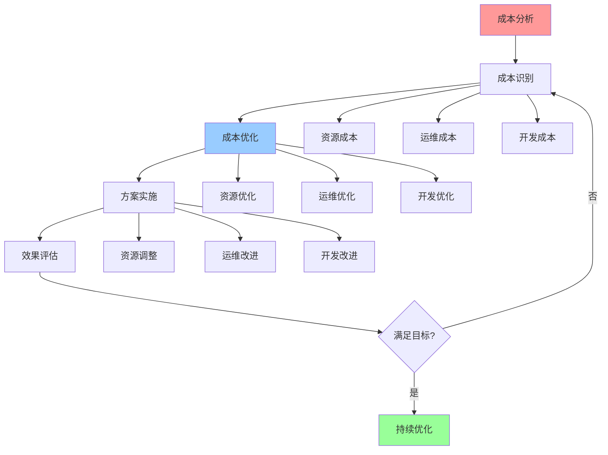

# 成本优化指南

## 📑 目录

- [成本优化指南](#成本优化指南)
  - [📑 目录](#-目录)
  - [1 成本优化全景](#1-成本优化全景)
  - [2 资源成本优化](#2-资源成本优化)
  - [3 运维成本优化](#3-运维成本优化)
  - [4 开发成本优化](#4-开发成本优化)
  - [5 成本优化检查清单](#5-成本优化检查清单)
  - [6 使用指南](#6-使用指南)
    - [6.1 快速开始](#61-快速开始)
    - [6.2 成本优化应用](#62-成本优化应用)
  - [7 使用技巧](#7-使用技巧)
    - [7.1 成本分析技巧](#71-成本分析技巧)
  - [8 实践案例](#8-实践案例)
    - [8.1 资源成本优化案例](#81-资源成本优化案例)
  - [9 相关文档](#9-相关文档)

---

## 1 成本优化全景



---

## 2 资源成本优化

| 优化方法 | 优化目标 | 优化效果 | 适用场景 | 推荐度 |
|---------|---------|---------|---------|--------|
| **资源利用率优化** | 提升利用率 | 20-40% | 资源浪费 | ⭐⭐⭐⭐⭐ |
| **资源池化** | 资源共享 | 30-50% | 多租户 | ⭐⭐⭐⭐⭐ |
| **弹性伸缩** | 按需分配 | 40-60% | 波动负载 | ⭐⭐⭐⭐⭐ |
| **资源预留优化** | 减少预留 | 10-30% | 资源预留过多 | ⭐⭐⭐⭐ |
| **资源迁移** | 迁移到低成本 | 20-40% | 混合云 | ⭐⭐⭐⭐ |
| **资源回收** | 回收闲置资源 | 10-20% | 资源泄漏 | ⭐⭐⭐⭐ |

**推荐度说明**：

- **⭐⭐⭐⭐⭐**：强烈推荐
- **⭐⭐⭐⭐**：推荐
- **⭐⭐⭐**：可选

---

## 3 运维成本优化

| 优化方法 | 优化目标 | 优化效果 | 适用场景 | 推荐度 |
|---------|---------|---------|---------|--------|
| **自动化运维** | 减少人工 | 50-80% | 重复操作 | ⭐⭐⭐⭐⭐ |
| **监控告警优化** | 减少告警 | 30-50% | 告警过多 | ⭐⭐⭐⭐ |
| **日志管理优化** | 优化日志 | 20-40% | 日志过多 | ⭐⭐⭐⭐ |
| **备份优化** | 优化备份 | 20-40% | 备份成本高 | ⭐⭐⭐⭐ |
| **故障处理优化** | 快速恢复 | 30-50% | 故障频繁 | ⭐⭐⭐⭐ |
| **运维工具优化** | 工具整合 | 10-30% | 工具过多 | ⭐⭐⭐ |

**推荐度说明**：

- **⭐⭐⭐⭐⭐**：强烈推荐
- **⭐⭐⭐⭐**：推荐
- **⭐⭐⭐**：可选

---

## 4 开发成本优化

| 优化方法 | 优化目标 | 优化效果 | 适用场景 | 推荐度 |
|---------|---------|---------|---------|--------|
| **代码复用** | 减少重复 | 30-50% | 重复代码 | ⭐⭐⭐⭐⭐ |
| **自动化测试** | 减少测试 | 40-60% | 手动测试 | ⭐⭐⭐⭐⭐ |
| **CI/CD优化** | 自动化部署 | 50-70% | 手动部署 | ⭐⭐⭐⭐⭐ |
| **开发工具优化** | 工具整合 | 20-40% | 工具过多 | ⭐⭐⭐⭐ |
| **代码质量优化** | 减少缺陷 | 30-50% | 缺陷多 | ⭐⭐⭐⭐ |
| **文档自动化** | 自动生成 | 40-60% | 文档维护 | ⭐⭐⭐⭐ |

**推荐度说明**：

- **⭐⭐⭐⭐⭐**：强烈推荐
- **⭐⭐⭐⭐**：推荐
- **⭐⭐⭐**：可选

---

## 5 成本优化检查清单

| 检查项 | 检查内容 | 重要性 | 推荐度 |
|--------|---------|--------|--------|
| **成本分析** | 成本识别、成本分类、成本分析 | 极高 | ⭐⭐⭐⭐⭐ |
| **成本优化** | 优化方案、优化评估、优化选择 | 高 | ⭐⭐⭐⭐⭐ |
| **方案实施** | 实施计划、实施执行、实施验证 | 高 | ⭐⭐⭐⭐⭐ |
| **效果评估** | 效果测量、效果分析、效果报告 | 中 | ⭐⭐⭐⭐ |
| **持续优化** | 持续监控、持续分析、持续优化 | 中 | ⭐⭐⭐⭐ |

**推荐度说明**：

- **⭐⭐⭐⭐⭐**：强烈推荐
- **⭐⭐⭐⭐**：推荐
- **⭐⭐⭐**：可选

---

## 6 使用指南

### 6.1 快速开始

**适用场景**：资源成本优化、运维成本优化、总拥有成本优化

**使用步骤**：

1. **成本分析**：分析系统成本（资源成本、运维成本）
2. **成本优化**：设计成本优化方案
3. **方案实施**：实施优化方案并验证效果

**推荐度**：⭐⭐⭐⭐⭐

---

### 6.2 成本优化应用

**适用场景**：实际项目中的成本优化

**使用步骤**：

1. **成本分析**：识别和分类系统成本
2. **成本优化方案设计**：设计成本优化方案
3. **方案评估**：评估优化方案的效果和风险
4. **方案实施**：实施优化方案
5. **效果验证**：验证成本优化效果

**推荐度**：⭐⭐⭐⭐⭐

---

## 7 使用技巧

### 7.1 成本分析技巧

**技巧1：成本识别**

- 全面识别系统成本
- 理解成本的来源和构成
- 建立成本监控机制

**技巧2：成本优化**

- 设计合理的成本优化策略
- 平衡成本优化和系统性能
- 建立持续优化机制

**推荐度**：⭐⭐⭐⭐⭐

---

## 8 实践案例

### 8.1 资源成本优化案例

**场景**：优化Kubernetes集群的资源成本

**优化过程**：

1. **成本分析**：
   - 资源成本：高（资源利用率低）
   - 运维成本：中等
   - 总拥有成本：高

2. **成本优化方案设计**：
   - 资源优化：提高资源利用率
   - 资源分配优化：优化资源分配策略
   - 资源回收：回收未使用的资源

3. **方案实施**：
   - 优化资源分配策略
   - 实施资源回收机制
   - 优化资源利用率

4. **效果验证**：
   - 资源利用率：从30%提升至70%
   - 资源成本：降低40%
   - 总拥有成本：降低30%

**效果**：成功优化资源成本，总拥有成本显著降低

**推荐度**：⭐⭐⭐⭐⭐

---

## 9 2025 年最新实践

### 9.1 成本优化指南应用最佳实践（2025）

**2025 年趋势**：成本优化指南在资源成本、运维成本、总拥有成本优化中的深度应用

**实践要点**：

- **成本分析**：全面识别和分类系统成本
- **成本优化**：设计合理的成本优化策略
- **成本监控**：建立成本监控机制
- **持续优化**：平衡成本优化和系统性能

**代码示例**：

```python
# 2025 年成本优化指南工具
class CostOptimizationGuideTool:
    def __init__(self):
        self.analyzer = CostAnalyzer()
        self.strategy_designer = CostOptimizationStrategyDesigner()
        self.monitor = CostMonitor()
        self.optimizer = CostOptimizer()

    def analyze_costs(self, resources, period):
        """成本分析"""
        return self.analyzer.analyze(resources, period)

    def design_strategy(self, costs, constraints):
        """成本优化策略设计"""
        return self.strategy_designer.design(costs, constraints)

    def monitor_costs(self, resources):
        """成本监控"""
        return self.monitor.monitor(resources)
```

## 10 实际应用案例

### 案例 1：成本优化指南应用（2025）

**场景**：使用成本优化指南优化Kubernetes集群成本

**实现方案**：

```python
# 成本优化指南应用
tool = CostOptimizationGuideTool()

# 成本分析
resources = Resources(cluster="kubernetes", nodes=100)
costs = tool.analyze_costs(resources, period="monthly")

# 成本优化策略设计
constraints = Constraints(performance="maintain", downtime="minimal")
strategy = tool.design_strategy(costs, constraints)

# 成本监控
monitoring = tool.monitor_costs(resources)

# 方案实施
results = tool.optimizer.optimize(strategy)
```

**效果**：

- 成本分析：全面分析成本，提高分析质量
- 成本优化：设计合理策略，提高优化效果
- 成本监控：实时监控成本，提高监控效率

---

## 11 相关文档

- **[资源模型详细思维导图](04-resource-model-detailed.md)** - 资源模型核心概念、资源类型详解、资源分配详解
- **[性能优化指南](18-performance-optimization-guide.md)** - CPU性能优化、内存性能优化、I/O性能优化、网络性能优化
- **[计算概念详细思维导图](10-computing-concepts-detailed.md)** - CPU概念详解、内存概念详解、调度概念详解

---

**最后更新**：2025-11-15
**文档状态**：✅ 完整 | 📊 包含成本优化指南、使用指南、使用技巧、实践案例 | 🎯 生产就绪
**维护者**：项目团队
