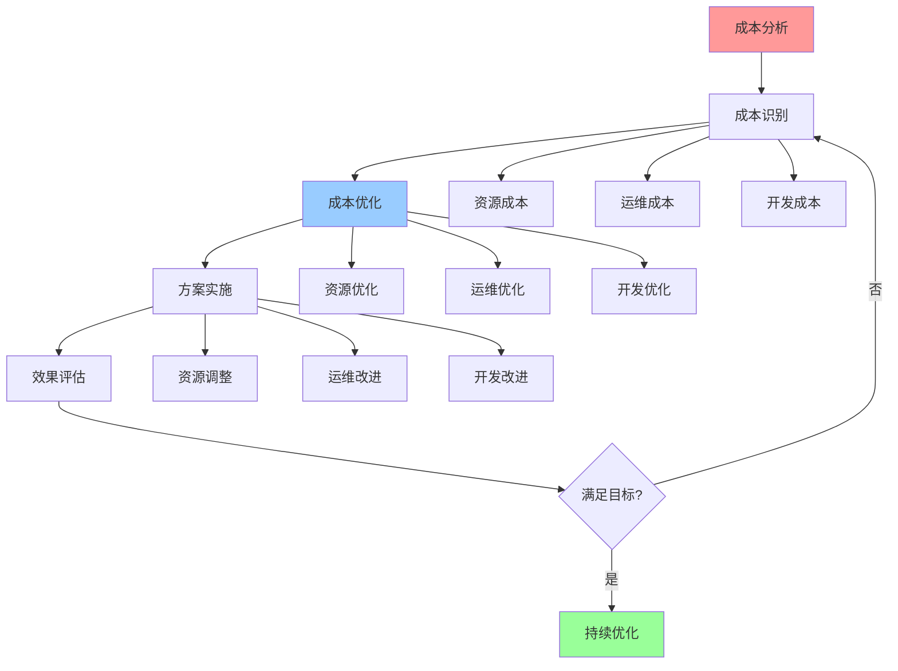

# 成本优化指南

## 📑 目录

- [成本优化指南](#成本优化指南)
  - [📑 目录](#-目录)
  - [1 成本优化全景](#1-成本优化全景)
  - [2 资源成本优化](#2-资源成本优化)
  - [3 运维成本优化](#3-运维成本优化)
  - [4 开发成本优化](#4-开发成本优化)

---

## 1 成本优化全景

---

## 2 资源成本优化

| 优化方法 | 优化目标 | 优化效果 | 适用场景 | 推荐度 |
|---------|---------|---------|---------|--------|
| **资源利用率优化** | 提升利用率 | 20-40% | 资源浪费 | ⭐⭐⭐⭐⭐ |
| **资源池化** | 资源共享 | 30-50% | 多租户 | ⭐⭐⭐⭐⭐ |
| **弹性伸缩** | 按需分配 | 40-60% | 波动负载 | ⭐⭐⭐⭐⭐ |
| **资源预留优化** | 减少预留 | 10-30% | 资源预留过多 | ⭐⭐⭐⭐ |
| **资源迁移** | 迁移到低成本 | 20-40% | 混合云 | ⭐⭐⭐⭐ |
| **资源回收** | 回收闲置资源 | 10-20% | 资源泄漏 | ⭐⭐⭐⭐ |

**推荐度说明**：

- **⭐⭐⭐⭐⭐**：强烈推荐
- **⭐⭐⭐⭐**：推荐
- **⭐⭐⭐**：可选

---

## 3 运维成本优化

| 优化方法 | 优化目标 | 优化效果 | 适用场景 | 推荐度 |
|---------|---------|---------|---------|--------|
| **自动化运维** | 减少人工 | 50-80% | 重复操作 | ⭐⭐⭐⭐⭐ |
| **监控告警优化** | 减少告警 | 30-50% | 告警过多 | ⭐⭐⭐⭐ |
| **日志管理优化** | 优化日志 | 20-40% | 日志过多 | ⭐⭐⭐⭐ |
| **备份优化** | 优化备份 | 20-40% | 备份成本高 | ⭐⭐⭐⭐ |
| **故障处理优化** | 快速恢复 | 30-50% | 故障频繁 | ⭐⭐⭐⭐ |
| **运维工具优化** | 工具整合 | 10-30% | 工具过多 | ⭐⭐⭐ |

**推荐度说明**：

- **⭐⭐⭐⭐⭐**：强烈推荐
- **⭐⭐⭐⭐**：推荐
- **⭐⭐⭐**：可选

---

## 4 开发成本优化

| 优化方法 | 优化目标 | 优化效果 | 适用场景 | 推荐度 |
|---------|---------|---------|---------|--------|
| **代码复用** | 减少重复 | 30-50% | 重复代码 | ⭐⭐⭐⭐⭐ |
| **自动化测试** | 减少测试 | 40-60% | 手动测试 | ⭐⭐⭐⭐⭐ |
| **CI/CD优化** | 自动化部署 | 50-70% | 手动部署 | ⭐⭐⭐⭐⭐ |
| **开发工具优化** | 工具整合 | 20-40% | 工具过多 | ⭐⭐⭐⭐ |
| **代码质量优化** | 减少缺陷 | 30-50% | 缺陷多 | ⭐⭐⭐⭐ |
| **文档自动化** | 自动生成 | 40-60% | 文档维护 | ⭐⭐⭐⭐ |

**推荐度说明**：

- **⭐⭐⭐⭐⭐**：强烈推荐
- **⭐⭐⭐⭐**：推荐
- **⭐⭐⭐**：可选

---

## 5 成本优化检查清单

| 检查项 | 检查内容 | 重要性 | 推荐度 |
|--------|---------|--------|--------|
| **成本分析** | 成本识别、成本分类、成本分析 | 极高 | ⭐⭐⭐⭐⭐ |
| **成本优化** | 优化方案、优化评估、优化选择 | 高 | ⭐⭐⭐⭐⭐ |
| **方案实施** | 实施计划、实施执行、实施验证 | 高 | ⭐⭐⭐⭐⭐ |
| **效果评估** | 效果测量、效果分析、效果报告 | 中 | ⭐⭐⭐⭐ |
| **持续优化** | 持续监控、持续分析、持续优化 | 中 | ⭐⭐⭐⭐ |

**推荐度说明**：

- **⭐⭐⭐⭐⭐**：强烈推荐
- **⭐⭐⭐⭐**：推荐
- **⭐⭐⭐**：可选

---

**最后更新**：2025-11-07
**文档状态**：✅ 完整 | 📊 包含成本优化指南 | 🎯 生产就绪
**维护者**：项目团队
