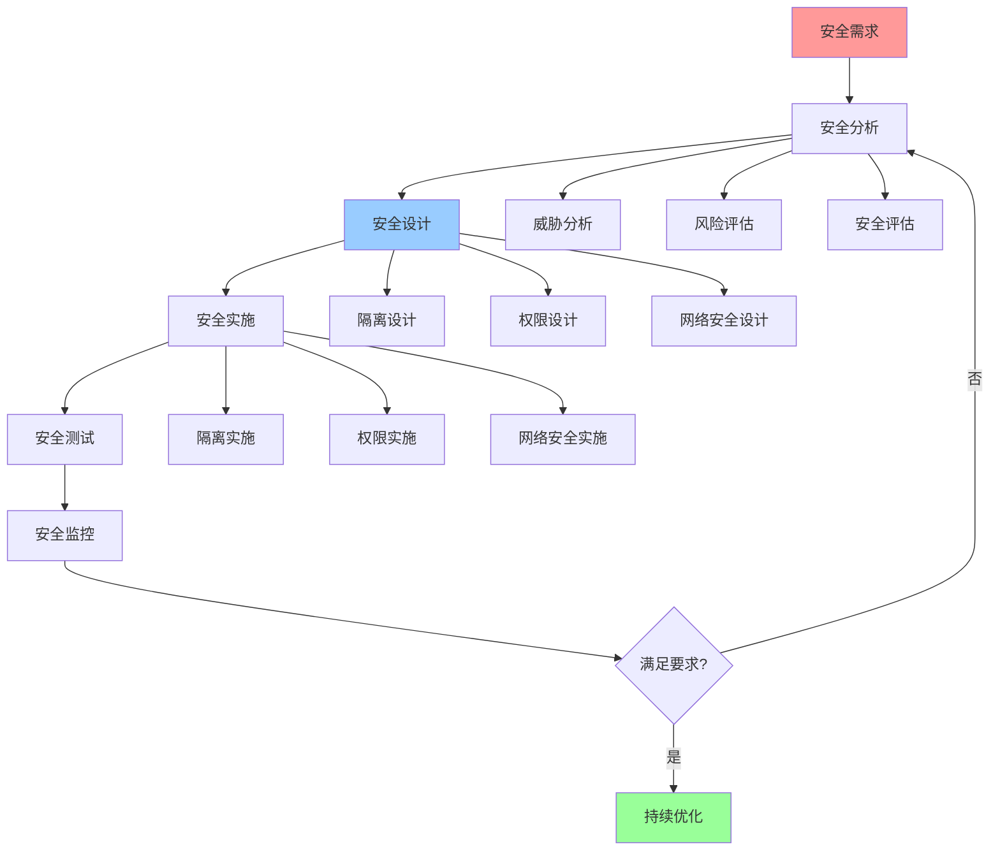

# 安全优化指南

## 📑 目录

- [安全优化指南](#安全优化指南)
  - [📑 目录](#-目录)
  - [1 安全优化全景](#1-安全优化全景)
  - [2 隔离安全优化](#2-隔离安全优化)
  - [3 权限安全优化](#3-权限安全优化)
  - [4 网络安全优化](#4-网络安全优化)

---

## 1 安全优化全景

---

## 2 隔离安全优化

| 优化方法 | 优化目标 | 优化效果 | 适用场景 | 推荐度 |
|---------|---------|---------|---------|--------|
| **隔离强度提升** | 增强隔离 | 高 | 多租户 | ⭐⭐⭐⭐⭐ |
| **隔离层次优化** | 多层隔离 | 高 | 安全敏感 | ⭐⭐⭐⭐⭐ |
| **隔离验证** | 验证隔离 | 高 | 所有场景 | ⭐⭐⭐⭐⭐ |
| **隔离监控** | 监控隔离 | 中 | 生产环境 | ⭐⭐⭐⭐ |
| **隔离优化** | 优化隔离 | 中 | 性能敏感 | ⭐⭐⭐⭐ |
| **隔离恢复** | 快速恢复 | 中 | 故障场景 | ⭐⭐⭐ |

**推荐度说明**：
- **⭐⭐⭐⭐⭐**：强烈推荐
- **⭐⭐⭐⭐**：推荐
- **⭐⭐⭐**：可选

---

## 3 权限安全优化

| 优化方法 | 优化目标 | 优化效果 | 适用场景 | 推荐度 |
|---------|---------|---------|---------|--------|
| **最小权限原则** | 最小权限 | 高 | 所有场景 | ⭐⭐⭐⭐⭐ |
| **权限审计** | 审计权限 | 高 | 安全敏感 | ⭐⭐⭐⭐⭐ |
| **权限分离** | 分离权限 | 高 | 多租户 | ⭐⭐⭐⭐⭐ |
| **权限撤销** | 快速撤销 | 中 | 安全事件 | ⭐⭐⭐⭐ |
| **权限优化** | 优化权限 | 中 | 权限过多 | ⭐⭐⭐⭐ |
| **权限监控** | 监控权限 | 中 | 生产环境 | ⭐⭐⭐⭐ |

**推荐度说明**：
- **⭐⭐⭐⭐⭐**：强烈推荐
- **⭐⭐⭐⭐**：推荐
- **⭐⭐⭐**：可选

---

## 4 网络安全优化

| 优化方法 | 优化目标 | 优化效果 | 适用场景 | 推荐度 |
|---------|---------|---------|---------|--------|
| **网络隔离** | 隔离网络 | 高 | 多租户 | ⭐⭐⭐⭐⭐ |
| **网络加密** | 加密通信 | 高 | 所有场景 | ⭐⭐⭐⭐⭐ |
| **网络监控** | 监控网络 | 高 | 安全敏感 | ⭐⭐⭐⭐⭐ |
| **DDoS防护** | 防护攻击 | 高 | 公网服务 | ⭐⭐⭐⭐⭐ |
| **网络访问控制** | 控制访问 | 高 | 安全敏感 | ⭐⭐⭐⭐⭐ |
| **网络审计** | 审计网络 | 中 | 合规要求 | ⭐⭐⭐⭐ |

**推荐度说明**：
- **⭐⭐⭐⭐⭐**：强烈推荐
- **⭐⭐⭐⭐**：推荐
- **⭐⭐⭐**：可选

---

## 5 安全优化检查清单

| 检查项 | 检查内容 | 重要性 | 推荐度 |
|--------|---------|--------|--------|
| **安全需求** | 安全需求、安全目标、安全要求 | 极高 | ⭐⭐⭐⭐⭐ |
| **安全分析** | 威胁分析、风险评估、安全评估 | 极高 | ⭐⭐⭐⭐⭐ |
| **安全设计** | 隔离设计、权限设计、网络安全设计 | 高 | ⭐⭐⭐⭐⭐ |
| **安全实施** | 隔离实施、权限实施、网络安全实施 | 高 | ⭐⭐⭐⭐⭐ |
| **安全测试** | 安全测试、漏洞扫描、渗透测试 | 高 | ⭐⭐⭐⭐⭐ |
| **安全监控** | 安全监控、威胁检测、安全响应 | 中 | ⭐⭐⭐⭐ |

**推荐度说明**：
- **⭐⭐⭐⭐⭐**：强烈推荐
- **⭐⭐⭐⭐**：推荐
- **⭐⭐⭐**：可选

---

**最后更新**：2025-11-07
**文档状态**：✅ 完整 | 📊 包含安全优化指南 | 🎯 生产就绪
**维护者**：项目团队
