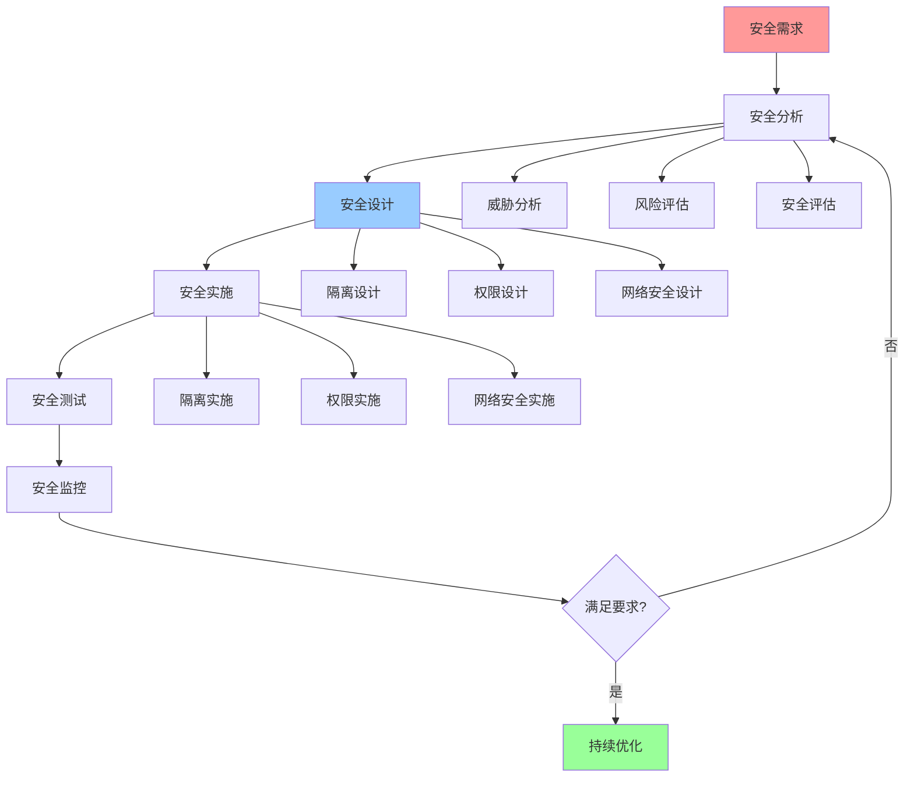

# 安全优化指南

## 📑 目录

- [安全优化指南](#安全优化指南)
  - [📑 目录](#-目录)
  - [1 安全优化全景](#1-安全优化全景)
  - [2 隔离安全优化](#2-隔离安全优化)
  - [3 权限安全优化](#3-权限安全优化)
  - [4 网络安全优化](#4-网络安全优化)

---

## 1 安全优化全景

---

## 2 隔离安全优化

| 优化方法 | 优化目标 | 优化效果 | 适用场景 | 推荐度 |
|---------|---------|---------|---------|--------|
| **隔离强度提升** | 增强隔离 | 高 | 多租户 | ⭐⭐⭐⭐⭐ |
| **隔离层次优化** | 多层隔离 | 高 | 安全敏感 | ⭐⭐⭐⭐⭐ |
| **隔离验证** | 验证隔离 | 高 | 所有场景 | ⭐⭐⭐⭐⭐ |
| **隔离监控** | 监控隔离 | 中 | 生产环境 | ⭐⭐⭐⭐ |
| **隔离优化** | 优化隔离 | 中 | 性能敏感 | ⭐⭐⭐⭐ |
| **隔离恢复** | 快速恢复 | 中 | 故障场景 | ⭐⭐⭐ |

**推荐度说明**：
- **⭐⭐⭐⭐⭐**：强烈推荐
- **⭐⭐⭐⭐**：推荐
- **⭐⭐⭐**：可选

---

## 3 权限安全优化

| 优化方法 | 优化目标 | 优化效果 | 适用场景 | 推荐度 |
|---------|---------|---------|---------|--------|
| **最小权限原则** | 最小权限 | 高 | 所有场景 | ⭐⭐⭐⭐⭐ |
| **权限审计** | 审计权限 | 高 | 安全敏感 | ⭐⭐⭐⭐⭐ |
| **权限分离** | 分离权限 | 高 | 多租户 | ⭐⭐⭐⭐⭐ |
| **权限撤销** | 快速撤销 | 中 | 安全事件 | ⭐⭐⭐⭐ |
| **权限优化** | 优化权限 | 中 | 权限过多 | ⭐⭐⭐⭐ |
| **权限监控** | 监控权限 | 中 | 生产环境 | ⭐⭐⭐⭐ |

**推荐度说明**：
- **⭐⭐⭐⭐⭐**：强烈推荐
- **⭐⭐⭐⭐**：推荐
- **⭐⭐⭐**：可选

---

## 4 网络安全优化

| 优化方法 | 优化目标 | 优化效果 | 适用场景 | 推荐度 |
|---------|---------|---------|---------|--------|
| **网络隔离** | 隔离网络 | 高 | 多租户 | ⭐⭐⭐⭐⭐ |
| **网络加密** | 加密通信 | 高 | 所有场景 | ⭐⭐⭐⭐⭐ |
| **网络监控** | 监控网络 | 高 | 安全敏感 | ⭐⭐⭐⭐⭐ |
| **DDoS防护** | 防护攻击 | 高 | 公网服务 | ⭐⭐⭐⭐⭐ |
| **网络访问控制** | 控制访问 | 高 | 安全敏感 | ⭐⭐⭐⭐⭐ |
| **网络审计** | 审计网络 | 中 | 合规要求 | ⭐⭐⭐⭐ |

**推荐度说明**：
- **⭐⭐⭐⭐⭐**：强烈推荐
- **⭐⭐⭐⭐**：推荐
- **⭐⭐⭐**：可选

---

## 5 安全优化检查清单

| 检查项 | 检查内容 | 重要性 | 推荐度 |
|--------|---------|--------|--------|
| **安全需求** | 安全需求、安全目标、安全要求 | 极高 | ⭐⭐⭐⭐⭐ |
| **安全分析** | 威胁分析、风险评估、安全评估 | 极高 | ⭐⭐⭐⭐⭐ |
| **安全设计** | 隔离设计、权限设计、网络安全设计 | 高 | ⭐⭐⭐⭐⭐ |
| **安全实施** | 隔离实施、权限实施、网络安全实施 | 高 | ⭐⭐⭐⭐⭐ |
| **安全测试** | 安全测试、漏洞扫描、渗透测试 | 高 | ⭐⭐⭐⭐⭐ |
| **安全监控** | 安全监控、威胁检测、安全响应 | 中 | ⭐⭐⭐⭐ |

**推荐度说明**：
- **⭐⭐⭐⭐⭐**：强烈推荐
- **⭐⭐⭐⭐**：推荐
- **⭐⭐⭐**：可选

---

## 6 使用指南

### 6.1 快速开始

**适用场景**：隔离设计、权限设计、网络安全设计

**使用步骤**：

1. **安全需求**：分析安全需求和安全目标
2. **安全设计**：设计安全架构和安全机制
3. **安全实施**：实施安全方案并验证效果

**推荐度**：⭐⭐⭐⭐⭐

---

### 6.2 安全优化应用

**适用场景**：实际项目中的安全优化

**使用步骤**：

1. **安全需求分析**：分析安全需求、安全目标、安全要求
2. **安全分析**：进行威胁分析、风险评估、安全评估
3. **安全设计**：设计隔离方案、权限方案、网络安全方案
4. **安全实施**：实施安全方案
5. **安全测试**：进行安全测试、漏洞扫描、渗透测试
6. **安全监控**：建立安全监控、威胁检测、安全响应机制

**推荐度**：⭐⭐⭐⭐⭐

---

## 7 使用技巧

### 7.1 安全设计技巧

**技巧1：多层防护**

- 设计多层安全防护机制
- 理解不同安全机制的作用
- 建立纵深防御体系

**技巧2：最小权限**

- 实施最小权限原则
- 限制不必要的权限
- 建立权限管理机制

**推荐度**：⭐⭐⭐⭐⭐

---

## 8 实践案例

### 8.1 多租户安全优化案例

**场景**：为SaaS平台设计多租户安全方案

**优化过程**：

1. **安全需求分析**：
   - 安全需求：多租户隔离、数据安全
   - 安全目标：高安全性、合规性
   - 安全要求：强隔离、权限控制

2. **安全分析**：
   - 威胁分析：数据泄露、权限提升
   - 风险评估：高风险
   - 安全评估：需要强隔离

3. **安全设计**：
   - 隔离设计：使用KVM进行多租户隔离
   - 权限设计：使用LSM+Seccomp进行权限控制
   - 网络安全设计：网络隔离、流量控制

4. **安全实施**：
   - 实施KVM隔离
   - 实施LSM+Seccomp权限控制
   - 实施网络隔离

5. **安全测试**：
   - 安全测试：通过
   - 漏洞扫描：无高危漏洞
   - 渗透测试：通过

6. **安全监控**：
   - 建立安全监控体系
   - 实施威胁检测
   - 建立安全响应机制

**效果**：成功设计多租户安全方案，安全性显著提升

**推荐度**：⭐⭐⭐⭐⭐

---

## 9 相关文档

- **[安全模型详细思维导图](06-security-model-detailed.md)** - 安全模型核心概念、安全机制详解、安全策略详解
- **[隔离模型详细思维导图](05-isolation-model-detailed.md)** - 隔离模型核心概念、隔离层次详解、隔离机制详解
- **[最佳实践指南](14-best-practices-guide.md)** - 技术选型最佳实践、架构设计最佳实践、安全设计最佳实践

---

**最后更新**：2025-11-15
**文档状态**：✅ 完整 | 📊 包含安全优化指南、使用指南、使用技巧、实践案例 | 🎯 生产就绪
**维护者**：项目团队
