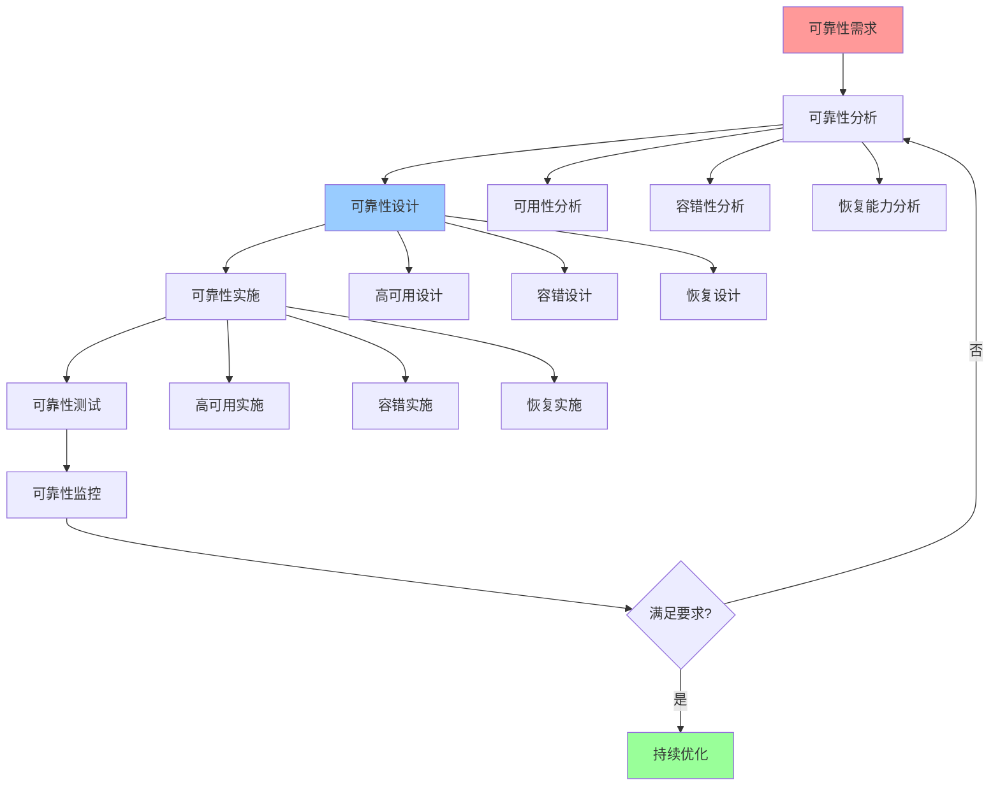

# 可靠性优化指南

## 📑 目录

- [可靠性优化指南](#可靠性优化指南)
  - [📑 目录](#-目录)
  - [1 可靠性优化全景](#1-可靠性优化全景)
  - [2 可用性优化](#2-可用性优化)
  - [3 容错性优化](#3-容错性优化)
  - [4 恢复能力优化](#4-恢复能力优化)

---

## 1 可靠性优化全景

---

## 2 可用性优化

| 优化方法 | 优化目标 | 优化效果 | 适用场景 | 推荐度 |
|---------|---------|---------|---------|--------|
| **高可用设计** | 提升可用性 | 高 | 关键系统 | ⭐⭐⭐⭐⭐ |
| **故障转移** | 快速转移 | 高 | 单点故障 | ⭐⭐⭐⭐⭐ |
| **负载均衡** | 均衡负载 | 高 | 高负载 | ⭐⭐⭐⭐⭐ |
| **健康检查** | 快速检测 | 高 | 所有场景 | ⭐⭐⭐⭐⭐ |
| **服务降级** | 降级服务 | 中 | 高负载 | ⭐⭐⭐⭐ |
| **限流熔断** | 保护系统 | 中 | 高并发 | ⭐⭐⭐⭐ |

**推荐度说明**：
- **⭐⭐⭐⭐⭐**：强烈推荐
- **⭐⭐⭐⭐**：推荐
- **⭐⭐⭐**：可选

---

## 3 容错性优化

| 优化方法 | 优化目标 | 优化效果 | 适用场景 | 推荐度 |
|---------|---------|---------|---------|--------|
| **错误处理** | 处理错误 | 高 | 所有场景 | ⭐⭐⭐⭐⭐ |
| **重试机制** | 自动重试 | 高 | 临时故障 | ⭐⭐⭐⭐⭐ |
| **超时控制** | 控制超时 | 高 | 网络调用 | ⭐⭐⭐⭐⭐ |
| **降级策略** | 服务降级 | 中 | 高负载 | ⭐⭐⭐⭐ |
| **熔断机制** | 快速熔断 | 中 | 服务故障 | ⭐⭐⭐⭐ |
| **隔离故障** | 隔离故障 | 高 | 分布式系统 | ⭐⭐⭐⭐⭐ |

**推荐度说明**：
- **⭐⭐⭐⭐⭐**：强烈推荐
- **⭐⭐⭐⭐**：推荐
- **⭐⭐⭐**：可选

---

## 4 恢复能力优化

| 优化方法 | 优化目标 | 优化效果 | 适用场景 | 推荐度 |
|---------|---------|---------|---------|--------|
| **快速恢复** | 快速恢复 | 高 | 故障场景 | ⭐⭐⭐⭐⭐ |
| **数据备份** | 备份数据 | 高 | 数据重要 | ⭐⭐⭐⭐⭐ |
| **数据恢复** | 恢复数据 | 高 | 数据丢失 | ⭐⭐⭐⭐⭐ |
| **状态恢复** | 恢复状态 | 高 | 状态重要 | ⭐⭐⭐⭐⭐ |
| **服务恢复** | 恢复服务 | 高 | 服务中断 | ⭐⭐⭐⭐⭐ |
| **灾难恢复** | 灾难恢复 | 高 | 灾难场景 | ⭐⭐⭐⭐⭐ |

**推荐度说明**：
- **⭐⭐⭐⭐⭐**：强烈推荐
- **⭐⭐⭐⭐**：推荐
- **⭐⭐⭐**：可选

---

## 5 可靠性优化检查清单

| 检查项 | 检查内容 | 重要性 | 推荐度 |
|--------|---------|--------|--------|
| **可靠性需求** | 可用性需求、容错性需求、恢复需求 | 极高 | ⭐⭐⭐⭐⭐ |
| **可靠性分析** | 可用性分析、容错性分析、恢复能力分析 | 极高 | ⭐⭐⭐⭐⭐ |
| **可靠性设计** | 高可用设计、容错设计、恢复设计 | 高 | ⭐⭐⭐⭐⭐ |
| **可靠性实施** | 高可用实施、容错实施、恢复实施 | 高 | ⭐⭐⭐⭐⭐ |
| **可靠性测试** | 可用性测试、容错测试、恢复测试 | 高 | ⭐⭐⭐⭐⭐ |
| **可靠性监控** | 可用性监控、故障监控、恢复监控 | 中 | ⭐⭐⭐⭐ |

**推荐度说明**：
- **⭐⭐⭐⭐⭐**：强烈推荐
- **⭐⭐⭐⭐**：推荐
- **⭐⭐⭐**：可选

---

**最后更新**：2025-11-07
**文档状态**：✅ 完整 | 📊 包含可靠性优化指南 | 🎯 生产就绪
**维护者**：项目团队
