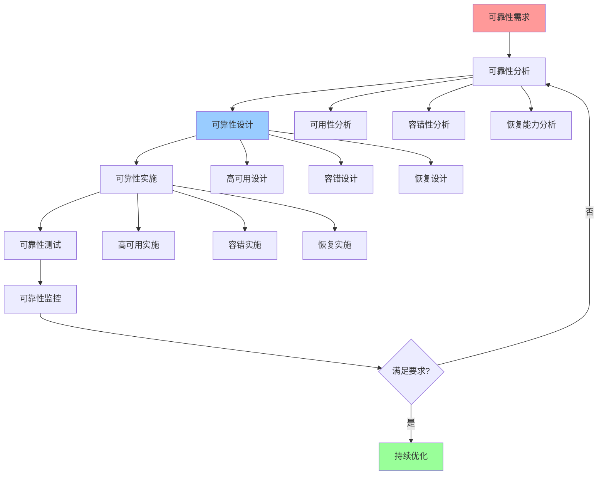

# 可靠性优化指南

## 📑 目录

- [可靠性优化指南](#可靠性优化指南)
  - [📑 目录](#-目录)
  - [1 可靠性优化全景](#1-可靠性优化全景)
  - [2 可用性优化](#2-可用性优化)
  - [3 容错性优化](#3-容错性优化)
  - [4 恢复能力优化](#4-恢复能力优化)
  - [5 可靠性优化检查清单](#5-可靠性优化检查清单)
  - [6 使用指南](#6-使用指南)
    - [6.1 快速开始](#61-快速开始)
    - [6.2 可靠性优化应用](#62-可靠性优化应用)
  - [7 使用技巧](#7-使用技巧)
    - [7.1 可靠性设计技巧](#71-可靠性设计技巧)
  - [8 实践案例](#8-实践案例)
    - [8.1 高可用性优化案例](#81-高可用性优化案例)
  - [9 相关文档](#9-相关文档)

---

## 1 可靠性优化全景



---

## 2 可用性优化

| 优化方法 | 优化目标 | 优化效果 | 适用场景 | 推荐度 |
|---------|---------|---------|---------|--------|
| **高可用设计** | 提升可用性 | 高 | 关键系统 | ⭐⭐⭐⭐⭐ |
| **故障转移** | 快速转移 | 高 | 单点故障 | ⭐⭐⭐⭐⭐ |
| **负载均衡** | 均衡负载 | 高 | 高负载 | ⭐⭐⭐⭐⭐ |
| **健康检查** | 快速检测 | 高 | 所有场景 | ⭐⭐⭐⭐⭐ |
| **服务降级** | 降级服务 | 中 | 高负载 | ⭐⭐⭐⭐ |
| **限流熔断** | 保护系统 | 中 | 高并发 | ⭐⭐⭐⭐ |

**推荐度说明**：

- **⭐⭐⭐⭐⭐**：强烈推荐
- **⭐⭐⭐⭐**：推荐
- **⭐⭐⭐**：可选

---

## 3 容错性优化

| 优化方法 | 优化目标 | 优化效果 | 适用场景 | 推荐度 |
|---------|---------|---------|---------|--------|
| **错误处理** | 处理错误 | 高 | 所有场景 | ⭐⭐⭐⭐⭐ |
| **重试机制** | 自动重试 | 高 | 临时故障 | ⭐⭐⭐⭐⭐ |
| **超时控制** | 控制超时 | 高 | 网络调用 | ⭐⭐⭐⭐⭐ |
| **降级策略** | 服务降级 | 中 | 高负载 | ⭐⭐⭐⭐ |
| **熔断机制** | 快速熔断 | 中 | 服务故障 | ⭐⭐⭐⭐ |
| **隔离故障** | 隔离故障 | 高 | 分布式系统 | ⭐⭐⭐⭐⭐ |

**推荐度说明**：

- **⭐⭐⭐⭐⭐**：强烈推荐
- **⭐⭐⭐⭐**：推荐
- **⭐⭐⭐**：可选

---

## 4 恢复能力优化

| 优化方法 | 优化目标 | 优化效果 | 适用场景 | 推荐度 |
|---------|---------|---------|---------|--------|
| **快速恢复** | 快速恢复 | 高 | 故障场景 | ⭐⭐⭐⭐⭐ |
| **数据备份** | 备份数据 | 高 | 数据重要 | ⭐⭐⭐⭐⭐ |
| **数据恢复** | 恢复数据 | 高 | 数据丢失 | ⭐⭐⭐⭐⭐ |
| **状态恢复** | 恢复状态 | 高 | 状态重要 | ⭐⭐⭐⭐⭐ |
| **服务恢复** | 恢复服务 | 高 | 服务中断 | ⭐⭐⭐⭐⭐ |
| **灾难恢复** | 灾难恢复 | 高 | 灾难场景 | ⭐⭐⭐⭐⭐ |

**推荐度说明**：

- **⭐⭐⭐⭐⭐**：强烈推荐
- **⭐⭐⭐⭐**：推荐
- **⭐⭐⭐**：可选

---

## 5 可靠性优化检查清单

| 检查项 | 检查内容 | 重要性 | 推荐度 |
|--------|---------|--------|--------|
| **可靠性需求** | 可用性需求、容错性需求、恢复需求 | 极高 | ⭐⭐⭐⭐⭐ |
| **可靠性分析** | 可用性分析、容错性分析、恢复能力分析 | 极高 | ⭐⭐⭐⭐⭐ |
| **可靠性设计** | 高可用设计、容错设计、恢复设计 | 高 | ⭐⭐⭐⭐⭐ |
| **可靠性实施** | 高可用实施、容错实施、恢复实施 | 高 | ⭐⭐⭐⭐⭐ |
| **可靠性测试** | 可用性测试、容错测试、恢复测试 | 高 | ⭐⭐⭐⭐⭐ |
| **可靠性监控** | 可用性监控、故障监控、恢复监控 | 中 | ⭐⭐⭐⭐ |

**推荐度说明**：

- **⭐⭐⭐⭐⭐**：强烈推荐
- **⭐⭐⭐⭐**：推荐
- **⭐⭐⭐**：可选

---

## 6 使用指南

### 6.1 快速开始

**适用场景**：可用性优化、容错性优化、恢复能力优化

**使用步骤**：

1. **可靠性需求**：分析可靠性需求（可用性、容错性、恢复能力）
2. **可靠性设计**：设计可靠性方案
3. **可靠性实施**：实施可靠性方案并验证效果

**推荐度**：⭐⭐⭐⭐⭐

---

### 6.2 可靠性优化应用

**适用场景**：实际项目中的可靠性优化

**使用步骤**：

1. **可靠性需求分析**：分析可用性需求、容错性需求、恢复需求
2. **可靠性分析**：进行可用性分析、容错性分析、恢复能力分析
3. **可靠性设计**：设计高可用方案、容错方案、恢复方案
4. **可靠性实施**：实施可靠性方案
5. **可靠性测试**：进行可用性测试、容错测试、恢复测试
6. **可靠性监控**：建立可用性监控、故障监控、恢复监控

**推荐度**：⭐⭐⭐⭐⭐

---

## 7 使用技巧

### 7.1 可靠性设计技巧

**技巧1：多层防护**

- 设计多层可靠性防护机制
- 理解不同可靠性机制的作用
- 建立纵深防御体系

**技巧2：快速恢复**

- 设计快速恢复机制
- 减少故障恢复时间
- 建立恢复监控机制

**推荐度**：⭐⭐⭐⭐⭐

---

## 8 实践案例

### 8.1 高可用性优化案例

**场景**：为电商平台设计高可用方案

**优化过程**：

1. **可靠性需求分析**：
   - 可用性需求：99.9%可用性
   - 容错性需求：自动故障转移
   - 恢复需求：快速恢复

2. **可靠性分析**：
   - 可用性分析：需要高可用设计
   - 容错性分析：需要故障转移
   - 恢复能力分析：需要快速恢复

3. **可靠性设计**：
   - 高可用设计：主从复制、负载均衡
   - 容错设计：故障转移、健康检查
   - 恢复设计：快速恢复、数据备份

4. **可靠性实施**：
   - 实施主从复制
   - 实施负载均衡
   - 实施故障转移机制

5. **可靠性测试**：
   - 可用性测试：达到99.9%可用性
   - 容错测试：故障转移成功
   - 恢复测试：快速恢复成功

6. **可靠性监控**：
   - 建立可用性监控
   - 建立故障监控
   - 建立恢复监控

**效果**：成功设计高可用方案，可用性达到99.9%

**推荐度**：⭐⭐⭐⭐⭐

---

## 9 2025 年最新实践

### 9.1 可靠性优化指南应用最佳实践（2025）

**2025 年趋势**：可靠性优化指南在高可用性、容错性、恢复能力优化中的深度应用

**实践要点**：

- **多层防护**：设计多层可靠性防护机制
- **快速恢复**：设计快速恢复机制
- **故障预防**：建立故障预防和监控机制
- **持续改进**：基于实践效果持续优化

**代码示例**：

```python
# 2025 年可靠性优化指南工具
class ReliabilityOptimizationGuideTool:
    def __init__(self):
        self.analyzer = ReliabilityAnalyzer()
        self.designer = ReliabilityDesigner()
        self.monitor = ReliabilityMonitor()
        self.optimizer = ReliabilityOptimizer()

    def analyze_reliability(self, system, requirements):
        """可靠性分析"""
        return self.analyzer.analyze(system, requirements)

    def design_reliability(self, requirements, constraints):
        """可靠性设计"""
        return self.designer.design(requirements, constraints)

    def monitor_reliability(self, system):
        """可靠性监控"""
        return self.monitor.monitor(system)
```

## 10 实际应用案例

### 案例 1：可靠性优化指南应用（2025）

**场景**：使用可靠性优化指南设计电商平台高可用方案

**实现方案**：

```python
# 可靠性优化指南应用
tool = ReliabilityOptimizationGuideTool()

# 可靠性分析
system = System(type="ecommerce", scale="large")
requirements = Requirements(availability="99.9%", fault_tolerance="auto")
analysis = tool.analyze_reliability(system, requirements)

# 可靠性设计
constraints = Constraints(budget="limited", downtime="minimal")
design = tool.design_reliability(requirements, constraints)

# 可靠性监控
monitoring = tool.monitor_reliability(system)
```

**效果**：

- 可靠性分析：全面分析可靠性需求，提高分析质量
- 可靠性设计：设计多层防护，提高可靠性水平
- 可靠性监控：实时监控可靠性，提高响应速度

---

## 11 相关文档

- **[分布式模型详细思维导图](07-distributed-model-detailed.md)** - 分布式模型核心概念、CAP理论详解、一致性模型详解
- **[性能优化指南](18-performance-optimization-guide.md)** - CPU性能优化、内存性能优化、I/O性能优化、网络性能优化
- **[监控运维指南](22-monitoring-operations-guide.md)** - 监控设计、告警管理、运维自动化

---

**最后更新**：2025-11-15
**文档状态**：✅ 完整 | 📊 包含可靠性优化指南、使用指南、使用技巧、实践案例 | 🎯 生产就绪
**维护者**：项目团队
