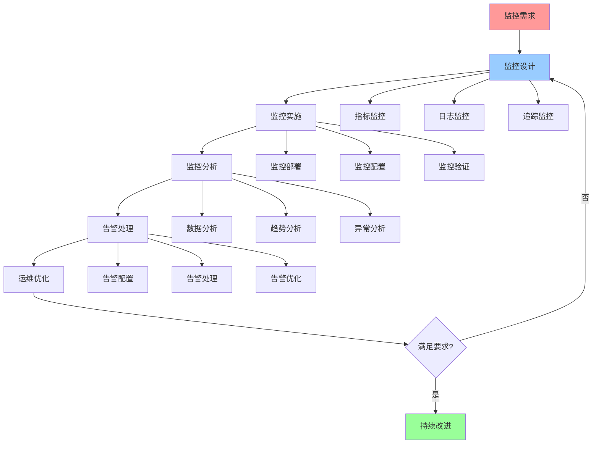

# 监控运维指南

## 📑 目录

- [监控运维指南](#监控运维指南)
  - [📑 目录](#-目录)
  - [1 监控运维全景](#1-监控运维全景)
  - [2 监控设计](#2-监控设计)
  - [3 告警管理](#3-告警管理)
  - [4 运维自动化](#4-运维自动化)
  - [5 监控运维检查清单](#5-监控运维检查清单)
  - [6 使用指南](#6-使用指南)
    - [6.1 快速开始](#61-快速开始)
    - [6.2 监控运维应用](#62-监控运维应用)
  - [7 使用技巧](#7-使用技巧)
    - [7.1 监控设计技巧](#71-监控设计技巧)
  - [8 实践案例](#8-实践案例)
    - [8.1 微服务监控运维案例](#81-微服务监控运维案例)
  - [9 2025 年最新实践](#9-2025-年最新实践)
    - [9.1 监控运维指南应用最佳实践（2025）](#91-监控运维指南应用最佳实践2025)
  - [10 实际应用案例](#10-实际应用案例)
    - [案例 1：监控运维指南应用（2025）](#案例-1监控运维指南应用2025)
  - [11 相关文档](#11-相关文档)

---

## 1 监控运维全景



---

## 2 监控设计

| 监控类型 | 监控内容 | 监控工具 | 认知模型 | 推荐度 |
|---------|---------|---------|---------|--------|
| **指标监控** | CPU、内存、I/O、网络 | Prometheus+Grafana | eBPF/OTLP视角 | ⭐⭐⭐⭐⭐ |
| **日志监控** | 应用日志、系统日志、审计日志 | ELK/Loki | eBPF/OTLP视角 | ⭐⭐⭐⭐⭐ |
| **追踪监控** | 分布式追踪、性能追踪 | Jaeger/Zipkin | eBPF/OTLP视角 | ⭐⭐⭐⭐ |
| **安全监控** | 安全事件、威胁检测 | 安全监控系统 | 安全模型 | ⭐⭐⭐⭐⭐ |
| **业务监控** | 业务指标、业务告警 | 业务监控系统 | 架构决策框架 | ⭐⭐⭐⭐ |
| **成本监控** | 资源成本、运维成本 | 成本监控系统 | 资源模型 | ⭐⭐⭐⭐ |

**推荐度说明**：

- **⭐⭐⭐⭐⭐**：强烈推荐
- **⭐⭐⭐⭐**：推荐
- **⭐⭐⭐**：可选

---

## 3 告警管理

| 告警类型 | 告警内容 | 告警策略 | 处理流程 | 推荐度 |
|---------|---------|---------|---------|--------|
| **性能告警** | CPU、内存、I/O、网络告警 | 阈值告警、趋势告警 | 性能分析→性能优化 | ⭐⭐⭐⭐⭐ |
| **错误告警** | 应用错误、系统错误 | 错误率告警、错误趋势告警 | 错误分析→错误修复 | ⭐⭐⭐⭐⭐ |
| **安全告警** | 安全事件、威胁检测 | 安全事件告警、威胁告警 | 安全分析→安全响应 | ⭐⭐⭐⭐⭐ |
| **可用性告警** | 服务不可用、服务降级 | 可用性告警、降级告警 | 可用性分析→服务恢复 | ⭐⭐⭐⭐⭐ |
| **资源告警** | 资源不足、资源泄漏 | 资源告警、资源趋势告警 | 资源分析→资源优化 | ⭐⭐⭐⭐ |
| **成本告警** | 成本超支、成本异常 | 成本告警、成本趋势告警 | 成本分析→成本优化 | ⭐⭐⭐⭐ |

**推荐度说明**：

- **⭐⭐⭐⭐⭐**：强烈推荐
- **⭐⭐⭐⭐**：推荐
- **⭐⭐⭐**：可选

---

## 4 运维自动化

| 自动化类型 | 自动化内容 | 自动化工具 | 认知模型 | 推荐度 |
|---------|-----------|-----------|---------|--------|
| **部署自动化** | 自动部署、自动回滚 | CI/CD工具 | 架构决策框架 | ⭐⭐⭐⭐⭐ |
| **配置自动化** | 自动配置、配置管理 | 配置管理工具 | 资源模型 | ⭐⭐⭐⭐⭐ |
| **监控自动化** | 自动监控、自动告警 | 监控工具 | eBPF/OTLP视角 | ⭐⭐⭐⭐⭐ |
| **故障自动化** | 自动故障检测、自动恢复 | 故障处理工具 | 问题解决方案矩阵 | ⭐⭐⭐⭐ |
| **扩容自动化** | 自动扩容、自动缩容 | 弹性伸缩工具 | 资源模型 | ⭐⭐⭐⭐⭐ |
| **备份自动化** | 自动备份、自动恢复 | 备份工具 | 可靠性优化指南 | ⭐⭐⭐⭐ |

**推荐度说明**：

- **⭐⭐⭐⭐⭐**：强烈推荐
- **⭐⭐⭐⭐**：推荐
- **⭐⭐⭐**：可选

---

## 5 监控运维检查清单

| 检查项 | 检查内容 | 重要性 | 推荐度 |
|--------|---------|--------|--------|
| **监控设计** | 监控需求、监控设计、监控工具 | 极高 | ⭐⭐⭐⭐⭐ |
| **监控实施** | 监控部署、监控配置、监控验证 | 高 | ⭐⭐⭐⭐⭐ |
| **告警管理** | 告警配置、告警处理、告警优化 | 高 | ⭐⭐⭐⭐⭐ |
| **运维自动化** | 自动化设计、自动化实施、自动化验证 | 中 | ⭐⭐⭐⭐ |
| **监控分析** | 数据分析、趋势分析、异常分析 | 中 | ⭐⭐⭐⭐ |
| **持续改进** | 监控优化、告警优化、运维优化 | 中 | ⭐⭐⭐⭐ |

**推荐度说明**：

- **⭐⭐⭐⭐⭐**：强烈推荐
- **⭐⭐⭐⭐**：推荐
- **⭐⭐⭐**：可选

---

## 6 使用指南

### 6.1 快速开始

**适用场景**：监控设计、告警管理、运维自动化

**使用步骤**：

1. **监控需求**：分析监控需求
2. **监控设计**：设计监控方案
3. **监控实施**：实施监控方案并验证效果

**推荐度**：⭐⭐⭐⭐⭐

---

### 6.2 监控运维应用

**适用场景**：实际项目中的监控运维

**使用步骤**：

1. **监控需求分析**：分析监控需求（指标、日志、追踪）
2. **监控设计**：设计监控方案（指标监控、日志监控、追踪监控）
3. **监控实施**：部署监控系统、配置监控、验证监控
4. **告警管理**：配置告警、处理告警、优化告警
5. **运维自动化**：设计自动化方案、实施自动化、验证自动化

**推荐度**：⭐⭐⭐⭐⭐

---

## 7 使用技巧

### 7.1 监控设计技巧

**技巧1：全面监控**

- 设计全面的监控体系（指标、日志、追踪）
- 理解不同监控类型的作用
- 建立监控知识库

**技巧2：告警优化**

- 设计合理的告警策略
- 避免告警风暴
- 建立告警处理机制

**推荐度**：⭐⭐⭐⭐⭐

---

## 8 实践案例

### 8.1 微服务监控运维案例

**场景**：为微服务架构设计监控运维方案

**实施过程**：

1. **监控需求分析**：
   - 指标监控：CPU、内存、I/O、网络
   - 日志监控：应用日志、系统日志
   - 追踪监控：分布式追踪

2. **监控设计**：
   - 指标监控：Prometheus+Grafana
   - 日志监控：ELK Stack
   - 追踪监控：Jaeger

3. **监控实施**：
   - 部署Prometheus+Grafana
   - 部署ELK Stack
   - 部署Jaeger

4. **告警管理**：
   - 配置性能告警
   - 配置错误告警
   - 配置可用性告警

5. **运维自动化**：
   - 实施部署自动化
   - 实施监控自动化
   - 实施扩容自动化

**效果**：成功设计监控运维方案，系统可观测性显著提升

**推荐度**：⭐⭐⭐⭐⭐

---

## 9 2025 年最新实践

### 9.1 监控运维指南应用最佳实践（2025）

**2025 年趋势**：监控运维指南在监控设计、告警管理、运维自动化中的深度应用

**实践要点**：

- **全面监控**：设计全面的监控体系（指标、日志、追踪）
- **告警优化**：设计合理的告警策略，避免告警风暴
- **运维自动化**：建立运维自动化机制
- **持续改进**：基于实践效果持续优化

**代码示例**：

```python
# 2025 年监控运维指南工具
class MonitoringOperationsGuideTool:
    def __init__(self):
        self.designer = MonitoringDesigner()
        self.alert_manager = AlertManager()
        self.automator = OperationsAutomator()
        self.optimizer = MonitoringOptimizer()

    def design_monitoring(self, requirements, system):
        """监控设计"""
        return self.designer.design(requirements, system)

    def manage_alerts(self, alerts, policies):
        """告警管理"""
        return self.alert_manager.manage(alerts, policies)

    def automate_operations(self, operations, workflows):
        """运维自动化"""
        return self.automator.automate(operations, workflows)
```

## 10 实际应用案例

### 案例 1：监控运维指南应用（2025）

**场景**：使用监控运维指南设计微服务架构监控运维方案

**实现方案**：

```python
# 监控运维指南应用
tool = MonitoringOperationsGuideTool()

# 监控设计
requirements = Requirements(metrics=True, logs=True, traces=True)
system = System(type="microservices", scale="large")
monitoring = tool.design_monitoring(requirements, system)

# 告警管理
alerts = Alerts(performance=True, errors=True, availability=True)
policies = AlertPolicies(thresholds=[...], escalation=[...])
alert_management = tool.manage_alerts(alerts, policies)

# 运维自动化
operations = Operations(deployment=True, scaling=True, recovery=True)
workflows = Workflows([...])
automation = tool.automate_operations(operations, workflows)
```

**效果**：

- 监控设计：全面监控体系，提高可观测性
- 告警管理：合理告警策略，提高响应效率
- 运维自动化：自动化运维，提高运维效率

---

## 11 相关文档

- **[eBPF/OTLP视角详细思维导图](../../04-application-perspectives/visualizations/03-ebpf-otlp-detailed-mindmap.md)** - eBPF技术详解、OTLP技术详解、可观测性体系
- **[性能优化指南](18-performance-optimization-guide.md)** - CPU性能优化、内存性能优化、I/O性能优化、网络性能优化
- **[可靠性优化指南](21-reliability-optimization-guide.md)** - 可用性优化、容错性优化、恢复能力优化

---

**最后更新**：2025-11-15
**文档状态**：✅ 完整 | 📊 包含监控运维指南、使用指南、使用技巧、实践案例 | 🎯 生产就绪
**维护者**：项目团队
