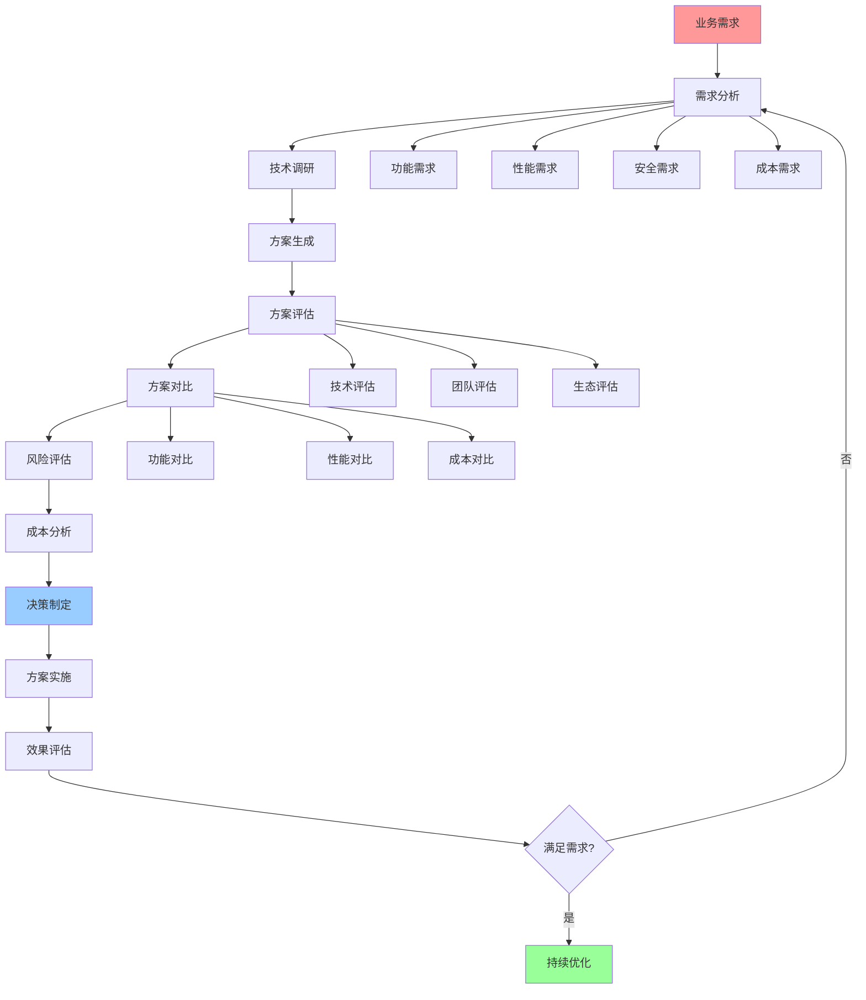
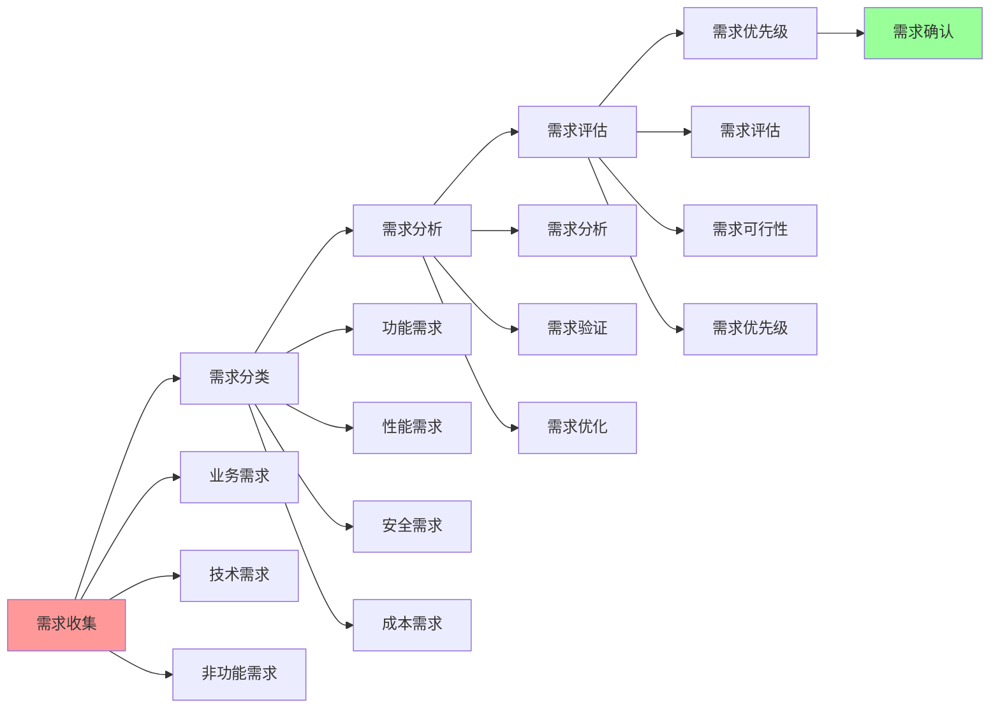
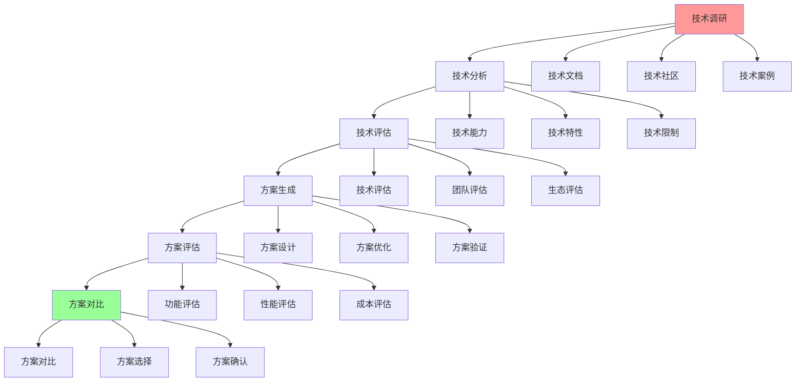
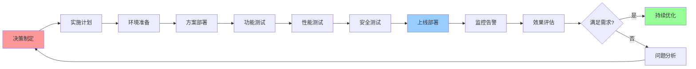

# 技术选型完整工作流

## 📑 目录

- [技术选型完整工作流](#技术选型完整工作流)
  - [📑 目录](#-目录)
  - [1 技术选型全景流程](#1-技术选型全景流程)
  - [2 需求分析流程](#2-需求分析流程)
  - [3 技术评估流程](#3-技术评估流程)
  - [4 决策实施流程](#4-决策实施流程)

---

## 1 技术选型全景流程

---

## 2 需求分析流程

---

## 3 技术评估流程

---

## 4 决策实施流程

---

## 5 技术选型检查清单

| 检查项 | 检查内容 | 重要性 | 推荐度 |
|--------|---------|--------|--------|
| **需求分析** | 需求完整、需求可行、需求优先级 | 极高 | ⭐⭐⭐⭐⭐ |
| **技术调研** | 技术文档、技术社区、技术案例 | 高 | ⭐⭐⭐⭐⭐ |
| **技术评估** | 技术能力、团队能力、生态支持 | 高 | ⭐⭐⭐⭐⭐ |
| **方案对比** | 功能对比、性能对比、成本对比 | 高 | ⭐⭐⭐⭐⭐ |
| **风险评估** | 技术风险、业务风险、运维风险 | 高 | ⭐⭐⭐⭐⭐ |
| **成本分析** | 开发成本、运维成本、总拥有成本 | 中 | ⭐⭐⭐⭐ |
| **决策制定** | 决策记录、决策理由、决策流程 | 高 | ⭐⭐⭐⭐⭐ |
| **方案实施** | 实施计划、实施执行、实施验证 | 高 | ⭐⭐⭐⭐⭐ |
| **效果评估** | 效果测量、效果分析、效果报告 | 中 | ⭐⭐⭐⭐ |

**推荐度说明**：
- **⭐⭐⭐⭐⭐**：强烈推荐
- **⭐⭐⭐⭐**：推荐
- **⭐⭐⭐**：可选

---

## 6 使用指南

### 6.1 快速开始

**适用场景**：技术选型、技术评估、决策实施

**使用步骤**：

1. **需求分析**：按照需求分析流程进行需求分析
2. **技术评估**：按照技术评估流程进行技术评估
3. **决策实施**：按照决策实施流程进行决策实施

**推荐度**：⭐⭐⭐⭐⭐

---

### 6.2 技术选型工作流应用

**适用场景**：实际项目中的技术选型

**使用步骤**：

1. **业务需求分析**：分析业务需求（功能、性能、安全、成本）
2. **需求分析**：按照需求分析流程分析需求
3. **技术调研**：调研相关技术（文档、社区、案例）
4. **方案生成**：生成技术方案
5. **方案评估**：评估技术方案（技术、团队、生态）
6. **方案对比**：对比不同方案（功能、性能、成本）
7. **风险评估**：评估技术风险、业务风险、运维风险
8. **成本分析**：分析开发成本、运维成本、总拥有成本
9. **决策制定**：制定技术选型决策
10. **方案实施**：按照决策实施流程实施方案
11. **效果评估**：评估方案实施效果

**推荐度**：⭐⭐⭐⭐⭐

---

## 7 使用技巧

### 7.1 工作流执行技巧

**技巧1：检查点利用**

- 充分利用检查点验证阶段成果
- 确保每个阶段的质量
- 及时调整工作流

**技巧2：迭代优化**

- 根据效果评估结果优化工作流
- 积累工作流使用经验
- 形成工作流使用模式

**推荐度**：⭐⭐⭐⭐⭐

---

## 8 实践案例

### 8.1 容器运行时选型工作流案例

**场景**：使用技术选型工作流选择容器运行时

**工作流过程**：

1. **业务需求分析**：
   - 功能需求：稳定可靠、Kubernetes集成
   - 性能需求：高性能、低延迟
   - 安全需求：中等安全性

2. **需求分析**：
   - 需求完整：是
   - 需求可行：是
   - 需求优先级：高

3. **技术调研**：
   - 技术文档：containerd、CRI-O、Docker
   - 技术社区：活跃
   - 技术案例：丰富

4. **方案生成**：
   - 方案1：containerd
   - 方案2：CRI-O
   - 方案3：Docker

5. **方案评估**：
   - 技术评估：containerd技术成熟
   - 团队评估：团队熟悉containerd
   - 生态评估：containerd生态完善

6. **方案对比**：
   - 功能对比：containerd功能完整
   - 性能对比：containerd性能优秀
   - 成本对比：containerd成本合理

7. **决策制定**：
   - 选择containerd
   - 理由：功能完整、性能优秀、生态完善

8. **方案实施**：
   - 按照决策实施流程实施
   - 通过所有检查点

9. **效果评估**：
   - 系统稳定可靠
   - 性能满足需求
   - 效果显著

**效果**：成功使用技术选型工作流选择容器运行时，决策科学合理

**推荐度**：⭐⭐⭐⭐⭐

---

## 9 相关文档

- **[技术选型详细指南](15-technology-selection-guide.md)** - 容器运行时选型指南、隔离技术选型指南、编排平台选型指南
- **[技术选型决策树](03-technology-selection-decision-tree.md)** - 容器运行时、隔离技术、编排平台、服务网格选型决策树
- **[综合决策工作流图](13-comprehensive-decision-workflow.md)** - 决策工作流全景、需求分析工作流、技术选型工作流

---

**最后更新**：2025-11-15
**文档状态**：✅ 完整 | 📊 包含技术选型完整工作流、使用指南、使用技巧、实践案例 | 🎯 生产就绪
**维护者**：项目团队
