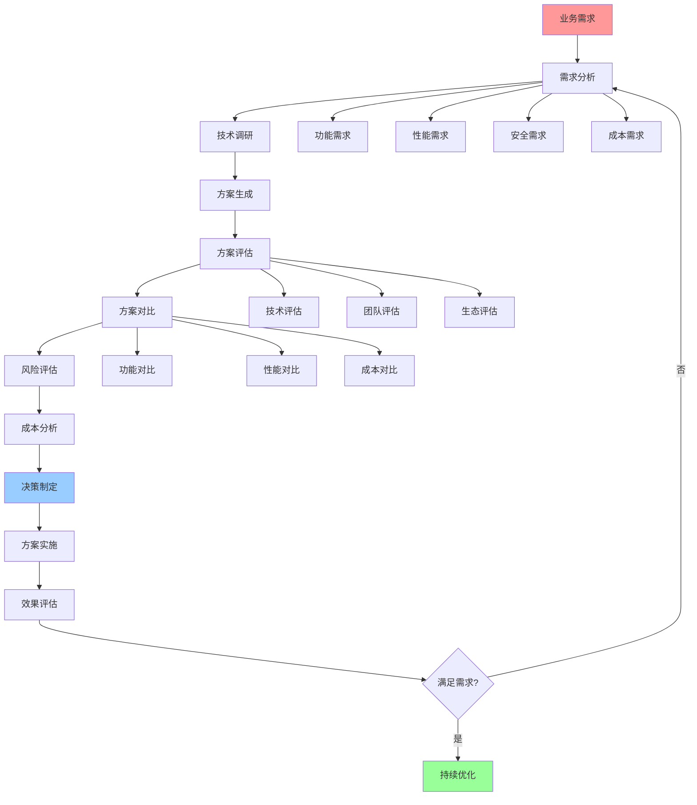
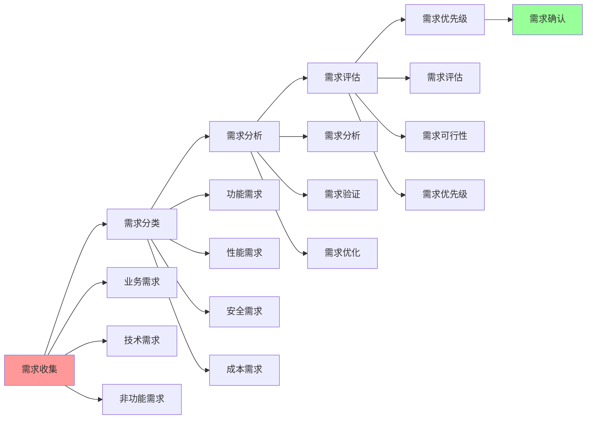
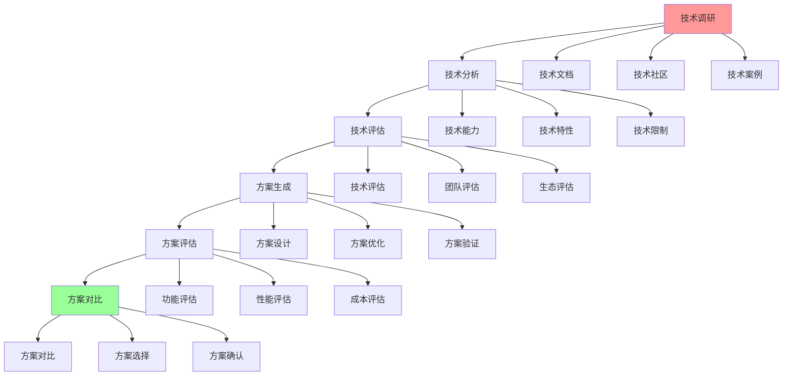
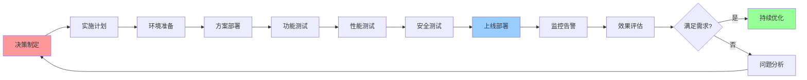

# 技术选型完整工作流

## 📑 目录

- [技术选型完整工作流](#技术选型完整工作流)
  - [📑 目录](#-目录)
  - [1 技术选型全景流程](#1-技术选型全景流程)
  - [2 需求分析流程](#2-需求分析流程)
  - [3 技术评估流程](#3-技术评估流程)
  - [4 决策实施流程](#4-决策实施流程)

---

## 1 技术选型全景流程

---

## 2 需求分析流程

---

## 3 技术评估流程

---

## 4 决策实施流程

---

## 5 技术选型检查清单

| 检查项 | 检查内容 | 重要性 | 推荐度 |
|--------|---------|--------|--------|
| **需求分析** | 需求完整、需求可行、需求优先级 | 极高 | ⭐⭐⭐⭐⭐ |
| **技术调研** | 技术文档、技术社区、技术案例 | 高 | ⭐⭐⭐⭐⭐ |
| **技术评估** | 技术能力、团队能力、生态支持 | 高 | ⭐⭐⭐⭐⭐ |
| **方案对比** | 功能对比、性能对比、成本对比 | 高 | ⭐⭐⭐⭐⭐ |
| **风险评估** | 技术风险、业务风险、运维风险 | 高 | ⭐⭐⭐⭐⭐ |
| **成本分析** | 开发成本、运维成本、总拥有成本 | 中 | ⭐⭐⭐⭐ |
| **决策制定** | 决策记录、决策理由、决策流程 | 高 | ⭐⭐⭐⭐⭐ |
| **方案实施** | 实施计划、实施执行、实施验证 | 高 | ⭐⭐⭐⭐⭐ |
| **效果评估** | 效果测量、效果分析、效果报告 | 中 | ⭐⭐⭐⭐ |

**推荐度说明**：
- **⭐⭐⭐⭐⭐**：强烈推荐
- **⭐⭐⭐⭐**：推荐
- **⭐⭐⭐**：可选

---

**最后更新**：2025-11-07
**文档状态**：✅ 完整 | 📊 包含技术选型完整工作流 | 🎯 生产就绪
**维护者**：项目团队
