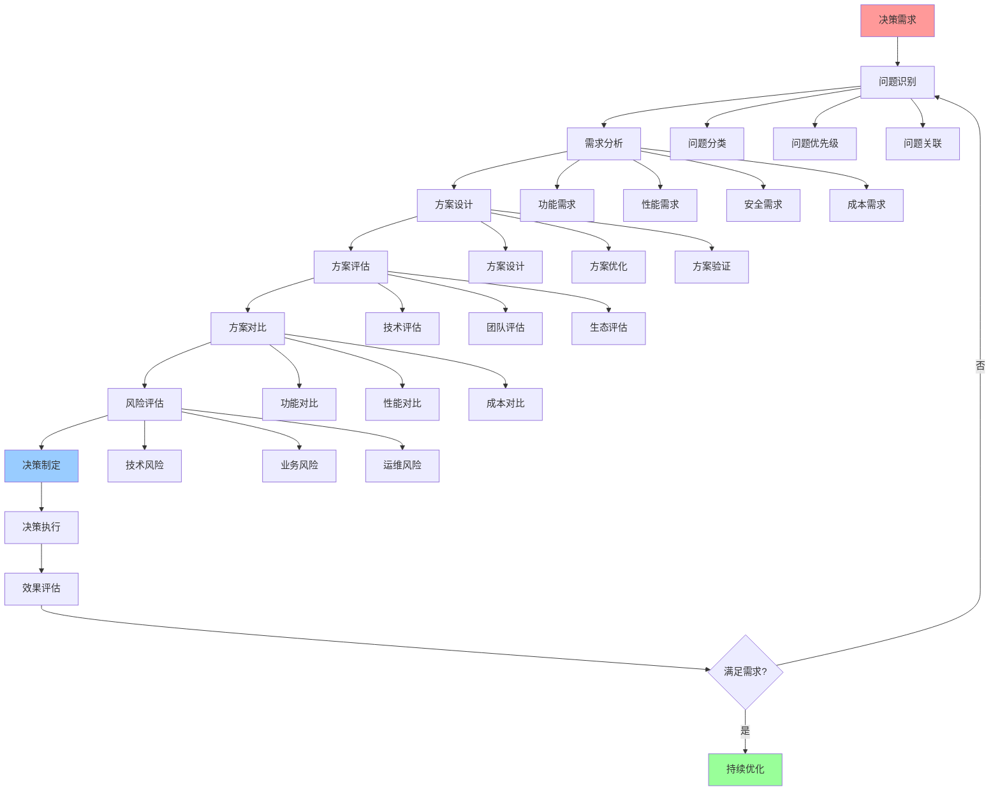
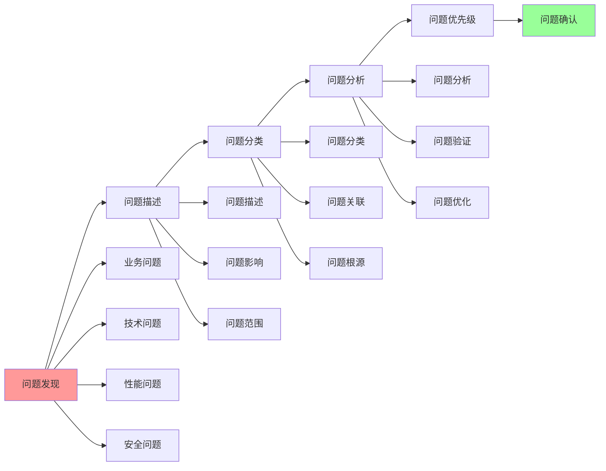
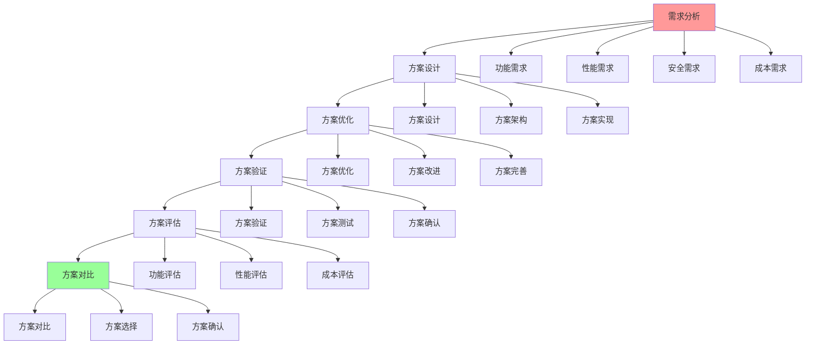
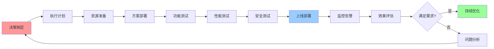

# 决策制定完整流程

## 📑 目录

- [决策制定完整流程](#决策制定完整流程)
  - [📑 目录](#-目录)
  - [1 决策制定全景流程](#1-决策制定全景流程)
  - [2 问题识别流程](#2-问题识别流程)
  - [3 方案设计流程](#3-方案设计流程)
  - [4 决策执行流程](#4-决策执行流程)

---

## 1 决策制定全景流程

---

## 2 问题识别流程

---

## 3 方案设计流程

---

## 4 决策执行流程

---

## 5 决策制定检查清单

| 检查项 | 检查内容 | 重要性 | 推荐度 |
|--------|---------|--------|--------|
| **问题识别** | 问题完整、问题分类、问题优先级 | 极高 | ⭐⭐⭐⭐⭐ |
| **需求分析** | 需求完整、需求可行、需求优先级 | 极高 | ⭐⭐⭐⭐⭐ |
| **方案设计** | 方案完整、方案可行、方案优化 | 高 | ⭐⭐⭐⭐⭐ |
| **方案评估** | 技术评估、团队评估、生态评估 | 高 | ⭐⭐⭐⭐⭐ |
| **方案对比** | 功能对比、性能对比、成本对比 | 高 | ⭐⭐⭐⭐⭐ |
| **风险评估** | 技术风险、业务风险、运维风险 | 高 | ⭐⭐⭐⭐⭐ |
| **决策制定** | 决策记录、决策理由、决策流程 | 高 | ⭐⭐⭐⭐⭐ |
| **决策执行** | 执行计划、执行执行、执行验证 | 高 | ⭐⭐⭐⭐⭐ |
| **效果评估** | 效果测量、效果分析、效果报告 | 中 | ⭐⭐⭐⭐ |

**推荐度说明**：

- **⭐⭐⭐⭐⭐**：强烈推荐
- **⭐⭐⭐⭐**：推荐
- **⭐⭐⭐**：可选

---

## 6 使用指南

### 6.1 快速开始

**适用场景**：决策制定、问题解决、方案设计

**使用步骤**：

1. **问题识别**：识别需要决策的问题
2. **需求分析**：分析决策需求
3. **方案设计**：设计决策方案
4. **决策制定**：制定决策并执行

**推荐度**：⭐⭐⭐⭐⭐

---

### 6.2 决策制定流程应用

**适用场景**：实际项目中的决策制定

**使用步骤**：

1. **问题识别**：识别问题、分类问题、确定问题优先级
2. **需求分析**：分析需求、验证需求、确定需求优先级
3. **方案设计**：设计方案、优化方案、验证方案
4. **方案评估**：评估技术、团队、生态
5. **方案对比**：对比功能、性能、成本
6. **风险评估**：评估技术风险、业务风险、运维风险
7. **决策制定**：记录决策、说明理由、确认流程
8. **决策执行**：制定执行计划、执行决策、验证执行效果
9. **效果评估**：测量效果、分析效果、报告效果

**推荐度**：⭐⭐⭐⭐⭐

---

## 7 使用技巧

### 7.1 决策制定技巧

**技巧1：问题识别**

- 准确识别问题的本质和范围
- 理解问题的优先级
- 避免问题识别错误

**技巧2：方案评估**

- 全面评估方案的各个方面
- 理解评估的准确性
- 建立评估机制

**推荐度**：⭐⭐⭐⭐⭐

---

## 8 实践案例

### 8.1 架构决策制定案例

**场景**：为微服务架构制定架构决策

**决策过程**：

1. **问题识别**：
   - 问题：需要选择微服务架构模式
   - 问题分类：架构决策
   - 问题优先级：高

2. **需求分析**：
   - 功能需求：高扩展、高可用
   - 性能需求：低延迟、高吞吐
   - 安全需求：中等安全性

3. **方案设计**：
   - 方案1：微服务架构+服务网格
   - 方案2：微服务架构+API网关
   - 方案3：微服务架构+直接调用

4. **方案评估**：
   - 技术评估：方案1技术成熟
   - 团队评估：团队具备能力
   - 生态评估：生态完善

5. **方案对比**：
   - 功能对比：方案1功能完整
   - 性能对比：方案1性能优秀
   - 成本对比：方案1成本合理

6. **风险评估**：
   - 技术风险：低
   - 业务风险：低
   - 运维风险：中等

7. **决策制定**：
   - 选择方案1：微服务架构+服务网格
   - 理由：功能完整、性能优秀、生态完善

8. **决策执行**：
   - 制定实施计划
   - 执行决策
   - 验证执行效果

9. **效果评估**：
   - 系统满足需求
   - 性能优秀
   - 效果显著

**效果**：成功制定架构决策，系统满足所有需求

**推荐度**：⭐⭐⭐⭐⭐

---

## 9 相关文档

- **[决策框架对比矩阵](01-decision-framework-matrix.md)** - 决策框架功能、决策场景适用、决策方法
- **[架构决策完整流程](../../02-architecture-design/visualizations/08-architecture-decision-process.md)** - 架构决策全景流程、需求分析流程、架构设计流程
- **[综合决策工作流图](13-comprehensive-decision-workflow.md)** - 决策工作流全景、需求分析工作流、技术选型工作流

---

**最后更新**：2025-11-15
**文档状态**：✅ 完整 | 📊 包含决策制定完整流程、使用指南、使用技巧、实践案例 | 🎯 生产就绪
**维护者**：项目团队
