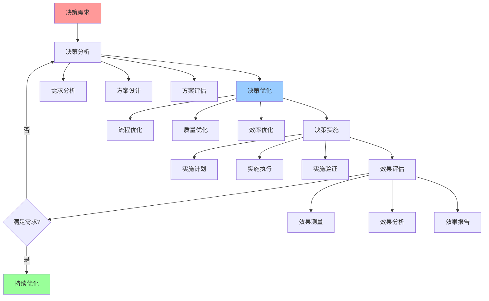

# 决策优化综合指南

## 📑 目录

- [决策优化综合指南](#决策优化综合指南)
  - [📑 目录](#-目录)
  - [1 决策优化全景](#1-决策优化全景)
  - [2 决策流程优化](#2-决策流程优化)
  - [3 决策质量优化](#3-决策质量优化)
  - [4 决策效率优化](#4-决策效率优化)
  - [5 决策优化检查清单](#5-决策优化检查清单)
  - [6 使用指南](#6-使用指南)
    - [6.1 快速开始](#61-快速开始)
    - [6.2 决策优化应用](#62-决策优化应用)
  - [7 使用技巧](#7-使用技巧)
    - [7.1 优化设计技巧](#71-优化设计技巧)
  - [8 实践案例](#8-实践案例)
    - [8.1 决策流程优化案例](#81-决策流程优化案例)
  - [9 相关文档](#9-相关文档)

---

## 1 决策优化全景



---

## 2 决策流程优化

| 优化维度 | 优化内容 | 优化方法 | 预期效果 | 推荐度 |
|---------|---------|---------|---------|--------|
| **流程简化** | 流程精简、流程优化 | 流程分析、流程重构 | 流程效率提升 | ⭐⭐⭐⭐⭐ |
| **流程标准化** | 流程标准化、流程规范化 | 流程设计、流程文档 | 流程质量提升 | ⭐⭐⭐⭐⭐ |
| **流程自动化** | 流程自动化、流程工具化 | 工具开发、工具集成 | 流程效率提升 | ⭐⭐⭐⭐ |
| **流程监控** | 流程监控、流程分析 | 监控设计、监控实施 | 流程质量提升 | ⭐⭐⭐⭐ |
| **流程持续改进** | 流程改进、流程优化 | 问题识别、改进实施 | 流程持续优化 | ⭐⭐⭐⭐ |

**推荐度说明**：

- **⭐⭐⭐⭐⭐**：强烈推荐
- **⭐⭐⭐⭐**：推荐
- **⭐⭐⭐**：可选

---

## 3 决策质量优化

| 优化维度 | 优化内容 | 优化方法 | 预期效果 | 推荐度 |
|---------|---------|---------|---------|--------|
| **需求分析质量** | 需求完整性、需求准确性 | 需求分析、需求验证 | 需求质量提升 | ⭐⭐⭐⭐⭐ |
| **方案设计质量** | 方案完整性、方案可行性 | 方案设计、方案验证 | 方案质量提升 | ⭐⭐⭐⭐⭐ |
| **评估质量** | 评估准确性、评估全面性 | 评估方法、评估验证 | 评估质量提升 | ⭐⭐⭐⭐⭐ |
| **决策质量** | 决策准确性、决策有效性 | 决策方法、决策验证 | 决策质量提升 | ⭐⭐⭐⭐⭐ |
| **实施质量** | 实施准确性、实施有效性 | 实施计划、实施验证 | 实施质量提升 | ⭐⭐⭐⭐ |

**推荐度说明**：

- **⭐⭐⭐⭐⭐**：强烈推荐
- **⭐⭐⭐⭐**：推荐
- **⭐⭐⭐**：可选

---

## 4 决策效率优化

| 优化维度 | 优化内容 | 优化方法 | 预期效果 | 推荐度 |
|---------|---------|---------|---------|--------|
| **决策速度** | 决策时间、决策周期 | 流程优化、工具优化 | 决策速度提升 | ⭐⭐⭐⭐⭐ |
| **决策成本** | 决策成本、决策资源 | 成本优化、资源优化 | 决策成本降低 | ⭐⭐⭐⭐ |
| **决策准确性** | 决策准确率、决策有效性 | 方法优化、工具优化 | 决策准确性提升 | ⭐⭐⭐⭐⭐ |
| **决策可重复性** | 决策可重复、决策标准化 | 流程标准化、工具标准化 | 决策可重复性提升 | ⭐⭐⭐⭐ |
| **决策可追溯性** | 决策记录、决策追溯 | 记录设计、追溯设计 | 决策可追溯性提升 | ⭐⭐⭐⭐ |

**推荐度说明**：

- **⭐⭐⭐⭐⭐**：强烈推荐
- **⭐⭐⭐⭐**：推荐
- **⭐⭐⭐**：可选

---

## 5 决策优化检查清单

| 检查项 | 检查内容 | 重要性 | 推荐度 |
|--------|---------|--------|--------|
| **流程优化** | 流程简化、流程标准化、流程自动化 | 极高 | ⭐⭐⭐⭐⭐ |
| **质量优化** | 需求分析质量、方案设计质量、评估质量 | 高 | ⭐⭐⭐⭐⭐ |
| **效率优化** | 决策速度、决策成本、决策准确性 | 高 | ⭐⭐⭐⭐⭐ |
| **持续改进** | 问题识别、改进实施、效果评估 | 中 | ⭐⭐⭐⭐ |

**推荐度说明**：

- **⭐⭐⭐⭐⭐**：强烈推荐
- **⭐⭐⭐⭐**：推荐
- **⭐⭐⭐**：可选

---

## 6 使用指南

### 6.1 快速开始

**适用场景**：决策流程优化、决策质量优化、决策效率优化

**使用步骤**：

1. **决策分析**：分析当前决策流程、质量、效率
2. **决策优化**：设计优化方案（流程、质量、效率）
3. **优化实施**：实施优化方案并验证效果

**推荐度**：⭐⭐⭐⭐⭐

---

### 6.2 决策优化应用

**适用场景**：实际项目中的决策优化

**使用步骤**：

1. **决策分析**：分析决策流程、决策质量、决策效率
2. **流程优化**：简化流程、标准化流程、自动化流程
3. **质量优化**：提升需求分析质量、方案设计质量、评估质量
4. **效率优化**：提升决策速度、降低决策成本、提升决策准确性
5. **持续改进**：识别问题、实施改进、评估效果

**推荐度**：⭐⭐⭐⭐⭐

---

## 7 使用技巧

### 7.1 优化设计技巧

**技巧1：问题识别**

- 准确识别决策流程、质量、效率的问题
- 理解问题的根本原因
- 建立问题识别机制

**技巧2：优化策略**

- 设计合理的优化策略
- 平衡优化效果和成本
- 建立持续优化机制

**推荐度**：⭐⭐⭐⭐⭐

---

## 8 实践案例

### 8.1 决策流程优化案例

**场景**：优化技术选型决策流程

**优化过程**：

1. **决策分析**：
   - 流程问题：流程复杂、耗时过长
   - 质量问题：决策质量不稳定
   - 效率问题：决策效率低

2. **流程优化**：
   - 流程简化：简化不必要的步骤
   - 流程标准化：标准化决策流程
   - 流程自动化：自动化部分流程

3. **质量优化**：
   - 提升需求分析质量：建立需求分析模板
   - 提升方案设计质量：建立方案设计模板
   - 提升评估质量：建立评估标准

4. **效率优化**：
   - 提升决策速度：优化流程，减少耗时
   - 降低决策成本：自动化流程，减少人力成本
   - 提升决策准确性：标准化流程，提升质量

5. **持续改进**：
   - 识别问题：持续识别优化机会
   - 实施改进：持续实施改进
   - 评估效果：持续评估优化效果

**效果**：成功优化决策流程，决策速度提升50%，决策质量提升显著

**推荐度**：⭐⭐⭐⭐⭐

---

## 9 2025 年最新实践

### 9.1 决策优化综合指南应用最佳实践（2025）

**2025 年趋势**：决策优化综合指南在决策流程优化、决策质量优化、决策效率优化中的深度应用

**实践要点**：

- **问题识别**：准确识别决策流程、质量、效率的问题
- **优化策略**：设计合理的优化策略
- **持续改进**：建立持续优化机制
- **效果评估**：持续评估优化效果

**代码示例**：

```python
# 2025 年决策优化综合指南工具
class DecisionOptimizationGuideTool:
    def __init__(self):
        self.analyzer = DecisionAnalyzer()
        self.optimizer = DecisionOptimizer()
        self.evaluator = OptimizationEvaluator()
        self.improver = ContinuousImprover()

    def analyze_decision(self, decision, metrics):
        """决策分析"""
        return self.analyzer.analyze(decision, metrics)

    def optimize_decision(self, decision, constraints):
        """决策优化"""
        return self.optimizer.optimize(decision, constraints)

    def evaluate_optimization(self, optimization, results):
        """优化评估"""
        return self.evaluator.evaluate(optimization, results)
```

## 10 实际应用案例

### 案例 1：决策优化综合指南应用（2025）

**场景**：使用决策优化综合指南优化技术选型决策流程

**实现方案**：

```python
# 决策优化综合指南应用
tool = DecisionOptimizationGuideTool()

# 决策分析
decision = Decision(type="technology_selection", process="complex")
metrics = Metrics(efficiency="low", quality="unstable", cost="high")
analysis = tool.analyze_decision(decision, metrics)

# 决策优化
constraints = Constraints(budget="limited", timeline="tight")
optimization = tool.optimize_decision(decision, constraints)

# 优化评估
results = Results(efficiency="improved", quality="stable", cost="reduced")
evaluation = tool.evaluate_optimization(optimization, results)
```

**效果**：

- 决策分析：系统化分析决策问题，提高分析质量
- 决策优化：设计合理优化策略，提高优化效果
- 优化评估：持续评估优化效果，提高持续改进能力

---

## 11 相关文档

- **[决策框架对比矩阵](01-decision-framework-matrix.md)** - 决策框架功能、决策场景适用、决策方法
- **[技术选型完整工作流](23-technology-selection-workflow.md)** - 技术选型全景流程、需求分析流程、技术评估流程
- **[决策制定完整流程](24-decision-making-process.md)** - 决策制定全景流程、问题识别流程、方案设计流程

---

**最后更新**：2025-11-15
**文档状态**：✅ 完整 | 📊 包含决策优化综合指南、使用指南、使用技巧、实践案例 | 🎯 生产就绪
**维护者**：项目团队
