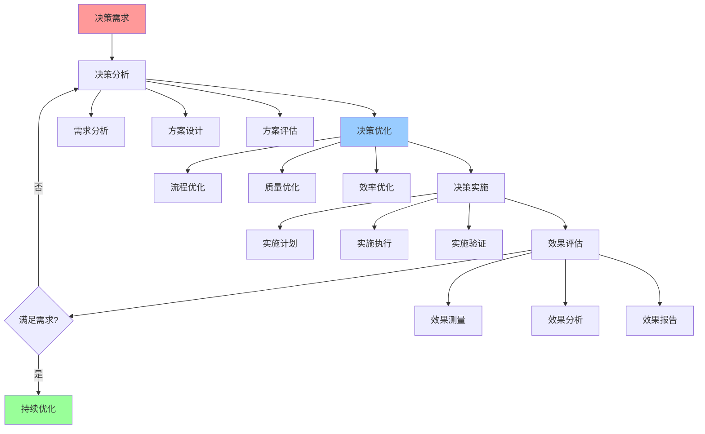

# 决策优化综合指南

## 📑 目录

- [决策优化综合指南](#决策优化综合指南)
  - [📑 目录](#-目录)
  - [1 决策优化全景](#1-决策优化全景)
  - [2 决策流程优化](#2-决策流程优化)
  - [3 决策质量优化](#3-决策质量优化)
  - [4 决策效率优化](#4-决策效率优化)

---

## 1 决策优化全景

---

## 2 决策流程优化

| 优化维度 | 优化内容 | 优化方法 | 预期效果 | 推荐度 |
|---------|---------|---------|---------|--------|
| **流程简化** | 流程精简、流程优化 | 流程分析、流程重构 | 流程效率提升 | ⭐⭐⭐⭐⭐ |
| **流程标准化** | 流程标准化、流程规范化 | 流程设计、流程文档 | 流程质量提升 | ⭐⭐⭐⭐⭐ |
| **流程自动化** | 流程自动化、流程工具化 | 工具开发、工具集成 | 流程效率提升 | ⭐⭐⭐⭐ |
| **流程监控** | 流程监控、流程分析 | 监控设计、监控实施 | 流程质量提升 | ⭐⭐⭐⭐ |
| **流程持续改进** | 流程改进、流程优化 | 问题识别、改进实施 | 流程持续优化 | ⭐⭐⭐⭐ |

**推荐度说明**：
- **⭐⭐⭐⭐⭐**：强烈推荐
- **⭐⭐⭐⭐**：推荐
- **⭐⭐⭐**：可选

---

## 3 决策质量优化

| 优化维度 | 优化内容 | 优化方法 | 预期效果 | 推荐度 |
|---------|---------|---------|---------|--------|
| **需求分析质量** | 需求完整性、需求准确性 | 需求分析、需求验证 | 需求质量提升 | ⭐⭐⭐⭐⭐ |
| **方案设计质量** | 方案完整性、方案可行性 | 方案设计、方案验证 | 方案质量提升 | ⭐⭐⭐⭐⭐ |
| **评估质量** | 评估准确性、评估全面性 | 评估方法、评估验证 | 评估质量提升 | ⭐⭐⭐⭐⭐ |
| **决策质量** | 决策准确性、决策有效性 | 决策方法、决策验证 | 决策质量提升 | ⭐⭐⭐⭐⭐ |
| **实施质量** | 实施准确性、实施有效性 | 实施计划、实施验证 | 实施质量提升 | ⭐⭐⭐⭐ |

**推荐度说明**：
- **⭐⭐⭐⭐⭐**：强烈推荐
- **⭐⭐⭐⭐**：推荐
- **⭐⭐⭐**：可选

---

## 4 决策效率优化

| 优化维度 | 优化内容 | 优化方法 | 预期效果 | 推荐度 |
|---------|---------|---------|---------|--------|
| **决策速度** | 决策时间、决策周期 | 流程优化、工具优化 | 决策速度提升 | ⭐⭐⭐⭐⭐ |
| **决策成本** | 决策成本、决策资源 | 成本优化、资源优化 | 决策成本降低 | ⭐⭐⭐⭐ |
| **决策准确性** | 决策准确率、决策有效性 | 方法优化、工具优化 | 决策准确性提升 | ⭐⭐⭐⭐⭐ |
| **决策可重复性** | 决策可重复、决策标准化 | 流程标准化、工具标准化 | 决策可重复性提升 | ⭐⭐⭐⭐ |
| **决策可追溯性** | 决策记录、决策追溯 | 记录设计、追溯设计 | 决策可追溯性提升 | ⭐⭐⭐⭐ |

**推荐度说明**：
- **⭐⭐⭐⭐⭐**：强烈推荐
- **⭐⭐⭐⭐**：推荐
- **⭐⭐⭐**：可选

---

## 5 决策优化检查清单

| 检查项 | 检查内容 | 重要性 | 推荐度 |
|--------|---------|--------|--------|
| **流程优化** | 流程简化、流程标准化、流程自动化 | 极高 | ⭐⭐⭐⭐⭐ |
| **质量优化** | 需求分析质量、方案设计质量、评估质量 | 高 | ⭐⭐⭐⭐⭐ |
| **效率优化** | 决策速度、决策成本、决策准确性 | 高 | ⭐⭐⭐⭐⭐ |
| **持续改进** | 问题识别、改进实施、效果评估 | 中 | ⭐⭐⭐⭐ |

**推荐度说明**：
- **⭐⭐⭐⭐⭐**：强烈推荐
- **⭐⭐⭐⭐**：推荐
- **⭐⭐⭐**：可选

---

**最后更新**：2025-11-07
**文档状态**：✅ 完整 | 📊 包含决策优化综合指南 | 🎯 生产就绪
**维护者**：项目团队
