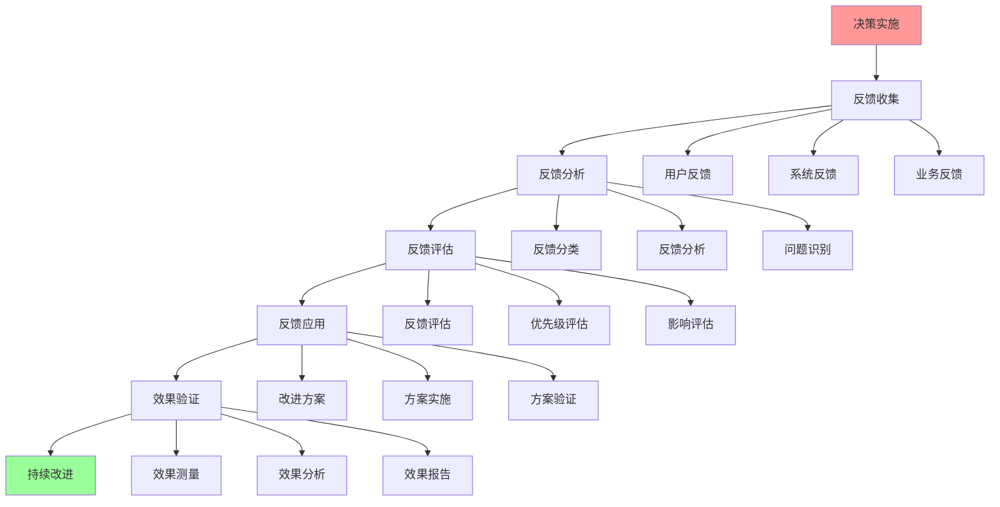
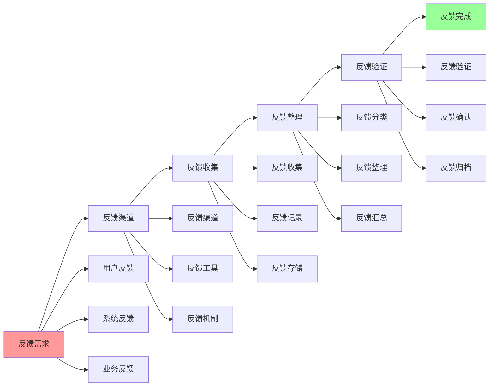
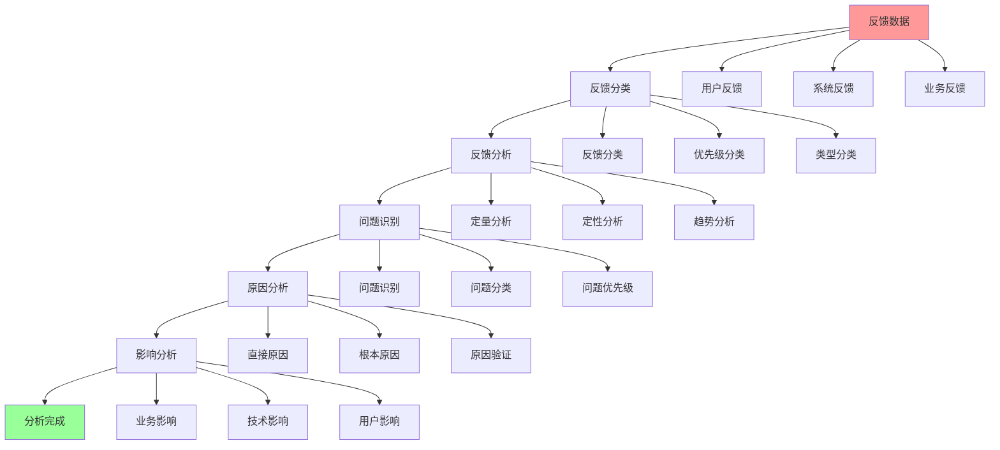
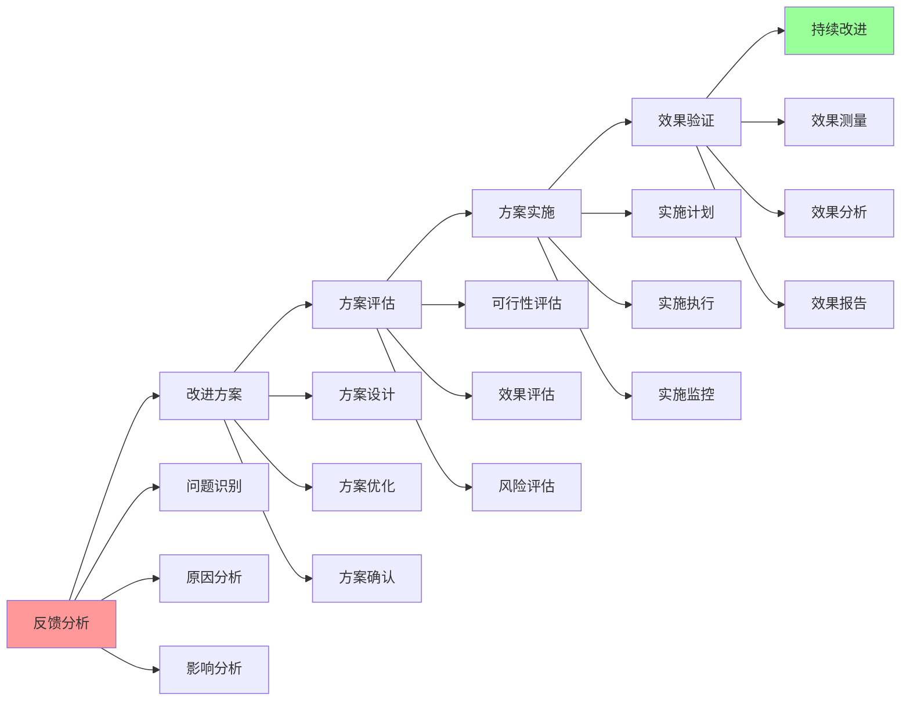

# 决策反馈完整流程

## 📑 目录

- [决策反馈完整流程](#决策反馈完整流程)
  - [📑 目录](#-目录)
  - [1 决策反馈全景流程](#1-决策反馈全景流程)
  - [2 反馈收集流程](#2-反馈收集流程)
  - [3 反馈分析流程](#3-反馈分析流程)
  - [4 反馈应用流程](#4-反馈应用流程)
  - [5 决策反馈检查清单](#5-决策反馈检查清单)
  - [6 使用指南](#6-使用指南)
    - [6.1 快速开始](#61-快速开始)
    - [6.2 决策反馈应用](#62-决策反馈应用)
  - [7 使用技巧](#7-使用技巧)
    - [7.1 反馈收集技巧](#71-反馈收集技巧)
  - [8 实践案例](#8-实践案例)
    - [8.1 微服务架构决策反馈案例](#81-微服务架构决策反馈案例)
  - [9 相关文档](#9-相关文档)

---

## 1 决策反馈全景流程



---

## 2 反馈收集流程



---

## 3 反馈分析流程



---

## 4 反馈应用流程



---

## 5 决策反馈检查清单

| 检查项 | 检查内容 | 重要性 | 推荐度 |
|--------|---------|--------|--------|
| **反馈收集** | 反馈渠道、反馈收集、反馈整理 | 极高 | ⭐⭐⭐⭐⭐ |
| **反馈分析** | 反馈分类、反馈分析、问题识别 | 高 | ⭐⭐⭐⭐⭐ |
| **反馈应用** | 改进方案、方案实施、效果验证 | 高 | ⭐⭐⭐⭐⭐ |
| **持续改进** | 效果评估、持续优化、反馈循环 | 高 | ⭐⭐⭐⭐⭐ |
| **反馈机制** | 反馈机制、反馈流程、反馈工具 | 中 | ⭐⭐⭐⭐ |

**推荐度说明**：

- **⭐⭐⭐⭐⭐**：强烈推荐
- **⭐⭐⭐⭐**：推荐
- **⭐⭐⭐**：可选

---

## 6 使用指南

### 6.1 快速开始

**适用场景**：决策反馈、持续改进

**使用步骤**：

1. **反馈收集**：按照反馈收集流程收集反馈
2. **反馈分析**：按照反馈分析流程分析反馈
3. **反馈应用**：按照反馈应用流程应用反馈

**推荐度**：⭐⭐⭐⭐⭐

---

### 6.2 决策反馈应用

**适用场景**：实际项目中的决策反馈

**使用步骤**：

1. **决策实施**：实施决策方案
2. **反馈收集**：收集用户反馈、系统反馈、业务反馈
3. **反馈分析**：分类反馈、分析反馈、识别问题
4. **反馈评估**：评估反馈、确定优先级、分析影响
5. **反馈应用**：设计改进方案、实施方案、验证效果
6. **持续改进**：持续收集反馈、持续优化

**推荐度**：⭐⭐⭐⭐⭐

---

## 7 使用技巧

### 7.1 反馈收集技巧

**技巧1：多渠道收集**

- 建立多渠道反馈收集机制
- 理解不同反馈渠道的特点
- 建立反馈整理机制

**技巧2：反馈分析**

- 系统化分析反馈
- 识别反馈的根本原因
- 建立反馈知识库

**推荐度**：⭐⭐⭐⭐⭐

---

## 8 实践案例

### 8.1 微服务架构决策反馈案例

**场景**：为微服务架构决策收集反馈并优化

**反馈过程**：

1. **决策实施**：
   - 实施微服务架构
   - 使用Istio服务网格

2. **反馈收集**：
   - 用户反馈：服务响应时间增加
   - 系统反馈：服务间调用延迟高
   - 业务反馈：业务功能正常

3. **反馈分析**：
   - 反馈分类：性能问题
   - 问题识别：服务网格增加延迟
   - 原因分析：服务网格代理增加延迟

4. **反馈评估**：
   - 优先级：高（影响用户体验）
   - 影响：用户体验下降

5. **反馈应用**：
   - 改进方案：优化服务网格配置、使用直连模式
   - 方案实施：优化配置、实施直连
   - 效果验证：延迟降低，用户体验改善

6. **持续改进**：
   - 持续收集反馈
   - 持续优化配置

**效果**：成功应用决策反馈流程，优化微服务架构性能

**推荐度**：⭐⭐⭐⭐⭐

---

## 9 2025 年最新实践

### 9.1 决策反馈完整流程应用最佳实践（2025）

**2025 年趋势**：决策反馈完整流程在反馈收集、反馈分析、反馈应用中的深度应用

**实践要点**：

- **多渠道收集**：建立多渠道反馈收集机制
- **系统化分析**：系统化分析反馈，识别根本原因
- **持续改进**：建立持续改进机制
- **反馈循环**：建立反馈循环机制

**代码示例**：

```python
# 2025 年决策反馈完整流程工具
class DecisionFeedbackProcessTool:
    def __init__(self):
        self.collector = FeedbackCollector()
        self.analyzer = FeedbackAnalyzer()
        self.applicator = FeedbackApplicator()
        self.improver = ContinuousImprover()

    def collect_feedback(self, decision, channels):
        """反馈收集"""
        return self.collector.collect(decision, channels)

    def analyze_feedback(self, feedback, criteria):
        """反馈分析"""
        return self.analyzer.analyze(feedback, criteria)

    def apply_feedback(self, analysis, context):
        """反馈应用"""
        return self.applicator.apply(analysis, context)
```

## 10 实际应用案例

### 案例 1：决策反馈完整流程应用（2025）

**场景**：使用决策反馈完整流程优化微服务架构决策

**实现方案**：

```python
# 决策反馈完整流程应用
tool = DecisionFeedbackProcessTool()

# 反馈收集
decision = Decision(type="microservices", status="implemented")
channels = Channels(users=True, system=True, business=True)
feedback = tool.collect_feedback(decision, channels)

# 反馈分析
criteria = Criteria(priority=True, impact=True, feasibility=True)
analysis = tool.analyze_feedback(feedback, criteria)

# 反馈应用
context = Context(team="devops", constraints="budget_limited")
improvements = tool.apply_feedback(analysis, context)
```

**效果**：

- 反馈收集：多渠道收集反馈，提高反馈完整性
- 反馈分析：系统化分析反馈，提高分析质量
- 反馈应用：持续应用反馈，提高持续改进能力

---

## 11 相关文档

- **[决策制定完整流程](24-decision-making-process.md)** - 决策制定全景流程、问题识别流程、方案设计流程
- **[决策优化综合指南](25-decision-optimization-guide.md)** - 决策流程优化、决策质量优化、决策效率优化
- **[综合决策工作流图](13-comprehensive-decision-workflow.md)** - 决策工作流全景、需求分析工作流、技术选型工作流

---

**最后更新**：2025-11-15
**文档状态**：✅ 完整 | 📊 包含决策反馈完整流程、使用指南、使用技巧、实践案例 | 🎯 生产就绪
**维护者**：项目团队
