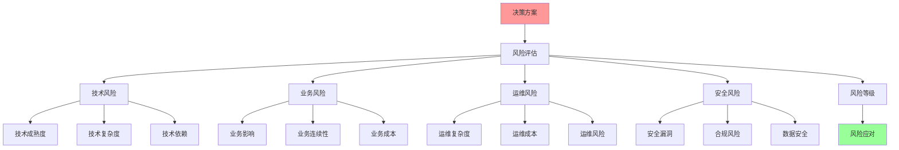
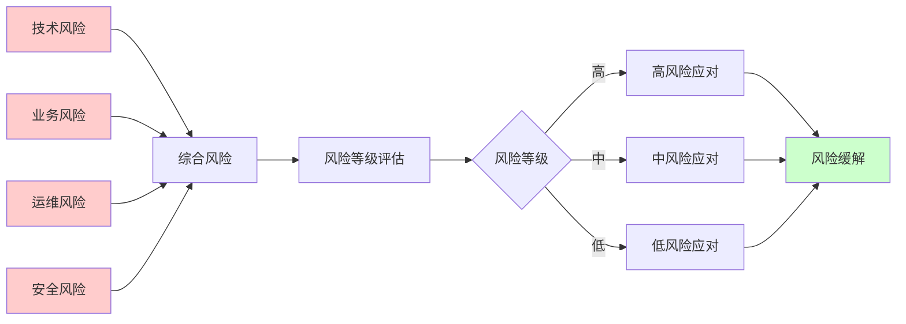

# 决策风险评估综合指南

## 📑 目录

- [决策风险评估综合指南](#决策风险评估综合指南)
  - [📑 目录](#-目录)
  - [1 风险评估全景](#1-风险评估全景)
  - [2 技术风险评估](#2-技术风险评估)
  - [3 业务风险评估](#3-业务风险评估)
  - [4 运维风险评估](#4-运维风险评估)
  - [5 综合风险评估](#5-综合风险评估)
  - [6 风险评估检查清单](#6-风险评估检查清单)
  - [7 使用指南](#7-使用指南)
    - [7.1 快速开始](#71-快速开始)
    - [7.2 风险评估应用](#72-风险评估应用)
  - [8 使用技巧](#8-使用技巧)
    - [8.1 风险识别技巧](#81-风险识别技巧)
  - [9 实践案例](#9-实践案例)
    - [9.1 微服务架构风险评估案例](#91-微服务架构风险评估案例)
  - [10 相关文档](#10-相关文档)

---

## 1 风险评估全景



---

## 2 技术风险评估

| 风险类型 | 风险描述 | 风险等级 | 影响范围 | 应对策略 | 推荐度 |
|---------|---------|---------|---------|---------|--------|
| **技术成熟度风险** | 技术不成熟、存在未知问题 | 高 | 系统稳定性 | 选择成熟技术、充分测试 | ⭐⭐⭐⭐⭐ |
| **技术复杂度风险** | 技术复杂度高、学习曲线陡 | 中 | 开发效率 | 技术培训、文档完善 | ⭐⭐⭐⭐ |
| **技术依赖风险** | 依赖第三方技术、供应商风险 | 中 | 系统可用性 | 多供应商、技术备选方案 | ⭐⭐⭐⭐ |
| **技术兼容性风险** | 技术不兼容、集成困难 | 中 | 系统集成 | 兼容性测试、标准化 | ⭐⭐⭐⭐ |
| **技术演进风险** | 技术快速演进、版本兼容 | 低 | 长期维护 | 版本管理、演进规划 | ⭐⭐⭐ |
| **性能风险** | 性能不达标、瓶颈问题 | 高 | 用户体验 | 性能测试、优化方案 | ⭐⭐⭐⭐⭐ |
| **安全风险** | 安全漏洞、安全威胁 | 高 | 系统安全 | 安全审计、安全加固 | ⭐⭐⭐⭐⭐ |

**风险等级说明**：

- **高**：严重影响系统，需要重点关注
- **中**：一定影响，需要适当关注
- **低**：影响较小，可接受

**推荐度说明**：

- **⭐⭐⭐⭐⭐**：强烈推荐
- **⭐⭐⭐⭐**：推荐
- **⭐⭐⭐**：可选

---

## 3 业务风险评估

| 风险类型 | 风险描述 | 风险等级 | 影响范围 | 应对策略 | 推荐度 |
|---------|---------|---------|---------|---------|--------|
| **业务影响风险** | 决策对业务的影响 | 高 | 业务运营 | 影响分析、业务预案 | ⭐⭐⭐⭐⭐ |
| **业务连续性风险** | 业务中断、服务不可用 | 高 | 业务连续性 | 高可用设计、故障恢复 | ⭐⭐⭐⭐⭐ |
| **业务成本风险** | 成本超支、ROI不达标 | 中 | 业务成本 | 成本控制、ROI分析 | ⭐⭐⭐⭐ |
| **业务合规风险** | 不符合法规、合规要求 | 高 | 业务合规 | 合规审查、合规设计 | ⭐⭐⭐⭐⭐ |
| **业务竞争风险** | 技术落后、竞争力下降 | 中 | 业务竞争力 | 技术选型、创新投入 | ⭐⭐⭐⭐ |
| **业务扩展风险** | 扩展困难、架构限制 | 中 | 业务扩展 | 可扩展设计、架构优化 | ⭐⭐⭐⭐ |

**风险等级说明**：

- **高**：严重影响业务，需要重点关注
- **中**：一定影响，需要适当关注
- **低**：影响较小，可接受

**推荐度说明**：

- **⭐⭐⭐⭐⭐**：强烈推荐
- **⭐⭐⭐⭐**：推荐
- **⭐⭐⭐**：可选

---

## 4 运维风险评估

| 风险类型 | 风险描述 | 风险等级 | 影响范围 | 应对策略 | 推荐度 |
|---------|---------|---------|---------|---------|--------|
| **运维复杂度风险** | 运维复杂、操作困难 | 中 | 运维效率 | 自动化运维、工具支持 | ⭐⭐⭐⭐ |
| **运维成本风险** | 运维成本高、资源浪费 | 中 | 运维成本 | 成本优化、资源管理 | ⭐⭐⭐⭐ |
| **运维人员风险** | 人员不足、技能缺失 | 中 | 运维能力 | 人员培训、知识管理 | ⭐⭐⭐⭐ |
| **运维工具风险** | 工具不足、工具不完善 | 低 | 运维效率 | 工具选型、工具开发 | ⭐⭐⭐ |
| **运维监控风险** | 监控不足、告警不及时 | 高 | 系统可用性 | 监控设计、告警管理 | ⭐⭐⭐⭐⭐ |
| **运维故障风险** | 故障频发、恢复困难 | 高 | 系统稳定性 | 故障预防、故障恢复 | ⭐⭐⭐⭐⭐ |

**风险等级说明**：

- **高**：严重影响运维，需要重点关注
- **中**：一定影响，需要适当关注
- **低**：影响较小，可接受

**推荐度说明**：

- **⭐⭐⭐⭐⭐**：强烈推荐
- **⭐⭐⭐⭐**：推荐
- **⭐⭐⭐**：可选

---

## 5 综合风险评估



**综合风险评估矩阵**：

| 风险类型 | 权重 | 风险等级 | 加权风险 | 优先级 |
|---------|------|---------|---------|--------|
| **技术风险** | 30% | 高 | 高 | P0 |
| **业务风险** | 30% | 高 | 高 | P0 |
| **运维风险** | 20% | 中 | 中 | P1 |
| **安全风险** | 20% | 高 | 高 | P0 |

**风险应对优先级**：

- **P0**：立即应对，最高优先级
- **P1**：尽快应对，高优先级
- **P2**：计划应对，中优先级
- **P3**：监控应对，低优先级

---

## 6 风险评估检查清单

| 检查项 | 检查内容 | 重要性 | 推荐度 |
|--------|---------|--------|--------|
| **风险识别** | 风险识别、风险分类、风险分析 | 极高 | ⭐⭐⭐⭐⭐ |
| **风险等级评估** | 风险等级、风险影响、风险概率 | 高 | ⭐⭐⭐⭐⭐ |
| **风险应对策略** | 应对策略、应对措施、应对计划 | 高 | ⭐⭐⭐⭐⭐ |
| **风险监控** | 风险监控、风险预警、风险报告 | 中 | ⭐⭐⭐⭐ |

**推荐度说明**：

- **⭐⭐⭐⭐⭐**：强烈推荐
- **⭐⭐⭐⭐**：推荐
- **⭐⭐⭐**：可选

---

## 7 使用指南

### 7.1 快速开始

**适用场景**：技术风险评估、业务风险评估、运维风险评估

**使用步骤**：

1. **风险识别**：识别技术风险、业务风险、运维风险
2. **风险等级评估**：评估风险等级和影响
3. **风险应对**：制定风险应对策略

**推荐度**：⭐⭐⭐⭐⭐

---

### 7.2 风险评估应用

**适用场景**：实际项目中的风险评估

**使用步骤**：

1. **风险识别**：识别技术风险、业务风险、运维风险、安全风险
2. **风险等级评估**：评估风险等级、风险影响、风险概率
3. **综合风险评估**：综合评估各类风险
4. **风险应对策略**：制定风险应对策略、应对措施、应对计划
5. **风险监控**：建立风险监控、风险预警、风险报告机制

**推荐度**：⭐⭐⭐⭐⭐

---

## 8 使用技巧

### 8.1 风险识别技巧

**技巧1：全面识别**

- 全面识别各类风险
- 理解风险的类型和特征
- 建立风险识别机制

**技巧2：风险等级评估**

- 准确评估风险等级
- 理解风险的影响和概率
- 建立风险评估标准

**推荐度**：⭐⭐⭐⭐⭐

---

## 9 实践案例

### 9.1 微服务架构风险评估案例

**场景**：为微服务架构进行风险评估

**评估过程**：

1. **风险识别**：
   - 技术风险：服务网格复杂度高、服务间调用延迟
   - 业务风险：业务连续性风险、业务成本风险
   - 运维风险：运维复杂度高、故障恢复困难
   - 安全风险：服务间通信安全、数据安全

2. **风险等级评估**：
   - 技术风险：中（技术成熟，但复杂度高）
   - 业务风险：中（业务影响可控）
   - 运维风险：高（运维复杂度显著增加）
   - 安全风险：中（安全机制完善）

3. **综合风险评估**：
   - 综合风险等级：中高
   - 主要风险：运维风险

4. **风险应对策略**：
   - 运维风险应对：自动化运维、工具支持、人员培训
   - 技术风险应对：技术培训、文档完善
   - 业务风险应对：高可用设计、故障恢复
   - 安全风险应对：安全审计、安全加固

5. **风险监控**：
   - 建立风险监控机制
   - 建立风险预警机制
   - 建立风险报告机制

**效果**：成功进行风险评估，识别并应对主要风险

**推荐度**：⭐⭐⭐⭐⭐

---

## 10 2025 年最新实践

### 10.1 决策风险评估综合指南应用最佳实践（2025）

**2025 年趋势**：决策风险评估综合指南在技术风险评估、业务风险评估、运维风险评估中的深度应用

**实践要点**：

- **全面识别**：全面识别各类风险
- **准确评估**：准确评估风险等级和影响
- **应对策略**：制定合理的风险应对策略
- **风险监控**：建立风险监控和预警机制

**代码示例**：

```python
# 2025 年决策风险评估综合指南工具
class DecisionRiskAssessmentTool:
    def __init__(self):
        self.identifier = RiskIdentifier()
        self.evaluator = RiskEvaluator()
        self.strategy_designer = RiskStrategyDesigner()
        self.monitor = RiskMonitor()

    def identify_risks(self, decision, context):
        """风险识别"""
        return self.identifier.identify(decision, context)

    def evaluate_risks(self, risks, criteria):
        """风险评估"""
        return self.evaluator.evaluate(risks, criteria)

    def design_strategy(self, risks, constraints):
        """应对策略设计"""
        return self.strategy_designer.design(risks, constraints)
```

## 11 实际应用案例

### 案例 1：决策风险评估综合指南应用（2025）

**场景**：使用决策风险评估综合指南进行微服务架构风险评估

**实现方案**：

```python
# 决策风险评估综合指南应用
tool = DecisionRiskAssessmentTool()

# 风险识别
decision = Decision(type="microservices", scale="large")
context = Context(team="devops", infrastructure="cloud")
risks = tool.identify_risks(decision, context)

# 风险评估
criteria = Criteria(probability=True, impact=True, severity=True)
evaluation = tool.evaluate_risks(risks, criteria)

# 应对策略设计
constraints = Constraints(budget="limited", timeline="tight")
strategy = tool.design_strategy(risks, constraints)

# 风险监控
monitoring = tool.monitor.monitor(risks)
```

**效果**：

- 风险识别：全面识别风险，提高识别完整性
- 风险评估：准确评估风险，提高评估质量
- 应对策略：设计合理策略，提高风险应对能力

---

## 12 相关文档

- **[决策制定完整流程](24-decision-making-process.md)** - 决策制定全景流程、问题识别流程、方案设计流程
- **[最佳实践指南](14-best-practices-guide.md)** - 技术选型最佳实践、架构设计最佳实践、安全设计最佳实践
- **[综合决策工作流图](13-comprehensive-decision-workflow.md)** - 决策工作流全景、需求分析工作流、技术选型工作流

---

**最后更新**：2025-11-15
**文档状态**：✅ 完整 | 📊 包含决策风险评估综合指南、使用指南、使用技巧、实践案例 | 🎯 生产就绪
**维护者**：项目团队
