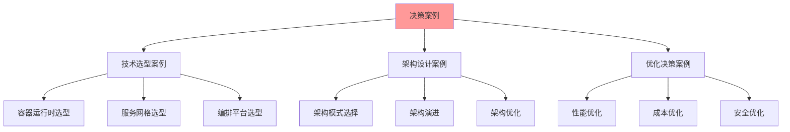

# 决策案例研究详解

## 📑 目录

- [决策案例研究详解](#决策案例研究详解)
  - [📑 目录](#-目录)
  - [1 案例研究全景](#1-案例研究全景)
  - [2 容器运行时选型案例](#2-容器运行时选型案例)
  - [3 服务网格选型案例](#3-服务网格选型案例)
  - [4 编排平台选型案例](#4-编排平台选型案例)
  - [5 架构演进案例](#5-架构演进案例)

---

## 1 案例研究全景

---

## 2 容器运行时选型案例

### 2.1 案例背景

**业务场景**：
- 企业级应用，需要高安全性和高可靠性
- 需要支持多种容器镜像格式
- 需要良好的性能和资源利用率

**决策需求**：
- 选择合适的容器运行时
- 评估不同运行时的优劣
- 制定选型决策

### 2.2 决策过程

| 步骤 | 内容 | 使用的模型/工具 |
|------|------|----------------|
| **需求分析** | 分析业务需求和技术需求 | 需求分析矩阵 |
| **方案对比** | 对比不同容器运行时方案 | 技术对比详细矩阵 |
| **风险评估** | 评估技术风险和业务风险 | 决策风险评估综合指南 |
| **决策制定** | 制定最终选型决策 | 技术选型决策树 |

### 2.3 决策结果

| 方案 | 优势 | 劣势 | 最终选择 |
|------|------|------|---------|
| **containerd** | 成熟稳定、性能好 | 功能相对简单 | ✅ 选择 |
| **CRI-O** | 轻量级、安全 | 生态相对较小 | ❌ 未选择 |
| **Docker** | 功能丰富、生态好 | 资源占用大 | ❌ 未选择 |

**决策理由**：
- 企业级应用需要成熟稳定的方案
- containerd满足性能和可靠性要求
- 生态支持良好

---

## 3 服务网格选型案例

### 3.1 案例背景

**业务场景**：
- 微服务架构，服务数量多
- 需要服务间通信治理
- 需要零信任安全

**决策需求**：
- 选择合适的服务网格方案
- 评估不同方案的优劣
- 制定选型决策

### 3.2 决策过程

| 步骤 | 内容 | 使用的模型/工具 |
|------|------|----------------|
| **需求分析** | 分析服务治理需求和安全需求 | 需求分析矩阵 |
| **方案对比** | 对比不同服务网格方案 | 决策案例对比矩阵 |
| **性能评估** | 评估性能和资源消耗 | 性能优化指南 |
| **决策制定** | 制定最终选型决策 | 技术选型决策树 |

### 3.2 决策结果

| 方案 | 优势 | 劣势 | 最终选择 |
|------|------|------|---------|
| **Istio** | 功能全面、生态好 | 复杂度高、资源消耗大 | ✅ 选择 |
| **Linkerd** | 轻量级、简单 | 功能相对较少 | ❌ 未选择 |
| **Consul Connect** | 集成Consul | 功能相对简单 | ❌ 未选择 |

**决策理由**：
- 微服务架构需要全面的服务治理能力
- Istio提供完整的服务网格功能
- 生态支持良好，社区活跃

---

## 4 编排平台选型案例

### 4.1 案例背景

**业务场景**：
- 多环境部署（开发、测试、生产）
- 需要自动化部署和运维
- 需要高可用和弹性扩展

**决策需求**：
- 选择合适的编排平台
- 评估不同平台的优劣
- 制定选型决策

### 4.2 决策过程

| 步骤 | 内容 | 使用的模型/工具 |
|------|------|----------------|
| **需求分析** | 分析部署和运维需求 | 需求分析矩阵 |
| **方案对比** | 对比不同编排平台方案 | 技术对比详细矩阵 |
| **成本评估** | 评估部署和运维成本 | 成本优化指南 |
| **决策制定** | 制定最终选型决策 | 技术选型决策树 |

### 4.3 决策结果

| 方案 | 优势 | 劣势 | 最终选择 |
|------|------|------|---------|
| **Kubernetes** | 功能全面、生态好 | 复杂度高、学习曲线陡 | ✅ 选择 |
| **Docker Swarm** | 简单易用 | 功能相对简单 | ❌ 未选择 |
| **Nomad** | 轻量级、灵活 | 生态相对较小 | ❌ 未选择 |

**决策理由**：
- 企业级应用需要全面的编排能力
- Kubernetes提供完整的容器编排功能
- 生态支持良好，社区活跃

---

## 5 架构演进案例

### 5.1 案例背景

**业务场景**：
- 单体应用需要演进为微服务架构
- 需要保持业务连续性
- 需要渐进式演进

**决策需求**：
- 制定架构演进策略
- 评估演进风险和成本
- 制定演进计划

### 5.2 决策过程

| 步骤 | 内容 | 使用的模型/工具 |
|------|------|----------------|
| **现状分析** | 分析当前架构和问题 | 架构认知地图 |
| **目标设计** | 设计目标架构 | 架构模式详细思维导图 |
| **演进路径** | 设计演进路径 | 架构演进路径图 |
| **风险评估** | 评估演进风险 | 决策风险评估综合指南 |
| **决策制定** | 制定演进计划 | 架构决策完整流程 |

### 5.3 决策结果

**演进策略**：
- **第一阶段**：服务拆分，识别服务边界
- **第二阶段**：数据分离，独立数据库
- **第三阶段**：服务独立部署，容器化
- **第四阶段**：服务治理，引入服务网格

**决策理由**：
- 渐进式演进降低风险
- 保持业务连续性
- 逐步验证和优化

---

## 6 案例研究总结

| 案例类型 | 关键决策点 | 使用的模型/工具 | 决策效果 | 推荐度 |
|---------|-----------|----------------|---------|--------|
| **容器运行时选型** | 成熟度、性能、可靠性 | 技术选型决策树、技术对比矩阵 | 成功选型 | ⭐⭐⭐⭐⭐ |
| **服务网格选型** | 功能全面性、生态支持 | 决策案例对比矩阵、技术选型决策树 | 成功选型 | ⭐⭐⭐⭐⭐ |
| **编排平台选型** | 功能全面性、生态支持 | 技术对比矩阵、成本优化指南 | 成功选型 | ⭐⭐⭐⭐⭐ |
| **架构演进** | 演进策略、风险评估 | 架构演进路径图、风险评估指南 | 成功演进 | ⭐⭐⭐⭐⭐ |

**推荐度说明**：
- **⭐⭐⭐⭐⭐**：强烈推荐
- **⭐⭐⭐⭐**：推荐
- **⭐⭐⭐**：可选

---

## 7 案例研究检查清单

| 检查项 | 检查内容 | 重要性 | 推荐度 |
|--------|---------|--------|--------|
| **案例背景** | 业务场景、决策需求、约束条件 | 极高 | ⭐⭐⭐⭐⭐ |
| **决策过程** | 需求分析、方案对比、风险评估 | 高 | ⭐⭐⭐⭐⭐ |
| **决策结果** | 决策方案、决策理由、决策效果 | 高 | ⭐⭐⭐⭐⭐ |
| **经验总结** | 成功经验、失败教训、改进建议 | 中 | ⭐⭐⭐⭐ |

**推荐度说明**：
- **⭐⭐⭐⭐⭐**：强烈推荐
- **⭐⭐⭐⭐**：推荐
- **⭐⭐⭐**：可选

---

## 8 使用指南

### 8.1 快速开始

**适用场景**：案例参考、决策学习、经验总结

**使用步骤**：

1. **案例查找**：根据决策类型查找相关案例
2. **案例分析**：分析案例的背景、过程、结果
3. **经验学习**：学习案例的成功经验和失败教训

**推荐度**：⭐⭐⭐⭐⭐

---

### 8.2 案例研究应用

**适用场景**：实际项目中的案例研究应用

**使用步骤**：

1. **案例匹配**：匹配项目的决策类型和场景
2. **案例学习**：学习案例的决策过程和方法
3. **经验应用**：应用案例的成功经验
4. **教训避免**：避免案例的失败教训

**推荐度**：⭐⭐⭐⭐⭐

---

## 9 使用技巧

### 9.1 案例选择技巧

**技巧1：场景匹配**

- 选择与项目场景最相似的案例
- 理解案例的背景和约束
- 避免盲目照搬案例

**技巧2：经验提取**

- 深入分析案例的成功经验
- 理解经验的适用条件
- 灵活应用经验

**推荐度**：⭐⭐⭐⭐⭐

---

## 10 相关文档

- **[决策案例对比矩阵](02-decision-cases-matrix.md)** - 边缘计算、Serverless、企业级、服务网格决策案例
- **[决策场景详细矩阵](17-decision-scenarios-matrix.md)** - 技术选型场景、架构设计场景、资源管理场景、安全设计场景
- **[实践案例详细矩阵](../../04-application-perspectives/visualizations/10-practical-cases-detailed.md)** - 电商平台案例、金融系统案例、边缘计算案例

---

**最后更新**：2025-11-15
**文档状态**：✅ 完整 | 📊 包含决策案例研究详解、使用指南、使用技巧 | 🎯 生产就绪
**维护者**：项目团队
