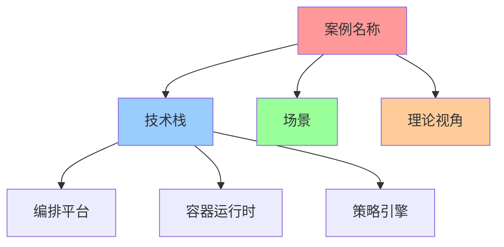

# 案例研究分析模型标准

> **创建日期**：2025-11-15 **维护者**：项目团队

---

## 📑 目录

- [案例研究分析模型标准](#案例研究分析模型标准)
  - [📑 目录](#-目录)
  - [1 文档定位](#1-文档定位)
  - [2 分析模型定义标准](#2-分析模型定义标准)
    - [2.1 矩阵视角标准](#21-矩阵视角标准)
      - [2.1.1 概念向量定义标准](#211-概念向量定义标准)
      - [2.1.2 技术选型矩阵标准](#212-技术选型矩阵标准)
    - [2.2 代数结构视角标准](#22-代数结构视角标准)
      - [2.2.1 算子定义标准](#221-算子定义标准)
      - [2.2.2 代数结构标准](#222-代数结构标准)
    - [2.3 结构视角标准](#23-结构视角标准)
      - [2.3.1 三类结构标准](#231-三类结构标准)
      - [2.3.2 结构权重标准](#232-结构权重标准)
    - [2.4 调度视角标准](#24-调度视角标准)
      - [2.4.1 分层调度标准](#241-分层调度标准)
      - [2.4.2 调度策略标准](#242-调度策略标准)
    - [2.5 范畴论视角标准](#25-范畴论视角标准)
      - [2.5.1 对象与态射标准](#251-对象与态射标准)
    - [2.6 形式化理论视角标准](#26-形式化理论视角标准)
      - [2.6.1 时序逻辑标准](#261-时序逻辑标准)
      - [2.6.2 模型检验标准](#262-模型检验标准)
  - [3 思维工具使用标准](#3-思维工具使用标准)
    - [3.1 思维导图标准](#31-思维导图标准)
      - [3.1.1 Mermaid格式标准](#311-mermaid格式标准)
    - [3.2 知识矩阵标准](#32-知识矩阵标准)
      - [3.2.1 矩阵格式标准](#321-矩阵格式标准)
    - [3.3 形式化定义标准](#33-形式化定义标准)
      - [3.3.1 数学符号标准](#331-数学符号标准)
  - [4 论证方法标准](#4-论证方法标准)
    - [4.1 理论论证标准](#41-理论论证标准)
      - [4.1.1 论证结构标准](#411-论证结构标准)
    - [4.2 形式化证明标准](#42-形式化证明标准)
      - [4.2.1 证明格式标准](#421-证明格式标准)
    - [4.3 案例分析标准](#43-案例分析标准)
      - [4.3.1 分析结构标准](#431-分析结构标准)
    - [4.4 对比分析标准](#44-对比分析标准)
      - [4.4.1 对比维度标准](#441-对比维度标准)
  - [5 文档结构标准](#5-文档结构标准)
    - [5.1 案例文档结构标准](#51-案例文档结构标准)
      - [5.1.1 必须包含的章节](#511-必须包含的章节)
    - [5.2 分析文档结构标准](#52-分析文档结构标准)
      - [5.2.1 必须包含的章节](#521-必须包含的章节)
    - [5.3 认知增强文档结构标准](#53-认知增强文档结构标准)
      - [5.3.1 必须包含的章节](#531-必须包含的章节)
  - [6 质量标准](#6-质量标准)
    - [6.1 内容质量标准](#61-内容质量标准)
      - [6.1.1 内容完整性标准](#611-内容完整性标准)
    - [6.2 格式质量标准](#62-格式质量标准)
      - [6.2.1 格式统一性标准](#621-格式统一性标准)
    - [6.3 链接质量标准](#63-链接质量标准)
      - [6.3.1 链接正确性标准](#631-链接正确性标准)
  - [7 使用指南](#7-使用指南)
    - [7.1 如何应用分析模型](#71-如何应用分析模型)
    - [7.2 如何选择思维工具](#72-如何选择思维工具)
    - [7.3 如何进行论证](#73-如何进行论证)
  - [8 相关文档](#8-相关文档)
    - [案例研究目录文档](#案例研究目录文档)
    - [COGNITIVE目录参考文档](#cognitive目录参考文档)

---

## 1 文档定位

本文档提供案例研究中使用的**分析模型、思维工具和论证方法的标准化定义**，确保所有案例文档和分析文档的一致性和质量。

**为什么需要分析模型标准？**

在创建和分析案例研究时，我们面临以下挑战：

1. **一致性不足**：不同案例使用的分析模型格式不一致
2. **质量参差**：不同案例的分析深度和质量参差不齐
3. **工具使用不规范**：思维工具的使用方式不统一
4. **论证方法不明确**：论证方法缺乏标准

分析模型标准通过**定义标准、使用指南和质量标准**，帮助我们：

1. **保证一致性**：确保所有案例使用统一的分析模型格式
2. **提升质量**：通过质量标准提升分析质量
3. **规范工具使用**：统一思维工具的使用方式
4. **明确论证方法**：明确论证方法的标准和要求

**核心价值**：

- **一致性保证**：确保所有文档的一致性
- **质量提升**：通过标准提升文档质量
- **工具规范**：规范思维工具的使用
- **方法明确**：明确论证方法的标准

---

## 2 分析模型定义标准

### 2.1 矩阵视角标准

#### 2.1.1 概念向量定义标准

**必须包含的内容**：

1. **12维原子概念向量**：
   - 每个概念向量的权重值（0-1之间）
   - 概念向量的含义说明
   - 概念向量在案例中的体现

2. **场景向量**：
   - 场景类型（Dev/CI/Test/Prod/Edge/IoT/Serverless/AI/MultiTenant）
   - 场景向量的权重分布
   - 场景适配度得分

3. **关系矩阵**：
   - 概念之间的依赖关系
   - 概念之间的转换关系
   - 概念之间的组合关系

**格式要求**：

```markdown
#### X.X 矩阵视角分析

**核心概念向量映射**：

- **12维原子概念向量**：将案例中的技术组件映射到12维概念向量
  - e₁ (Image): 0.9 - 镜像管理
  - e₂ (Container): 1.0 - 容器化部署
  - ...

- **场景向量**：确定案例所属的场景类型
  - s₃ = Prod（生产环境）

- **关系矩阵**：分析技术组件之间的依赖、转换、组合关系
  - Container → Image: 依赖关系
  - Scale → Container: 组合关系
```

#### 2.1.2 技术选型矩阵标准

**必须包含的内容**：

1. **属性矩阵**：
   - 技术在不同场景下的成熟度
   - 技术在不同场景下的性能表现
   - 技术在不同场景下的成本表现

2. **场景变换矩阵**：
   - 场景转换的可行性
   - 场景转换的成本
   - 场景转换的风险

3. **技术链序列**：
   - 技术演进路径
   - 技术组合序列
   - 技术优化建议

**格式要求**：

```markdown
**技术选型矩阵分析**：

- **属性矩阵**：分析技术在不同场景下的成熟度、性能、成本表现
  | 技术 | 成熟度 | 性能 | 成本 | 推荐度 |
  |------|--------|------|------|--------|
  | K8s | ⭐⭐⭐⭐⭐ | ⭐⭐⭐⭐ | ⭐⭐⭐ | ⭐⭐⭐⭐⭐ |

- **场景变换矩阵**：分析场景转换的可行性和成本
  - Prod → Edge: 可行性高，成本中等

- **技术链序列**：分析技术演进路径
  - Docker → Kubernetes → K3s → WasmEdge
```

### 2.2 代数结构视角标准

#### 2.2.1 算子定义标准

**必须包含的内容**：

1. **20个一元算子**：
   - 识别案例中使用的算子（V/I/C/S/M/Kc/G/F/W等）
   - 算子的含义说明
   - 算子在案例中的应用

2. **算子组合**：
   - 算子组合形成的技术栈
   - 算子组合的复杂度
   - 算子组合的优化建议

3. **复合运算**：
   - 算子复合运算的结果
   - 复合运算的性质
   - 复合运算的应用

**格式要求**：

```markdown
#### X.X 代数结构视角分析

**算子映射**：

- **20个一元算子**：识别案例中使用的算子
  - I (Image): 镜像管理
  - C (Container): 容器化
  - S (Scale): 扩缩容
  - P (Policy): 策略引擎

- **算子组合**：分析算子组合形成的技术栈
  - `P ∘ C ∘ I` = `Policy(Container(Image))`

- **复合运算**：分析算子复合运算的结果
  - `(P ∘ C) ∘ I = P ∘ (C ∘ I)` [结合律]
```

#### 2.2.2 代数结构标准

**必须包含的内容**：

1. **代数结构**：
   - `Σ = ⟨Ω, ℱ, 𝒫, ℒ⟩` 在案例中的体现
   - 代数结构的性质
   - 代数结构的应用

2. **结构保持**：
   - 算子组合是否保持结构
   - 结构保持的条件
   - 结构保持的应用

3. **同态映射**：
   - 不同技术栈之间的同态关系
   - 同态映射的性质
   - 同态映射的应用

**格式要求**：

```markdown
**代数结构分析**：

- **代数结构**：`Σ = ⟨Ω, ℱ, 𝒫, ℒ⟩` 在案例中的体现
  - Ω: 算子集合 {I, C, S, P, ...}
  - ℱ: 函数集合
  - 𝒫: 谓词集合
  - ℒ: 逻辑集合

- **结构保持**：分析算子组合是否保持结构
  - `P ∘ C` 保持结构：Policy和Container的组合保持结构

- **同态映射**：分析不同技术栈之间的同态关系
  - `φ: K8s → K3s` 是同态映射
```

### 2.3 结构视角标准

#### 2.3.1 三类结构标准

**必须包含的内容**：

1. **计算结构**：
   - 计算资源（CPU、内存、存储）
   - 计算模式（批处理、流处理、实时处理）
   - 计算流程（数据处理流程）

2. **控制结构**：
   - 控制逻辑（调度逻辑、故障恢复逻辑）
   - 调度策略（静态调度、动态调度）
   - 故障恢复机制（自动重启、故障转移）

3. **信息结构**：
   - 数据流（数据输入、数据处理、数据输出）
   - 数据存储（数据库、缓存、文件系统）
   - 数据安全（加密、访问控制、合规性）

**格式要求**：

```markdown
#### X.X 结构视角分析

**三类结构分析**：

- **计算结构**：分析案例中的计算资源、计算模式、计算流程
  - 计算资源：CPU 4核，内存 8GB
  - 计算模式：实时处理
  - 计算流程：数据输入 → 处理 → 输出

- **控制结构**：分析案例中的控制逻辑、调度策略、故障恢复机制
  - 控制逻辑：Kubernetes调度器
  - 调度策略：动态调度（HPA）
  - 故障恢复：Pod自动重启

- **信息结构**：分析案例中的数据流、数据存储、数据安全
  - 数据流：API请求 → 数据库 → API响应
  - 数据存储：PostgreSQL数据库
  - 数据安全：TLS加密、OPA访问控制
```

#### 2.3.2 结构权重标准

**必须包含的内容**：

1. **结构权重分布**：
   - 计算结构权重（0-1）
   - 控制结构权重（0-1）
   - 信息结构权重（0-1）
   - 权重归一化：`w_C + w_Ctrl + w_Info = 1`

2. **结构平衡分析**：
   - 结构平衡度计算
   - 结构不平衡的原因分析
   - 结构优化建议

**格式要求**：

```markdown
**结构平衡分析**：

- **结构权重**：评估三类结构在案例中的相对重要性
  - 计算结构：0.40（40%）
  - 控制结构：0.35（35%）
  - 信息结构：0.25（25%）

- **结构平衡度**：分析结构之间的平衡关系
  - 平衡度：0.85（较高）
  - 分析：计算结构权重较高，强调高并发处理

- **结构优化**：提出结构优化建议
  - 建议：优化控制结构，提升故障恢复速度
```

### 2.4 调度视角标准

#### 2.4.1 分层调度标准

**必须包含的内容**：

1. **技术架构层调度**：
   - Kubernetes/K3s调度器
   - 容器运行时调度
   - 调度策略和算法

2. **应用架构层调度**：
   - 服务网格调度（Istio）
   - API网关调度
   - 消息队列调度

3. **系统软件层调度**：
   - 操作系统进程调度
   - 网络调度
   - 存储调度

**格式要求**：

```markdown
#### X.X 调度视角分析

**分层调度分析**：

- **技术架构层**：分析Kubernetes/K3s调度器、容器运行时调度
  - Kubernetes调度器：默认调度器
  - 容器运行时：containerd
  - 调度策略：节点亲和性、Pod反亲和性

- **应用架构层**：分析服务网格、API网关、消息队列调度
  - 服务网格：Istio流量管理
  - API网关：Kong负载均衡
  - 消息队列：RabbitMQ消息分发

- **系统软件层**：分析操作系统进程调度、网络调度
  - 进程调度：Linux CFS调度器
  - 网络调度：网络队列调度
```

#### 2.4.2 调度策略标准

**必须包含的内容**：

1. **静态调度策略**：
   - 资源配额（ResourceQuota）
   - 节点亲和性（NodeAffinity）
   - Pod反亲和性（PodAntiAffinity）

2. **动态调度策略**：
   - 自动扩缩容（HPA）
   - 故障恢复（Pod自动重启）
   - 滚动更新（RollingUpdate）

3. **性能指标**：
   - 调度延迟
   - 资源利用率
   - 故障恢复时间

**格式要求**：

```markdown
**静态调度与动态调度**：

- **静态调度策略**：分析资源配额、节点亲和性、Pod反亲和性
  - 资源配额：CPU 100核，内存 200GB
  - 节点亲和性：优先调度到SSD节点
  - Pod反亲和性：同一服务的Pod不调度到同一节点

- **动态调度策略**：分析自动扩缩容、故障恢复、滚动更新
  - 自动扩缩容：HPA，CPU使用率>70%时扩容
  - 故障恢复：Pod自动重启，最多重启3次
  - 滚动更新：RollingUpdate策略，最大不可用25%

- **性能指标**：
  - 调度延迟：< 5s
  - 资源利用率：75%+
  - 故障恢复时间：< 60s
```

### 2.5 范畴论视角标准

#### 2.5.1 对象与态射标准

**必须包含的内容**：

1. **对象**：
   - 系统组件（Pod、Service、Deployment）
   - 服务（微服务、API服务）
   - 数据（数据库、缓存）

2. **态射**：
   - 组件之间的关系（依赖关系、组合关系）
   - 组件之间的交互（API调用、消息传递）
   - 组件之间的转换（数据转换、格式转换）

3. **范畴结构**：
   - 范畴定义
   - 范畴性质（结合律、单位元）
   - 范畴同构

**格式要求**：

```markdown
#### X.X 范畴论视角分析

**对象与态射**：

- **对象**：识别案例中的系统组件、服务、数据
  - Pod对象：应用Pod、数据库Pod
  - Service对象：API服务、数据库服务
  - 数据对象：用户数据、订单数据

- **态射**：识别组件之间的关系、交互、转换
  - Pod → Service: 依赖关系
  - Service → Service: API调用关系
  - 数据 → 数据: 数据转换关系

- **范畴结构**：
  - 范畴定义：`C = (Objects, Morphisms)`
  - 范畴性质：结合律、单位元
  - 范畴同构：不同技术栈之间的范畴同构
```

### 2.6 形式化理论视角标准

#### 2.6.1 时序逻辑标准

**必须包含的内容**：

1. **Safety属性**：
   - 形式化定义：`□(¬bad)`
   - 属性说明：坏事永远不会发生
   - 验证方法：模型检验

2. **Liveness属性**：
   - 形式化定义：`◇(good)`
   - 属性说明：好事最终会发生
   - 验证方法：模型检验

3. **Fairness属性**：
   - 形式化定义：`□◇(fair)`
   - 属性说明：公平性
   - 验证方法：模型检验

**格式要求**：

```markdown
#### X.X 形式化理论视角分析

**时序逻辑分析**：

- **Safety属性**：分析系统的安全性属性
  - `□(transaction → authorized)`: 所有交易都经过授权
  - `□(data → encrypted)`: 所有数据都加密存储

- **Liveness属性**：分析系统的活性属性
  - `◇(request → response)`: 所有请求最终都会得到响应
  - `◇(failure → recovery)`: 系统故障最终会恢复

- **Fairness属性**：分析系统的公平性属性
  - `□◇(schedule)`: 调度无限次发生，保证公平性
```

#### 2.6.2 模型检验标准

**必须包含的内容**：

1. **状态转换系统**：
   - 状态定义
   - 状态转换规则
   - 初始状态

2. **模型检验**：
   - 属性定义
   - 模型检验算法
   - 检验结果

3. **反例分析**：
   - 反例生成
   - 反例分析
   - 反例修复

**格式要求**：

```markdown
**模型检验**：

- **状态转换系统**：建模系统的状态转换
  - 状态：`S = {idle, processing, completed, failed}`
  - 转换：`idle → processing → completed`
  - 初始状态：`idle`

- **模型检验**：使用模型检验验证系统属性
  - 工具：TLA+、Promela/SPIN
  - 属性：`□(processing → ◇completed)`
  - 结果：属性满足

- **反例分析**：分析模型检验发现的反例
  - 反例：`idle → processing → failed`
  - 分析：故障恢复机制不完善
  - 修复：添加故障恢复机制
```

---

## 3 思维工具使用标准

### 3.1 思维导图标准

#### 3.1.1 Mermaid格式标准

**格式要求**：

1. **使用Mermaid格式**：

   ```mermaid
   graph TB
       A[节点A] --> B[节点B]
       A --> C[节点C]
   ```

2. **层次清晰**：
   - 最多5层
   - 每层节点数不超过10个
   - 使用颜色区分不同类型

3. **内容完整**：
   - 包含所有关键概念
   - 包含关系连接
   - 包含认知价值标注

**示例**：

```markdown
### X.X 案例知识图谱思维导图



### 3.2 知识矩阵标准

#### 3.2.1 矩阵格式标准

**格式要求**：

1. **必须包含的列**：
   - 对比维度列
   - 特征值列
   - 认知价值列
   - 推荐度列

2. **格式统一**：
   - 使用Markdown表格格式
   - 列对齐
   - 使用emoji或符号表示等级

3. **内容准确**：
   - 数据来源明确
   - 对比维度清晰
   - 认知价值有意义

**示例**：

```markdown
### X.X 案例-理论视角-认知价值矩阵

| 案例 | 矩阵视角 | 代数结构 | 结构视角 | 调度视角 | 认知价值 | 学习优先级 |
|------|---------|---------|---------|---------|---------|-----------|
| **案例A** | ⭐⭐⭐⭐⭐ | ⭐⭐⭐⭐ | ⭐⭐⭐⭐⭐ | ⭐⭐⭐⭐ | 全面理解 | 高 |
| **案例B** | ⭐⭐⭐⭐⭐ | ⭐⭐⭐⭐ | ⭐⭐⭐⭐ | ⭐⭐⭐⭐ | 专项理解 | 中 |

**认知价值说明**：

- **全面理解**：包含所有理论视角，适合全面学习
- **专项理解**：专注于特定场景或技术，适合专项学习
```

### 3.3 形式化定义标准

#### 3.3.1 数学符号标准

**格式要求**：

1. **使用标准数学符号**：
   - 时序逻辑：`□`（总是）、`◇`（最终）、`→`（蕴含）
   - 集合论：`∈`、`⊆`、`∪`、`∩`
   - 函数：`f: A → B`

2. **证明结构清晰**：
   - 前提条件
   - 推理步骤
   - 结论

3. **引用标准**：
   - 引用相关理论
   - 引用相关案例
   - 引用相关文档

**示例**：

```markdown
### X.X 形式化定义

**概念向量形式化**：

设概念向量为 `E = [e₁, e₂, ..., e₁₂]`，其中 `eᵢ ∈ [0, 1]` 表示第i个概念的重要性。

**形式化定义**：

E: Concepts → [0,1]¹²
E(c) = [e₁(c), e₂(c), ..., e₁₂(c)]

**性质**：

- **归一化**：`∑ᵢ eᵢ(c) = 1`
- **非负性**：`∀i: eᵢ(c) ≥ 0`

### 3.4 专家观点标准

#### 3.4.1 引用格式标准

**格式要求**：

1. **专家信息**：
   - 专家姓名
   - 专家身份/职位
   - 专家领域

2. **观点引用**：
   - 使用引用格式
   - 提供观点来源
   - 说明观点应用

3. **论证分析**：
   - 分析观点的适用性
   - 说明观点的价值
   - 提供实践建议

**示例**：

```markdown
### X.X 专家观点与论证

#### 计算信息软件科学家的观点

##### 1. Donald Knuth（计算机科学教育家）

> "The best programs are written so that computing machines can perform them quickly and so that human beings can understand them clearly."

**在案例研究中的应用**：

- **清晰性**：案例研究应该清晰表达技术选型和架构设计
- **正确性**：通过形式化证明确保系统正确性
- **理解性**：通过思维导图和知识矩阵帮助理解
```

---

## 4 论证方法标准

### 4.1 理论论证标准

#### 4.1.1 论证结构标准

**必须包含的内容**：

1. **前提条件**：
   - 明确前提条件
   - 说明前提的合理性
   - 验证前提的正确性

2. **推理过程**：
   - 清晰的推理步骤
   - 逻辑严密的推理链
   - 合理的推理方法

3. **结论**：
   - 明确的结论
   - 结论的适用范围
   - 结论的局限性

**格式要求**：

```markdown
**理论论证**：

**前提条件**：
- 所有交易请求都经过OPA策略引擎验证
- OPA策略定义授权规则
- Kubernetes Admission Controller确保策略执行

**推理过程**：
1. ∀t: transaction(t) → OPA_Check(t)  [前提]
2. ∀t: OPA_Check(t) → authorized(t)   [策略定义]
3. ∀t: transaction(t) → authorized(t)  [传递性]

**结论**：
- 所有交易都经过授权
- 系统满足安全性要求
```

### 4.2 形式化证明标准

#### 4.2.1 证明格式标准

**格式要求**：

1. **证明结构**：
   - 定理陈述
   - 证明过程
   - 结论

2. **证明方法**：
   - 归纳法
   - 反证法
   - 构造法

3. **证明工具**：
   - 形式化语言
   - 模型检验工具
   - 定理证明工具

**示例**：

```markdown
      **形式化证明**：

      **定理**：`□(transaction → authorized)`

      **证明**：

      ```text

      假设：

      - ∀t ∈ Transactions: OPA_Check(t) → authorized(t)
      - Admission_Controller_enforces(OPA_Policy)

      证明：

      1. ∀t: transaction(t) → OPA_Check(t)  [前提]
      2. ∀t: OPA_Check(t) → authorized(t)   [策略定义]
      3. ∀t: transaction(t) → authorized(t)  [传递性]

      结论：□(transaction → authorized)

      ```
```

### 4.3 案例分析标准

#### 4.3.1 分析结构标准

**必须包含的内容**：

1. **案例描述**：
   - 案例背景
   - 案例场景
   - 案例规模

2. **技术分析**：
   - 技术栈分析
   - 架构分析
   - 性能分析

3. **理论应用**：
   - 理论视角应用
   - 分析结果
   - 优化建议

**格式要求**：

```markdown
**案例分析**：

**案例描述**：
- **背景**：银行核心系统，需要高可用和合规性
- **场景**：容器化、云原生、高可用
- **规模**：10+节点，200+Pod，日均5000万笔交易

**技术分析**：
- **技术栈**：Kubernetes + containerd + OPA
- **架构**：微服务架构，服务网格
- **性能**：P99延迟<100ms，可用性99.99%

**理论应用**：
- **矩阵视角**：Policy权重1.0，强调合规性
- **结构视角**：控制结构权重0.40，强调高可用
- **形式化理论**：Safety属性满足
```

### 4.4 对比分析标准

#### 4.4.1 对比维度标准

**必须包含的内容**：

1. **对比维度**：
   - 行业维度
   - 场景维度
   - 技术栈维度
   - 理论视角维度

2. **对比方法**：
   - 定性对比
   - 定量对比
   - 理论对比

3. **对比结果**：
   - 差异分析
   - 共性分析
   - 洞察总结

**格式要求**：

```markdown
**对比分析**：

**对比维度**：
- **行业维度**：金融、电商、医疗
- **场景维度**：容器化、边缘计算、Serverless
- **技术栈维度**：K8s、K3s、WasmEdge

**对比方法**：
- **定性对比**：描述性对比，识别差异和共性
- **定量对比**：数值对比，量化差异
- **理论对比**：使用理论框架进行深度对比

**对比结果**：
- **差异分析**：金融强调合规性，电商强调高并发
- **共性分析**：都使用Kubernetes/K3s + containerd
- **洞察总结**：技术栈趋同，行业差异明显
```

---

## 5 文档结构标准

### 5.1 案例文档结构标准

#### 5.1.1 必须包含的章节

**标准结构**：

1. **文档头部**：
   - 文档标题
   - 创建日期
   - 维护者

2. **目录**：
   - 完整的目录结构
   - 所有章节链接

3. **核心章节**：
         - 1. 案例基本信息
         - 2. 案例描述
         - 3. 技术栈
         - 4. 关键指标
         - 5. 实施步骤
         - 6. 经验总结
         - 7. 相关链接
         - 8. 更新记录

4. **理论视角分析章节**（可选）：
   - 11. 理论视角深度分析
     - 11.1 矩阵视角分析
     - 11.2 代数结构视角分析
     - 11.3 结构视角分析
     - 11.4 调度视角分析
     - 11.5 范畴论视角分析（可选）
     - 11.6 形式化理论视角分析（可选）
     - 11.7 多视角综合分析

### 5.2 分析文档结构标准

#### 5.2.1 必须包含的章节

**标准结构**：

1. **文档头部**：
   - 文档标题
   - 创建日期
   - 维护者

2. **目录**：
   - 完整的目录结构

3. **核心章节**：
         - 1. 文档定位
         - 2. 分析框架
         - 3. 详细分析
         - 4. 对比分析
         - 5. 最佳实践
         - 6. 相关文档
         - 7. 更新记录

4. **认知增强章节**（可选）：
   - X. 认知增强：知识多维关系矩阵
     - X.1 思维导图
     - X.2 知识矩阵
     - X.3 形式化定义
     - X.4 专家观点

### 5.3 认知增强文档结构标准

#### 5.3.1 必须包含的章节

**标准结构**：

1. **文档头部**：
   - 文档标题
   - 创建日期
   - 维护者

2. **目录**：
   - 完整的目录结构

3. **核心章节**：
         - 1. 文档定位
         - 2. 核心内容
         - 3. 认知增强内容
           - 3.1 思维导图
           - 3.2 知识矩阵
           - 3.3 形式化定义
           - 3.4 专家观点
           - 3.5 形象化解释
         - 4. 相关文档

---

## 6 质量标准

### 6.1 内容质量标准

#### 6.1.1 内容完整性标准

**必须满足的要求**：

1. **信息完整**：
   - 所有必需信息都已包含
   - 没有遗漏关键信息
   - 信息准确无误

2. **分析深度**：
   - 分析深度达到要求
   - 理论视角应用充分
   - 洞察有价值

3. **逻辑严密**：
   - 逻辑清晰
   - 推理严密
   - 结论合理

### 6.2 格式质量标准

#### 6.2.1 格式统一性标准

**必须满足的要求**：

1. **格式统一**：
   - 使用统一的格式标准
   - 章节编号一致
   - 表格格式统一

2. **结构清晰**：
   - 层次结构清晰
   - 章节组织合理
   - 内容组织有序

3. **可读性强**：
   - 文字清晰易读
   - 图表清晰
   - 链接正确

### 6.3 链接质量标准

#### 6.3.1 链接正确性标准

**必须满足的要求**：

1. **链接有效**：
   - 所有链接都有效
   - 链接指向正确
   - 链接格式正确

2. **锚点正确**：
   - 锚点链接正确
   - 锚点格式统一
   - 锚点可访问

3. **引用准确**：
   - 引用文档存在
   - 引用内容准确
   - 引用格式统一

---

## 7 使用指南

### 7.1 如何应用分析模型

**步骤**：

1. **选择视角**：根据案例特点选择合适的理论视角
2. **应用标准**：按照分析模型标准进行分析
3. **深度分析**：使用选定的视角进行深度分析
4. **多视角综合**：结合多个视角进行综合分析
5. **实践应用**：将分析结果应用到实际案例中

**示例**：

```markdown
**应用流程**：

1. **选择视角**：选择矩阵视角和结构视角
2. **应用标准**：按照矩阵视角标准和结构视角标准进行分析
3. **深度分析**：
   - 矩阵视角：分析概念向量和关系矩阵
   - 结构视角：分析三类结构和结构平衡
4. **多视角综合**：结合两个视角的分析结果
5. **实践应用**：将分析结果应用到技术选型和架构设计
```

### 7.2 如何选择思维工具

**选择原则**：

1. **根据问题类型**：
   - 快速认知 → 知识图谱
   - 技术选型 → 矩阵视角
   - 架构设计 → 结构视角
   - 性能优化 → 调度视角

2. **根据分析深度**：
   - 基础分析 → 矩阵视角、结构视角
   - 深度分析 → 所有视角
   - 形式化分析 → 形式化理论视角

3. **根据组合策略**：
   - 技术选型 → 矩阵视角 + 结构视角
   - 性能优化 → 调度视角 + 矩阵视角
   - 系统验证 → 形式化理论视角 + 结构视角

### 7.3 如何进行论证

**论证步骤**：

1. **明确问题**：明确要论证的问题
2. **选择方法**：选择合适的论证方法
3. **收集证据**：收集相关证据和数据
4. **进行论证**：按照论证标准进行论证
5. **得出结论**：得出明确的结论

**示例**：

```markdown
**论证流程**：

1. **明确问题**：论证系统满足安全性要求
2. **选择方法**：选择形式化证明方法
3. **收集证据**：
   - OPA策略定义
   - Kubernetes Admission Controller配置
   - 系统架构设计
4. **进行论证**：
   - 定义Safety属性：`□(transaction → authorized)`
   - 构建形式化证明
   - 使用模型检验验证
5. **得出结论**：系统满足安全性要求
```

---

## 8 相关文档

### 案例研究目录文档

- [案例研究知识图谱](cases-knowledge-map.md) - 案例研究多维度认知框架
- [案例研究认知模型矩阵](cases-cognitive-models-matrix.md) - 认知模型对比矩阵
- [案例研究形式化证明](cases-formal-proofs.md) - 形式化证明和理论论证
- [认知增强扩展计划](COGNITIVE-ENHANCEMENT-PLAN.md) - 认知增强扩展计划和方案
- [案例理论视角分析模板](../../../cases/case-theoretical-analysis-template.md) - 理论视角分析模板

### COGNITIVE目录参考文档

- [COGNITIVE目录总览](../../docs/COGNITIVE/README.md) - COGNITIVE目录完整说明 ⭐
- [案例研究认知增强文档总览](../../docs/COGNITIVE/06-case-studies/README.md) - 案例研究认知增强文档完整说明 ⭐
- [理论视角框架](../03-theoretical-perspectives/README.md) - 多维度理论分析框架
- [矩阵视角](../03-theoretical-perspectives/matrix-perspective/README.md) - 矩阵视角详细文档
- [代数结构视角](../03-theoretical-perspectives/algebraic-structure/README.md) - 代数结构视角详细文档
- [结构视角](../03-theoretical-perspectives/structural-perspective/README.md) - 结构视角详细文档
- [调度视角](../03-theoretical-perspectives/scheduling-perspective/README.md) - 调度视角详细文档
- [形式化理论](../03-theoretical-perspectives/formal-theory/formal-theory.md) - 形式化理论基础

---

## 2025 年最新实践

### 案例研究分析模型标准应用最佳实践（2025）

**2025 年趋势**：分析模型标准在案例研究、问题分析、架构设计中的深度应用

**实践要点**：

- **标准化分析**：使用标准化的分析模型进行案例研究
- **思维工具**：使用标准化的思维工具分析问题
- **论证方法**：使用标准化的论证方法验证结论

**代码示例**：

```python
# 2025 年案例研究分析模型标准工具
class CaseAnalysisModelsStandardTool:
    def __init__(self):
        self.analyzer = StandardAnalyzer()
        self.thinker = StandardThinker()
        self.prover = StandardProver()

    def analyze(self, case, model):
        """标准化分析"""
        return self.analyzer.analyze(case, model)

    def think(self, problem, tool):
        """标准化思维"""
        return self.thinker.think(problem, tool)

    def prove(self, conclusion, method):
        """标准化论证"""
        return self.prover.prove(conclusion, method)
```

## 实际应用案例

### 案例 1：案例研究标准化分析（2025）

**场景**：使用标准化的分析模型进行案例研究

**实现方案**：

```python
# 案例研究标准化分析
tool = CaseAnalysisModelsStandardTool()

# 标准化分析
case = Case(industry="finance", scenario="core-system")
model = AnalysisModel.STRUCTURAL
analysis = tool.analyze(case, model)

# 标准化思维
problem = Problem(description="...")
tool_type = ThinkingTool.MATRIX
thinking = tool.think(problem, tool_type)

# 标准化论证
conclusion = Conclusion(statement="...")
method = ProofMethod.FORMAL
proof = tool.prove(conclusion, method)
```

**效果**：

- 标准化分析：基于标准化的分析模型，提高分析一致性
- 思维工具：使用标准化的思维工具，提高分析效率
- 论证方法：使用标准化的论证方法，提高结论可靠性

---

**最后更新**：2025-11-15 **维护者**：项目团队
