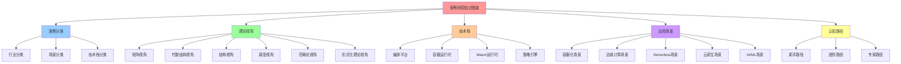
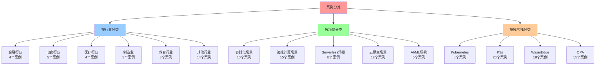
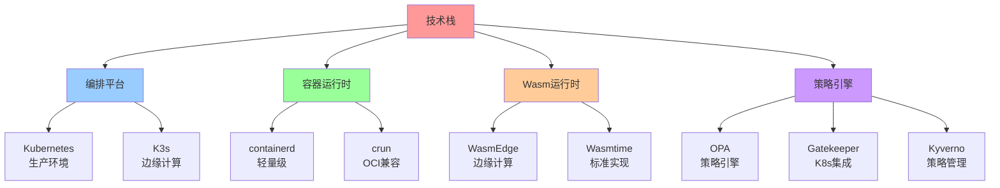
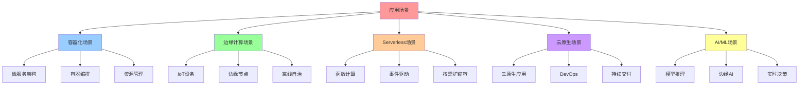
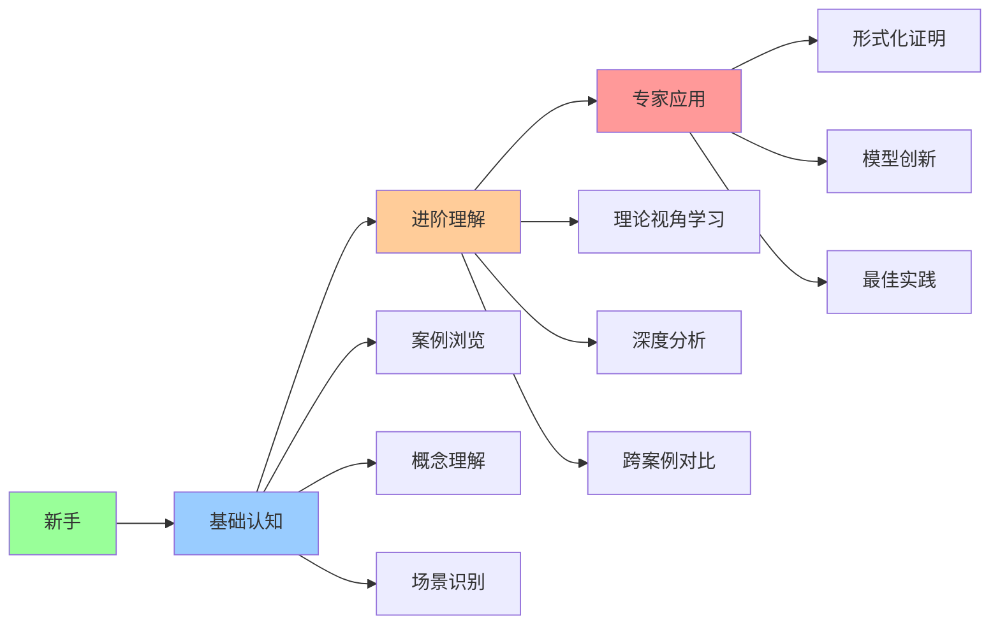
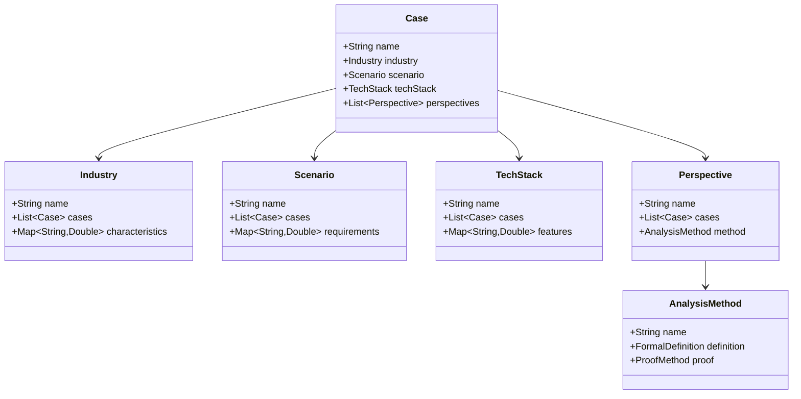

# 案例研究知识图谱：多维度认知框架

> **创建日期**：2025-11-15 **维护者**：项目团队

---

## 📑 目录

- [案例研究知识图谱：多维度认知框架](#案例研究知识图谱多维度认知框架)
  - [📑 目录](#-目录)
  - [1 文档定位](#1-文档定位)
  - [2 核心思维导图](#2-核心思维导图)
    - [2.1 全局知识地图](#21-全局知识地图)
    - [2.2 案例分类地图](#22-案例分类地图)
    - [2.3 理论视角地图](#23-理论视角地图)
    - [2.4 技术栈地图](#24-技术栈地图)
    - [2.5 应用场景地图](#25-应用场景地图)
    - [2.6 认知路径地图](#26-认知路径地图)
  - [3 核心概念定义](#3-核心概念定义)
    - [3.1 案例分类概念](#31-案例分类概念)
    - [3.2 理论视角概念](#32-理论视角概念)
    - [3.3 技术栈概念](#33-技术栈概念)
  - [4 概念属性矩阵](#4-概念属性矩阵)
    - [4.1 案例-理论视角矩阵](#41-案例-理论视角矩阵)
    - [4.2 行业-场景-技术栈矩阵](#42-行业-场景-技术栈矩阵)
    - [4.3 理论视角-分析深度矩阵](#43-理论视角-分析深度矩阵)
  - [5 认知路径](#5-认知路径)
    - [5.1 新手路径](#51-新手路径)
    - [5.2 进阶路径](#52-进阶路径)
    - [5.3 专家路径](#53-专家路径)
  - [6 多维层次结构](#6-多维层次结构)
    - [6.1 行业维度](#61-行业维度)
    - [6.2 场景维度](#62-场景维度)
    - [6.3 技术栈维度](#63-技术栈维度)
    - [6.4 理论视角维度](#64-理论视角维度)
  - [7 快速参考表](#7-快速参考表)
    - [7.1 案例快速参考](#71-案例快速参考)
    - [7.2 理论视角快速参考](#72-理论视角快速参考)
    - [7.3 文档导航快速参考](#73-文档导航快速参考)
  - [8 形式化定义](#8-形式化定义)
    - [8.1 案例体系形式化](#81-案例体系形式化)
    - [8.2 理论视角形式化](#82-理论视角形式化)
    - [8.3 认知路径形式化](#83-认知路径形式化)
  - [9 认知增强：思维导图、建模视图与图表达转换](#9-认知增强思维导图建模视图与图表达转换)
    - [9.1 案例研究知识图谱完整思维导图](#91-案例研究知识图谱完整思维导图)
    - [9.2 知识建模视图（UML类图）](#92-知识建模视图uml类图)
    - [9.3 知识多维关系矩阵](#93-知识多维关系矩阵)
      - [案例-理论视角-认知价值矩阵](#案例-理论视角-认知价值矩阵)
    - [9.4 图表达和转换](#94-图表达和转换)
      - [视图转换规则](#视图转换规则)
    - [9.5 形象化解释论证](#95-形象化解释论证)
      - [案例研究知识图谱的形象化类比](#案例研究知识图谱的形象化类比)
        - [1. 案例研究知识图谱 = 城市地图](#1-案例研究知识图谱--城市地图)
        - [2. 理论视角 = 不同的观察角度](#2-理论视角--不同的观察角度)
        - [3. 认知路径 = 登山路线](#3-认知路径--登山路线)
    - [9.6 专家观点与论证](#96-专家观点与论证)
      - [计算信息软件科学家的观点](#计算信息软件科学家的观点)
        - [1. Donald Knuth（计算机科学教育家）](#1-donald-knuth计算机科学教育家)
        - [2. Edsger W. Dijkstra（算法和编程理论家）](#2-edsger-w-dijkstra算法和编程理论家)
      - [计算信息软件教育家的观点](#计算信息软件教育家的观点)
        - [1. Seymour Papert（建构主义教育家）](#1-seymour-papert建构主义教育家)
        - [2. Jean Piaget（认知发展理论）](#2-jean-piaget认知发展理论)
    - [9.7 认知学习路径矩阵](#97-认知学习路径矩阵)
    - [9.8 专家推荐阅读路径](#98-专家推荐阅读路径)
  - [10 相关文档](#10-相关文档)
    - [案例研究目录文档](#案例研究目录文档)
    - [COGNITIVE目录参考文档](#cognitive目录参考文档)

---

## 1 文档定位

本文档提供案例研究的**快速认知图谱**，通过思维导图、概念矩阵、认知路径和多维结构，帮助快速建立案例研究的认知体系。

**为什么需要案例研究知识图谱？**

在学习和理解案例研究时，我们经常面临以下挑战：

1. **案例数量庞大**：33个案例，涉及多个行业和场景，难以快速建立整体认知
2. **理论视角复杂**：6个理论视角，每个视角有不同的分析方法和工具
3. **学习路径不明确**：缺乏明确的学习路径，不知道从何开始学习
4. **视角单一**：只从单一视角理解案例，难以形成全面的认知

案例研究知识图谱通过**思维导图、概念矩阵、认知路径和多维结构**，帮助我们：

1. **快速建立整体认知**：通过思维导图快速理解案例研究的整体结构
2. **理清概念关系**：通过概念矩阵理清案例、理论视角、技术栈之间的关系
3. **明确学习路径**：通过认知路径明确从新手到专家的学习路径
4. **多维度理解**：通过多维结构从不同维度理解案例研究

**核心价值**：

- **快速认知**：通过思维导图快速理解整体结构
- **概念清晰**：核心概念的定义、属性和关系
- **学习路径**：从新手到专家的认知路径
- **多维视角**：不同维度的层次结构

---

## 2 核心思维导图

### 2.1 全局知识地图



### 2.2 案例分类地图



### 2.3 理论视角地图

```mermaid
graph TB
    A[理论视角] --> B[矩阵视角]
    A --> C[代数结构视角]
    A --> D[结构视角]
    A --> E[调度视角]
    A --> F[范畴论视角]
    A --> G[形式化理论视角]

    B --> B1[12维原子概念向量]
    B --> B2[关系矩阵]
    B --> B3[变换矩阵]
    B --> B4[技术选型]

    C --> C1[20个一元算子]
    C --> C2[代数结构]
    C --> C3[同态映射]
    C --> C4[操作组合]

    D --> D1[计算结构]
    D --> D2[控制结构]
    D --> D3[信息结构]
    D --> D4[技术本质]

    E --> E1[分层调度]
    E --> E2[调度策略]
    E --> E3[性能分析]
    E --> E4[调度优化]

    F --> F1[对象]
    F --> F2[态射]
    F --> F3[函子]
    F --> F4[系统结构]

    G --> G1[时序逻辑]
    G --> G2[模型检验]
    G --> G3[抽象解释]
    G --> G4[形式化证明]

    style A fill:#ff9999
    style B fill:#99ccff
    style C fill:#99ff99
    style D fill:#ffcc99
    style E fill:#cc99ff
    style F fill:#ffff99
    style G fill:#ff99cc
```



### 2.4 技术栈地图



### 2.5 应用场景地图



### 2.6 认知路径地图



---

## 3 核心概念定义

### 3.1 案例分类概念

**行业分类**：

- **金融行业**：银行核心系统、支付网关、风控系统、交易系统
- **电商行业**：电商平台、高并发Serverless、物流系统、推荐系统、库存管理
- **医疗行业**：医院信息系统、远程医疗、医疗影像处理、健康数据管理
- **制造业**：智能制造、供应链管理、工业IoT
- **教育行业**：在线教育平台、学习管理系统、考试系统

**场景分类**：

- **容器化场景**：使用容器技术部署应用
- **边缘计算场景**：在边缘节点部署应用
- **Serverless场景**：使用Serverless函数计算
- **云原生场景**：使用云原生技术栈
- **AI/ML场景**：使用AI/ML技术

### 3.2 理论视角概念

**矩阵视角**：

- **概念向量**：12维原子概念向量，表示技术特征
- **关系矩阵**：概念之间的依赖、转换、组合关系
- **变换矩阵**：场景变换、操作变换

**代数结构视角**：

- **算子**：20个一元算子，表示技术操作
- **代数结构**：`Σ = ⟨Ω, ℱ, 𝒫, ℒ⟩`，表示技术结构
- **同态映射**：不同技术栈之间的结构保持

**结构视角**：

- **计算结构**：计算资源、计算模式、计算流程
- **控制结构**：控制逻辑、调度策略、故障恢复机制
- **信息结构**：数据流、数据存储、数据安全

### 3.3 技术栈概念

**编排平台**：

- **Kubernetes**：生产环境容器编排平台
- **K3s**：轻量级边缘计算容器编排平台

**容器运行时**：

- **containerd**：轻量级、高性能容器运行时
- **crun**：OCI兼容的容器运行时

**Wasm运行时**：

- **WasmEdge**：边缘计算优化的Wasm运行时
- **Wasmtime**：标准Wasm运行时实现

**策略引擎**：

- **OPA**：通用策略引擎
- **Gatekeeper**：Kubernetes策略引擎
- **Kyverno**：Kubernetes策略管理

---

## 4 概念属性矩阵

### 4.1 案例-理论视角矩阵

| 案例 | 矩阵视角 | 代数结构 | 结构视角 | 调度视角 | 范畴论 | 形式化理论 | 认知价值 |
|------|---------|---------|---------|---------|--------|-----------|---------|
| **银行核心系统** | ⭐⭐⭐⭐⭐ | ⭐⭐⭐⭐ | ⭐⭐⭐⭐⭐ | ⭐⭐⭐⭐ | ⭐⭐⭐ | ⭐⭐⭐⭐⭐ | 全面理解金融系统架构 |
| **支付网关** | ⭐⭐⭐⭐⭐ | ⭐⭐⭐⭐ | ⭐⭐⭐⭐ | ⭐⭐⭐⭐ | ⭐⭐⭐ | - | 理解高并发支付系统 |
| **风控系统** | ⭐⭐⭐⭐⭐ | ⭐⭐⭐⭐ | ⭐⭐⭐⭐ | ⭐⭐⭐⭐ | ⭐⭐⭐ | - | 理解边缘AI应用 |
| **交易系统** | ⭐⭐⭐⭐⭐ | ⭐⭐⭐⭐ | ⭐⭐⭐⭐ | ⭐⭐⭐⭐ | ⭐⭐⭐ | - | 理解低延迟交易系统 |
| **电商平台** | ⭐⭐⭐⭐⭐ | ⭐⭐⭐⭐ | ⭐⭐⭐⭐⭐ | ⭐⭐⭐⭐ | ⭐⭐⭐ | - | 理解微服务架构 |
| **电商高并发** | ⭐⭐⭐⭐⭐ | ⭐⭐⭐⭐ | ⭐⭐⭐⭐ | ⭐⭐⭐⭐⭐ | ⭐⭐⭐ | - | 理解Serverless架构 |
| **电商物流** | ⭐⭐⭐⭐⭐ | ⭐⭐⭐⭐ | ⭐⭐⭐⭐ | ⭐⭐⭐⭐ | ⭐⭐⭐ | - | 理解边缘计算应用 |
| **电商推荐** | ⭐⭐⭐⭐⭐ | ⭐⭐⭐⭐ | ⭐⭐⭐⭐ | ⭐⭐⭐⭐ | ⭐⭐⭐ | - | 理解边缘AI推荐 |
| **电商库存** | ⭐⭐⭐⭐⭐ | ⭐⭐⭐⭐ | ⭐⭐⭐⭐ | ⭐⭐⭐⭐ | ⭐⭐⭐ | - | 理解实时库存管理 |
| **医院信息系统** | ⭐⭐⭐⭐⭐ | ⭐⭐⭐⭐ | ⭐⭐⭐⭐ | ⭐⭐⭐⭐ | ⭐⭐⭐ | ⭐⭐⭐⭐⭐ | 理解医疗系统架构 |
| **远程医疗** | ⭐⭐⭐⭐⭐ | ⭐⭐⭐⭐ | ⭐⭐⭐⭐ | ⭐⭐⭐⭐ | ⭐⭐⭐ | - | 理解边缘医疗应用 |
| **医疗影像** | ⭐⭐⭐⭐⭐ | ⭐⭐⭐⭐ | ⭐⭐⭐⭐ | ⭐⭐⭐⭐ | ⭐⭐⭐ | - | 理解边缘AI影像处理 |
| **健康数据管理** | ⭐⭐⭐⭐⭐ | ⭐⭐⭐⭐ | ⭐⭐⭐⭐ | ⭐⭐⭐⭐ | ⭐⭐⭐ | ⭐⭐⭐⭐⭐ | 理解数据安全合规 |

**推荐度说明**：

- **⭐⭐⭐⭐⭐**：强烈推荐，深度分析
- **⭐⭐⭐⭐**：推荐，标准分析
- **⭐⭐⭐**：可选，基础分析
- **-**：未分析

### 4.2 行业-场景-技术栈矩阵

| 行业 | 场景 | 技术栈 | 案例数 | 理论视角覆盖 | 认知价值 |
|------|------|--------|--------|------------|---------|
| **金融** | 容器化 | K8s+containerd+OPA | 4 | 6个视角 | 理解金融系统架构和合规性 |
| **金融** | 边缘计算 | K3s+WasmEdge+OPA | 1 | 5个视角 | 理解边缘AI风控 |
| **电商** | 容器化 | K8s+containerd | 1 | 5个视角 | 理解微服务架构 |
| **电商** | Serverless | K3s+WasmEdge | 1 | 5个视角 | 理解Serverless架构 |
| **电商** | 边缘计算 | K3s+WasmEdge | 3 | 5个视角 | 理解边缘计算应用 |
| **医疗** | 容器化 | K8s+containerd+OPA | 1 | 6个视角 | 理解医疗系统架构 |
| **医疗** | 边缘计算 | K3s+WasmEdge+OPA | 3 | 5-6个视角 | 理解边缘医疗应用 |
| **制造** | 边缘计算 | K3s+WasmEdge+OPA | 3 | 4个视角 | 理解工业IoT和边缘计算 |

### 4.3 理论视角-分析深度矩阵

| 理论视角 | 分析深度 | 案例覆盖 | 形式化程度 | 认知价值 |
|---------|---------|---------|-----------|---------|
| **矩阵视角** | ⭐⭐⭐⭐⭐ | 13/13 (100%) | 中等 | 技术选型和场景转换理解 |
| **代数结构视角** | ⭐⭐⭐⭐ | 13/13 (100%) | 高 | 操作组合和结构保持理解 |
| **结构视角** | ⭐⭐⭐⭐⭐ | 13/13 (100%) | 中等 | 技术本质和架构设计理解 |
| **调度视角** | ⭐⭐⭐⭐ | 13/13 (100%) | 中等 | 调度优化和性能分析理解 |
| **范畴论视角** | ⭐⭐⭐ | 1/13 (8%) | 高 | 系统结构和关系分析理解 |
| **形式化理论视角** | ⭐⭐⭐⭐⭐ | 3/13 (23%) | 高 | 系统验证和正确性证明理解 |

---

## 5 认知路径

### 5.1 新手路径

**目标**：快速建立案例研究的基本认知

**路径**：

1. **浏览案例列表**（1-2小时）
   - 阅读[README.md](README.md)
   - 浏览案例分类
   - 了解案例数量（33个）

2. **理解核心概念**（2-4小时）
   - 阅读[QUICK-REFERENCE.md](QUICK-REFERENCE.md)
   - 理解行业分类
   - 理解场景分类

3. **选择一个案例深入学习**（4-8小时）
   - 选择一个感兴趣的案例
   - 阅读案例文档
   - 理解案例的技术栈和场景

**推荐案例**：

- **金融行业**：[支付网关](finance-payment-gateway.md)
- **电商行业**：[电商平台](ecommerce-platform.md)
- **医疗行业**：[远程医疗](healthcare-telemedicine.md)

### 5.2 进阶路径

**目标**：深入理解理论视角和分析方法

**路径**：

1. **学习理论视角**（16-24小时）
   - 阅读[THEORETICAL-ANALYSIS-SUMMARY.md](THEORETICAL-ANALYSIS-SUMMARY.md)
   - 学习矩阵视角
   - 学习结构视角
   - 学习调度视角

2. **深度分析案例**（24-32小时）
   - 阅读[industry-depth-analysis.md](../../../cases/industry-depth-analysis.md)
   - 阅读[scenario-depth-analysis.md](../../../cases/scenario-depth-analysis.md)
   - 阅读[tech-stack-depth-analysis.md](../../../cases/tech-stack-depth-analysis.md)

3. **跨案例对比**（8-16小时）
   - 阅读[cross-case-comparison-analysis.md](../../../cases/cross-case-comparison-analysis.md)
   - 理解行业差异
   - 理解场景差异

### 5.3 专家路径

**目标**：掌握形式化证明和模型创新

**路径**：

1. **形式化理论**（32+小时）
   - 学习形式化理论视角
   - 阅读形式化证明文档
   - 理解模型检验方法

2. **模型创新**（16+小时）
   - 理解分析模型标准
   - 创新分析方法
   - 创建新的分析模型

3. **最佳实践**（8+小时）
   - 总结最佳实践
   - 分享经验
   - 指导他人

---

## 6 多维层次结构

### 6.1 行业维度

**层次结构**：

```text
案例研究
├── 金融行业（4个案例）
│   ├── 银行核心系统
│   ├── 支付网关
│   ├── 风控系统
│   └── 交易系统
├── 电商行业（5个案例）
│   ├── 电商平台
│   ├── 电商高并发Serverless
│   ├── 电商物流系统
│   ├── 电商推荐系统
│   └── 电商库存管理
├── 医疗行业（4个案例）
│   ├── 医院信息系统
│   ├── 远程医疗
│   ├── 医疗影像处理
│   └── 健康数据管理
└── 其他行业（20个案例）
```

### 6.2 场景维度

**层次结构**：

```text
案例研究
├── 容器化场景（10个案例）
├── 边缘计算场景（15个案例）
├── Serverless场景（8个案例）
├── 云原生场景（12个案例）
└── AI/ML场景（6个案例）
```

### 6.3 技术栈维度

**层次结构**：

```text
案例研究
├── Kubernetes（8个案例）
├── K3s（20个案例）
├── WasmEdge（18个案例）
└── OPA（15个案例）
```

### 6.4 理论视角维度

**层次结构**：

```text
案例研究
├── 矩阵视角（13个案例，100%）
├── 代数结构视角（13个案例，100%）
├── 结构视角（13个案例，100%）
├── 调度视角（13个案例，100%）
├── 范畴论视角（1个案例，8%）
└── 形式化理论视角（3个案例，23%）
```

---

## 7 快速参考表

### 7.1 案例快速参考

| 案例 | 行业 | 场景 | 技术栈 | 理论视角 | 文档链接 |
|------|------|------|--------|---------|---------|
| 银行核心系统 | 金融 | 容器化 | K8s+containerd+OPA | 6个 | [finance-bank-core.md](finance-bank-core.md) |
| 支付网关 | 金融 | 容器化 | K8s+containerd+OPA | 5个 | [finance-payment-gateway.md](finance-payment-gateway.md) |
| 电商平台 | 电商 | 容器化 | K8s+containerd | 5个 | [ecommerce-platform.md](ecommerce-platform.md) |
| 电商高并发 | 电商 | Serverless | K3s+WasmEdge | 5个 | [ecommerce-high-concurrency.md](ecommerce-high-concurrency.md) |
| 医院信息系统 | 医疗 | 容器化 | K8s+containerd+OPA | 6个 | [healthcare-hospital-information-system.md](healthcare-hospital-information-system.md) |

### 7.2 理论视角快速参考

| 理论视角 | 核心工具 | 适用场景 | 案例覆盖 | 文档链接 |
|---------|---------|---------|---------|---------|
| 矩阵视角 | 向量、矩阵 | 技术选型、场景转换 | 13/13 | [矩阵视角](../03-theoretical-perspectives/matrix-perspective/README.md) |
| 代数结构视角 | 算子、代数结构 | 操作组合、结构保持 | 13/13 | [代数结构视角](../03-theoretical-perspectives/algebraic-structure/README.md) |
| 结构视角 | 三类结构 | 技术本质、架构设计 | 13/13 | [结构视角](../03-theoretical-perspectives/structural-perspective/README.md) |
| 调度视角 | 分层、图 | 调度优化、性能分析 | 13/13 | [调度视角](../03-theoretical-perspectives/scheduling-perspective/README.md) |
| 形式化理论视角 | 时序逻辑、模型检验 | 系统验证、正确性证明 | 3/13 | [形式化理论视角](../03-theoretical-perspectives/formal-theory/formal-theory.md) |

### 7.3 文档导航快速参考

| 文档类型 | 文档名称 | 用途 | 链接 |
|---------|---------|------|------|
| **索引文档** | INDEX.md | 快速导航所有文档 | [INDEX.md](INDEX.md) |
| **快速参考** | QUICK-REFERENCE.md | 快速查找关键信息 | [QUICK-REFERENCE.md](QUICK-REFERENCE.md) |
| **对比分析** | cross-case-comparison-analysis.md | 跨案例对比分析 | [cross-case-comparison-analysis.md](../../../cases/cross-case-comparison-analysis.md) |
| **行业分析** | industry-depth-analysis.md | 行业维度深度分析 | [industry-depth-analysis.md](../../../cases/industry-depth-analysis.md) |
| **场景分析** | scenario-depth-analysis.md | 场景维度深度分析 | [scenario-depth-analysis.md](../../../cases/scenario-depth-analysis.md) |
| **技术栈分析** | tech-stack-depth-analysis.md | 技术栈维度深度分析 | [tech-stack-depth-analysis.md](../../../cases/tech-stack-depth-analysis.md) |
| **总结文档** | THEORETICAL-ANALYSIS-SUMMARY.md | 理论视角分析总结 | [THEORETICAL-ANALYSIS-SUMMARY.md](THEORETICAL-ANALYSIS-SUMMARY.md) |

---

## 8 形式化定义

### 8.1 案例体系形式化

**案例集合定义**：

设案例集合为 $\mathcal{C} = \{c_1, c_2, \ldots, c_n\}$，其中 $n = 33$。

**案例分类函数**：

- **行业分类**：$I: \mathcal{C} \to \mathcal{I}$，其中 $\mathcal{I} = \{\text{金融}, \text{电商}, \text{医疗}, \text{制造}, \ldots\}$
- **场景分类**：$S: \mathcal{C} \to \mathcal{S}$，其中 $\mathcal{S} = \{\text{容器化}, \text{边缘计算}, \text{Serverless}, \ldots\}$
- **技术栈分类**：$T: \mathcal{C} \to \mathcal{T}$，其中 $\mathcal{T} = \{\text{K8s}, \text{K3s}, \text{WasmEdge}, \ldots\}$

**理论视角覆盖函数**：

- **矩阵视角覆盖**：$M: \mathcal{C} \to \{0, 1\}$，其中 $M(c) = 1$ 表示案例 $c$ 有矩阵视角分析
- **结构视角覆盖**：$Str: \mathcal{C} \to \{0, 1\}$，其中 $Str(c) = 1$ 表示案例 $c$ 有结构视角分析
- **形式化理论覆盖**：$F: \mathcal{C} \to \{0, 1\}$，其中 $F(c) = 1$ 表示案例 $c$ 有形式化理论分析

### 8.2 理论视角形式化

**理论视角集合**：

$\mathcal{P} = \{\text{矩阵}, \text{代数结构}, \text{结构}, \text{调度}, \text{范畴论}, \text{形式化理论}\}$

**视角分析函数**：

$A: \mathcal{C} \times \mathcal{P} \to \{0, 1\}$，其中 $A(c, p) = 1$ 表示案例 $c$ 有视角 $p$ 的分析。

**视角覆盖度**：

$\text{Coverage}(p) = \frac{|\{c \in \mathcal{C} : A(c, p) = 1\}|}{|\mathcal{C}|}$

### 8.3 认知路径形式化

**认知阶段**：

$\mathcal{L} = \{\text{新手}, \text{进阶}, \text{专家}\}$

**认知路径函数**：

$L: \mathcal{C} \times \mathcal{L} \to [0, 1]$，其中 $L(c, l)$ 表示案例 $c$ 在阶段 $l$ 的学习价值。

**认知路径序列**：

对于案例 $c$，认知路径为序列 $\langle L(c, \text{新手}), L(c, \text{进阶}), L(c, \text{专家})\rangle$。

---

## 9 认知增强：思维导图、建模视图与图表达转换

### 9.1 案例研究知识图谱完整思维导图

```mermaid
graph TB
    A[案例研究知识图谱] --> B[案例分类]
    A --> C[理论视角]
    A --> D[技术栈]
    A --> E[应用场景]
    A --> F[认知路径]
    A --> G[分析模型]
    A --> H[形式化证明]

    B --> B1[行业分类<br/>6个行业]
    B --> B2[场景分类<br/>5个场景]
    B --> B3[技术栈分类<br/>4类技术]

    C --> C1[矩阵视角<br/>13个案例]
    C --> C2[代数结构视角<br/>13个案例]
    C --> C3[结构视角<br/>13个案例]
    C --> C4[调度视角<br/>13个案例]
    C --> C5[范畴论视角<br/>1个案例]
    C --> C6[形式化理论视角<br/>3个案例]

    D --> D1[编排平台<br/>K8s/K3s]
    D --> D2[容器运行时<br/>containerd/crun]
    D --> D3[Wasm运行时<br/>WasmEdge/Wasmtime]
    D --> D4[策略引擎<br/>OPA/Gatekeeper]

    E --> E1[容器化场景<br/>10个案例]
    E --> E2[边缘计算场景<br/>15个案例]
    E --> E3[Serverless场景<br/>8个案例]
    E --> E4[云原生场景<br/>12个案例]
    E --> E5[AI/ML场景<br/>6个案例]

    F --> F1[新手路径<br/>基础认知]
    F --> F2[进阶路径<br/>深度理解]
    F --> F3[专家路径<br/>形式化证明]

    G --> G1[分析模型标准]
    G --> G2[思维工具标准]
    G --> G3[论证方法标准]

    H --> H1[时序逻辑]
    H --> H2[模型检验]
    H --> H3[抽象解释]

    style A fill:#ff9999
    style B fill:#99ccff
    style C fill:#99ff99
    style D fill:#ffcc99
    style E fill:#cc99ff
    style F fill:#ffff99
    style G fill:#ff99cc
    style H fill:#99ffcc
```



### 9.2 知识建模视图（UML类图）



### 9.3 知识多维关系矩阵

#### 案例-理论视角-认知价值矩阵

| 案例 | 矩阵视角 | 代数结构 | 结构视角 | 调度视角 | 范畴论 | 形式化理论 | 认知价值 | 学习优先级 |
|------|---------|---------|---------|---------|--------|-----------|---------|-----------|
| **银行核心系统** | ⭐⭐⭐⭐⭐ | ⭐⭐⭐⭐ | ⭐⭐⭐⭐⭐ | ⭐⭐⭐⭐ | ⭐⭐⭐ | ⭐⭐⭐⭐⭐ | 全面理解金融系统架构 | 高 |
| **支付网关** | ⭐⭐⭐⭐⭐ | ⭐⭐⭐⭐ | ⭐⭐⭐⭐ | ⭐⭐⭐⭐ | ⭐⭐⭐ | - | 理解高并发支付系统 | 高 |
| **电商平台** | ⭐⭐⭐⭐⭐ | ⭐⭐⭐⭐ | ⭐⭐⭐⭐⭐ | ⭐⭐⭐⭐ | ⭐⭐⭐ | - | 理解微服务架构 | 高 |
| **电商高并发** | ⭐⭐⭐⭐⭐ | ⭐⭐⭐⭐ | ⭐⭐⭐⭐ | ⭐⭐⭐⭐⭐ | ⭐⭐⭐ | - | 理解Serverless架构 | 中 |
| **医院信息系统** | ⭐⭐⭐⭐⭐ | ⭐⭐⭐⭐ | ⭐⭐⭐⭐ | ⭐⭐⭐⭐ | ⭐⭐⭐ | ⭐⭐⭐⭐⭐ | 理解医疗系统架构 | 高 |
| **健康数据管理** | ⭐⭐⭐⭐⭐ | ⭐⭐⭐⭐ | ⭐⭐⭐⭐ | ⭐⭐⭐⭐ | ⭐⭐⭐ | ⭐⭐⭐⭐⭐ | 理解数据安全合规 | 中 |

**认知价值说明**：

- **全面理解**：包含所有理论视角，适合全面学习
- **专项理解**：专注于特定场景或技术，适合专项学习
- **形式化理解**：包含形式化证明，适合深入研究

### 9.4 图表达和转换

#### 视图转换规则

**转换规则 1：案例视图 → 理论视角视图**:

```yaml
案例视图转换:
  输入: 案例（银行核心系统、支付网关）
  转换规则:
    - 银行核心系统 → 矩阵视角、结构视角、形式化理论视角
    - 支付网关 → 矩阵视角、调度视角
  输出: 理论视角分析（矩阵、结构、调度、形式化）
```

**转换规则 2：理论视角视图 → 技术栈视图**:

```yaml
理论视角转换:
  输入: 理论视角（矩阵视角、结构视角）
  转换规则:
    - 矩阵视角 → K8s、K3s、WasmEdge
    - 结构视角 → containerd、OPA
  输出: 技术栈选择（K8s+containerd+OPA）
```

### 9.5 形象化解释论证

#### 案例研究知识图谱的形象化类比

##### 1. 案例研究知识图谱 = 城市地图

> **类比**：案例研究知识图谱就像城市地图，案例是城市中的建筑，理论视角是不同角度的观察方式，技术栈是建筑的材料，场景是建筑的功能。

**认知价值**：

- **导航理解**：通过地图类比，理解知识图谱的导航作用
- **结构理解**：通过建筑类比，理解案例的结构
- **关系理解**：通过城市布局类比，理解案例之间的关系

##### 2. 理论视角 = 不同的观察角度

> **类比**：理论视角就像不同的观察角度，矩阵视角是从上往下看（整体结构），结构视角是从侧面看（内部结构），调度视角是从动态看（运行过程）。

**认知价值**：

- **视角理解**：通过观察角度类比，理解不同理论视角的作用
- **互补理解**：通过多角度观察类比，理解视角的互补性
- **选择理解**：通过观察需求类比，理解视角的选择

##### 3. 认知路径 = 登山路线

> **类比**：认知路径就像登山路线，新手路径是缓坡（基础认知），进阶路径是陡坡（深度理解），专家路径是攀岩（形式化证明）。

**认知价值**：

- **路径理解**：通过登山路线类比，理解认知路径的渐进性
- **难度理解**：通过路线难度类比，理解不同阶段的难度
- **目标理解**：通过山顶目标类比，理解认知路径的目标

### 9.6 专家观点与论证

#### 计算信息软件科学家的观点

##### 1. Donald Knuth（计算机科学教育家）

> "The best programs are written so that computing machines can perform them quickly and so that human beings can understand them clearly. A programmer is ideally an essayist who works with traditional aesthetic and literary forms as well as mathematical concepts, to communicate the way that an algorithm works and to convince a reader that the results will be correct."

**在案例研究中的应用**：

- **清晰性**：案例研究应该清晰表达技术选型和架构设计
- **正确性**：通过形式化证明确保系统正确性
- **理解性**：通过思维导图和知识矩阵帮助理解

##### 2. Edsger W. Dijkstra（算法和编程理论家）

> "Program testing can be used to show the presence of bugs, but never to show their absence."

**在案例研究中的应用**：

- **形式化验证**：使用形式化理论验证系统属性，而不仅仅依赖测试
- **理论证明**：通过形式化证明确保系统正确性
- **模型检验**：使用模型检验发现潜在问题

#### 计算信息软件教育家的观点

##### 1. Seymour Papert（建构主义教育家）

> "You can't teach people everything they need to know. The best you can do is position them where they can find what they need to know when they need to know it."

**在案例研究中的应用**：

- **知识图谱**：通过知识图谱帮助学习者找到需要的知识
- **认知路径**：通过认知路径指导学习者学习
- **快速参考**：通过快速参考快速查找信息

##### 2. Jean Piaget（认知发展理论）

> "The principal goal of education is to create men who are capable of doing new things, not simply of repeating what other generations have done."

**在案例研究中的应用**：

- **创新理解**：通过案例研究理解如何创新
- **最佳实践**：通过最佳实践学习如何改进
- **模型创新**：通过分析模型创新分析方法

### 9.7 认知学习路径矩阵

| 学习阶段 | 推荐案例 | 推荐理论视角 | 学习内容 | 学习时间 | 前置要求 | 后续进阶 |
|---------|---------|------------|---------|---------|---------|---------|
| **新手阶段** | 支付网关、电商平台 | 矩阵视角 | 案例浏览、概念理解 | 1-2周 | 无 | 进阶阶段 |
| **进阶阶段** | 银行核心系统、医院信息系统 | 矩阵+结构+调度 | 理论视角学习、深度分析 | 4-8周 | 新手阶段 | 专家阶段 |
| **专家阶段** | 银行核心系统、健康数据管理 | 所有视角+形式化理论 | 形式化证明、模型创新 | 16+周 | 进阶阶段 | - |

### 9.8 专家推荐阅读路径

**路径1：金融系统理解路径**:

1. **第一步**：阅读[支付网关](finance-payment-gateway.md)（矩阵视角、调度视角）
2. **第二步**：阅读[银行核心系统](finance-bank-core.md)（所有视角）
3. **第三步**：阅读[industry-depth-analysis.md](../../../cases/industry-depth-analysis.md)（金融行业深度分析）

**路径2：边缘计算理解路径**:

1. **第一步**：阅读[电商物流系统](ecommerce-logistics.md)（边缘计算场景）
2. **第二步**：阅读[scenario-depth-analysis.md](../../../cases/scenario-depth-analysis.md)（边缘计算场景深度分析）
3. **第三步**：阅读[tech-stack-depth-analysis.md](../../../cases/tech-stack-depth-analysis.md)（WasmEdge技术栈分析）

**路径3：形式化证明理解路径**:

1. **第一步**：阅读[银行核心系统](finance-bank-core.md)（形式化理论视角）
2. **第二步**：阅读[健康数据管理](healthcare-health-data-management.md)（形式化理论视角）
3. **第三步**：阅读[形式化理论文档](../03-theoretical-perspectives/formal-theory/formal-theory.md)

---

## 10 相关文档

### 案例研究目录文档

- [案例研究目录](README.md) - 案例研究主目录
- [快速参考指南](QUICK-REFERENCE.md) - 快速查找关键信息
- [文档索引](INDEX.md) - 文档快速导航索引
- [跨案例对比分析](../../../cases/cross-case-comparison-analysis.md) - 多维度理论视角对比分析
- [行业维度深度分析](../../../cases/industry-depth-analysis.md) - 行业维度理论视角深度分析
- [场景维度深度分析](../../../cases/scenario-depth-analysis.md) - 场景维度理论视角深度分析
- [技术栈维度深度分析](../../../cases/tech-stack-depth-analysis.md) - 技术栈维度理论视角深度分析
- [理论视角分析总结](../../../cases/THEORETICAL-ANALYSIS-SUMMARY.md) - 理论视角分析工作总结

### COGNITIVE目录参考文档

- [COGNITIVE目录总览](../README.md) - COGNITIVE目录完整说明 ⭐
- [案例研究认知增强文档总览](README.md) - 案例研究认知增强文档完整说明 ⭐
- [知识图谱](../01-core-foundations/knowledge-map/knowledge-map.md) - 云原生容器技术栈知识图谱
- [认知模型矩阵](../01-core-foundations/visualizations/02-cognitive-models-matrix.md) - 认知模型对比矩阵
- [理论视角框架](../03-theoretical-perspectives/README.md) - 多维度理论分析框架
- [形式化理论](../03-theoretical-perspectives/formal-theory/formal-theory.md) - 形式化理论基础

---

## 2025 年最新实践

### 案例研究知识图谱应用最佳实践（2025）

**2025 年趋势**：知识图谱在案例研究、技术选型、架构设计中的深度应用

**实践要点**：

- **知识图谱构建**：使用知识图谱构建案例研究的多维度认知框架
- **关系挖掘**：使用知识图谱挖掘案例之间的关联关系
- **决策支持**：使用知识图谱支持技术选型和架构决策

**代码示例**：

```python
# 2025 年案例研究知识图谱工具
class CaseKnowledgeMapTool:
    def __init__(self):
        self.graph_builder = GraphBuilder()
        self.relation_miner = RelationMiner()
        self.decision_supporter = DecisionSupporter()

    def build_graph(self, cases):
        """知识图谱构建"""
        return self.graph_builder.build(cases)

    def mine_relations(self, graph):
        """关系挖掘"""
        return self.relation_miner.mine(graph)

    def support_decision(self, case, graph):
        """决策支持"""
        return self.decision_supporter.support(case, graph)
```

## 实际应用案例

### 案例 1：案例研究知识图谱应用（2025）

**场景**：使用知识图谱进行案例研究和技术选型

**实现方案**：

```python
# 案例研究知识图谱应用
tool = CaseKnowledgeMapTool()

# 知识图谱构建
cases = [case1, case2, case3]
graph = tool.build_graph(cases)

# 关系挖掘
relations = tool.mine_relations(graph)

# 决策支持
case = Case(industry="finance", scenario="core-system")
decision = tool.support_decision(case, graph)
```

**效果**：

- 知识图谱：基于知识图谱的案例研究，提高分析深度
- 关系挖掘：使用知识图谱挖掘案例关系，发现隐藏模式
- 决策支持：使用知识图谱支持技术决策，提高决策准确性

---

**最后更新**：2025-11-15 **维护者**：项目团队
